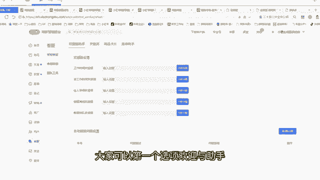
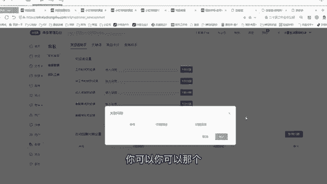
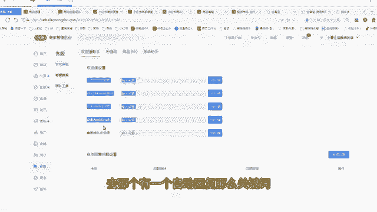
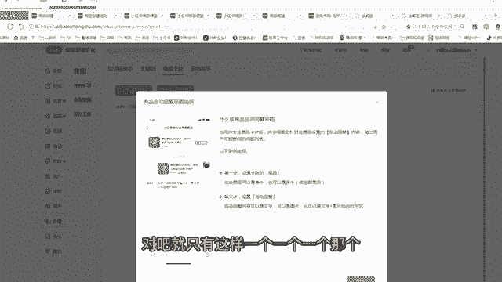
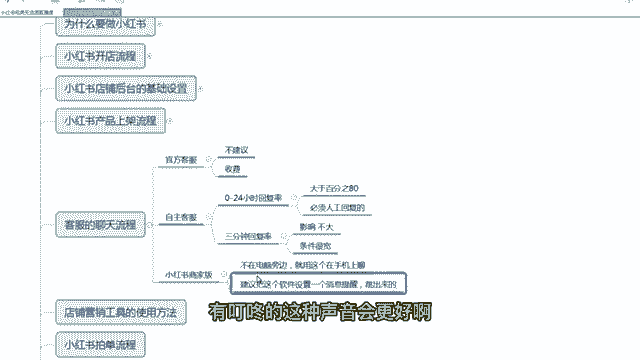

# 【2024版小红书运营教程】全B站最良心的小红书开店流程详解，高阶运营教程合集！小红书体开店，起号真的快，共1000集全是重要知识点，赶快点赞收藏起来！！ - P6：第5课：客服的聊天流程【小红书零基础电商运营课~全流程】 - 一盏灯的时间q - BV1eSaMeWEXf

嗯，大家好，这节课给大家讲解小红书客服的一个聊天流程。那小红书的客服我之前给大家已经那个讲过了，就是如果你没有时间聊天，官方还可以给你有一个代聊的服务。但是即便官方给咱们一个代聊的服务。

我也不建议大家用。因为有点小贵啊，有聊小贵，而且不至于啊。因为目前小红书的那个聊天的一个规则不是很严。大部分人我觉得95%的人都能满足这个要求啊。呃，那么呃不建议大家用官方客服，是因为他要收费的。

所以不建议啊那么咱们就用自主客服。那么官方客服自主客服就是自己去聊天啊，就咱们自己去聊。那么官方和自主在哪里面设置，咱们还是进入小红书的一个后台点击客服，有个客服团队，客服团队啊。

你看这个当前我们这个店铺的运营模式为自主客服，就咱们自己聊自己老板聊或者自己员工聊，不是让那个平台去聊。那么如果你不想你想用平台，那么申请关关闭自主客服就可以了。你选平台，但是不建议啊。

我建议大家还是自己聊省这个钱，因为赚钱都不容易。因为有不需要花费你太长时间。嗯，这是这是官方和自主的一个区别啊。那么第二个自主客服聊天里面有两个重点。我给大家讲，为什么建议自主客服呃。

虽然有些兼职的或者有些上班的，也可以满足。因为小红书现的规定啊是0到24小时，一天24小时内，只要你回复人家一次就行了。而且这个回复必须是。是人工回复的啊，嗯就是那个机器自动回复的，不算是人必须打字。

或者你发一个表情，打一个数字都行，都算是人工回复。机器回复不算，就是在这一天当中24小时，你必须回复率大于80%，但是不要求你回复的时间。啊，那所以这个是条件很宽松啊。比如说有一个顾客早上8点问你一句。

你晚上8点回回他一句都可以，只要不超过0点，对不对？但是不建议啊，咱们还是做生意的啊。如果有人因为小红书咨询量很低的，一天卖你一天卖十单，我估计也就一两个人问你一句啊，就是咨询量很低。所以说能回复。

尽量回复一下，然后增加你的一个转化率，万一人家有急事呢，非要问一句，对不对？还是尽量去去回复一下啊。但是这个你即便回复不了也没关系啊，不违规。那么小红书还有一个3分钟回复率啊。

这个三分3分钟回复率什么意思？就是你在3分钟之内顾客问一个问题，你在3分钟之内用人工去回他一句话，任何一句话只要回复他就行，只要3分钟回复率，3分钟回复率是影响你的店铺的一个体验分，对吧？这个体验分啊。

就是这个动店铺动态评分里面有那个有一个咨询这个4。5，这个是就是3分钟回复率会影响这个指标啊，那么这个指标其实也没什么影响啊。因为咱们开店都4点5分啊。然后你这个嗯你你即便是低于4分也没关系。

对你笔记的影响不是很大啊。但是就是我说这个80%的回复率，这个影响非常大。这个如果你80%就达不到，这个有点太过了，这个会屏蔽你的笔记和商品会这个影响比较大啊，但3分钟回复率也没必要。

所以这个条件很宽裕啊条件很宽。所以说为什么建议那些兼职的也可以做啊，重点就在这个地方，客服都不卡你啊嗯。呃，那么后台嗯带大家去看一看那个客服的一些设置啊啊，你比如说客服大家可以第一个选项，欢迎与助手。

就是如果哎有一个人跟你聊天了，你可以你可以那个嗯。

你可以设置个欢英语啊，去那个有一个自动回复。那么关键词。

比什么时候发货？那么发货的话，自动会提取这个第一步本店现商品下单，预计3天内发货，会提取这个这个大家呃做不做都行啊。然后商品卡片商品卡片就比如说关念什么产品啊，对吧？

就只这样一个一个一个那个呃一个助手啊，一个小助手跟单助手也一样，这个就大家要不要都行，无所谓的啊，客服数据就是今天啊，就是有些聊天记录都可以在这里面看，其他的没有什么东西。

呃，然后是网页端也可以聊天。大家看啊，有这个地方有个客服啊，就网页端也可以聊，就在电脑上也可以这样去聊。嗯。啊，点击客服工作台呃，这个就是客服工作台。你看这这里面有很多绘画啊。

这是我们之前聊天的一些绘画啊，看一下啊。啊啊，什么叫人工客服？就是你自己打上的字，对吧？打上的字发过去才叫人工。那自动回复。你看这种自动回复是队长这动自动回复，这个不算的啊，人工回的才算是计入指标的啊。

啊，这都之前我们那个。呃，你看。嗯。小鼠生活服服装，那这是我们自己店主回复的啊，有些系统回复的带大家看一下啊，你要数队长啊，这个是系统自动回复的那这个都不算啊。嗯。呃，那么第二个点啊。

就是如果我现在不在电脑旁，我出门了，或者我上班了啊，对吧？我在电脑上没办法聊怎么办？手机上聊，那么手机上你们一定要下载一个小红书商家版，这个商家版它就有一个客服聊天的一个窗口啊，在中间这个位置啊。

一个窗口，然后不在电脑时候，在手机上聊是一样的。而且这个哈建议大家。建议把这个软件啊设置。一个休息提醒。啊，就而且这个消息提醒是能跳出来的啊。这个应该大家都会吧，都会玩手机，就是你的消息提醒你要跳出来。

直接跳到屏幕上，让你能看到。这样万一你在吃饭或者出门的时候，他这个消息比较明显，而且不要静音啊，尽量指这个消息弹出来之后，有叮咚的这种声音会更好呃，这是小红书的一个商家版。

啊，带大带大家看一下小红书商家版的APP啊，上么这是咱们打开小红书商家版的1个APP这个APP里面中间有个消息，这个消息就是咱们聊天的一个窗口有顾客有给咱们聊天，咱们就点击这个消息啊，进去之后。

然后是直接聊天就可以了啊。那么这个商家版的APP也有一些提醒啊，待发货呀，还有一些工单呀，需要咱们处理这些售后啊，都在这里面，大家都可以看得到啊。

