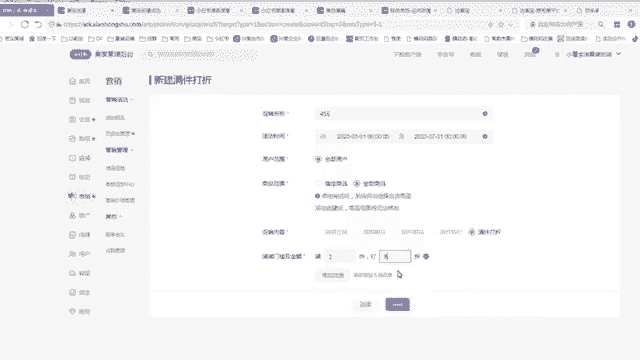
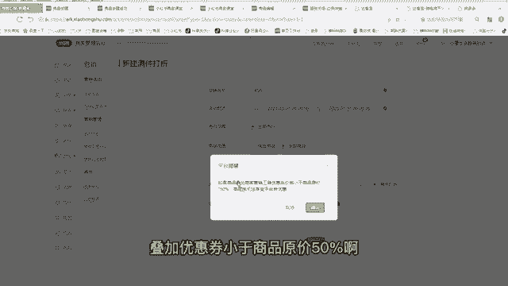
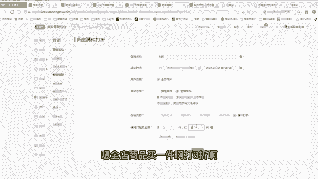
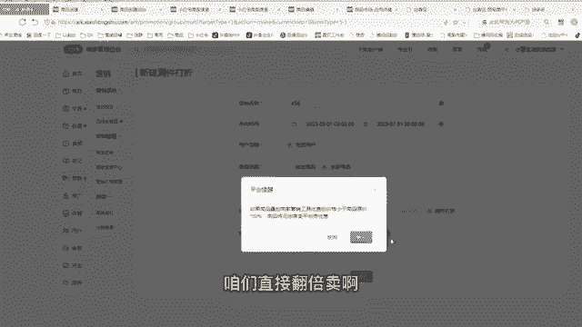
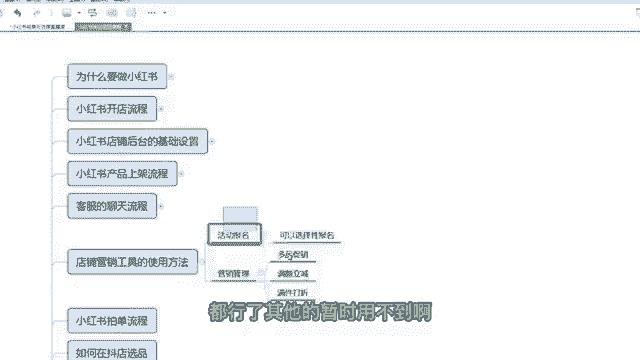

# 【2024版小红书运营教程】全B站最良心的小红书开店流程详解，高阶运营教程合集！小红书体开店，起号真的快，共1000集全是重要知识点，赶快点赞收藏起来！！ - P7：第6课：店铺营销工具的使用方法【小红书零基础电商运营课~全流程】 - 一盏灯的时间q - BV1eSaMeWEXf

呃，大家好，这节课给大家讲解小红书店铺营销工具的一个使用方法啊。那么之前咱们已经把商品两倍上传到咱们店铺。如果咱们需要对这个商品做一个活动或者是打一个折扣，或者是做一个优惠券，咱们需要用到一些工具啊。

那么这个工具，咱们点击咱们小红书店铺的后台点击营销啊，你想营销第一个是一个营销活动的，这个营销活动有个活动报名，这个活动报名里面，咱们点击可报名的活动里面会展示最近咱们这个店铺能参加的活动。

你看最近啊你看这个这个时间咱们能参加的活动，就三八节。这三八节的一个条件，咱们可以点击报名活动，去看一看啊，它里面有一些条件。嗯，比如说需要那个呃呃需要这个店铺分要4分以上，然后是那个商品价格等等啊。

咱们可以再点进去啊，这里面有一个店铺的一个基本类型都都符合活动详情，就是呃就是就这样一个门槛吗？啊，而且有一个满减，满300减40，你觉得咱们满300减40，你能承担这个折扣，那么你就报不能承担。

你都不报，就这个活动是可报可不报的啊。那么比如说咱们遇到双十一双十二，我建议大家都报上。那平时的小活动我不太建议大家去报啊，还是把精力花在那个笔记上。那么第一个是营销管理，营销管理有一个商品促销。

商品促销有一个单品促销，单品促销就是你对单个商品去做打折。你用到这个工具，咱们一般咱们都是批量性的，不做单品促销，咱们一般是多品促销。那么招品促销里面咱们用到的工具，第一个是满额立减。第一个是满件打折。

中间咱们这三个是基本上不用的。那么满额立减，我给大家去讲一讲啊，咱们去。呃，去做一个点击选中就行了啊啊，比如说我随便起个名1个3啊，时间。啊，那今天的是一号，咱们就选一号啊。嗯，然后是然后是到期的时间。

咱们时间长点啊，尽量3个月以上啊，然后点确定啊，指定商品和全部商品。咱们一般是全店打折的啊，全全店打折，指定商品，比如一部分商品，咱们一部分商品打折，尽量也咱们怎们做店都是全店打折，这样比较方便啊啊。

然后满多少减多少，一般情况下咱们设置一个咱们店铺的一个平均的客单价。比如说你店铺啊基本上都是50块钱以上的，咱们就点50嘛，你要减多少，比如说减个5块钱嘛，是个5块钱优惠券，对吧？然后点击完成就可以了。

啊，那么这个活动都创建成功了啊，那么如果你想不想要这个活动，那么你就暂停或者删除都可以啊。那满满间打折也一样的啊，一个道理啊，456。嗯。啊，近当天的一个时间，然后是3个月啊。嗯。

就满一件咱们打个9折啊啊，这里面大家听一下，我建议这个大家做一下啊，满件打折，我建议就是所有的学员都这样做。因为咱们两倍上传的两倍上传哎，我经常跟大家说两倍上传啊，就可以了。因为小红书的利润非常高。

对不对？翻倍卖，但是你是一个新店，如如果你想让更快速的出单，你还是打一个折扣。我建议打个9折，8折都行，看自己的一个情况。如果你你不想要那么多单子，不想那个呃怎么着了，你就打一个9折或者不打都行。

如果你这段时间你想快速出单啊，我前期新店没什么权重，想快速出单，我不想一单赚那么多啊，我觉得赚翻倍卖，我觉得有点太狠是吧？那我打个8折也行啊，我觉得打个8折都够了。

这时候点击完成就可以了啊。就是你全店所有的商品啊都会打8折的啊。叠加优惠券小于商品原价50%啊。因为呃因为我这两个折扣是我这两个折扣不能一起做啊，所以我要删除一个那个才能建啊。

大家只满个立减和满减打折只需要一个就行了。我建议用这个满减打折啊。

满件打这停基本上够用了啊。嗯，全店商品买一件啊，打8折啊啊，后面你卖起来之后，店铺权重高了，你可以把这个活动取消了，咱们直接翻倍卖啊。

还是。啊，这样都可以了，对不对？然后咱们店铺的这些东西都是没用的，善单有理，没没有用啊，这些不用管，大家只需要管我讲讲的几个东西都行了，其他的暂时用不到啊。

