# 【2024版小红书运营教程】全B站最良心的小红书开店流程详解，高阶运营教程合集！小红书体开店，起号真的快，共1000集全是重要知识点，赶快点赞收藏起来！！ - P9：第8课：如何在抖店选品【小红书零基础电商运营课~全流程】 - 一盏灯的时间q - BV1eSaMeWEXf

大家好，这节课给大家讲如何在抖店去选品。那为什么咱们要在抖店去选品呢？因为爆款互联网的爆款都是有共性的，特别是那个新媒体平台，像那个抖音属于新媒体平台，对吧？那小红书也属于那么抖音它有一个抖音小店。

就咱们说的抖店，它有电商？那么抖音电商里面卖的好的品，是不是小红书里面大概率也会卖的好啊，这就是咱们为什么要在抖店去选品。

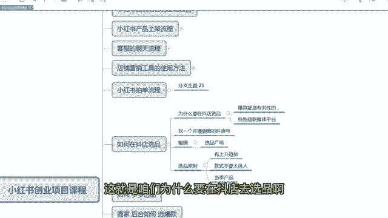

嗯，那么抖店去选品其实有很多方法，有一些数据软件，但都比较贵啊，数据软件是比较贵的。那咱们要轻资产去创业，低成本创业，对吧？那么咱们尽量这些东西该不用还是不用，咱们就去在橱窗里面也可以选品。

那橱窗里面去选品，咱们首先咱们要找到一个呃开通过橱窗的一个抖音号。嗯，那么咱们一般人的抖音号的橱窗一般都开通了啊，因为之前咱们开通做过其他项目，如果没有开通的话，你可以开通一下，是500块钱保证金。

或者是你去找你的周边的人。如果他开通，你拿他的那个用一用也是可以的。拿他账号来用一下啊。一般如果没开通的话，500块钱保证金，这个也可以退的啊，没关系，你你到时候不不用了，你把它退了就行了。啊。

那么橱窗选品咱们的实操，接下来我给大家去详细的一步一步教教大家怎么样在橱窗去选到更容易去爆的一个产品啊。

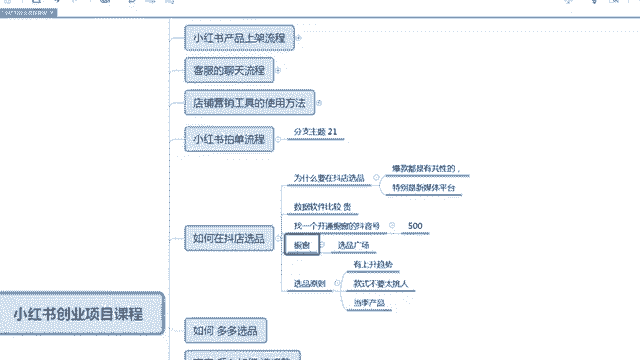

嗯，首先啊咱们点击咱们抖音的橱窗啊，主页的橱橱窗。然后点完之后，咱们点击那个呃点完之后，呃咱们就到这个橱窗的一个首页这个界面，有一个选品广场，在这个选品广场这一栏，咱们点击啊点击进入选品广场。

那么这里面咱们就可以在这里面选品的，选品广场里面有很多都是看按那个最近卖的比较好的一个排序。那么咱们直接点击一个搜索啊，点击搜索。

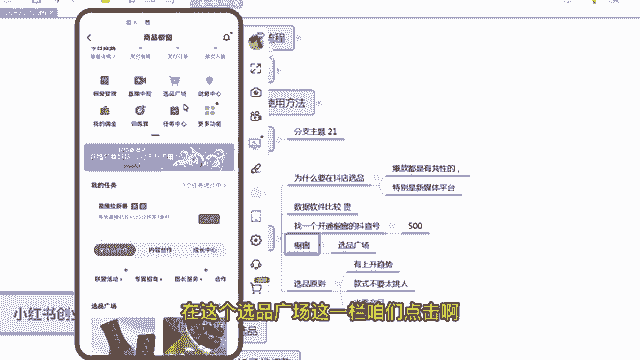

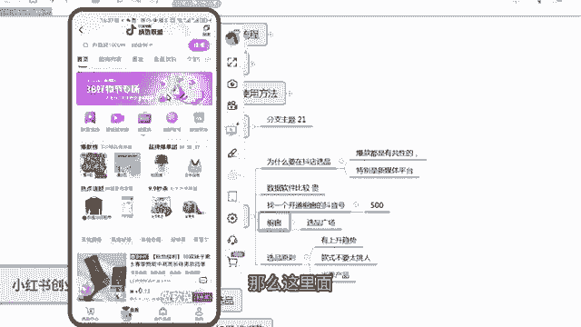

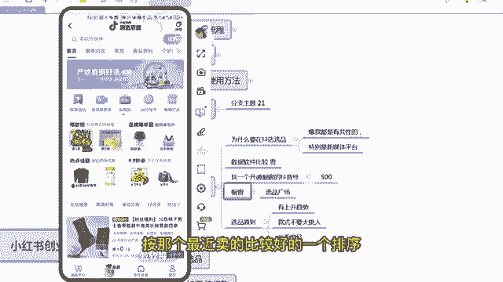

呃，然后再把这个词，然后把它点掉，往下拉，会有一个爆款热卖榜啊，搜索热度榜和一个搜索趋势榜。那那么这这里面给大家讲一个咱们选品的一个原则啊。第一个有上升趋势的品。第一个款式不要太挑人，太挑人。

因为退货率比较高啊。

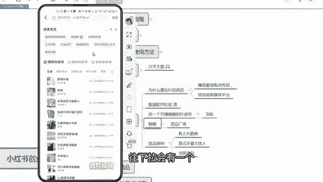

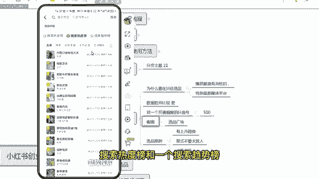

嗯。人就是会退货率会高一些。嗯，所以退货率高一思，咱们收获的多了嘛。第一个，当季的产品就是越当季的产品越容易转化，越好卖，越越爆啊，这是大概一个原则啊。那咱们去找啊，比如说嗯我给大家讲一下。

咱们找一个什么嗯。

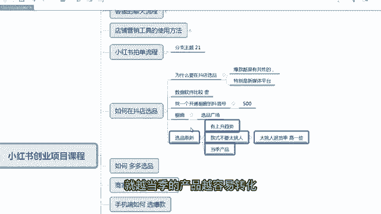

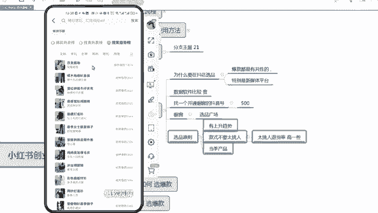

找一个童装吧，看有没有童装的啊。桶装的。

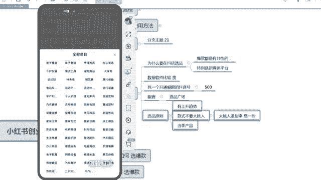

啊，咱们选选择那个亲子童装。那么第一个呃女童格子童童装，你看第三名我选这个吧，这个比较有代表性。女童格子套装啊，咱们选择。

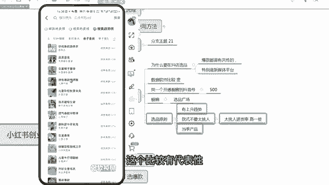

嗯啊，选择这里面有这么多女童格子套装，对不对？那咱们就选一下啊，这个就看自己眼光了。其实这里面很多都可以选，咱们尽量选一些，其实卖的相对来说好一点。你看月售22件，这个就是卖太少了啊。

这一般的呃当地产品销量啊，销量我建议1000以上。

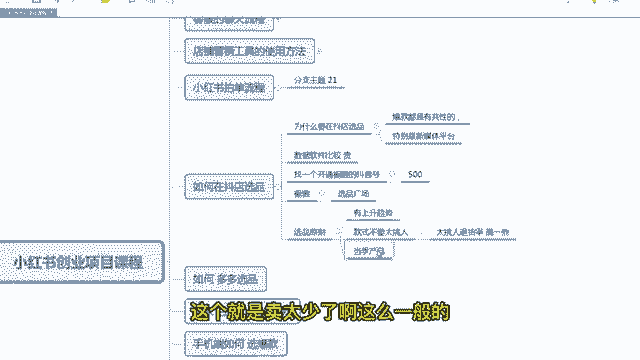

嗯，5000以下。嗯，像这种是就是这种叫趋势品，就是我报我不是很非常非常爆，但是我销量也差也也那个也不会太差啊，就这种如果是服装这个类目，建议大家按这个去选啊。

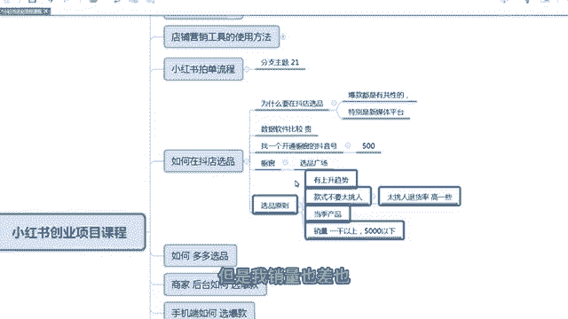

你看第一个A，我觉得还可以，对不对？挺新颖的一个一款服装啊。你像这个。

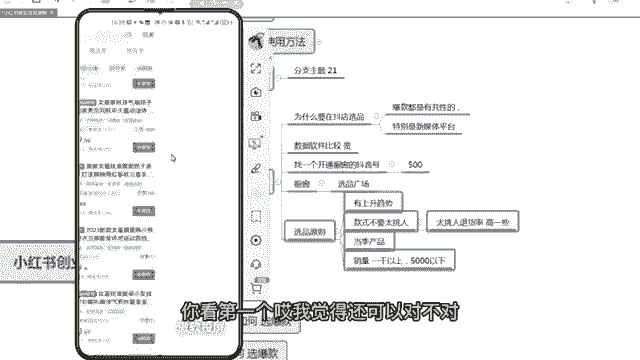

嗯，你像这个最近属于上升趋势啊，上升趋势嗯。

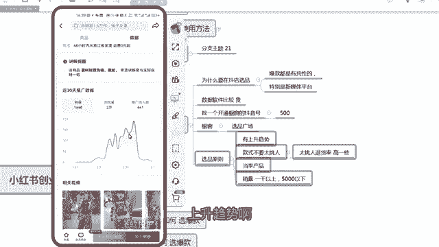

呃，这这个这个也一般般啊，不太好。咱们看这个啊月束11件。啊，我找了这款啊，这款这款格子看看起来挺不错的啊。

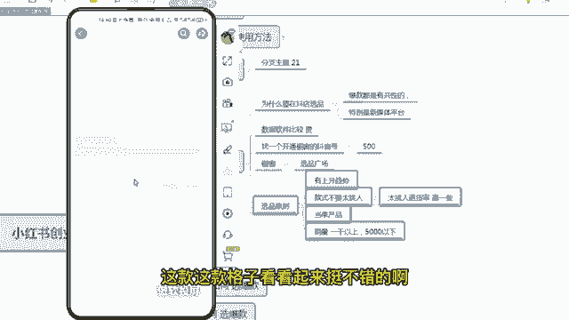

呃，咱们往下拉，看好了，往下拉拉到这个位置。你看整体上啊，咱们不咱们不要看波动啊，你看这个销量一个月也是1000多件，然后整体上它的一个曲线是趋于上升趋势，看没看到没有？咱们要看整体啊。

不要不要看每一个几天的一个时间，整体上看好了，是不是上升趋势，对不对？那么这个产品就是最近是一个上升的趋势品，第一个款式咱们看一下是不是不是很挑人的，对不对？这款式看起来挺挺大方的。

但是呃也挺那个流行的一个款式啊，第三个当季商品，对不对？现在春季了嘛，当季商品，第四个销量1000以上5000以下哎也符合，但是这个销量1000以上，5000以下是一个相对的啊，如果你选不到。

你可以降低标准啊，如果没有可以降低标准。

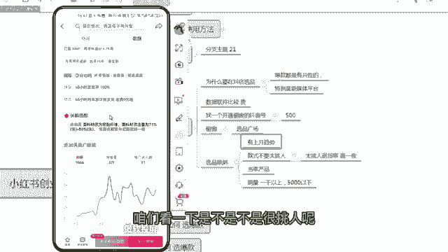

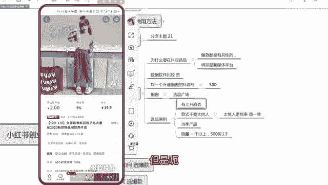

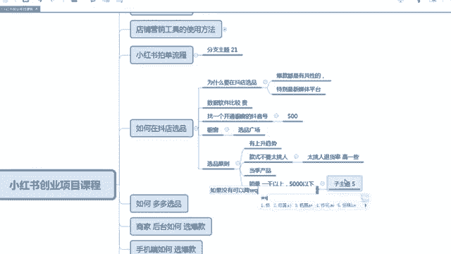

嗯你比如说是你1000以上的很少，你像这个格子格子这个服装，1000以上的其实不多的。这个时候咱们其实呃500或者是500也不多的话，甚至100都可以。因为这个春装刚出来，对不对？大家都还没卖多少呢。

是不是咱们没必要选择那么极端啊。嗯。那这个产品符合咱们选品的条件之后，咱们就点击进去啊，咱们点击这个产品的一个详情，对吧？啊，总共卖了3000多件还可以啊。啊，那这个的话咱们就要截屏嘛，截它的一个手屏。

对，手机截屏，截屏完之后，咱们就去多多里面啊。

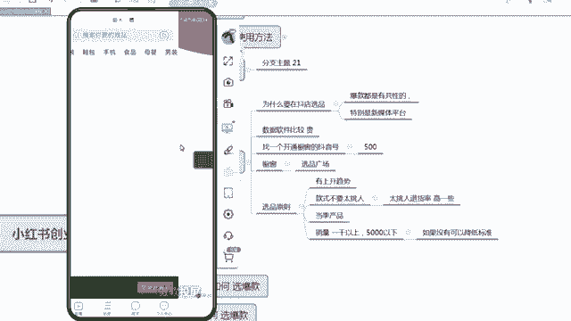

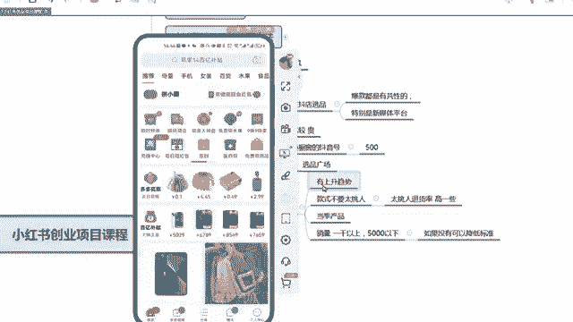

啊，咱们打开多多，然后是把刚截屏的这个图片，然后选上之后，你看多多里面有这么多商品，咱们找到咱们合适的商品就可以了啊。你看这个卖2。2万件啊，看它评价多少个，2202。228个。

说明这个评价不可能是刷出来的啊，200多多只有销量是刷出来的，但评价是不好刷的，评价是一个一个做的，像200多个评价肯定是真是卖的啊，那这个产品咱们就可以取，直接搬过去了啊，差价又没有。

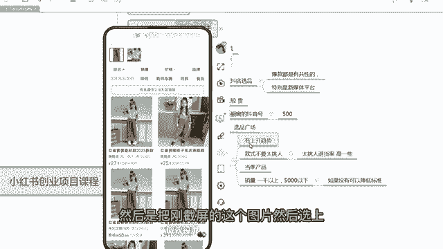

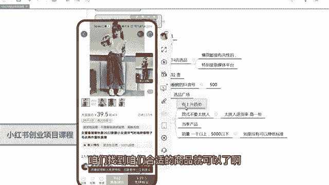

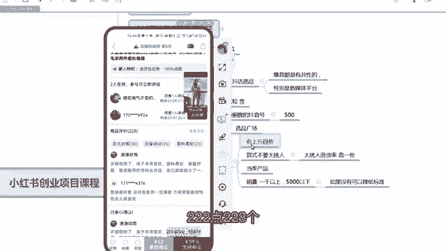

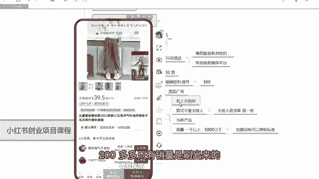

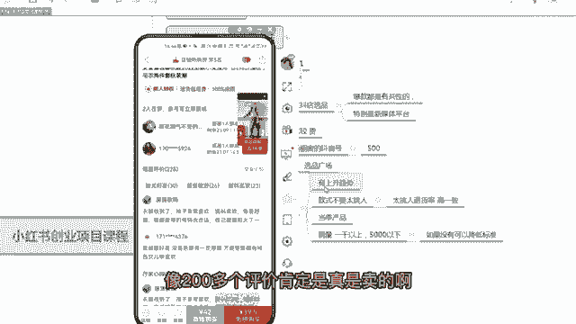

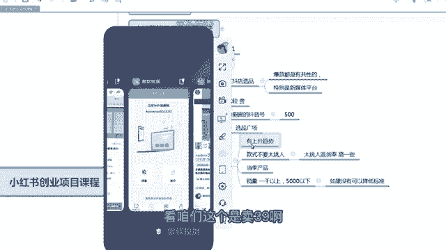

看咱们这个是卖39啊，多多是卖多多也是卖39啊，看有没有更便宜的啊。

哦，咱们找到一个3D便宜的，不过这个便宜的不是很多啊，但是咱们其他款可能便宜的更多啊。你看这个啊呃便宜个10块钱吧，39二八，那么大概11块钱啊，都是可以的。就一1一单咱们能赚11块钱啊。

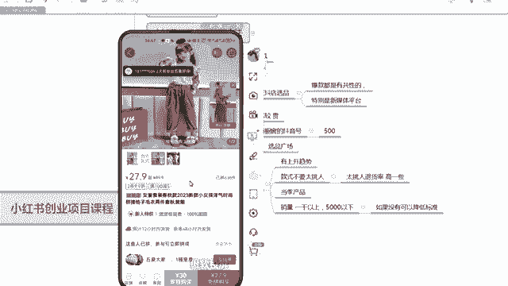

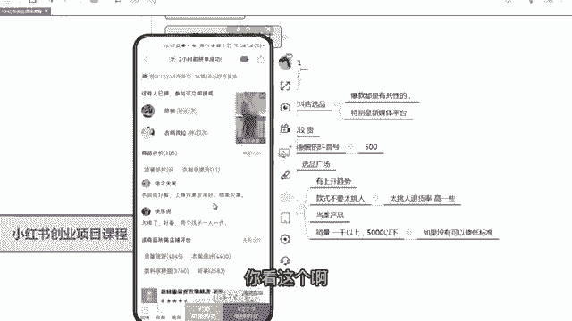

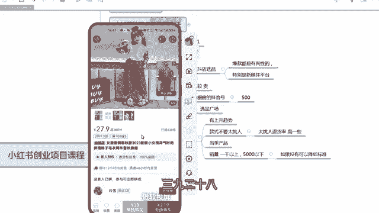

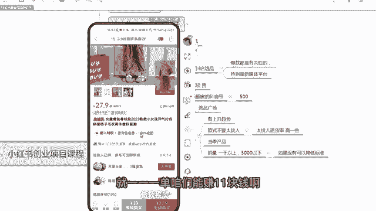

啊，那咱们也可以按销量去排序啊，销量排序之后，第三个我觉得也可以啊，咱们看一下第三个。

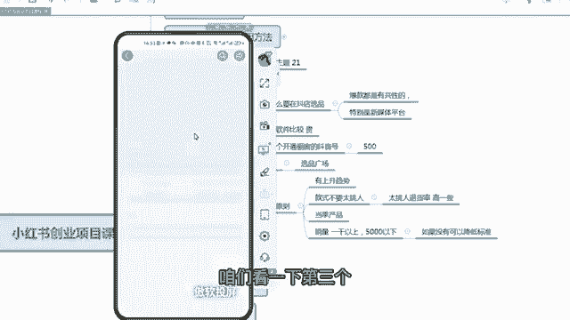

嗯第三个，你看整体上它处于一个上升的趋势啊，额断也没关系，额段也没关系，整体上处于一个上升趋势，表明它卖的还挺爆的啊。咱们点击它的详情，卖的有啊1326件啊，咱们截屏啊。

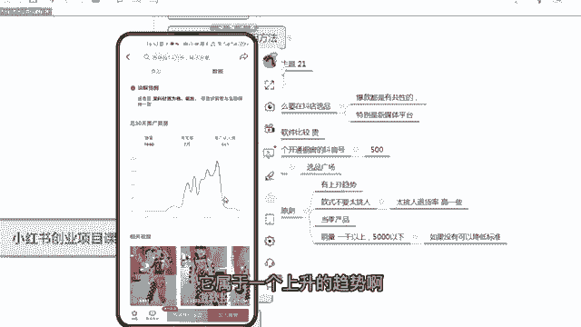

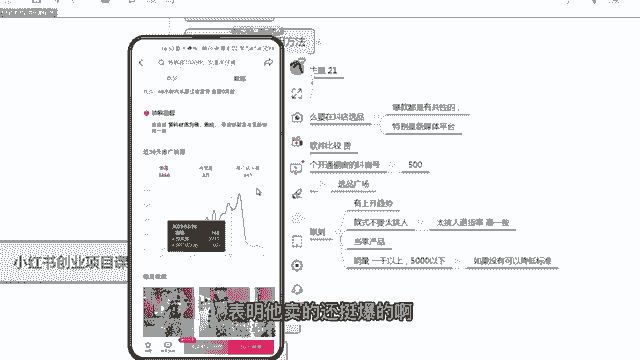

截屏之后，咱们进入咱们的多多去搜一下这个款，以图搜款，搜一下。咱们点击这一个是卖了1万件啊，销量177个可那这个就不是刷的啊，咱们看它的一个卖价啊，整体上呃是差不多4550块钱，那么抖音上是卖99。

那咱们上到上到咱们那个小红书里面也可以卖99。那么一单能赚。

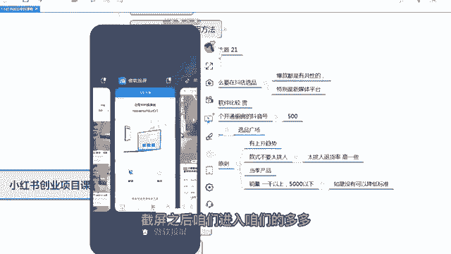

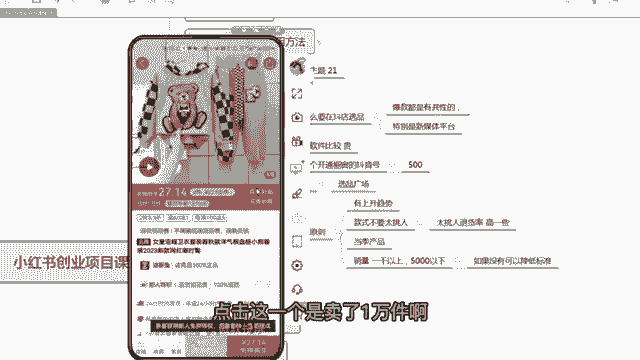

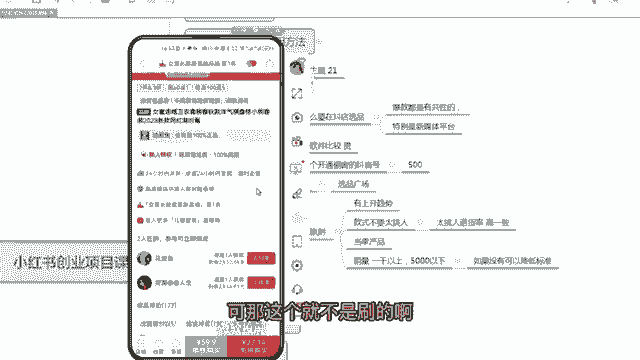

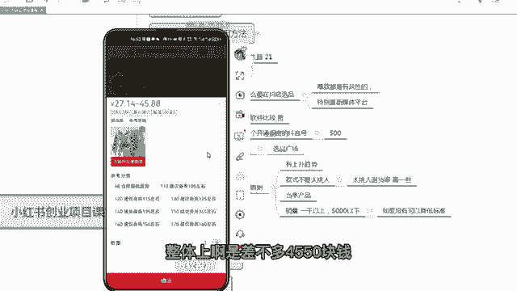

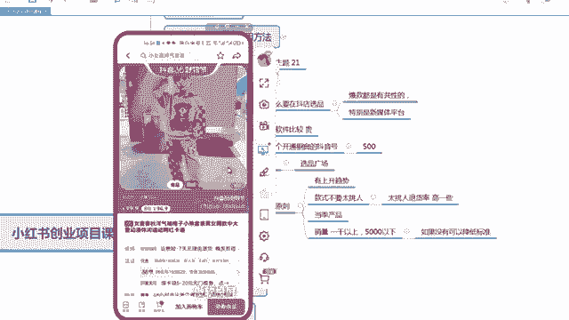

呃，一倍只翻了一倍的价格。呃，一单差不多能赚个50块钱吧啊呃所以服装的利润还是很高的啊，大家定价要稍微高一点哈，这就是如何在抖音里面选品啊。

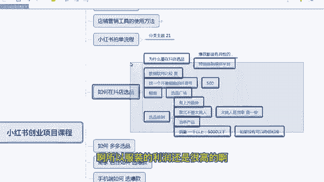

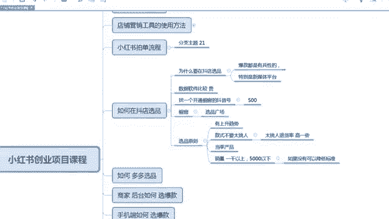