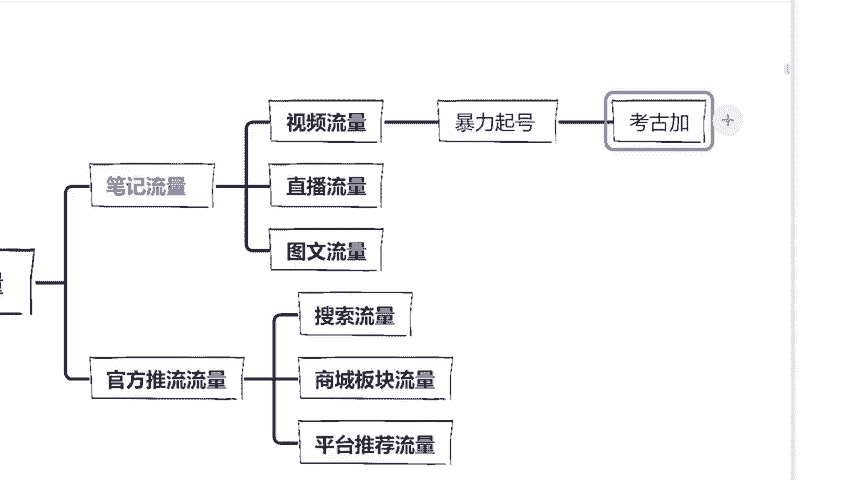
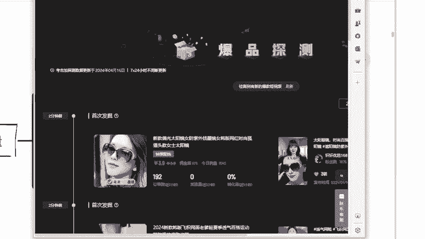
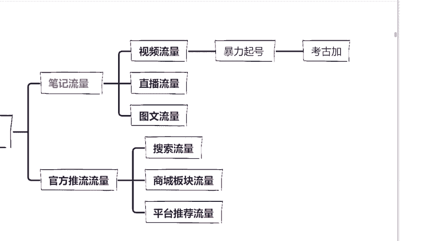
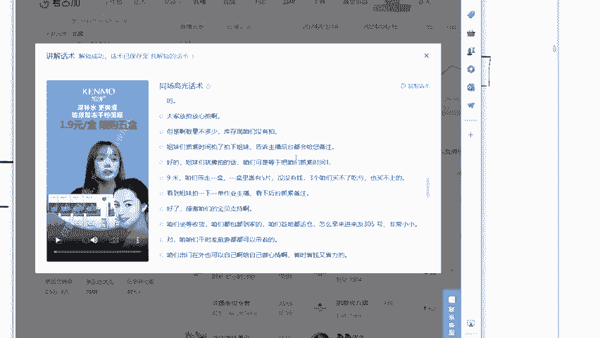
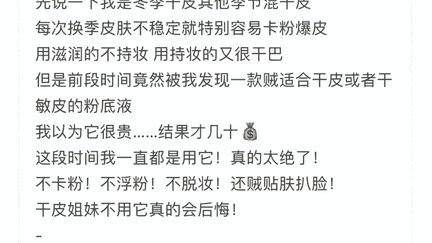

# 【2024版小红书运营教程】全B站最良心的小红书开店运营高阶教程合集！小红书体开店 起号真的快，赶快点赞收藏起来 - P11：5月7日12 - 头上油麦菜 - BV12f421m7wN

嗯，我给大家讲流量。首先啊我们做小红说，流量肯定是最关键的东西啊，你没有流量，什么都是浮云啊。如果说你没有流量，没有人进店铺，你产品再好也卖不出去。那我们怎么去获取礼物的量呢？首先我来给大家讲清楚。

这里一定要听仔细了啊，这里没听仔细，你们相当于学了个空气啊，它主要分为两个板块。第一个就是咱们的笔记流量。在这里呢，我强调一个点啊，笔记不是单纯的代表我们的图文这一种作品来，我给大家看一张图。

你们就能够理解了。😊，稍等一下下。我给大家看一下。图文是什么？就是比如说你打开一个小红书的主页，你能看到有人发布的作品，比如说图文啊、视频直播，这些都是笔记，对不对？

你可以理解为小红书的作品的名字就叫做笔记。那么第二个就小红书官方的推流。我今天呢会把这两大流量板块都给大家讲清楚，同时呢会教给大家如何快速精准的获取所有的流量。那么第一个就是笔记流量里面的视频流量。

很多同学都来说，老师我领粉丝，我纯小白，我在小红书上面怎么样才能快速涨粉，快速起号呢？为什么说我带的学生几天就能够把账号起来呢？这肯定是有技巧的。我在这里呢要提到一个词叫做什么叫做暴力起号。😊。

什么意思？呃？我带过很多学生啊，不管是有基础还是没基础，要么就死在了起号路上，要么就在起号的过程当中浪费了大量时间。我今天教大家一个暴类起号的方法，就去发布抖音或者说其他平台的爆款视频，让流量激增。

这有点像什么呢？你可以理解为哗众取宠。我刚刚说过啊，小红书官方定义是一个什么购物分享的APP那么基本上你能看到的所有的笔记内容都是以产品为主，这个点能理解对不对？那么刷的时间长了。😊。

用户会出现审美疲劳，就像你天天吃那个呃呃山珍海味，偶尔也会想吃点清汤小粥，对不对？那这个时候你想一下，如果说你刷到一个区别于种草的视频，能缓解一下你刷小说的审美疲劳。

你会不会点进去观看现在不是有个词叫硬控吗？对不对？说白了，你可能听个背景音乐都能硬控你十几秒呢？那你说你还愁不涨粉吗？那老师这个视频从哪来呢？我总不能抖音快手挨个找吧，这也太浪费时间了。来听仔细啊。

我今天是来带你们去赚钱，带你们去变现的。在这里呢，我给大家介绍一个工具，你们也打在公屏上面做好笔记啊，叫做考古家？😊，考古加是什么作用呢？打出来加深一下印象。我今天拿这个抖音为例子，好不好？来，同学们。

我给大家简单的看一下啊。

我给你们简单的看一下。来看到这里，你打开考古家里面有非常多的抖音啊，这种视频热榜，对不对？他甚至把视频进行分类，什么美食啊、宠物啊、搞笑全部都帮你分好了。你想要什么样的类型都可以在这里去进行选择。

那么在这里呢我们也可以看到视频发布的时间，点赞评论，对不对？比大小这道题大家都会把我们直接在考古家这里对不对？选择我们刚刚看到的视频，因为它会有声音，我就不给大家点开了，它会有那个视频的发布时间啊。

点赞量啊，评论啊，比大小这道题都会做，对不对？那么我们在这里选择最高流量的视频，我们拿来发布就可以了。在这里我强调一下，小红书它不是说一个娱乐平台，它不是娱乐平台，它的重心是放到哪里放到电商带货上面。

所以你不用担心说老师这个视频审核过不了，怎么办？最简单的去重方法。我们直接把视频进行翻转就能过审，这么简单。我现在问大家一个问题啊，就算你拿到了这些热榜。😊。

视频对不对？你会不会觉得说老师我一个一个剪辑太慢了，我想通过小红书来做一个副业，我能不能一下子剪出一个星期的视频呢？直接批量剪辑呢？有没有这种想法？同学们有的话，你告诉我在我的直播间，你不用不好意思啊。

😊，想不想学一下怎么去批量剪辑？就一下子我就把这一个星期的任务都做完了，我挨个剪辑真的好累呀，我就想做一份兼职，对不对？我为什么这么问你们，因为我的学生就没少跟我说这个问题，你今天叫我一声。

老师你也是我的学生，对不对？在这里呢我要给大家介绍一个批量剪辑的软件，你们直接把想剪辑的软件，想剪辑视频对不对？拖到这个左边的框里面，视频的剪辑没有数量啊没有没有上线啊。

你这个50条100条一次性300条都O的。然后呢在右侧这一个工具栏里面去进行调整啊，去水印啊，画面调整啊，分辨率啊，翻转啊，抽帧啊，对不对？你随便按一下就可以了。不要搞改太大啊，否则的话他会失真。

然后我们再点击这个开始处理就可以了。过一会你就能收获30条剪辑过的50条剪辑过的，来，你告诉我这个方法剪不简单，我们能不能自己操作这个视频流量他的起号方法暴不暴力。同学们，你觉得这个操作。

你能我给了你这个软件，你就能学会。😊，这个操作同学想要考古家和批量工具的同学，你在直播间打出想要两个字好不好？你打出来，我看一下，我说了，我是做电商的，有的是我自己的方法，不可能不然的话。

我的学生怎么跟我赚到钱呢，对不对？😊，OK那当我们今天暴力掌握了流量视频之后，起号是非常快的。并且呢到了后期是一样的，可以拿视频去带货的，对不对？😊，你们到时候记得提醒我把这个批量剪辑软件送给大家。

如果你们是想好好跟我学的话，那我一定送给大家。到时候记得提醒我啊。那么接下来呢我再给大家讲一下我们的直播流量。直播流量我相信直播间很多同学都应该看到过。这个呢就是我们去刷小红书的时候。

你会发现来给大家看图吧。不看图，我怕你们有点难理解啊。😊，看到没？这里是不是有三条杠啊，就代表着人家目前正在直播。那么对于直播这个板块呢，在咱们今年的央视春晚播出之后。

小红书春晚它是要到了很多的明星买手做客直播间嘛，让用户边看直播，边看春晚边下单购买，对不对？他其实就是说明了小红书24年的重心是什么？就是电商板块，这也证明了对直播板块的看重，这些明星买手。

他做客小红书之后，他们将带来春晚之后的第二波流量高峰。那小红书怎么承接这破天的富贵呢？没错，就是我们我们这些新买家，为什么因为平台他现在还在一个红利期，他还缺人嘛。

所以说呢小红书官方他会想要大力扶持小白推出政策，帮助我们去变现。因为你要知道平台他是缺人，但是我说话直接一点，他不缺臭鱼烂虾，明白了吗？我像我们这种能够帮他带出一大批优质的电商的人才。

是不是他会给到我们很多的扶持和政策。小红书啊。😊，目前他直播带货是非常的火的。在直播间所有同学，我想问大家一个问题，你如果说是老师我是那种表现能力强，我喜欢出镜，我想去直播，但是我去话术。

我不知道该怎么去做，但是我愿意强势的同学，你在直播间里面给老师敲个一好不好？你说老师我是那种非常市恐的，我不想出镜，但是我又想吃直播红利的，你敲个二。哎，敲出来，我看一下。呃。

有同学问是不是那个软件要不要收费？像我们刚刚的那个批量软件，对不对？它是要你自己去下的话，在网上是没有免费下的。你需要去花钱购买。但是你如果说老师我确定了，我要做小数，那这个软件我肯定是能够直接给你的。

我跟你还收什么钱，对不对？我有的我都给你啊，也有同学敲啊，是不是两种同学都不少，这样子同学们如果说你是想出镜，但是呢去话术这个问题很好解决，还是一样的，我给大家看一下啊，比如说看到这里啊。

我们打开这个考古价，对不对？你会发现这里有高光话术，对不对？我们把这个话术直接一个复制粘贴拿走，哎，你告诉我好不好用，直播流程啊，包括说你找到直播流程，对不对？还有高光话术都是有的。

你也可以到时候自己修改一下很简单的，到时候我教你嘛，直播流程啊，当话术我记好了，话术只能用在前期。因为后面呢你肯定会熟悉，你会慢慢的有自己的风格。如果说你是不想出镜的话，那么我到时。😊。

会告诉你无人直播的玩法，我已经研究透彻了，到时候你们一样能够跑通这条路的，好不好？关于直播的话分为两种，我待会给你们详细讲。那么第三种是图文。图文的话，我要重点给你们说一下。

它是小红书爆发性最强的一个板块。如果说你们今天店铺想要去爆单，想要去赚更多的钱，我们一定要学会利用笔记接上单赚钱，利用笔记来给店铺引流，从而打造咱们的爆款店铺，让小红书达到一个一加一大于2的效果。

什么意思。😊，我刚刚提到一个词叫做什么？叫做商单。什么叫做商单呢？比如说啊我们这个我先给大家详细看一下这个笔记吧，不然我怕你们看不明白，上面是图片，对不对？然后下面就是带文字，像测评一样啊。呃。

我再说回来这个完美日记完美日记大家知不知道是什么？完美日记是干嘛的，知道吗？知道的话打在公屏上面告诉老师。😊。

