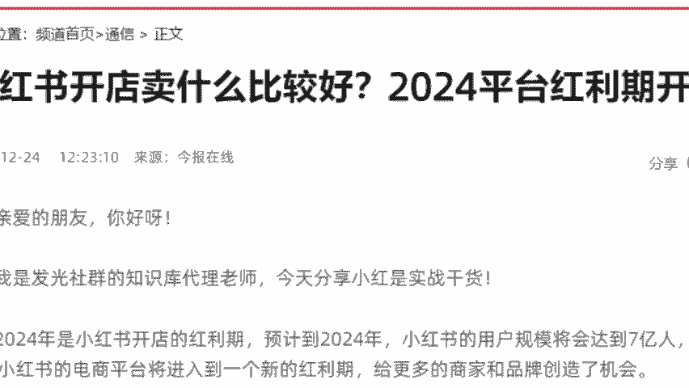

# 【2024版小红书运营教程】全B站最良心的小红书开店运营高阶教程合集！小红书体开店 起号真的快，赶快点赞收藏起来 - P1：第一章 - 香凝孕味 - BV1Pf421U77J

啊，长痘脱发脱发是不是掉掉头发，对吧？同学们，那我问你啊，假如我今天熬夜，对不对？那当我发现我脱发过后，我会选择去医院看病呢，还要选择去小红书上面搜索一下脱发，对不对？

那当我今天去小红书上面搜索脱发过后，你会发现他出来非常多的一些案例啊，视频图片，对不对？那我今天就会点进这些图片去看一下，当我今天看了这篇文章过后，我会发现他和我的经历特别相似，一样的，都是熬夜掉头发。

而且呢他在视频的下方挂上一个链接，什么链接，防脱洗发水，而且他告诉我什么，他告诉我他用了这款防脱洗发水之后，他的头发都长出来了，那我今天是不是就会毫不犹豫的去购买他这款防脱洗发水。而当我去购买之后。

发这个图文笔记的人，他就能够赚到钱了。这个就不像百度，我们在百度上面弹一下呃，搜一下原因，对不对？他弹出来一个直发广告，你对他广告是非常反感的。赶紧擦掉。😊。

所以说呢这种形式反而能够让我们更加容易去接受这个叫做什么？这个叫做软广。嗯，这个同学说对哦，是不是？因为我们在购买之前，它已经培养了咱们用户一个购买认知了，什么意思？我给你们讲清楚啊。

我今天读了这篇文章，我发现这个人和我特别相似。都是用了防脱洗发水之后，他的头发都长出来了。那我今天就愿意去尝试愿意去购买，愿意去花这个钱，所以说小红书平台就更加精准的推送广告给到咱们目标用户。

因为当我今天在搜索脱发的时候，其实就已经意味着我对这款防脱洗发水是有需求的。我本来就想买，只不过呢我在寻找更合适我自己的，然后呢，他正巧的给我推推荐了一个相对应的产品，这个叫做什么？

这个叫做引导消费者来做决策。同学们能够理解了吗？他是在引导我们去消费，这是小红书平台最大的优势啊？那么相对于咱们国内的传统电商而言他。😊。

就是要利用了他这个3亿的用户来进行变现。所以你今天是不是能够直接通过这种方式来变现，赚到更多的钱来？同学们这个地方大家能不能理解，能听懂能理解的话，明白小红书它是怎么变现的话，在公屏上面敲一个数字一。

好不好？这个地方都能理解，对不对？😊。

哎，非常的好啊。那么这个呢就是我给大家讲到我们今天为什么要去做小红书，它的优势在于哪里？它凭什么能够赚到钱？现在都理解了，是不是？但是啊它的优势虽然说非常猎人呃，诱人，但是不可能没有劣势，对不对？

他的劣势在哪里，我还是要给大家讲清楚，不能直讲好不讲坏啊。我们今天作为一个新手作为一个小白，他对你的选品要求会非常的高。我们今天选的产品呢一定要符合咱们用户胃口，你才能够更加高效的把产品给卖出去。

那么关于选品这一块，我给大家讲过了。我是最擅长打造爆款的。所以待会呢我会教大家，咱们新手小白如何去选择爆款，这一点，你一定要听我的，你不听我的，你自己去做做款了，你就别怨我了。我们怎么去做才能够直接出。

但直接去赚钱。这个点你只要听我的，你就不用太担心。为什么我给你看一个我的学生吧。来我这个同学啊，他叫做刘玉，大家可以看到他在当初过来跟我学的时候，他跟我怎么说，他说童彤老师开小红书店铺真的能够赚到钱吗？

他跟你们想法一样，他说。😊。

老师，我不会拍摄，不会写文案，我也不想直播露脸。我今天没有货源，没有产品，我到底做不做得起来。当然了，我要求也不高，我就想做一份副业，做一份兼职，每个月挣个两三千我就知足了。当时我就跟他讲。

我说你不用担心，彤彤老师，我来带你做店铺，对不对？所以当时我帮他开的这家店铺是我也是我亲自帮他选的产品，卖的是什么？我们可以详细来看一下。😊。

哎，同学们看到没？这是一款居家服啊，卖价是多少？99块钱，对不对？那么这套居家服呢，我的学生刘玉，他在小红书上面售价是99，这是他的一个卖价。当时呢我帮他找的货源，我们来看一下货源在哪里。

在1688上面的。你们看一下是不是一模一样的一个产品啊，对不对？还有绿色蓝色的啊，我在这里首先说一下，大家千万不要对1688反感说用户那不知道用户不知道他自己下单去1688吗？

你们自己也知道1688便宜。我想问你们，你们平时买东西在不在1688上面买，也不是吧，对不对？首先第一点，我刚刚给你讲过的，消费群体不一样，他是中高端女性，第二点，比如说你跟我你是希望买一辆呃。

买一件质量好一点的，对不对？那几块几10块的，你不敢买。但是当这个东西变成99，你会觉得他质量一定有保证否则他不敢卖这么贵，对不对？那我也会想要买便宜的质量好的。但是我可能为了一个衣服。

我一次性去买十几家店铺。😊，同的价格选出一个性价比最高其他再去退款嘛，不可能，对不对？太多同样的东西，不同的价格。所以说后期肯定是我来帮你找货源，都是我们团队实测过的，都是花了钱去测试的。

我本包括我本人都不知道跑过多少线下厂家了，明白吗？就是为什么我们可以去选择1688原因啊，那么在1688上面，我帮他去拿货，他的成本价是多少呢？同学们38块钱。那我们现在还是一样的来算一笔账好不好？😊。

那是多少钱啊？99减去38等于多少，61对不对？61块钱还没有减掉运费啊，我们运费其实到后期挺便宜。但我们现在这里算贵一点。好吧，我们减去一个8块钱的运费53块钱，是不是？

那我们来看一下他开店的时间虽然短，但是到目前为止卖了多少家，卖了多少套呢？我们来看一下，哎，同学们咱们看到这里啊，卖了817套，是不是817好，我们再来算53乘以817等于多少，等于43000。

这是就是他的一个纯利润了，对不对？那么他最开始是和你们一样都是什么都不明白，他自己都说到说什么都不会。我一个月就想挣个两三千0一个零基础性用小白，通过这一个单品，在两个月的时间达到多少，达到了4万块钱。

而且而且他店铺现在不止这一个单品，后期我会让他上架10个单品，上架20个单品，那你想想他是不是能够做到收益去翻倍了。包括我给大家看一下他的一个店铺。😊。

啊，来他这家店铺叫做I love you，我们来看一下，我们来看一下数据，他当时做了多少啊，同学们做了95000。那么95000我们大概算一下，百40的话是多少，三四万块钱，对不对？

同学们一个月是三四万，他最开始跟我说，老师，我真的一个月两三千没想现在把小红书从兼职转为全职来做了。一个月呢最低的话，没有节假日，没有那些呃大卖节的话，一个月2万多也是没有太多问题的。

所以同学们我们现在去做小红书店铺，你们今天需要有什么。首先你必须要有一部手机，我们是可以直接去做起来的。因为呢你今天是不需要去囤货，也不需要去压货零启动资金，我们都能够去做，羡慕想做，那你就好好听课啊。

😊。

这个东西呢我再给大家讲一下，因为它不像说你要开一家公司去创业一样。店铺啊，我给你讲实话，你就算一个月挣少一点，咱们前期对不对？一个月挣个两三千，挣点零花钱，我觉得也是可以了。而且这还是最初期。

而且同学们你们一定要记住一点啊，在这里给大家稍微强调一下，我们在中国做生意，你一定要干嘛，一定要跟着国家政策来走。我不知道大家平时看不看新闻啊，如果你们看新闻的话。

应该可以看到这个这个是中华网发布的一条新闻。他怎么说的，完成暑店入驻，2024年平台红利期开店直接能够赚翻篇。因为24年是小红书开店的红利期啊，24年小红书规模将高达7个亿。所以同学们。

咱们今年开暑店一定是最大的一个风口。那我想问你们一个问题，听课听到这里，你说彤童老师，我确实觉得小红书这个平台它的前景发展都很好。我也想在小红书上面去开一家店的，我想要在这个平台上面去赚钱的同学。

你在直播间把三个6。😊。

抄在公屏上面，我看一下哪些同学是真的想要跟我去好好学习的，好不好？我看一下是真的想要去做小红书，愿意去花时间，愿意去努力的同学。

