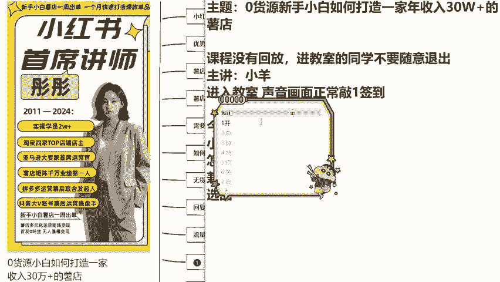

# 【2024版小红书运营教程】全B站最良心的小红书开店运营高阶教程合集！小红书体开店 起号真的快，赶快点赞收藏起来 - P1：第一节 - 根正苗红好学长 - BV14m411C7Er

来，hello，同学们，有没有同学提前到教室了，来帮老师一个小忙好不好？现在呢就是同学们能够听得见老师声音，并且看得到画面，没有杂音，没有卡顿的话，咱们在公屏上面帮老师敲一个可以好不好？

声音和画面都是正常，没有卡顿啊，没有黑屏这种现象的话，咱们在公屏上面敲一个可以。😊，都没有问题，是不是哎，非常的好？恭喜大家提前到达教室啊。现在呢距离我们上课的时间还有3分钟。

那么既然大家提前到达到达这个教室呢，我也不可能说放点歌，让你们就白惊喜，对不对？我给你们另外一个小福利，好不好？今天大家有没有什么想学的内容，可以打在公屏上面。我呢也算是给这些提前到达同学们一个小福利。

好不好？有没有什么想学的内容啊，😊。

来敲出来。嗯，想学习怎么赚钱，这个是没有问题的啊。因为我们今天去做小红书，目的是什么，又不是做慈善，对不对？老师说直接一点，都是为了提高我们的生活质量，提高我们的一个收入啊，小红书怎么带货。😊。

OK这个可以去讲，没有问题的，怎么变现？它的变现方法有非常多，你们主要是想学什么呢？比如说它的一个蒲公英计划，比如说他的直播带货，比如说它的商品挂链接，是不是？😊。

呃，想问一下关于兼职对不对？兼职能不能去做？其实啊它是更加适合兼职去做的。如果你现在是呃有工作的话，我并不是很建议辞职去做。你前面呢你先做一个两个月，对不对？等到他兼职收入超过了你全职的收入之后。

你再去做。因为我们并不是说一上来小红书，他一天就要花你八九个小时的。前期你的养号啊，那些还是需要嗯需要的时间其实并不多，你就算做全职的话，每天估计也就四五个小时。所以说我更加倾向于你去兼职去做。啊。

想知道怎么去选品。😊。

没有问题，这个也是可以讲的，怎么去开店？哎，这个同学说的非常好，你们有没有什么想开的店啊，可以打在公屏上面，我到时候给你们一点建议，好不好？现在这个市场更加适合开什么样的店。

卖什么样的东西才能赚到更高的一个收益。😊。

