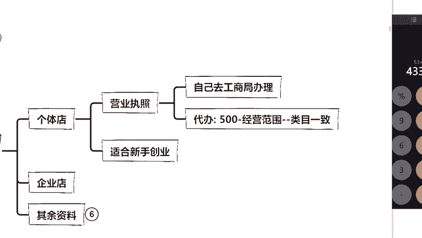
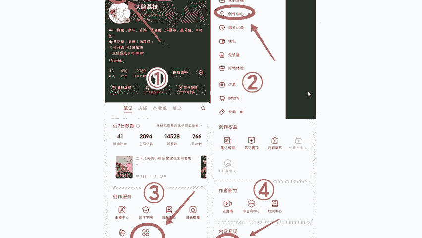
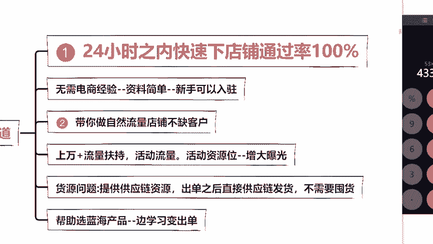
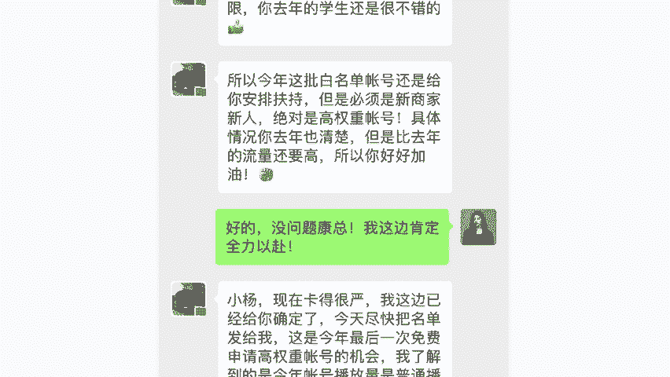
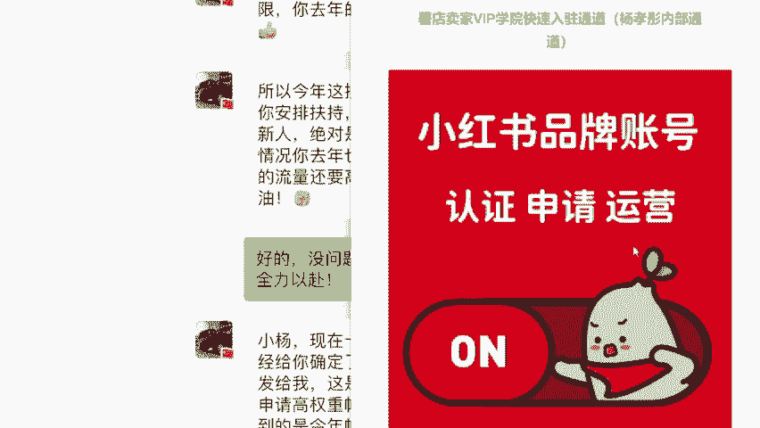
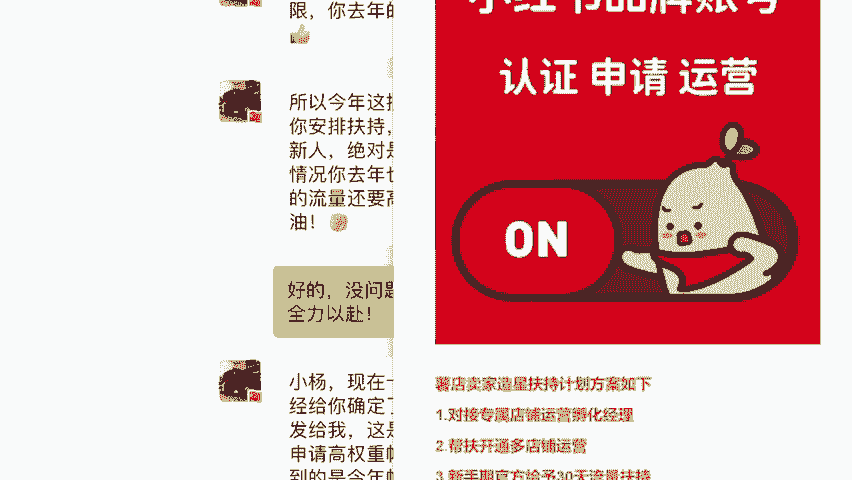
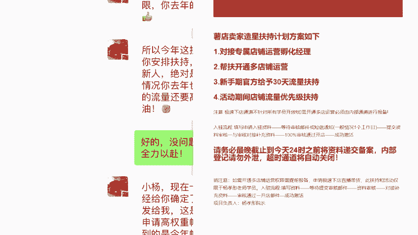
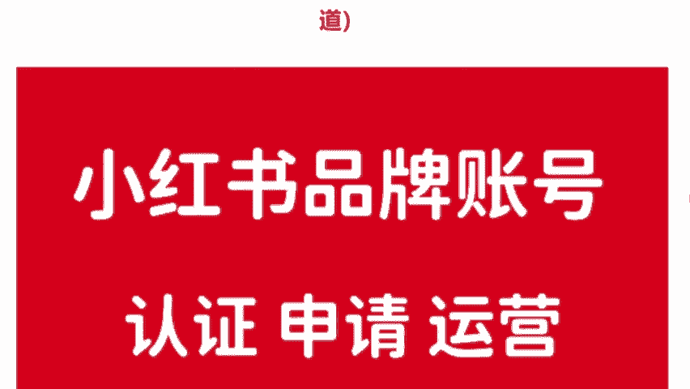
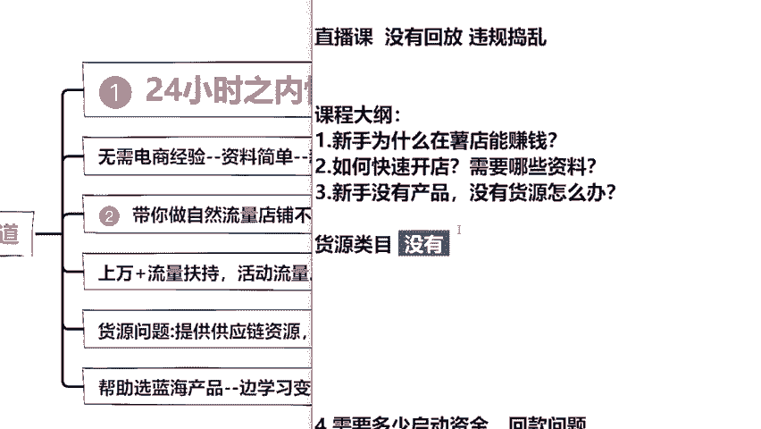

# 【2024版小红书运营教程】全B站最良心的小红书开店运营高阶教程合集！小红书体开店 起号真的快，赶快点赞收藏起来 - P2：第二章 - 香凝孕味 - BV1Pf421U77J

O那我们现在去开小红书店铺啊，它分为两种。我给大家讲一下。首先第一种是什么？来，我们看到这里，我把它关一下，免免得影响到你们啊。第一种呢是个体店。那么第二种叫企业店，听我一句劝啊。

前期呢你不要去开企业店。因为企业店的话它是需要报税的，对你来说会比较的麻烦。那么个体店呢它的通过率也会高一些。那我们今天需要准备什么呢？一张营业执照，没有的同学你可以去工商局办理，其实很简单啊。

或者说待会彤彤老师，我来帮你们解决前期没有营业执照的问题也是OK的，那么我们准备好过后呢，需要一个小红书账号，你要有身份证号，你要有手机号就能够去把小红书店铺给开起来。

那具体呢我们是一个怎么样的开店流程，我在这里给大家来详细的说一下好不好？这里就不用做笔记啊，我给你们讲你们了解一下就可以了。到时候呢我们进入到小红红书的一个首页，首页呢左上角这里是不是有三条杠啊。

同学们是不是我们点击三条杠进入到第二步创作中心，然后进入到第三步，这里有一个更多服务。当我们点击完这个更多服务之后呢，你看到没？右边这里有个管理店铺啊，我我。😊。

到我这里是管理店铺，你们那边会是开通店铺，明白了吧？我们就能够直接去开通了。在这里我给大家详细说一下，你到时候把你的姓名、电话、身份证号、营业执照，你选择类目退还货地址全部都准确无误的填写进去过后。

你就可以进入到小红书审核了。在这里呢，我稍微的给大家说一下，我们开店呢是有两种方式，你们可以自由的来选择这个的话是没有什么强调的呃强迫的，我只是给你们说一下，你们可以自己去选择啊。分为两种。

第一种呢就是你们自己去开店。但是我要给大家说句实话，你们自己去开，就是一个普通入住。如果说今天各位同学我们选的是一个普通入住的话，你把所有的资料提交上去，你等待呢大概20到30天就会有一个结果。

那么一般来讲呢，我们教室里面100个同学去申请。可能呢我说句实话，并不是所有同学都能够通过，可能通过率只有50%。而且我给大家强调一个点啊，如果说我们是。😊，普通入驻的同学。

你的店铺是拿不到任何流量和扶持的，没有流量和扶持。你可以想一想。自己容不容易做起来，不容易吧，对不对？还有一个重点，大家一定要记住啊，就是我们一套资料只能申请一次。如果说不通过的话，你就直接作废了。

你没有机会去申请第二次。就算有的话，你要等上半个月了，明白没有？所以同学们你要记住啊，在你们资料没有准备齐全。你填写说没有百分之百的把握。你千万不要随便的去申请小红书店铺。

因为今天呢是我们自己去官网开店，必须要符合人家官网的一个要求，那么我们今天讲了开店这个点，其实大家也不用灰心相机说，老师，那我万一通过不了怎么办，对不对？你们今天过来听彤彤老师我的课，我的课呢？

嗯这些东西对于你们来说可能比较难啊，但是对于我来说其实是嗯很简单的一件事情，那我今天呢我能不能帮你们开店，我告诉你呢，并且呢我是能够直接百分百的帮你把店铺给开起来。为什么刚刚直播间有些同学来的比较晚啊。

说老师你为什么能够帮我通过啊，我前面给大家讲过的，我到目前为。😊，为止也是有十多年的一个电商经验了。当时我是首个一周时间通过小红书去变现赚到钱的人。所以当时呢我是受邀来给大家讲这节公开课的。

来给大家看一下啊，来这里给大家看一下，我是获得了小红书的十佳授课导师的，包括在腾讯课堂老我也是小红书举证电商运营变现的高级讲师。如果说我今天没有实力，我不可能坐这给大家来讲课。我没有点本事。

我们学院也不可能说有这么多的合作平台愿意来跟我们合作，对不对？所以说彤彤老我作为小红书资深卖家，我熟悉平台的规则和玩法。那么你们跟着我来做每个学生我不说百分之百。

80%拿到3万以上的一个月收入在成熟期是没有任何问题的。那我今天为什么要来给大家讲这些公开课呢？我也直接给大家说一下，因为有很多同学都说老师那这个赚钱方法，你为什么不武警了。

为什么要宣扬出来来我给大家说吧，我直接跟你们敞开聊好吧，因为我们。😊。

招商经理呢，他也跟我说的非常清楚了。他说今年会给到我一批高权重的店铺，那么高权重店铺会直接有流量扶持，让我们的店铺能够快速的直接做起来。他为什么会给我，其实说白了，因为我的学生收益是非常高的。

他希望我能再带出来一批高收益的学员，所以说呢今年公司是直接给了童童老师，我一个VIP学员快速入入通道，我来给大家看一下好不好？这里你们一定要看仔细了啊，这个呢是我学员独有的什么意思？

如果说你们今天是通过彤童老师，我的内部通道来进行报备的。你记住啊，首先第一点，我们需要提交你的本人的姓名电话一些资料等等，对不对？那么你把这资料提交上去过后呢，你不用等20天不用等30天。

你记住24个小时，我就能让你百分百下店，把这个店铺给开起来，明白没有？而且呢拿到所有的扶持，拿到所有的政策，你们来看一下项目负责人杨晓彤院长。😊。

彤彤老师，我对不对？同学们，包括有同学在问说，老师，那我没有这个营业执照怎么办？没有的话，没关系，前期呢你是可以通过我的VIP快速通道入住来进行报备的，提交好你的资料，24个小时百分百下店铺。

并且呢拿到所有的扶持，拿到所有的政策一天直接下店，咱们争取一周出单一个月打造爆款好不好？因为呢你们可以来看到这里啊，像彤彤老师，我这个同学他叫做什么，他叫做张玲玲，我们来看一下他怎么说的。

他说老有你帮忙就是款。我之前提交了好久都没有下店，没想到这次当天就下店了。因为他之前是一个人在琢磨嘛。我来给大家看一下他的店铺好不好？他的店铺叫做玲玲小铺啊，我们来看一下，他当时呢是做到多少。

做到了27万的一个销售额，27万乘140是多少啊，这里我们就不忙猜了，我要给你们算出来啊，你们不要觉得多啊，因为他是跟着我还是做了蛮久的，已经到了一个成熟期了，他现在呢手底下也是有一些员。😊。

是一起来做的，一个月呢是10万左右的一个纯利润。包括我给大家看一下，我这个同学叫做李婷文的。他怎么跟我说的，他说老师活动力度真的大，活动期间直接通过小红书就给报单了。所以说同学们。

你们通过我的VIP快速入通道来进行报备。而且在你店铺开起来之后呢，你能够拿到我给你的所有辐射政策让大家一周出单一个月打到爆款好不好？那么今天呢你是想走我的VIP快速入驻通道来进行报备的同学。

你在直播间里面把需要两个字敲出来来敲好了，你想想这个不就是信息差和资源差吗？对不对？那么所有敲了需要的同学啊，O我到时候会给你们登记的助教，你先帮我统计一下啊，所有敲需要敲一遍就可以了。

助教老别统计漏了啊敲好了。那么今天呢我对大家没有其他要求。唯一一个呢就希望大家能够做到认真听课，并且呢在直播间积极跟老师来互动的。那么待。😊，你把课程听完之后，资料提交给我，我会去帮你们开店，明白没有？

开店呢，它会涉及到一些你的个人信息。所以说你到时候把资料提交给我，我帮你去后台登记好，你再去开通，这样子会更加方便一点。明白没有？到时候你再自己去开通啊，所以同学们记好了，开店这个点，你也不用太过担心。

待会呢彤彤老师会来帮助大家，我说过帮你，我就肯定会来帮你的，明白没有？这是我们开店这个板块啊，有同学也在问说彤彤老师，那我今天作为一个新手啊，我作为一个小白，我去做小红书店铺，我没有货源。

没有产品怎么办？同学们，我想问你们一个问题啊。😊，之前也是有同学聊到这个问题，在开课之前说没有货源的同学，我先问有货源的同学，你在直播间把你的这个货源类目敲出来。如果你说老师我是没有货源的话。

你就把没有两个字给我敲在公屏上面，好不好？我来看一下。😊。

