# 【2024版小红书运营教程】全B站最良心的小红书开店运营高阶教程合集！小红书体开店 起号真的快，赶快点赞收藏起来 - P3：第三章 - 香凝孕味 - BV1Pf421U77J

OK呃，贺州同学没有大部分刘振燕同学没有，大部分同学都是没有，对不对？没关系啊。那么今天呢如果说你是有货源的话，你的货源供应链呢有优势，价格有优势啊，比如说你是做美甲店的，对不对？

那么待伙呢你就可以直接用自己的货源自己的产品，我会教大家如何来发货，如何来定价的，包括怎么选我们的一个爆款商品，也就是所谓的选品，能理解吧？但是呢很多同学都在说没有货源知秋没有，对不对？

在车站等人同学也没有没关系，那我今天是不是就不能通过小红书去开店了，肯定不是的，你没有货源呢？那我就教你没有货源的玩法，好不好？什么玩法，大家记住啊，玩法有很多种。

我先给你们讲一个最适合信用小白最简单的，好不好？这个呢叫做代发嗯。😊，听仔细了。呃，比如说我们今天要去卖货，对不对？卖东西，那首先你得去找货源。你得去进货，对不对？那这里相对应的你得有厂家，是不是？

那老师我不像你有那么多的线下厂家，一个个工厂去跑，那我怎么办呢？我会来给大家对接一些线上的厂家。我们管这些线上厂家去拿货，也可以叫做什么呢？代发平台。什么叫做代发平台啊。😊，我给你们敲好。

你们也要做好比价。说白了就是我们今天用别人的产品来赚我们自己的钱，也就是我们今天作为中间商来赚一个差价，对不对？我不可能为了开一下小红书店铺，我去开一个工厂啊，同学们这个地方能够理解对不对？

我们是来赚这个差价的。我来给大家讲一下啊，所有的知识点都是干货，一定要认真听很多同学都在问，那我去哪里找货源呢？我做店上这么多年了，我手里可能没有货源吗？同学们给你们看其中一部分好不好？

无论你们是想要卖这种工业啊，机械电子批发，对不对？服装批发美妆啊、珠宝食品医药这等等，我都能够给你们去对接到最优质厂家，我也是常年在里面帮我的学生去进行选品的，明白没有？

线下厂家我给你们说实话都是我一家一家挨个去跑过的，都是我进行实测过，到目前为止呢，我是带着我的团队内测了差不多有10万家的一个爆款了，意思是什么？同学们这里还有一个好处。😊。

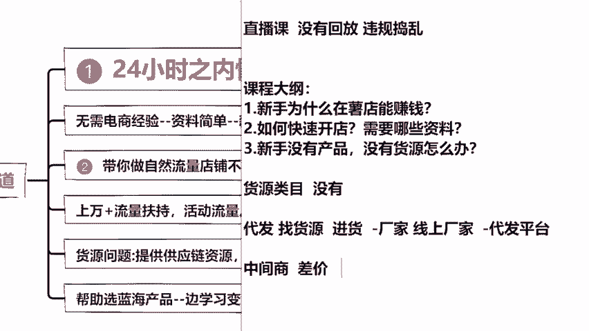

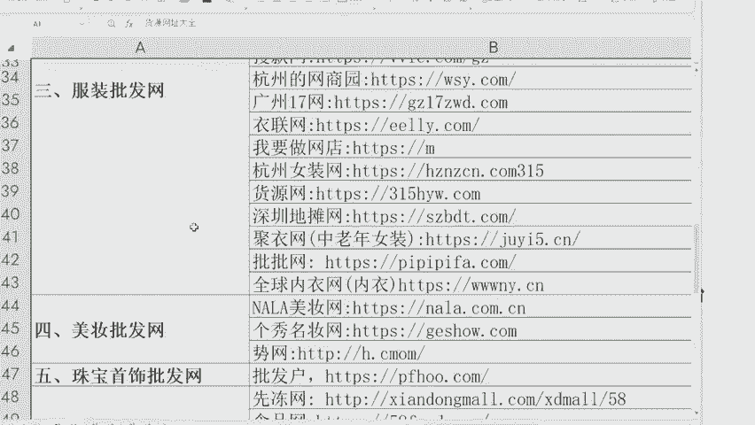

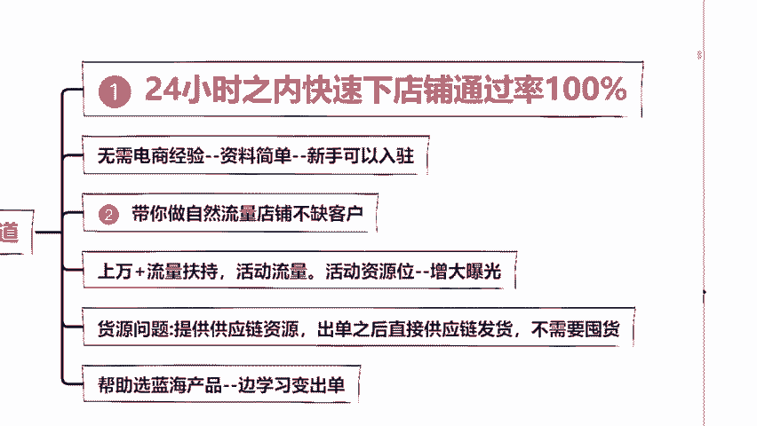

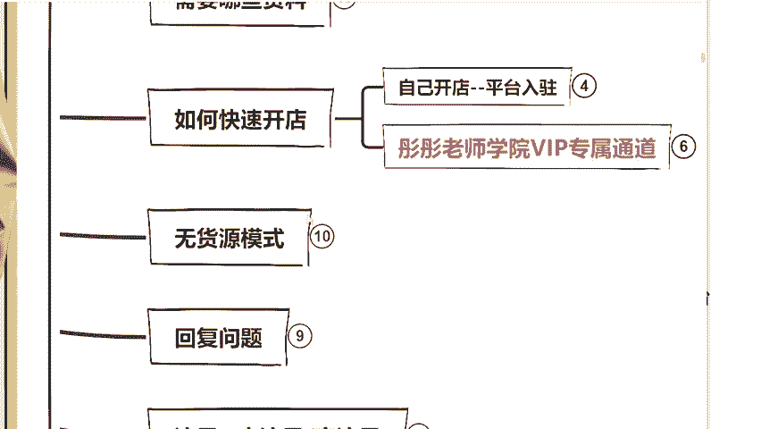

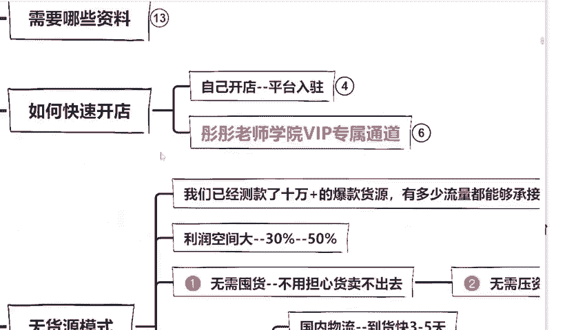

要记得啊，就是我帮你挑选产品，不管你后期店铺有多少流量，你出了多少单，我都能够保证商家百分之百准时来给你发货，明白没有？而且最重要的一个点在于哪里？

最重要的一个点在于我能够保证大家的利润达到30%到50%以上。来，同学们，这里记好了。

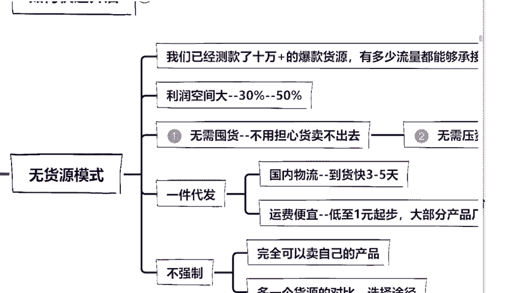

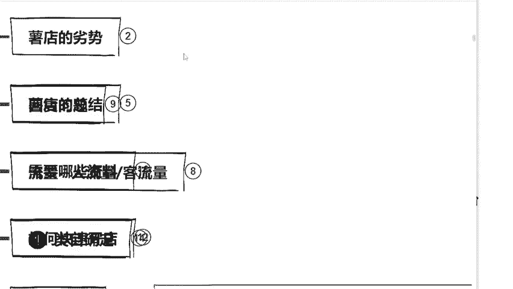

哎，稍等一下。嗯，你们现在看课件还清晰吗？我这里稍微有点模糊啊，你们卡不卡，你们卡不卡？同学们，你们卡吗？😡。

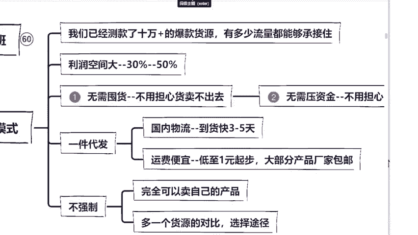

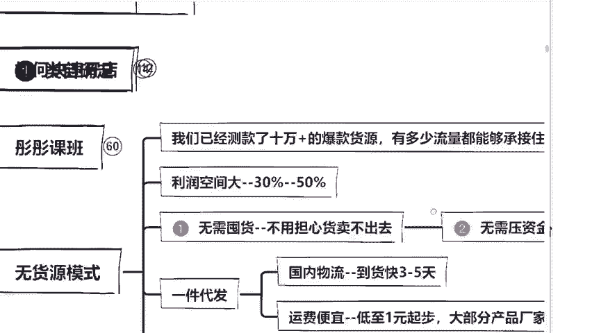

OK不卡吧，不卡就OK啊，我这里稍微卡了一下。最重要一个点是什么？刚刚讲到30%到50%以上，对不对？目前在我们国家那么多个呃什么抖音啊、快手对不对？能够达到让你达到30%以上吧。

咱们不说百50就30的，其实只有小红书一个平台能够达到这样的收益。你们自己可以想想，因为我在前面给大家说过，小红书平台80%，它的用户都是什么？还记不记得？来。

同学们告诉我小红书80%以上的用户群体都是什么？打在公屏上面。😊。

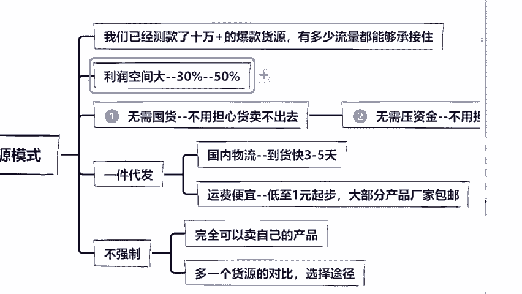

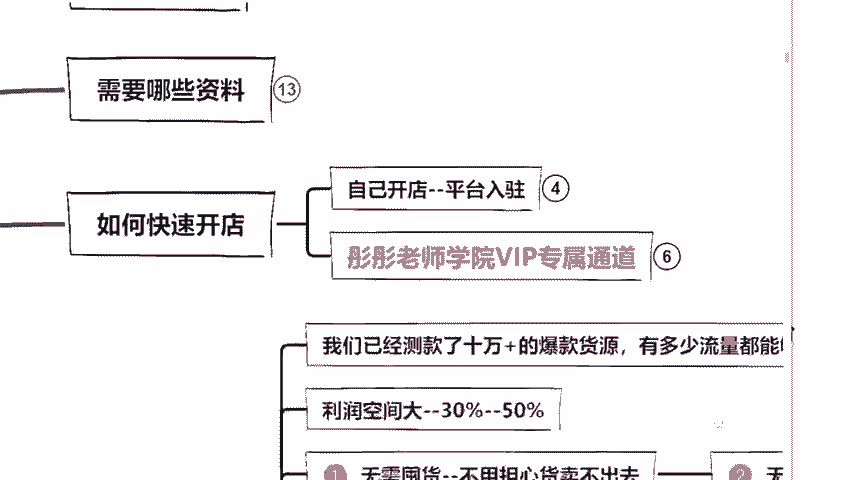

该不会我前面讲的，你们转头就忘了吧。对，非常的好。中高端女性啊，这个王安子同学课后把地址发我，老师给你寄一份神秘礼物，好不好？优秀同学就该有奖励啊。😊，呃，80%都是中高端女性，明白没有？

所以说呢我把我的产品给卖出去，这些女性她本身的购买能力就强，产品就是非常的暴力。所以说我们卖出去就能够直接赚到钱的，明白没有？有的人问说，老师，这个利润真的有那么高吗？彤彤老师。

我在这里直接用我的学生来给大家举个例子好不好？你们可以来看到，老师我这里呢有一个学生，他卖的是什么产品？一个拼图玩具对不对？这个儿童拼图玩具呢，价格是多少，价格是58块钱，对吧？58块钱。

那有同学可能会问说老师，那这一单他大概能够赚到多少钱呢？她卖的也不算特别的贵呀。😊。

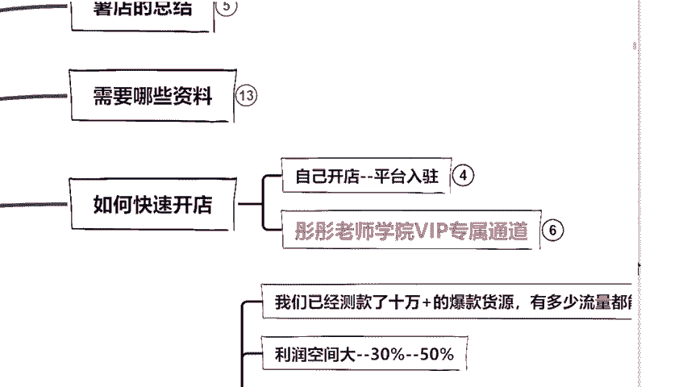

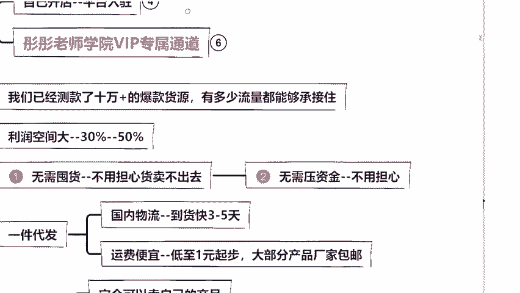

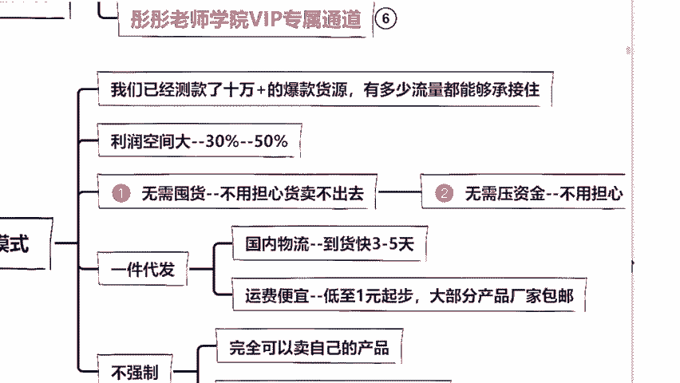

首先你想知道他赚多少钱，你是不是得知道他的成本价是多少？那我们今天怎么去找成本价呢？你们跟上我的思路，听仔细啊。首先第一步，我们把这个商品给他截图下来，截图呢保存到你的电脑或者说是呃手机上面。

然后第二步你打开1688这个网站，1688打开之后呢，无论你是手机电脑，这里搜索旁边都会有一个相机啊，你点击相机，然后呢，我们把刚刚截图上传上去，然后点击搜索会出来什么，会出来大批一模一样的拼图。

但是呢价格不一样，有10块的，有8块的，有18的28的各种各样的价格都有，对不对？那我们就要在这里去拿货。比如说彤彤老师，我今天随便给大家找一个啊。比如说我们随便找一个这个。😊。

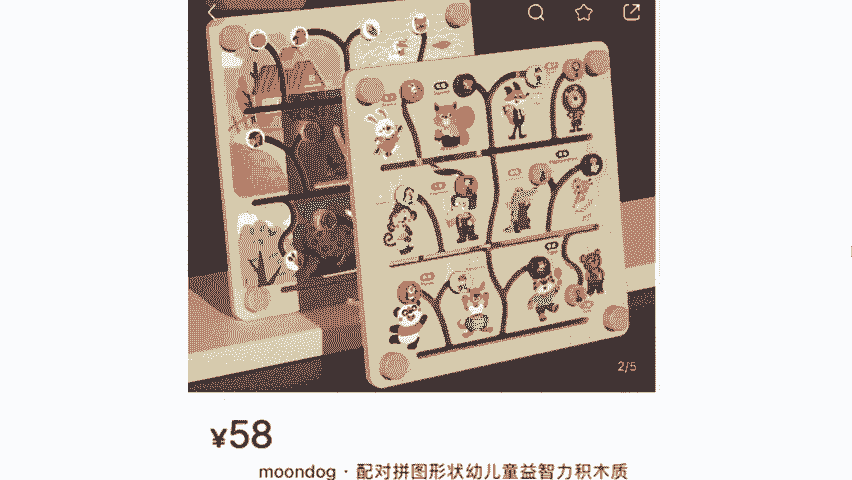

28块钱的好不好？呃，这个27便宜1块钱啊。那我们比如说这个27块钱，我们用58。😊，用这个58来减去这个27等于多少，等于31块钱的利润，对吧？这个是毛利润还没有减掉运费啊。

我们现在再来减掉一个8块钱运费。后期的话你不用担心为这8块钱心痛啊，后期我们的运费，我会教你们怎么把运费给留下来啊，那么23块钱就是我们的纯利润。老师刚刚你说的真的能有30%到50%的利润吗？

我们用23去除以多少除以58多少0。3940的利润，对不对？计算器看不到吗？百40的利润看到没？这里看到没？百40的利润对不对？39。6嘛，45入对不对？所以说啊直播间各位同学，你们今天去做产品的话。

你们的产品能够达到40%这样的一个利润，你们满不满意，光是卖个拼图，我随便给你找一个，你能达到40%满不满意满意的话，把满意打出来，我看看如果说老师我不满意，我就想卖那个10块钱的卖那个8块钱的。

也不是没有啊，但是你听我讲我如果说你卖58块钱，我推荐你让你。😊，去卖这款买进货进这款27的，你就不要为了贪便宜去找这种12块的什么10块钱的，能明白吗？同学们为什么？因为我给你推荐一定都是我实测过。

它的质量是过关的，你到时候买个10块钱，你赚的钱更多，你是没有复购率的，你是会砸了口碑的，明白没有？同学们，我让你去选这个是为了你好，是为了能够让你有口碑，能够有稳定的质量，O吗？这都是我拿钱。

我拿我的团队去测过的，直接让你站在我的肩膀上去成长。所以到时候你这里一定要听我的啊，能够卖的出去才是多少单，对吧？那我们现来回来看一下他的店铺卖了多少个单。哎，同学们，咱们看一下。😊，卖了多少个单啊？

4529个单，对不对？4529个单。那我们现在来算一下，拿出我们的计算器。

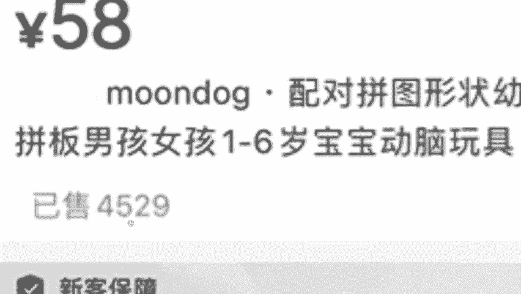

4529乘以多少？23块钱嘛，等于多少？10万块钱一个拼图，对吧？我们刚刚算的27块钱，每一单23块钱减掉了运费。如果我不请人帮忙聊客服的话，这一个单品纯利润让我赚到手是10万块钱。

所以说我要告诉你们是作为一个零技术小白，只要你把产品选好了，小红数利润空间是非常大的。而且呢这只是一个单品的利润。那后期如果直接20个单品，30个单品呢，你想过没有？同学们。😡。

现在小红书平台真的很好做，只要你选对产品，只要我们能够出单，就能够去赚钱。那么数据就是一个最好的证明了。这个地方呢是我教大家来如何去选品的，再教大家如何去找货源的，我再给大家说一下，在小红书上面。

你什么淘宝啊，拼多多是没有办法代发的。但是呢1688它是可以代发的，明白没有？这一点记好了啊，关于这个地方给大家讲完之后呢，我接下来再给大家讲一下，就刚刚有同学问到的，说老师那今天我这个客服怎么搞呀？

如果说有客人来到我的店铺，他问我问题，我当时在上班啊，在上学啊，那这个问题怎么解决呢，对不对？来同学们看到这里啊，给大家我直接给你们上图，因为看图片的话，会更加清晰一点，对不对？

这也是你们到时候签翻后台啊，然后呢我们点击客服这一栏，进入到这里它会有一些欢迎语设置啊人工设置对不对？包括还有一些自动回复的问题啊，我直接在这里设置好就可以了。但是你光靠自动回复，可以吗？😊。

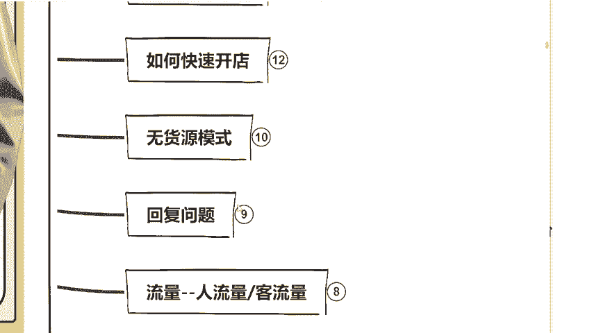

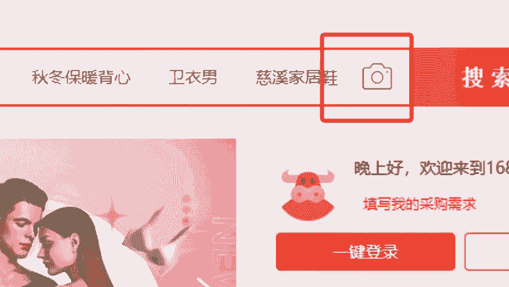

来一个客人，他说你帮我选个码数，他说你好，你再问他说哎，哪个颜色好看，他还是只能说你好，自动回复没有用的那我除了自动回复，我一天也没有那么多时间怎么办啊？同学来看到这里啊，平台能够帮你解决。

我在这里问大家一个问题，你们仔考虑好了，考虑好再回答我啊，人家平台呢是有24个小时的在线客服来帮你解决买家的问题的，这些客服呢非常的专业，如果说由客服来帮你回复成交一单呢，你给一单的钱。

大概是4到5块钱的代运营费，你会不会愿意去请这样的客服呢？比如说你刚刚赚23块钱，现在可能要用23块钱减去4到5块钱，你愿不愿意来告诉我，你愿不愿意找这样的客服。😊。

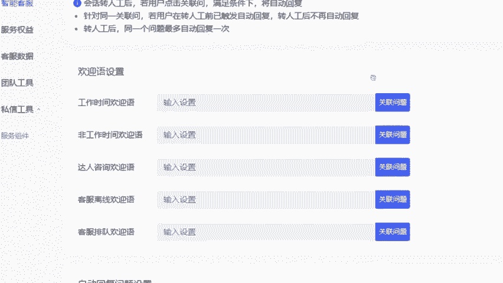

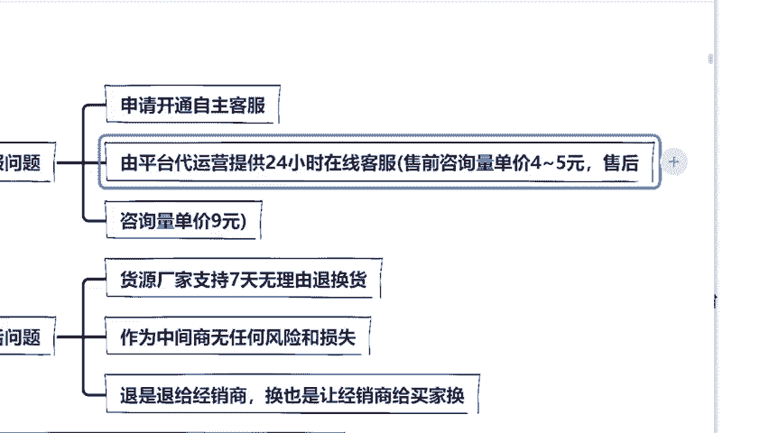

愿意啊，不愿意，为什么不愿意？