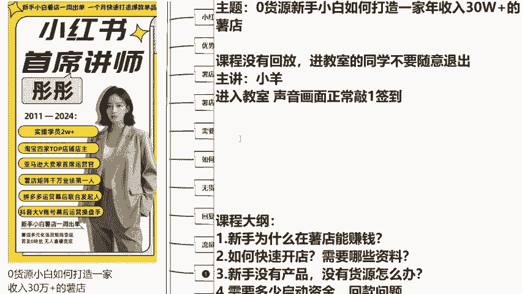
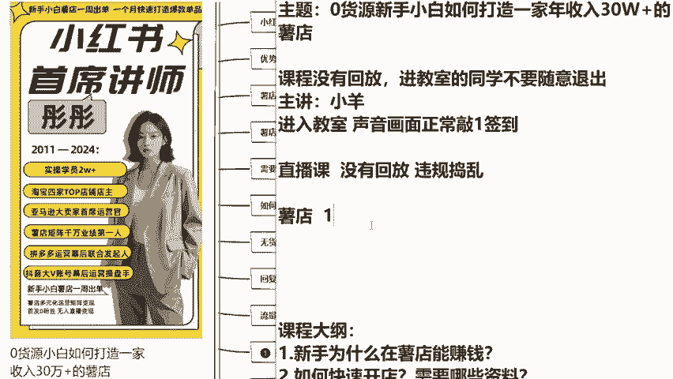
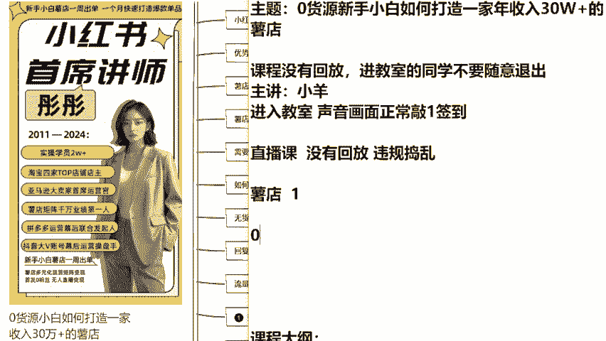

# 【2024版小红书运营教程】全B站最良心的小红书开店运营高阶教程合集！小红书体开店 起号真的快，赶快点赞收藏起来 - P3：第三节 - 根正苗红好学长 - BV14m411C7Er

hello同学们好，我们现在课程正式开始了。首先呢我先给大家做一个自我介绍，最起码得让你知道今天过来给你讲课的这个人是谁，他有什么样的身份和资格坐在这里，对不对？来，同学们看一下啊。

我稍微可以放大一点给大家看。那么彤彤老师呢，我是在整个小红书平台，第一个通过小红书的举证玩法达到业绩千万以上的。那么我到现在为止呢也是有十多年的电商经验了。我是从11年开始从事淘宝啊。

当时呢是做到了4家top店店主，15年的时候呢，我是做过亚马逊的，包括在1819年也是作为抖音的幕后运营操盘手过来跟抖音有过合作。那么在23年的时候，彤彤老师。

我呢是通过小红书直接举证运营电商达到变现的。到目前为止啊，在小红书上面开店。我最擅长的板块，其实就是关于一个零技术的小白，让你在最快速的在一周内能够在小红书上面去出单。

并且呢一个月去打造一个爆款单品变现。那么彤彤老师。😊，我今天这节课主要是教大家关于小红书的无货源电商，我们到底该如何来做。我会把我这么多年所有的电商运营经验尽量的教给大家。

包括我看我直播间有同学在说抢过的线下课没有抢到，是不是没有关系啊？那么这节课呢也是我24年唯一的一节线上免费公开课。我会争取把我线下的三天两夜价值12800的分享课内容，给大家尽量折合成两个小时来讲解。

所以同学们今天一定要认真听课，并且跟上思路，好不好？那么首先我先给大家说一下，刚刚有同学在问老师今天这节课是不是直播今天啊是直播课，所以说呢我们是没有回放的，大家一定要认真的听课，并且呢做好笔记。

这一点O吗？没有纸和笔的话，可以打开你手机的备忘录。还有一点就是因为我们今天是非常正规的一节线上公开课。所以任何的违规捣乱的字眼，大家不要去讲，不然的话到时候系统小要它自动识别，把你请出直播间。

那个时候你。😊。

老师对不起，我错了，还有机会吗？那就不太合适了啊。所以呢我们在课程正式开始之前达成一个君子协议。你说老师我今天能认认真真把课听完的，我能遵守纪律的。那么你在直播间给彤彤老师，我敲一个数字6好不好？

来祝教老师也帮我看一下啊，如果说捣乱的同学，不认真听课的同学，在课堂上乱发言的同学，你帮我直接把它请出直播间就可以了。我们今天是以学习为主啊，😊，好的，那我们今天呢想要做好小红书，小红书店上。

我会教大家如何来做。因为我们这节课的主题是什么？围绕着零基础零货源的新手小白，如何去打造一家年收入30万的小红书店铺啊。那么首先我先来问一下大家的一个基础情况，好不好？零基础也分层次啊。同学们。

你们之前了不了解什么叫做鼠店。如果说老师我玩过小红书，我大概知道小红书怎么买东西，怎么卖东西，有过一些了解的话，你在直播间里面敲个一。你说彤彤老师，我一点都不了解，我之前没有玩过小红书啊。

我也不知道小红书怎么买东西，我没有在上面购物过的，你在上面敲个零好不好？我来看一下。😊。

