# 【2024版小红书运营教程】全B站最良心的小红书开店运营高阶教程合集！小红书体开店 起号真的快，赶快点赞收藏起来 - P4：第四章 - 有容比较大 - BV12s421K7sd

啊，看来很多同学都是小白中的小白啊。老师，那我适不适合去学呢？没关系啊，像这个贺州同学，像这个LAE同学，对不对？追梦人同学都俏铃，但没关系，今天这节课你只要认真听，我保证你能够有所收获，好不好？😊。

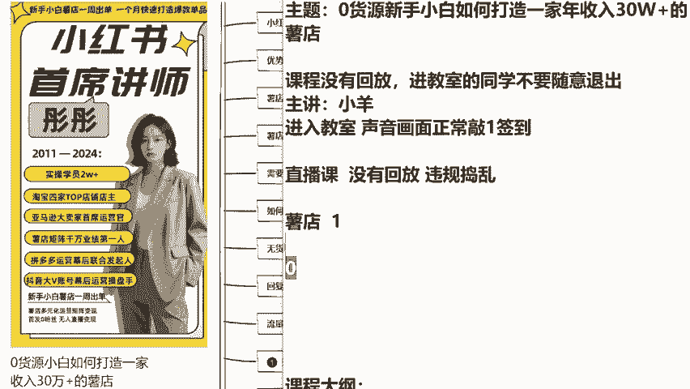

那今天呢我会告诉大家，我们如何从0到1去开一家属于你的小红书店铺。包括呢在听课过程当中会有问题。没关系哈，所有的疑问呢我都会尽量来给大家讲解。但是呢我还是额外说一句。如果说今天A同学问一句。

B同学问一句，都要老师回答的话，那么这一节课我就会很难讲解下去，我知道大家有问题，我尽量都会给大家解决。但是呢一定是以跟着老师我的思路为主，我的节奏为主的去讲课，好不好？😊。

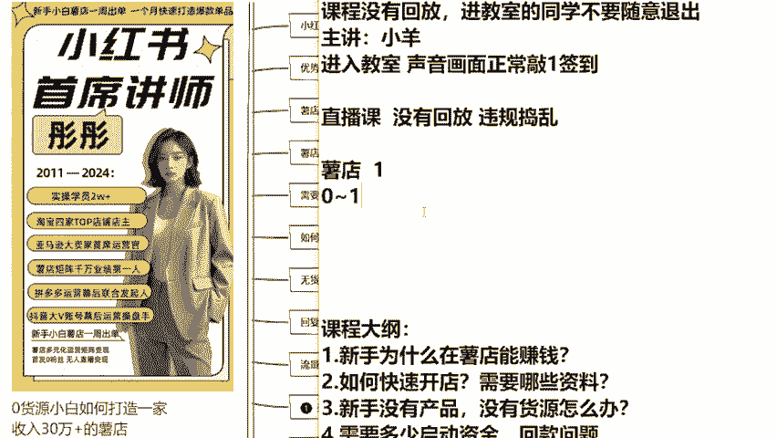

一直给你推荐小红书，所以把你推荐到这来了。今天就不要辜负了啊，好好听课。好，那么这个问题呢，今天关于零基础，我给大家整理了7个知识点。这节课呢会围绕着这7个知识点来讲解。包括有同学问到说怎么开店。

开店需要哪些资料，没有产品，没有货源，能不能去做，需不需要启动资金回款问题，包括流量的问题。老师我没有做过生意，我不知道卖什么产品才能报单，我是不适合去做，我全部都会给大家来讲到啊。

首先我们先解决第一个问题，就很多同学都是没有信心的过来说，老师我这个作为一个新手，我作为一个小白，我今天去小红书这个平台去做，我能不能赚到钱，我为什么能够赚到钱。我什么都不懂。

什么都不会在小红书这个平台，我能不能做到月入过万来，同学们，我先给你们打一针强心剂，好不好？我们来看一下像彤彤老师呢，我有一个学生他叫做李娜啊，他和你们的情况，甚至比你们情况还要差一些。

为什么他就是一个。😊。

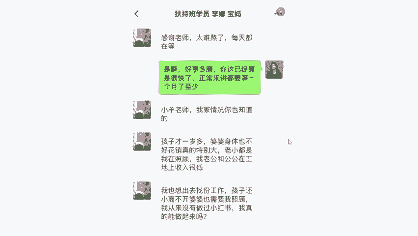

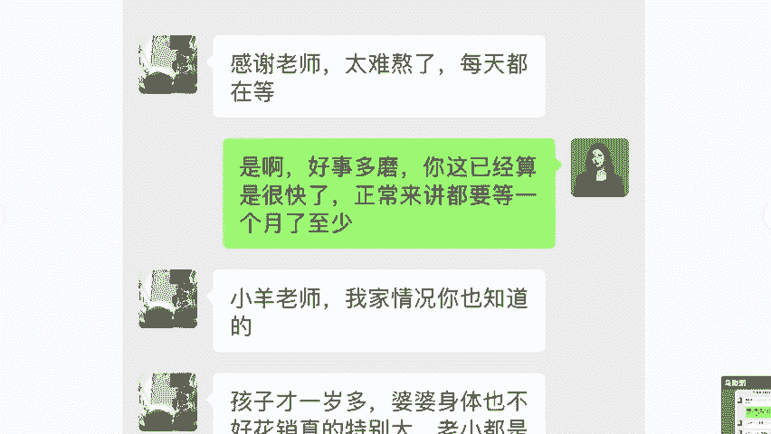

初中文凭，他之前跟我说，他说老师我相当于是初中就没有毕业，老家是东北那边的。那个时候呢也不太重视学习嘛。人家现在20岁出头，但是已经是两个孩子的妈妈了。那么当时啊他在10月份的时候过来跟我开小红书店铺。

他当时聊到一个东西，他说老师我其实就算下来花是一个四五人员，我一没有货源，二没有资金，三没有基础，四没有学历，我要什么没什么。但我确实是想做我真的很希望有人来帮我一下。

所以说当时我是亲自来帮他开这家小红书店铺的，我们可以来看一下他的后台数据啊，这个数据呢，到时候你们开完店之后，我会教你们怎么去下载这个这小红书，你开店的一个后台数据叫千万系统啊，我们来看一下。

不用每个给大家讲解，你们先听我说就可以了。你会发现店铺所有的数据都是零，对不对？因为呢还没有正式上架，没有正式运营，所以说是一单都没有出的，但是啊到了11月份的时候，同学们来看一下，开始正式运营了。

开始上架了，已经出单了。😊。

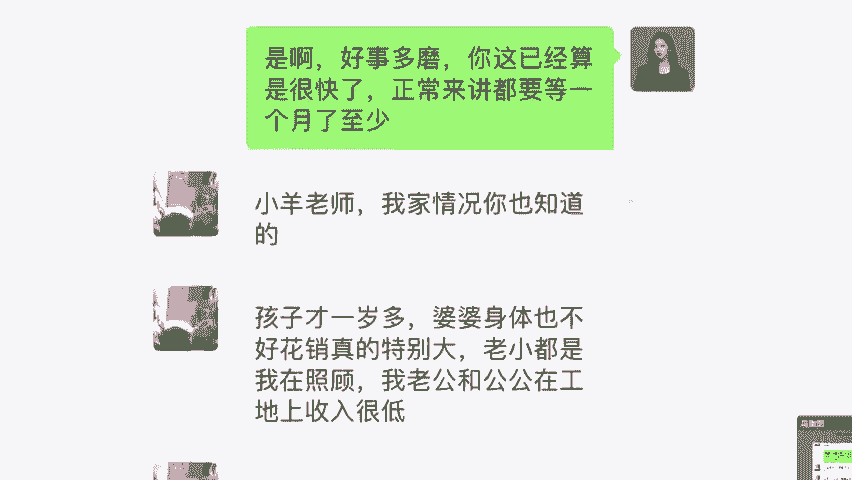

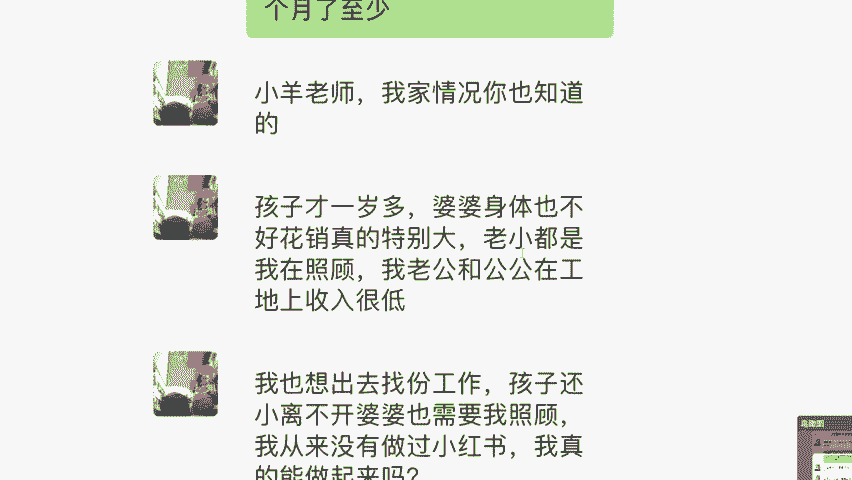

不对，他当时是做到多少18684的一个销售额，对不对？那么同学们，你记住啊，那老师这个支付金额是不是就是我的能赚到少钱？并不是啊我们再拿出计算器，我给大家算一下，我们能做到的利润大概是多少？

一般来说是百30到50。我们今天有一个折中的数据来算一下，好不好？来，我们拿这个乘以40。😊。

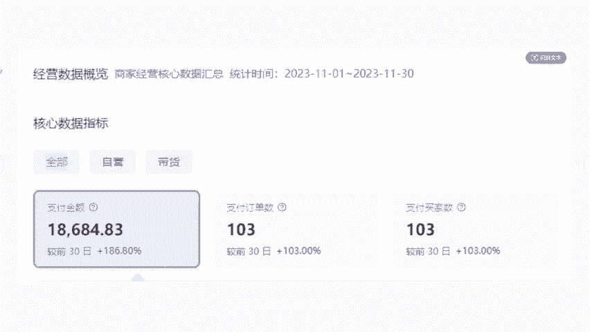

这个忽略算下来才是你能拿到手的收益。也就是说他卖出去18000，他到手大概是7400左右的样子。但实际上我记得的话，他领娜当时那个月应该是有8000多，这样还算少了一点点了。

但是我们没办法一件一件去算嘛。而且同学们你还要记住啊，我们越往后做，你的店铺数据是肯定会越来越好的。我们来看一下第二个月好不好？他在做店铺的第二个月啊，当时12月份通过三个单品直接就给报单了。

销售额翻了十几倍，做到了18万的销售额，那么18万的销售额，童彤老师，我在这，我还是老规矩，咱们给大家算一下，好不好？来。😊。

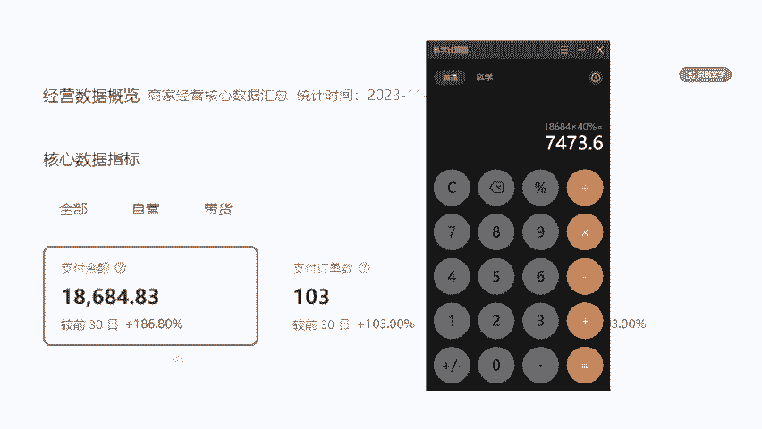

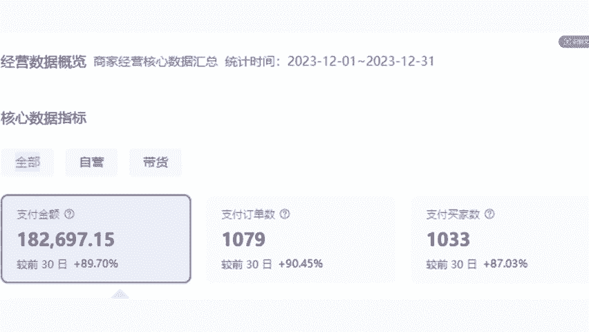

乘以多少还是40吗？7000是不是12月份当时确实也赶上双十二了，做了多少7000的利润。所以同学们，我想问一下，如果说你今天跟他一样，你作为一个新手小白，我带着你，我好好带你，你能不能做跟他一样。

我不说第一个月7000多，第二个月直接翻倍70多，第二个月翻个小贝，你14000，这样一个变现速度，这样的方法，你想不想学，我就问一下你你不用管你是学生还是工作了，你想不想学，你愿不愿意去学来。

同学们告诉我，你愿不愿学，你愿意学，我就能带你。那么他这家店铺是怎么做到的呢？我待会会全部的教给大家，包括有同学在问说老师那除了小红书还没有其他能去做的，能不能去做什么抖音啊，今天能不能顺便都讲一讲。

我告诉你啊，如果你想去做抖音的话是肯定不合适。嗯，在这里我先稍微给大家讲一下啊，因为有很多同学都在课前给我的助理发消息，说能不能讲一下抖音。😊。

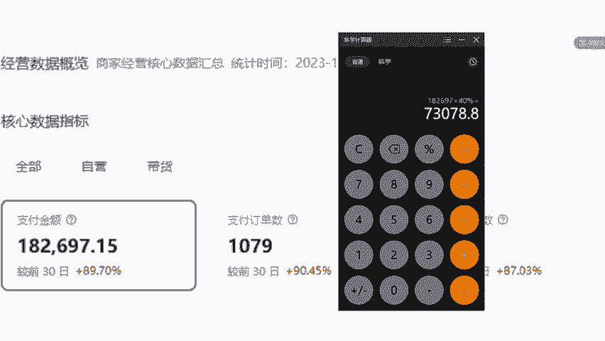

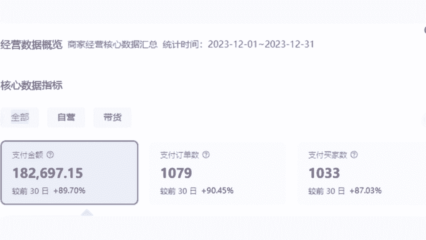

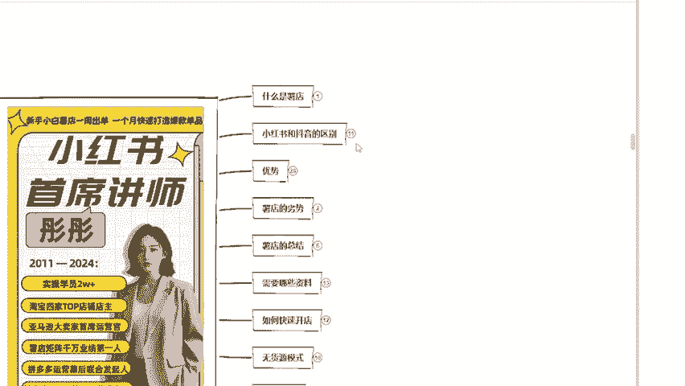

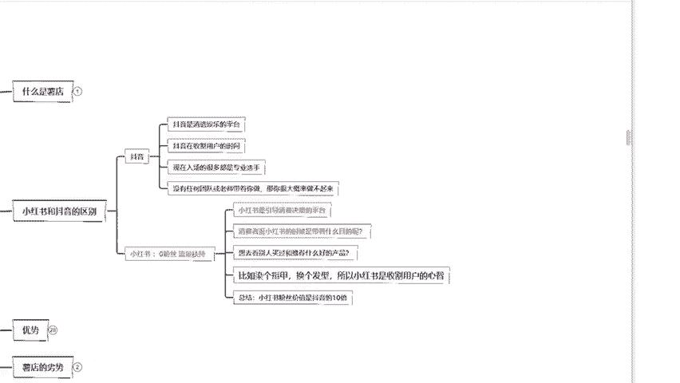

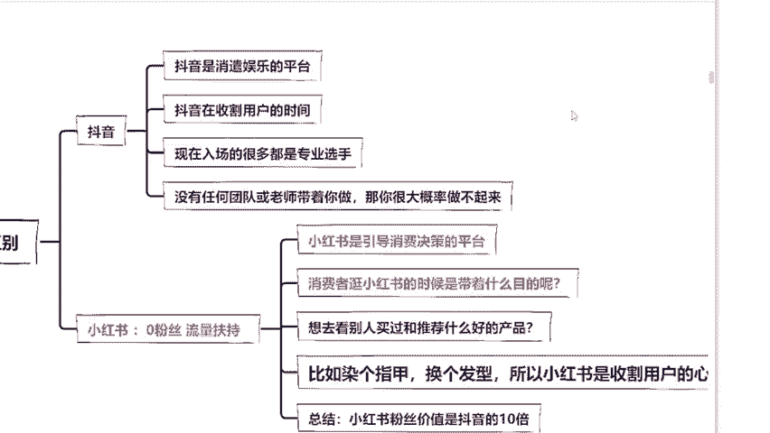