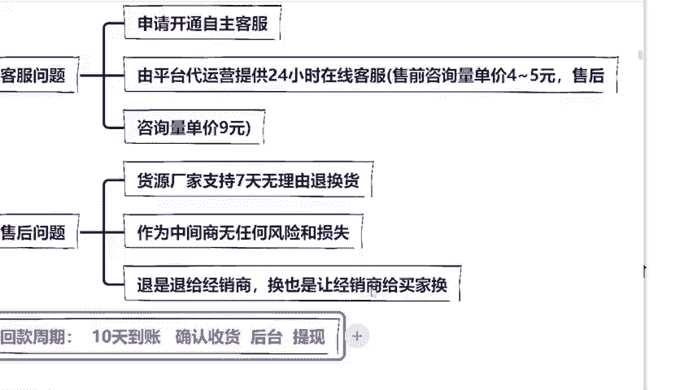
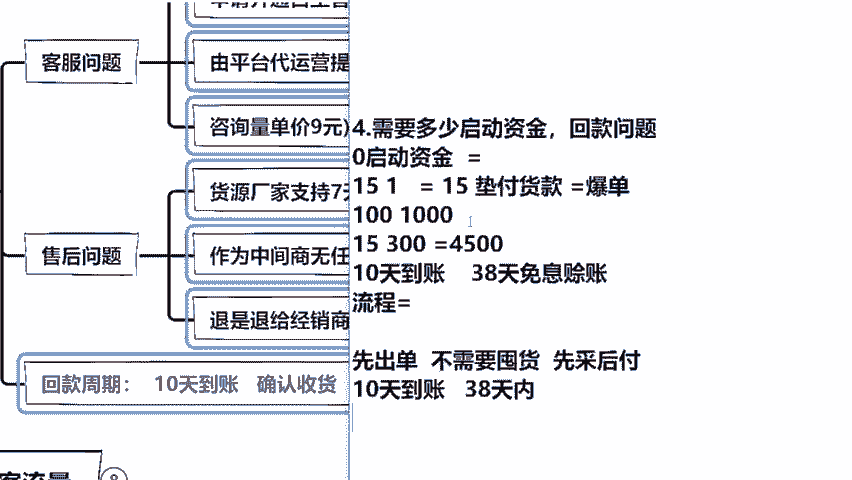

# 【2024版小红书运营教程】全B站最良心的小红书开店运营高阶教程合集！小红书体开店 起号真的快，赶快点赞收藏起来 - P4：第四章 - 香凝孕味 - BV1Pf421U77J

听子下，我是不太建议你们去找代运营的，你不要看他只有4到5块钱。因为我的学生你到了后期都是几千单几千单的。我就算给你算少一点好不好？200单乘以4块钱都8000块钱了。我8000块钱。

我为什么不请不花钱花23000块钱，我就可以请个大学生坐在我家里来帮我回复问题了，这不就O了吗，对不对？同学们，虽然说后期咱们可以挣大钱，但是我觉得能省一点就算一点，前期呢我个人建议你辛苦一点。

多看一下手机去回复，对不对？如果你非要找的话也可以，但是到了后期你就不要走这样的路了，咱们钱是要花在刀刃上能省一笔算一笔。就是我有很多同学他们到后期也不知道怎么弄，他们嫌麻烦，就是找这种代运营。

但是其实每个月出去流水是很恐怖的。所以我挨这提前给你们说好，到时候你们可以自己去比如说找个大学生啊，对不对？或者说招个客服嘛，价格挺便宜的。你比拿这个要便宜多了，好不好？同学们。😊。

而且他绝对是划算很多啊，这个问题记住了吗？同学们记住了吗？那么第二个是什么？就售后的问题，老师他万一要退货呢？首先第一点，我帮你找的一定是那种7天无理由退货的，明白没有？那第二个。

如果说他要卖货的话怎么办？退货的话怎么办？这个货我会让他直接退给厂家，换货的话，也是换给厂家，我今天作为一个中间商，我是没有任何损失的。顶多说你要退货的话，OK那我不赚你这个差价，我少赚一笔钱。

其实我是没有损失的，对不对？那这个就是我们做代发小白最好的一个优势了。😊。

他不需要你去纠结这个退换货的问题。还有很多同学都会问老师，大学生是最廉价的劳动力，花钱就可以给我讲实话哈。你其实如果说给他家包吃包住1000块钱，2000块钱都是有的。现在大学生真的太不值钱了。

很多大学生就是明明是高校毕业出来找工作确实是挺难的。但是其实专业技能，我觉得反而是更加重要一点。现在像我们公司招人，我都不太看学历，反而看你的工作经验，看你这个人的一个品性。

这个对于我们来说现在才是更加看重的。像我们公司其实有很多都是那种专科的，包括一些是高中毕业的，都是最开始都是我的学生，后面是跑到我这边来让我带着一起做的。哎，这个先不给大家说，先不聊歪了。

继续聊我们的课程啊。那么我们现在啊做小红书店铺赚钱了，我要多久才能回到我的账户上面，我的回款周期是多久呢？啊，我挣的钱，我要多久才能去花呢，我在这给大家详细的讲一下好不好？我们小。😊，红书平台啊。

你想去赚到钱，回款周期呢是10天到账，什么意思？就有些他收货之后，他可能不会当下点确认收货。他如果不点的话，1天他会自动确认的。如果他点了确认收货，这个钱呢，他就会直接到你的后台，你直接去提现就OK了。

那我今天就用一个我的账号给大家看一下怎么去提现的，好不好？来看到这里嗯。

嗯，这是我的一个店铺啊，小红书的店铺呃的后台。我进入到后台过后呢，你们可以发现提现金额这里全部都是有整理了，对不对？有银行卡板块、支付宝啊、微信等等。那当我这天账户店铺，这里有一个可提现余额。

我就去点击这个银行卡管理，对不对？我绑定我的银行卡，绑定过后呢，我在这里选择提现，选择提现之后，你输入你的金额，输入你的账号密码，钱就会全部的提现到你的银行卡里面。而且同学们我给大家说一下啊。

因为现在小红书呢，他鼓励咱们新手卖家去挣钱，所以说他会给到我们非常多的扶持。其中有一个扶持体现在哪里？你记好了，我问一下你们有没有同学在什么抖音快手卖过货的，有没有什么同学是做过生意的。

有没有在网络上做过生意的。你们会知道吧，像这种平台啊，包括你去做直播，对不对？你提现，它是不是要收你的手续费呀。😊。

是不是要收手续费，包括我们的呃抖音国际版抖音，他是收取5%的手续费，就你赚了100块钱，你提现的话只能提95块钱。但是小红书你听仔细了，他首先给到你的一个扶持，就是提现的时候，不会收取一分钱的佣金。

不会收取一分钱的手续费，这是我们今天赚多少钱，这个钱全部都会到你的口袋里面，明白没有？这是他最大的一个扶持啊，你们不要小看这个钱，比如说100万的话，那么提现金额，他提你1个百20的话，那就是2万了。

你不要小看这些利润啊。同学们，他是没有收你任何手续费的，这个是非常的好的。然后我再给大家说啊，那这就是我今天给大家讲到小红书店铺我们的客服问题，售后问题回款周期问题。

有同学说保证金这个问题呢我也是能够帮你解决的。在前期，但是呢这个我们在客房上面不方便讲，课后呢，我可以单独给你讲好不好？明白了吗？那么我现在讲的这三个问题，大家明白了吗？听明白了吗？听懂的话。

你把明白两个字敲在公屏上面好不好？就是我们的回款客服售后问题都明白的话，把明白敲出来。现在呢我就来给你们讲我们的今天的第四点，关于启动资金的问题。😊。

明白是不是？好，那么今天有同学会答应说老师我就是一个新手，我就是一个小白。我去做这个小红书店铺呢，我需不需要启动资金啊，我没有钱，能不能去做啊？我前面跟你们说过了，对不对？

现在呢但是因为我们今天时间有限，大家也知道我们的课程大概就是讲两个小时左右的样子啊。所以说呢我们时间有限，我就不能把所有的玩法都给大家讲完。现在呢我给大家提供两个思路，你们听一下想学哪种玩法好不好？

我让你们选择我尊重大家啊，首先第一个玩法呢就是你的启动资金可能要多一点，大概是5万块钱左右的样子。但是呢你第一个月的收入起步就会比较高，第一个月收入呢大概是能达到1万左右的样子，你后期的起步也是更高的。

咱们这个呢是奔着做团队把你的公司做大明白吗？不是说个人啊，但是呢这个启动资金的话，要求可能是5万以上的，明白没？第二个呢就是你个人啊作为兼职或者说你个人前期手头比较紧张，零启动资金去做。

但是咱们前期第一个月，第二个月可能就是小几千块钱。😊。

等你成熟了，对不对？基本上就是每个月上万块钱是没有太多问题的。但是你一个月的话，你个人是达不到什么10万20万的，这些你就不要太思考，除非你把团队做大了才有的。你们现在想学哪种，想学第一种还是第二种。

我问一下零启动资金，还是想学这个5万启动资金。😊，你们自己选啊。因为我平时也会要给那些商业老板上课，所以说呢我其实也擅长讲这种这种玩法我会更加熟悉一点。但是像这种的话，就是因为我带的学生太多了。

零启动资金对不对？行，那大家既然态度统一，我就讲这种啊，你们别到时候说老师另一种也讲讲啊，我们今天实践我现在只能讲一部分，我已经很尊重大家，对不对？关于零启动资金。😡，他的玩法也很多。

我给大家随便讲一种，好吧，我给大家讲一种，对于你们来说，新游戏比较合适的。那么怎么去做呢？来听仔细啊，比如说我今天举个例子，稍等一下，我嗓子有点哑，有点感冒。😊，嗯，我给大家举个例子。

比如说我们的这个M7同学啊，M7同学，你今天要去拿货，对吧？你今天要去拿货，就你要先进货嘛，你的成本价是15块钱一单，对不对？那如果说有人在你的店铺里面拿了一就是说下购了一个订单。

你就要拿出15块钱去干嘛垫付货款的，这个能够理解吧，对不对？😊，但是你要知道，小红书官方现在给到你的流量，给到你的扶持是很多的，也就意味着你是非常容易爆单的。什么叫做爆单？同学们啊，比如说M7同学。

你今天只有一单，但是。😊，你明天可能有100单，你后天可能直接1000单，你突然就爆钱了，突然就爆发式增长了怎么办啊？这个时候你怎么办？我在这里你们不要觉得不可能啊。

我用我这个学生给你们举个例子看一下我这个同学呢，他当时是在11月份开头店铺，店铺只有一个单子，对不对？我们来看一下，到了12月份报了多少同学们报了多少单啊，上个月一个单子，第二个月多少个单子啊。

做了87000的销售额，是不是同学们，这是一个很恐怖的？所以说啊如果说你报单了的话，那你怎么办呢？啊，你垫付的起货款吗？你垫付不起了，对不对？什么意思？你成本价15块钱，你第二天假设你报了300个单子。

那你今天这450百块钱，你是不是自己就要去垫付货款了？M7同学来告诉老师是不是所以我想问你的是，如果说想红说报单了，今天需要你拿出4500来垫付这个货款，你是不是拿不出来啊？同学们。

咱们是不是很多同学说拿不出来，或者说有些同学说老师我不是拿不出来，我是不太想拿出来，我手头就四五千0块钱，我全部拿出来了，那我这个怎么怎么办呢？对不对？😊。

是不是？但是啊我要在这里给你们讲一个东西啊，如果说你今天流水是够的，你拿着你的流动资金，你去垫付货款就可以了。但是很多同学啊是不想拿出来怎么办？你听仔细了，在这里听我讲啊，我们小红书最晚是多少。

是10天到账，对不对？很多同学就是不想拿出来，或者说条件不足以支撑，那怎么办呢？听仔细啊，我们选择平台的38天免息赊账。😊，什么意思？就说我们今天可以选择先拿货，你先不要付钱，等赚到的钱回款过后。

我们再来结算贷款，什么意思？

嗯，我直接上图给你们说吧，不上图，我怕你们看不明白啊。比如说我们现在卖这样一个拼图。好吧，我们就拿刚刚这个做案例啊。比如说我们要去厂家拿货，但是呢我现在拿不出这么多的钱去进4500的货。那我该怎么办呢？

同学们，我们就找你看啊，这下面只有响应啊深度验商，对不对？没有哪几个字，没有先采后付，有些是有先采后付四个字，有些是没有的，我们在1688上面作为一个新手，我想要去领启动资金，我就一定要找先采后付的。

明白没有？同学们先采后付打出来，先采后付四个字，打在公屏上面加深记忆啊，打出来啊，其实不用我给大家讲，大家正面意思都能够理解，对不对？这是1688呢给到新手卖家一个扶持。

他最开始叫什么叫做38天免息赊账，也就意味着我们可以先拿货，先不付钱，等你赚到钱回款过后，我再来平台把这个钱给他还上就O了呀。这个呢就是1688再鼓励咱们新手卖家来做生意给到我。😊。

的扶车政策，这个叫做先进货后付款，也叫做诚意奢。有些同学可能听不明白，我再重新给你们梳理一下流程，好不好？来，我来给你们梳理一下，捋一下。首先第一步我们的店铺得干嘛？先出单，是不是我们得先出单。

先出单会有一个什么好处呢？就是他不需要囤货。因为你是先出了单，你再去拿货。意思就是说人家客人买了这个东西，你再去拿货，明白没有？你是不需要囤货的，你不需要把家里堆成仓库的，是不是非常简单？

那么出单第二步干嘛呢？我们直接去拿货的时候，你要记住啊，你不要去付钱，我们选择平台的38天免息赊账，也就是先采后付，我先去赊他的货，让厂家给我发出去。O我在小红书平台，人家也是先下单，对不对？

我再去联系平台再去发，他最晚是什么，10天到账10天结算的。那我今天10天我的钱最晚就到口袋了，而我只需要在38天内，我再去平台把这个钱给他还掉就OK了。他就像我们平时去借花呗，我20号还花呗。

但是我15号发工资，这个时间对我来说是完全足够的，对不对？今天啊不管你是不想拿。😊，拿出来这么多启动资金的，还是说我手里需要有一些流动资金的同学，你们都可以去选择平台的38天免息赊账。

这也就是为什么我建议大家前期呢先做1688的原因了。因为它是最适合你们新手前期风险最低的方法，对不对？那我想问你们的是，接下来呢，如果说我建议大家用这种方法来做小红书这个平台。

你们觉得可不可以觉得可以做这个模式你也能接受的话，同学们在直播间里面把可以两个字敲出来好不好？他的玩法其实有很多种啊，我现在给你讲的是相对来说比较适合你们的。

这个呢也就是说是如果我们今天一下子出单太多了，我们又没有这么多方法去拿货，我们该用什么样的方法。我在这里给大家讲的非常清楚了，对不对？我们可以直接选择38天免息赊账，这也就是为什么我要讲1688原因了。

我讲的一定是前期最适合你的玩法。后期啊等你的流水起来了，你再去对接线下的工厂好不好？如果大家觉得可以做的话，那我们今天现在就来讲到第五个问题了，流量问题都没有问题了，对不对？

有问题的话可以艾特咱们的助教老师啊。😊。

