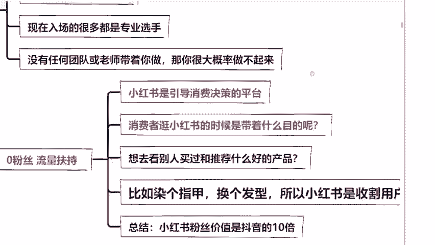

# 【2024版小红书运营教程】全B站最良心的小红书开店运营高阶教程合集！小红书体开店 起号真的快，赶快点赞收藏起来 - P5：第五节 - 根正苗红好学长 - BV14m411C7Er

目前他已经是进入到一个资本付费的时代了。像抖音，咱们现在作品，你不去投一个抖家，不去投钱的话，是没有流量的。而且呢目前在国内啊，他个人做账号的红利时代，他早就结束了。你今天没有团队没有启用资金。

你想要在国内抖音去站稳脚跟，真的是太难了。那今天为什么说我们今天能去做小红书呢？来，同学，我问大家一个问题，24年的春晚看过没看过的话，在公屏上面嗯敲一个小花花好不好？来，同学们。

24年的春晚看过没看过的话，在公屏上面敲的小花花。😊。

来给你们上张图，眼不眼熟啊，是不是小红书作为春晚指定合作平台，直接亮相春晚的第一个小品上面。春晚是什么概念？只要你是中国人，全国十4有一个算一个到了点，他都必须看的节目，对不对？

所以说啊春晚它其实也就是巨大流量的代言词。春晚也预指了我们未来的一个走向。那么小红书直接成为了央视春晚指定合作平台，其中的生意就不言而喻了，对不对？往年都是快手抖音，那你想想快手抖音发展成什么样了？

今年变成小红书，那这对于我们想利用小红书去变现的人来说，这就是24年包括未来的一个赚钱新风口，是不是？而且同学们我要在这给大家讲一下，区别于国内的抖音快手这些娱乐平台。

官方定义它是一个购物分享的APP什么意思？就是说小红书用户，只要是意向用户，它都是有极强的消费意识的。而且呢小红书目前在整个平台，它都是红利期。😊。

哪怕你是零粉丝，你照样能够去开店去卖货去赚钱。这一句话你记好了。因为平台它会给到你流量扶持。那我们今天需要做什么事情呢？就是在小红书这个平台去开一家属于你的店铺。然后你把产品卖给刷小红书的用户就可以了。

她和传统电商的区别在哪里？同学们这句话也要做好笔记啊，她是引导咱们消费者来做决策的。比如说我们平时会不会逛小红书，我们逛小红书都是带着目的去的。比如说我想换一个发色，想要买件衣服。

我可能会选择在小红书上面搜索一下，看一下别的女孩子，她染了一个什么样的发型，她做了一个什么样的美甲，我会去参考，对不对？所以啊同学们你仔己想想，当我们在翻阅整个小红书的过程当中。

我们是不是会被小红书博主给种草。😊。

