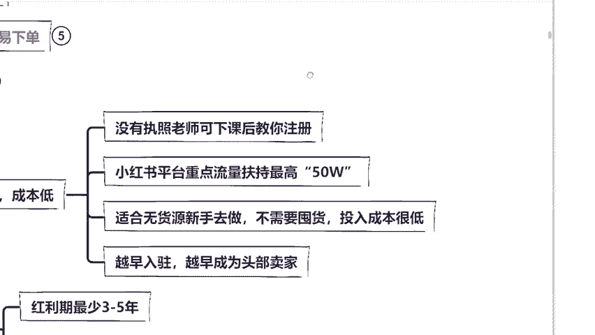

# 【2024版小红书运营教程】全B站最良心的小红书开店运营高阶教程合集！小红书体开店 起号真的快，赶快点赞收藏起来 - P6：5月7日7 - 头上油麦菜 - BV12f421m7wN

说时间长的同学，你想想抖音，抖音现在不好做了。他的发展那么好，为什么不好做？没你的地方了，对不对？肯定是时间短，对不对？非常的好啊？我跟大家说一下，为什么我今天呃会这么说，因为你会发现任何一个电商平台。

它在发展初期，它都是一个爆发式的增长，而且就是在初期，我们作为卖家是只要挑软的呢也可以这么讲，在初期啊，我们作为新手卖家是比较容易做起来的。而且它的限制会比较的宽松。那么同样的都是国内电商。

为什么不是淘宝拼多多呢？我在这里给大家看一组数据好不好？来，同学们，咱们看到这里啊。😊。

这组数据是什么呢？这是咱们近几年的一个国内主流电商平台活跃系数，包括啊淘宝啊、天猫啊、京多呃，京东、拼多多等等。你会发现最开始几年它都是在持续增长，对不对？但是最近几年哎怎么不升反降了呢？同学们是不是？

所以说这个时候能够留下来的，都是十几年的沉淀，咱们插不了手，包括很多同学说老师国内抖音这么火，为什么我当时还没做起来？😊。

你要知道他火归火，但是人家做的早，你竞争不过。现在很多明星网红为什么依然能够火？因为它是自带流量的，它是自带话题的。我们作为一个普通人是没有优势。

那我们今天作为一个新手作为一个小白属店他的优势最大在于哪里呢？同学们就是在于他做的人不多，而且操作简单，你只需要有什么记好我的话，你今天只要有一部手机，你每天拿出两个小时。

我们就能够去把小红书店铺给做起来，明白没有？这是小红书店铺平台，它的第一个优势啊，而且呢我们来看到这里，这是官方说的啊，整个小红书平台呢，他当时是有3亿多的日活用户，其中80%都是什么？

80%都是女性为主。比如说这个都市白领，比如说都市中产金致妈妈大学生，我现在在给你们分析小红书的用户啊，你们一定要听仔细，那么这些女性群体，他的消费能力相对来说是比较强的，能够理解吧，对不对？

而且呢他对自我的形。😊。

像要求品牌要求也会更加高一点。比如说咱们直播间女孩子来，你今天要去买一支口红，你会选择直接去商店下单呢，出去购买呢？还专柜试色呢，还是说我会选择在小红书上面搜索一下，看一下唉黑黄皮涂这个口红合不合适？

哎，白皮涂这个口红合不合适，你会怎么选啊。同学们，你告诉我你会去搜一下，还是直接去下单，还是去店里面试色。😊。

去看一下对不对？在小红书上面。所以说啊我们在小红书上面的购物人群，它的信用度是非常高的，它是抱着消费欲望来的。而且同学们咱们可以在这里看到一个东西啊，来，我给你们看一个，这是网络上的一个流量价值排序。

女性是排第一的，对不对？男人是排在给后面的啊，而且你要知道女性的消费能力强。那小红书它偏偏80%以上都是中高端女性，那么我们今天就是要利用这一批女性来进行一个变现。那么小红书这个平台。

它的吸金能力是非常强的。我们去做小红书直接把小红书的用户引流到你的店铺当中去变现，你的流量越大出单就越多，你赚的钱也就越多，这是咱们今天的第二个优势，能够理解，对不对？这个优势能够理解的话。

咱们在公屏上面打个ok好不好？我看一下啊，我怕我讲的太快了，有些同学还没来得及吸收啊。😊。

OK都没有问题，是不是？那么第三点，他的入住门槛是非常的低。首先第一点，它是不限制你的年年龄、学历经验的。因为咱们今天又不是去考研究生，对不对？只要你有身份证号、营业执照。

咱们就能够去把小红书店铺给开起来，把产品卖出去就能赚钱了。关于不知道怎么开店的，营业执照不知道怎么办理，或者没有的，待会呢，我会详细教大家，等会有个专门的板块教大家怎么去开店，好不好？不要着急啊。😊。

那么现在呢我要告诉你一件事情，小红书啊，它的官方目前给到咱们新手卖家的扶持是非常好的。因为小红书今年才开始正式的走向商业化，它会重点去扶持咱们新手小白最高给到多少，最高给到50万的一个流量扶持。同学们。

这是一个很恐怖的概念，意思是说我们今天你把小红书店铺开起来，你按照我教的方法，咱们去走原创，走高质量。那么未来啊在新手期最高会有50万人进入到你的店铺，我们入驻时间越早，你成为商家越早。

你就能够越早赚到钱，这个政策也是同样的道理。所以同学们你们可以看到啊，它的第五个优势是什么啊？同学们它的发展空间是非常大的。因为小红书它电商跟咱们传统电商不一样，我在这里给大家详细讲一下，它是一个内容。

种草平台。来，同学们把种草两个字打在公屏上面，也做好笔记，加深一下自忆啊，我让你打的一定都是课程当中的重点啊。记好了啊。😊。

现在我来问大家一个问题，打完告诉我你们熬不熬夜，熬夜的话呢呃会有什么后遗症啊？同学们熬夜最大的后遗症是什么？来告诉老师打在公屏上面熬夜最大的后遗症是什么？😊。

