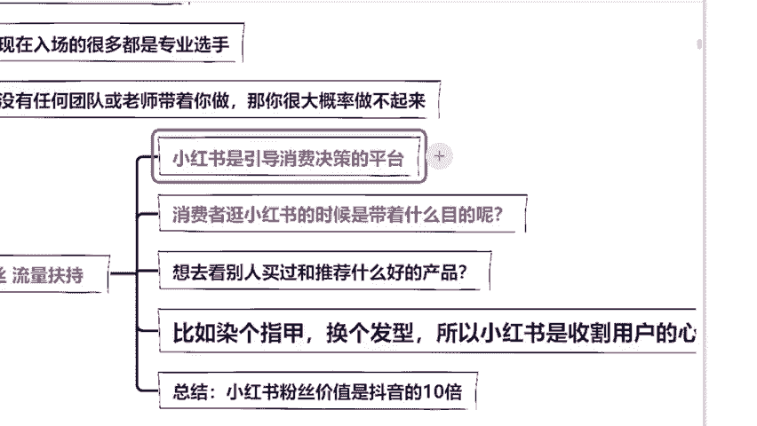
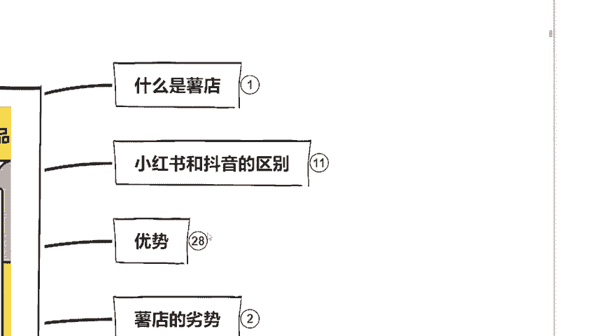
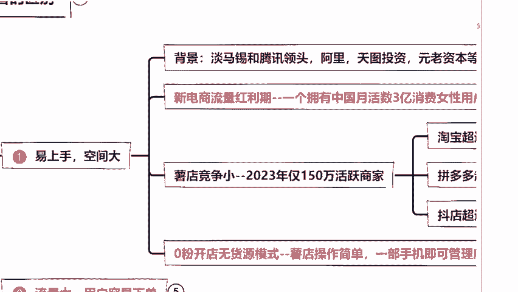
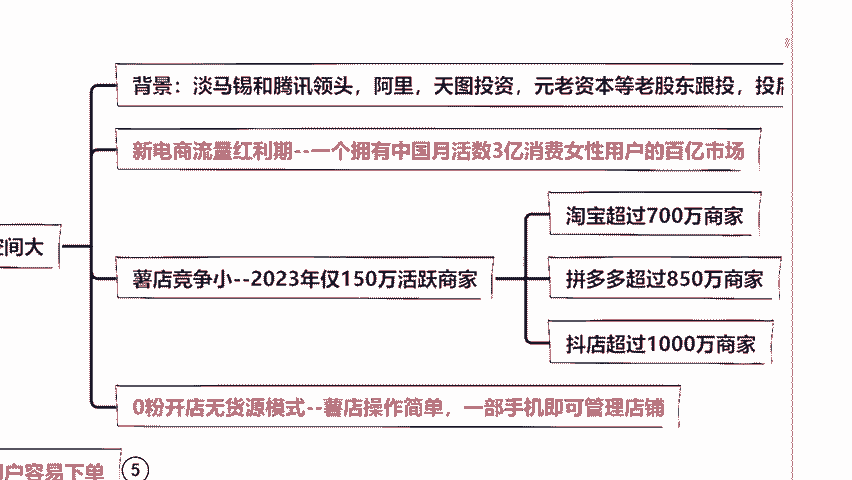
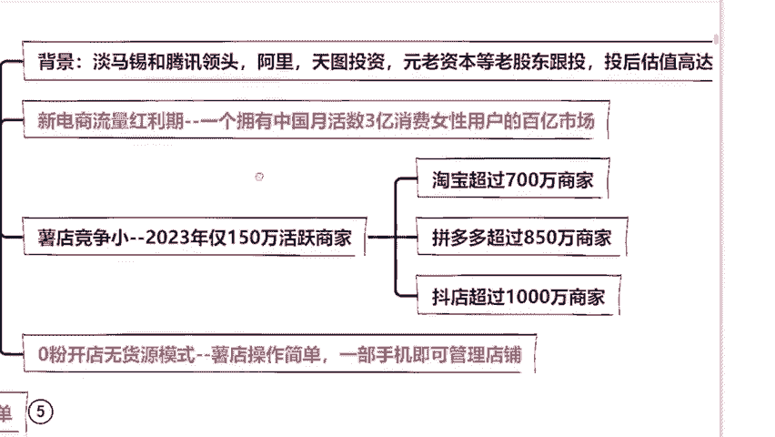
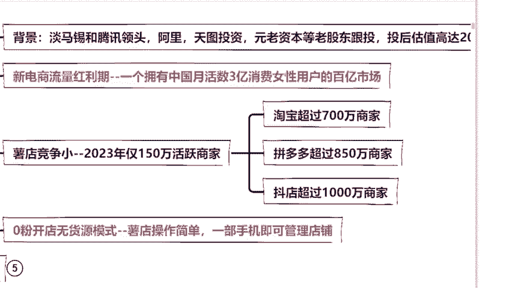

# 【2024版小红书运营教程】全B站最良心的小红书开店运营高阶教程合集！小红书体开店 起号真的快，赶快点赞收藏起来 - P6：第六章 - 有容比较大 - BV12s421K7sd

然后在整个过程当中，我会被引导我最终的一个角色。比如说今年哎流行这样的穿搭，那我也许会下单这样的穿大，是不是？哎，这个福梦同学说就是这个样子。所以说啊同学们小红书这个平台说白了。

它就是在收割咱们用户的心智，成为我们生活当中的意见领袖。然后在不知不觉的潜移默化的把这个产品卖给我们的客户。这个呢就小红书平台的一个变现模式区别于抖音快手那样的短视频。

它都是我们的小红书的用户都是带着目的去消费，它是有消费欲望去的，这个能不能理解同学们，这就是小红书平台和抖音平台最大的一个区别，这也是小红书粉丝价值是抖音10倍的原因。

那么粉丝价值高也就意味着转化率会高。什么意思？10个人进到你的店铺，那么就比如说抖音只会有一个人下单，但是小红书至少是一个以上，那么我们去做就更加容易赚到钱，这个点大家能不能理解？

那么很多同学都会说老师那我作为一个新手，作为小白，我去做小红书平台真的能够赚到钱吗？同学们，呃，我先给大家讲清楚啊，有同学说老师能不能直接讲干货这个东西我不想听。😊。

但是我要给你们说明白，你们连小红书它是怎么赚钱，我们今天为什么要去做小红书。小红书的优势是什么都不明白的话，你们学了有什么用呢？所以说我们必须要明白我们今天为什么要去做小红书，好不好？

这一点希望大家能够理解啊。听我讲，首先我们作为新手小白小红书店铺对于你来说，它最大的好处就是容易上手，发展空间大。我们可以来看一下它是属于红利期，对不对？因为小红书的电商板块它是在23年才上线的。

到目前为止啊，它发展的时间是比较短的。哎，发展时间短呢，对于我有什么优势呢？来，同学们，你们想想一个电商平台发展时间长对你有好处还是短，对你这种新手卖家有好处。来，同学们。

你们来回答一下我时间长好还是时间短好。😊。

