# 【2024版小红书运营教程】全B站最良心的小红书开店运营高阶教程合集！小红书体开店 起号真的快，赶快点赞收藏起来 - P7：第七章 - 香凝孕味 - BV1Pf421U77J

啊，没有同学会写文案吗？是不会还是不自信啊？😊，还说老师我是个男孩子，我写不了女孩子的这个东西啊。老师我可不可以去抄别人的呀？谁写的号，我抄谁的呀？听仔细啊，你不能走歪图啊，什么意思？不管是小红书也好。

其他平台也好，咱们要吃呢就是流量的第一批流量。今天小红书对于新手卖家新手用户它是有流量扶持的。一批原创的笔迹可以有几万甚至是十几万的曝光。如果说你是伪原创，对不起，平台会限流会封号，明白了吧，会封号的。

这也是平台对我们原创作者一种保护。那那老师我之前用那个视频用别人的视频没关系吗？我再次强调一下，小红书是一个购物分享APP他对娱乐视频的把控没有那么严格。

所以我们用来起号用来增加点击率关那个关注是没有问题，但是关于商品，你必须要原创明白没有？说白了就是关于商品的一切，你必须是原创原创就是官方推流的一条分水岭好不好？那么怎么办呢？我教你个方法。😊，我教你。

我们今天去绑架一个高材生，让他不要钱，不准要工资，让他不要五险一金，让他天天24个小时，全年无休的给你写文案。好不好？同学们今天呢高材生是绑架不了的。但是呢我今天可以给你请一个助手，这个助手呢特别厉害。

他能够他一样的不要工资，他一样的24个小时全年在线给你去写文案好不好？这就是我们现在最新的AI助手。来，同学们，你们知不知道什么叫做AI助手知不知道不知道的话，我来给你们详细讲一下。

比如说这个AI我们来看一下我今天拿小红书来举例啊，这是一个综合性软件，我们今天进入到小红书的板块，然后你们可以看到这里是针对不同的板块都进行细分，像笔记标题啊种草文案lo分享探念文案。

包括现在最流行的是什么？同学们，旅游攻略对不对？这都很你你以为那个你们比如说要出去旅游，你们会小红书上面搜攻略吗？你以为那些攻略都是人写的吗？还真不一定啊？现在有些。😊。

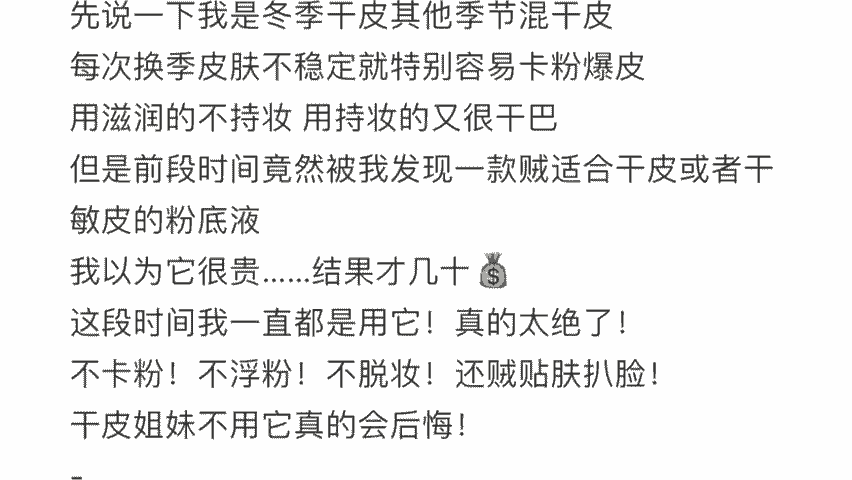

旅游攻略还真的是AI写的。我跟你们讲，写的比人写的好多了。我今天就不拿那个举例，我今天拿种草文案来举例，好不好？比如说我们今天。😊。

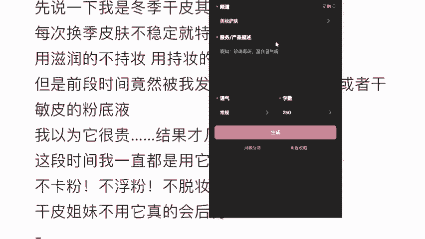

在这里挑一个美妆护肤，潮流川搭珠宝配饰有很多，我们就随便挑一个美妆护肤。然后呢，比如说口红。

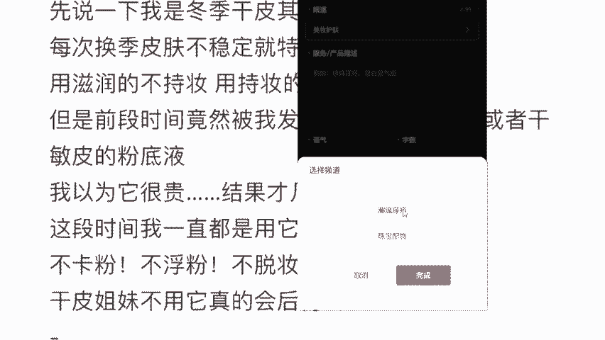

对吧我们要卖一个口红，然后是大红色的，你到时候自己做，你可以写的更加详细一点啊。比如说金属管啊，比如说什么牌子啊，然后呢你看一下，比如说我平时要是卖的是香水很贵的话，对不对？我就可以选奢华。

但是我今天卖的是一个挺便宜的口红，我就选个友好嘛，各种各样的风格都有我今天选个友好，对不对？然后字数这里你也可以选我还这强调一下超过250字以上算是测评类的笔记，这种笔记流量是非常大的。

那我们今天时间关系我们就选择一个少一点的250字好不好？然后我们按一下这个生成哎，你等待几秒钟一篇原创文案就出来了，这是AI给你写的，你只需要干嘛粘贴复制一键发布就可以了。这么简单。

他不会重复的这个你可以放心，尤其是你在这里补充的稍微再多一点点嘛，我是补充的很少来，同学们不会写文案的，或者说懒得写的同学对于这个AI文案，你们满不满意啊，同学他是不是能够让我们用最简单的方法赚取最多。

😊。

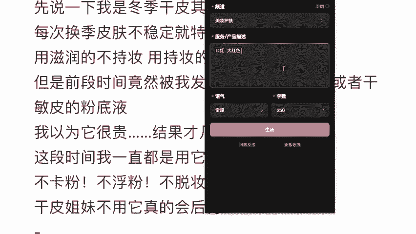

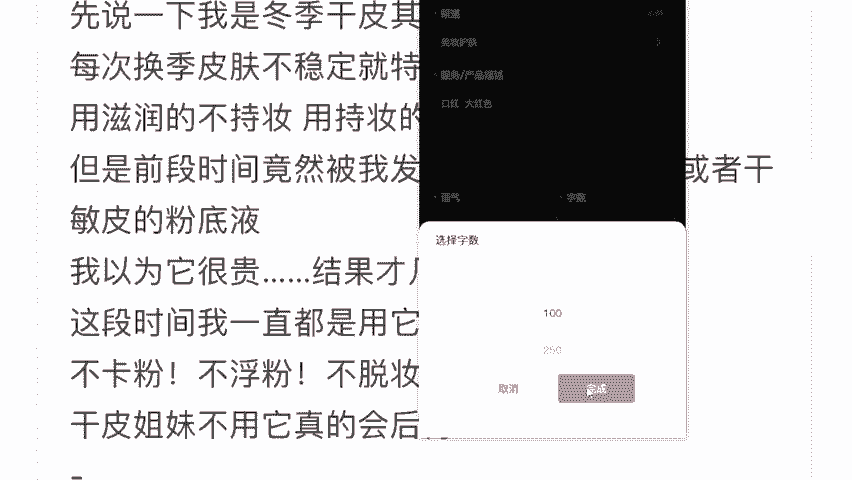

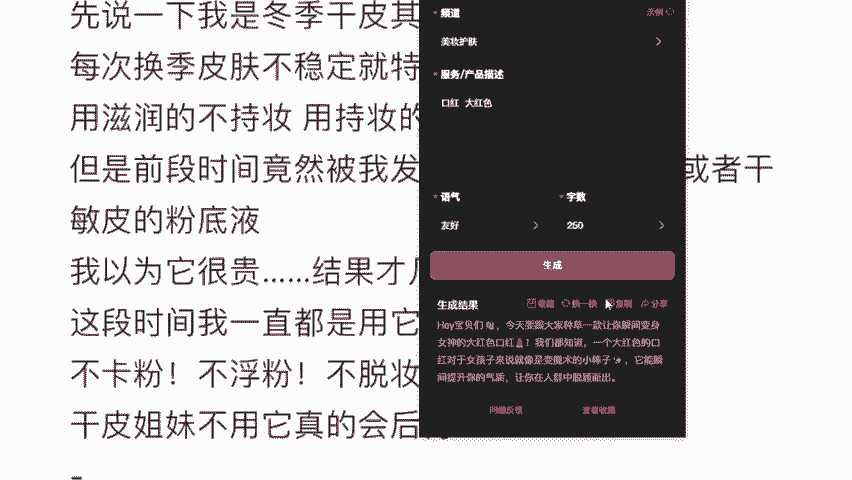

的收益啊是不是啊满意是不是嗯，有朋友问的好，要不要钱？😊，来，我回答你一下，你不能光光让人干活，不给人吃饭啊，对不对？他钱还是要的，平均算下来每个月20块钱，一个月20块钱能不能接受？我想问一下。

一个月20块钱让他给你写文案，你接不接受，能接受的话，你敲个一好不好？能接受的话，你敲个一好不好？😊，OK吗？如果说老师我连20块都舍不得怎么办？你猜我为什么不推荐别的软件，而是这个呢？

这个是你最适合你们新手小白去用的，它功能很简单，也不复杂，而且实用度很高。最重要的是，如果老师。😊，同学这样子，如果你真的连20块钱你都舍不得话，其实我很想劝你，没有必要做小红书。

但是如果你真的舍不得话，你还可以选择看广告，也能免费让你用。好吧，这是我推荐你新手用这个的原因了，但是一个月20块钱，其实讲真真不贵啊。这个呢就是我们小红书笔记的三个板块，咱们应该都听懂都学会了吧。

我也给你分别讲了，咱们怎么去获得，对不对？用老师教你的方法，这个都是靠咱们自己的努力和老师教你给你的方法去获取到流量。那么除此之外，老师还有没有免费流量能够让我去免费蹭蹭啊，那除了以上的三种呢。

听仔细了啊，还是会有的。有同学在问那个软件别担心啊，下课之后我就会给到你好吧？下课之后我就会给到你。我们现在听这里官方还会给你推流，记住了，新手期，官方会推流。比如说什么。😊。

比如说我刚刚讲的一个搜索流量，对不对？来看到这里啊，当我们去搜索睡衣的时候，对不对？它这个就跟淘宝一样啊，它下面会出来非常多的睡衣。那刚开始你刚开始店铺刚开你的产品可能在第1万个，在1000个，对不对？

但是有了官方推流，你可能在100个，在第99个，你告诉我差别大不大，对不对？然后就商城内部推流，比如说我们今天进入到这个小红书过后啊，你可以看到。😊，首页旁边有一个什么有一个购物，对不对？

这个购物板块是小红书一个单独的商城。那当我今天点进去之后，进入到这个平台，它有非常多的细分的产品啊，跟淘宝是一样的啊，那么你想想我上架的产品全部都在这里。那现在有平台对新用户的扶持。

我的是不是就可以往前挪挪了，就可以出现在封面了，而且我要给你补充一个小红书的特性在这里，同学们一定要记好啊，很多同学就担心说老师，那我最开始我这个是零粉丝哦，我能我是不是就出不了单了。

起号周期是不是很长，我要很久才能出单赚钱，你要知道啊，其实我们虽然要讲起号，但是呢其实我给大家说句实话，你店铺的粉丝量，跟你店铺的出单单量有关系吗？他们是没有关系的。他们是没有任何关系的。什么意思？

今天你哪怕是零粉丝，你照样能够去出单，照样能够去赚钱。😊。

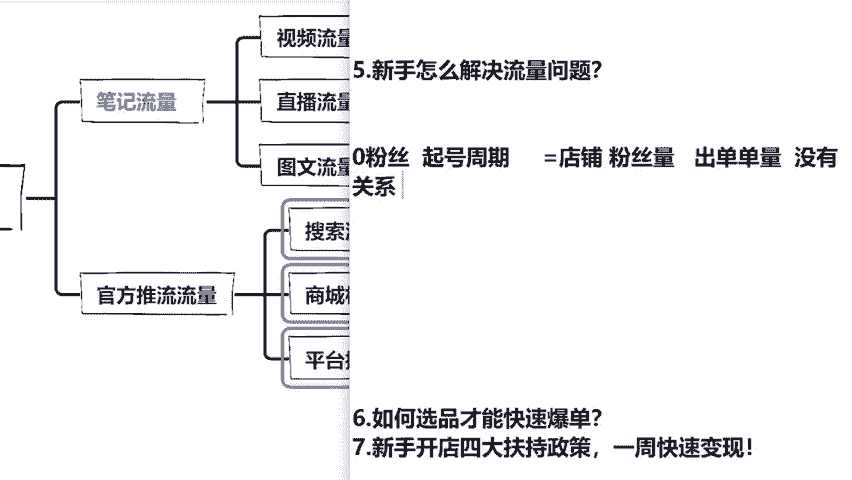

为什么我给大家讲解一下，这里你们听好了，你们到时候不要担心说老师我没有起来号，我是不是就做不了了。你就算没起号成功，对不对？你一样可以去卖货，为什么像我这个学生，他是卖袜子的。

这个袜子呢卖到目前为止多少个单了，9。8万个单了，对不对？😊，老师肯定是你那个粉丝特别多，这个学生啊肯定是他粉丝多，来，我们看一下他粉丝多不多呀。他粉丝5000多。而且我给你说句实话。

大部分的大部分的粉丝都是因为他出单过后再来复购才涨的粉讲实话。所以我们今天在做店铺的时候，你要记好了店铺的粉丝量和你出单的单量是没有任何关系的，零粉丝照样能够开店，照样能够出单，照样能够去赚钱，好不好？

记住了吗？那么很多同学呃一样是零粉开店，为什么有的人就是爆款店铺，有的同学就是一开一个死呢？你要记住啊，你如果是通过我的内部通到下的店铺，不光能够让你一天百分百下店。

再加上你拿到平台给你的30天新手免费流量扶持，对不对？那么也就是说你的平台一天他最高会进行什么平台最高会有可能获得50万的流量推流，所以说你的店铺怎么可能不到不爆单，只要你今天选对了产品。😊。

咱们就直接是一个爆款店铺。就像刚刚那个同学，你看一下，对不对？两个多月，他单卖袜子都能卖出9。8的销销量啊，是不是？所以说啊接下来我再给大家讲一下我们今天的第六个知识点。关于流量这一块。

大家还有没有问题，还有没有问题，没问题的话，咱们敲个一好不好？我继续往下给大家讲了。😊。

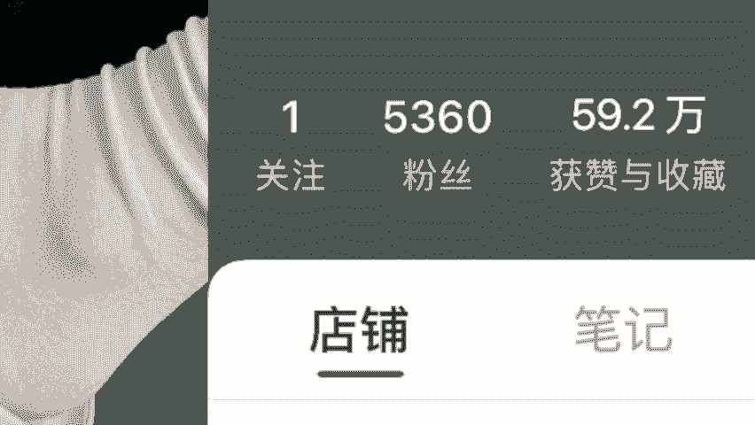

OK来，我来给大家讲一下我们的第六个知识点，就是我们怎么样去选品才能够去爆单。选品这一块呢是老师我最擅长的。我告诉大家，我们做电商选品一定是最重要的。因为我们在电商界呢有一句这样的话说非常的好。

叫做七分靠选品，三分靠运营，所以说选品它是至关重要的。而童彤老师我今天会教大家，我们今天什么作为一个新手卖什么类目才能够去赚钱。这个地方呢我会教大家去找到我们的一个需求。

那么第二个呢我也会告诉你如何把一个商品打造成爆款。它具体的一个运营流程到底是什么？说白了一个爆款商品啊，它就足够一个小白去赚的了。今天呢我要教你们这些选品打造爆款的干货。

绝对是你在其他老师那里都听不到的。首先你要知道小红书他的选品类目到底要怎么来确定呢？电商里头类种类对不对？五花八门有十几万的商品。那我们到底该怎么。😊，选呢首先我们要确定你的选品类目。

你先不要去考虑单一的商品，你先确定一个大方向。我们在小红书上面选品，我们一定要根据小红书的用户特征来选。我刚给说过的小红书80%的用户都是什么？我们要根据用户画像分析来打在公屏上面回复我。

来打在公屏上面回复老师，我们小红书的用户是什么？我们卖的产品肯定是要根据我们的用户来确定的呀，对不对？😊，哎，说的非常的好，中高端女性啊。记好了，你不能说比如说我明明用户80%都是女性，我去卖个钓鱼竿。

你肯定卖不出去啊。那么这些女性她愿意去尝试，愿意去呃创新，对不对？喜欢去分享，也喜欢去购买消费能力还强。那么我们今天就针对这些女性用户这些中高端的消费群体，我们去卖一些产品。

比如说我们可以卖什么来看这里。😊，服饰啊、鞋啊、包啊、母婴啊、玩具啊、家居摆货啊、美妆啊、美食啊呃日常用品、健身类的、养生类的都可以。这些呢都是打持久战的商品类目。

在小红书是卖的非常的好的那我为什么知道这些产品种类卖的特别好呢？我又是怎么知道这些类目的，它具体有哪些单品是爆款的同学们，因为小红书平台，它每个月呢都会生成一份报表来，同学们记好了，这个报表叫做什么？

😊，这个报表叫做。嗯，我给你们打出来吧，重点稀缺内部报表。这个我给大家讲一下，它里面会直接的给我们统计出小红书每个月什么产品好卖，什么销量最高，什么产品利润最高，而且全部用数据报表的形式给大家统计清楚。

统计好过后呢，他会发发到什么，我们这种优质服务商。然后呢，我如果说是发到我这里的话，我肯定是会直接对接给我的学生，你们拿去照抄就可以了。那他具体的作用，你们现在可能还不是很明白。

我给你们简单分析一下好不好？我们拿到报表之后有什么用啊，我们可以直接跟卖。什么意思？就我们拿到报表之后，再去进行这样的确定的选品的种类方式，叫做跟卖。你还是新手，你做电商不能凭借着你的喜好来。

因为你目前来说对这个行业还没有什么感知。你的感觉是片面的。就比如说像我之前有个学生啊，他觉得小红书上面女生多，对不对？他家里正好开场子卖那个娃娃的。他说这个肯定是爆款，结果一个月你知道他利润才多少吗？

才3000多，白白浪费了时间和精力，按道理来说，他自产自销，他不可能利润这么低的，这个产品啊，他不是说不好卖。一是因为他笔记写的不对。第二个是因为他没有把握时机，他不是说不能成为爆款。

但不是说你想他成为爆款，他就能是爆款，能理解吗？同学们，但是如果说你今然拿到了这个这个什么重点内部稀缺报表，这个是小红书内部统计的，当下最热门的产品的种类，这个就相当于是什么开卷考试。

包括小红书用户的活跃化像，人群年龄分布，他全。部都是有做细节整理的，我给你看其中一部分好不好？来，同学们给大家看一部分，比如这里。😊。

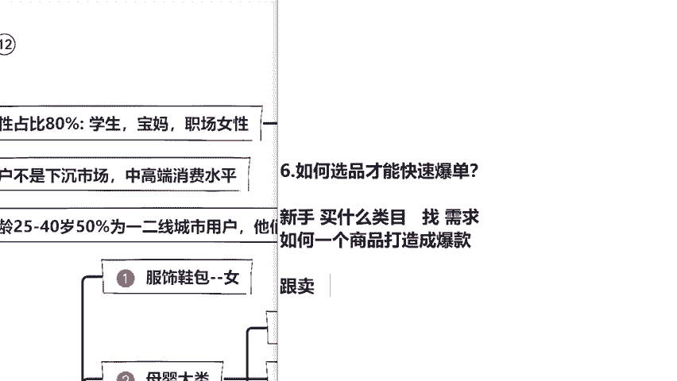

你看对不对？什么产品好卖，用美妆类的用活跃用户画像对不对？全部都在这里给你展示的清清楚楚。我们可以直接通过这个数据报表去了解客户最有需求的产品，然后我们再直接去上架，他最有需求的产品，对不对？

我们就能出单。这个呢也就是对针下药，我就能够赚得到钱，这就是跟卖的好处啊，电商界有一句这样的话叫做先模仿再超越，如果说你今天把他给超成功，你把它给超明白了，这个叫做什么，这个叫做复职成功。嗯。

比如说我今天也不知道卖什么产品。但是啊这个表上面告诉我说，现在这个比如说祛痘的产品，人家已经卖了100万了，对不对？那他卖100万，我就超他的，我卖一模一样的，我卖个10万块钱行不行？同学们。

你说行不行啊？像彤彤老师，我这有一个学生是一个宝妈，他叫做陈海红，他当时过来跟我学的时候呢，他也不知道卖什么产品。我把这个报表直接给他了，然后他自己选的产品，他怎么跟我说彤彤老师。

你给我的这个产品真的是太有用了。😊。

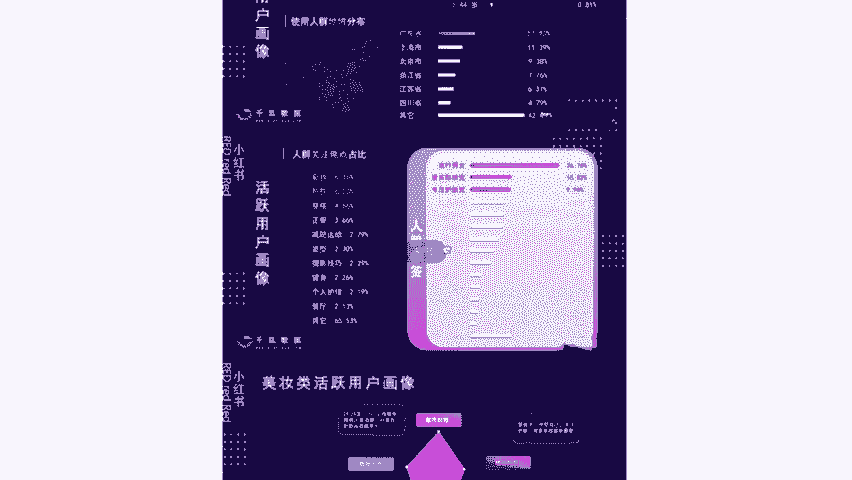

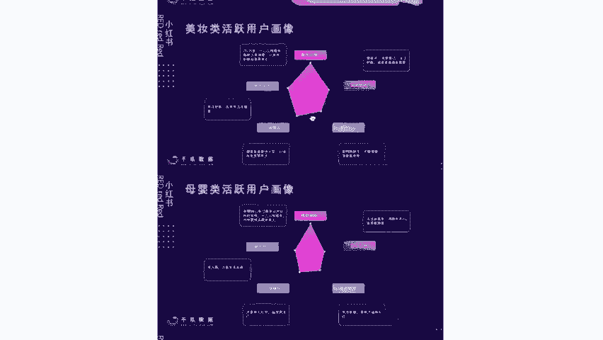

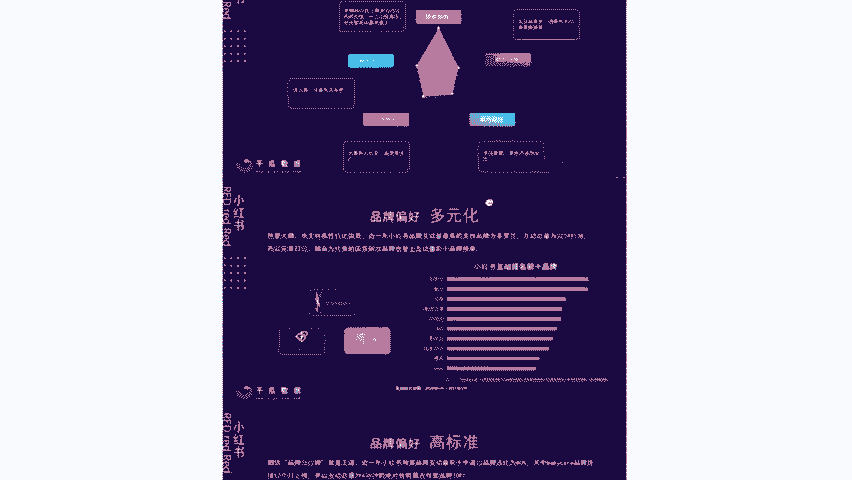

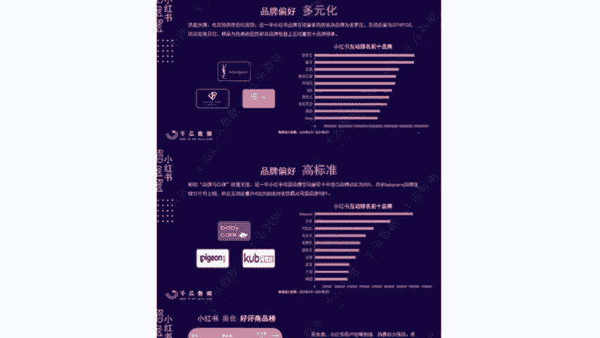

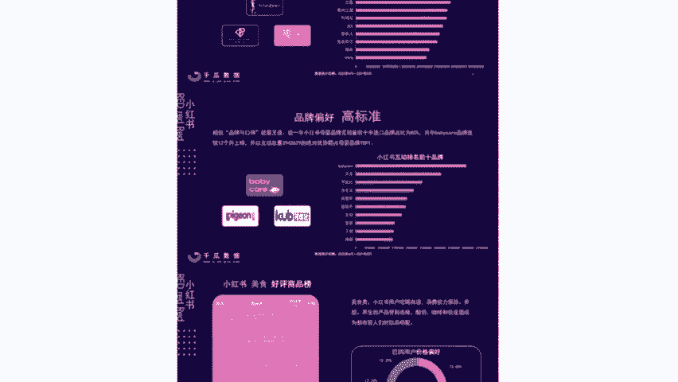

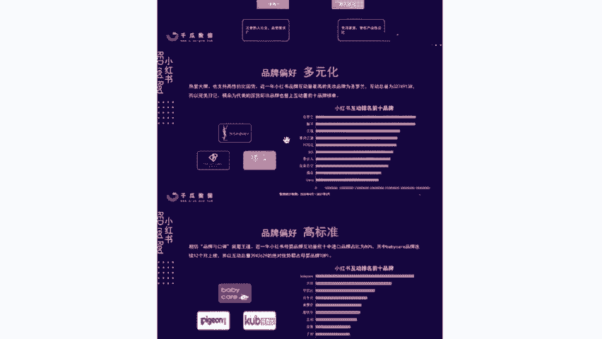

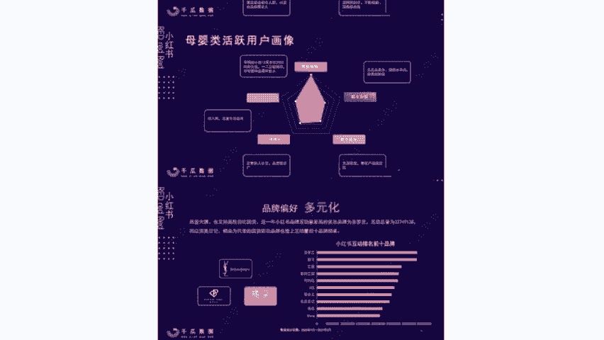

我到现在我通过报表选的产品直接做了20万了，还是得用工具省时省力效率高。他说老师我现在也想去跟人家分享一下，怎么跟着你把小红书店铺给做起来，怎么去赚到钱的。因为他最开始就是一个宝妈，什么都不会。

一个宝妈跟我说，他当时说社会上没有什么五险一金的全职太太，只有没有话语权的家庭主妇，所以说他是下定决心，一定要靠自己去赚钱。同学们，你们可以看到，我给你们看一下他的店铺，好不好？😊。

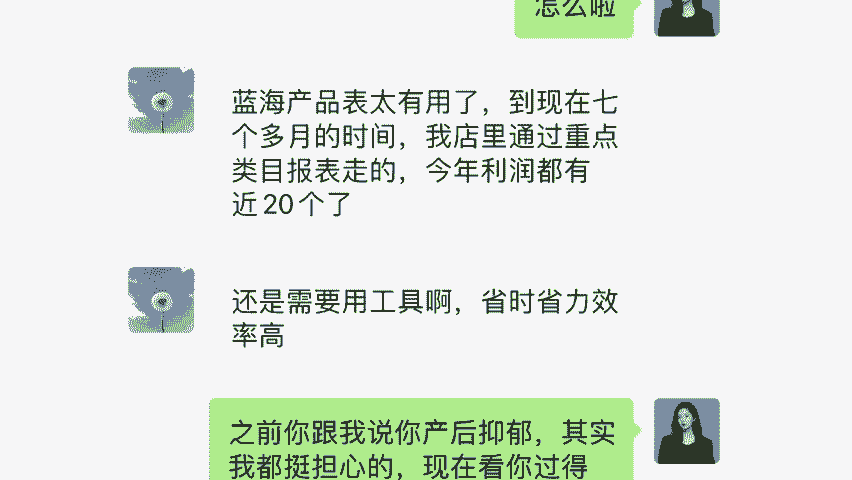

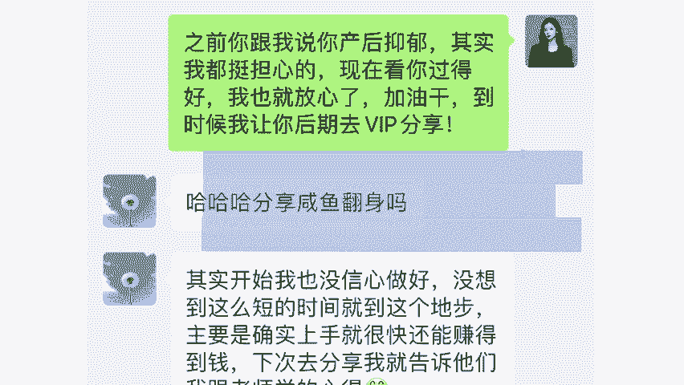

来靠这里，他第一个月呢其实做的并不多，只有1000多块钱，但是到了第二个月变成多少17000了，对不对？第三个月做是多少4万多，咱们算利润的话也不少了，对不对？同学们，我当时印象很深刻。

因为他那个时候统计数据时候，他是直接给我一个电话就打过来，特别高兴。童彤老师，你知道吗？我现在家里我老公我婆婆那都不敢大声跟我说话，因为谁挣钱谁就有底气，对不对？同学们。

我可能会在下个月帮他开第二家店铺啊，所以你要记住，你只要选对产品，小红书上面真的是挣不完的钱，选对行业，他就是挣不完的钱。所以我给大家说过的，今年做小红书一定是我们最好的一个选择，对吧？

那么这个呢也是我今天唯一的一节线上免费公开课，像我线下的课程，那都是5位数起步的。我今天教你们的，你们一定要认真听，为什么？因为全部都是小红书2024年最新的一个玩法，你们可以来看一下吗？

是不是我是拿到了什么？我是获得了小红书举。😊，运营电商变现的高级讲师的。所以说今天为什么我的学生能够快速出单能够快速去赚钱？因为每个月我都会帮助他们去对接咱们的重点内部稀缺报表。

这个报表每个月他是会直接来进行实时更新的。如果说你们今天想要这个报表的话，来，同学们在公屏上面敲个响字，好不好？来敲了响的同学啊，待会只要你在直播间认真听课，你把课程听完，我可以把这个报表给你。

让你拿到就能够找准最有需求产品，拿到就能够直接赚钱。但是啊并不是说呃谁我都能给的，我只会给认真听课的，并且今天是真的想要下定决心去做小红书店铺的，我才会给你。因为人家也说了，这个报表你在外面花钱买。

你是买不到的。只有你今天是真的想做，我才愿意会去帮助你。这是咱们一个最新的报表，我会每个月去帮助大家实时更新，好不好？😊，OK那么类目我们确定了通过这个小红书的内部资料，我知道该去选择什么类目。

那有同学就会问，我光确定类目了，那一个类目那么多，我该选择哪个产品去卖呢？比如说美妆里面对不对？有口红啊，有眼影，我选哪个牌子，哪个产品去卖呢？像我之前那个同学也是很有意思，他光看那个月啊，奶粉销量高。

他跟着去卖，但是一个月满打满算，他其实之前每个月利润是在1万多，接近2万，那个月换了产品之后，一万的利润都没有达到，为什么他老我怎么反而下降了，很简单，我选择爆款的眼光是非常独到的。

你们可以投铁不听我的，最近奶粉火你去卖什么，羊奶粉啊，什么水牛奶粉啊，驼奶粉啊，你可以去赚钱，对不对？但是对于我们来说不够，你换个思路，我们如果说在什么在奶粉面前加上什么加上母婴加上宠物。

也就意味着什么，也就意味着你的利润可以翻上10倍。😊，这个才叫做选对产品，这个就是选对产品的魅力。那么问题就来了。同学们，我们作为新手小白，如何能在众多产品里面选择一个爆款去进行售卖呢？来。

各位同学们听好了，在这个地方呢，彤彤老师，我直接给到大家一个工具，叫做什么？叫做灰臀数据。来，同学们一定要把灰屯数据打出来啊，这是你们之后一定一定是可以说是每天都会用到的一个工具。这个工具打出来啊。

打在公屏上面记好了。😊，OK我来给你们讲一下这个工具啊，它这个工具是什么？它能够帮我们去分析近期热卖的产品，你到时候直接去跟款上架就可以了。它就是一个官方的工具啊，它是一个官方的工具，小红书的灰臀数据。

他要不要钱，他要钱，而且呢我是非常不建议大家去进行购买的。为什么因为你去购买的话，一年是5000块钱4000多嘛，接近5000块钱，而且呢同学们你要记住啊，彤彤老师，我的学生，我不建议你去购买。

到时候你可以直接用我的，或者说是这样子，我每天来给大家去更新数据，好不好？我给你更新数据帮大家看到小红书大盘数据，所以说同学们我能够帮你的，我都会尽可能的来帮你，你千万不要着急先去买工具。

先去花这个冤枉钱，我先教你这个工具如何来使用他要什么用，好不好？比如说我们打开这个灰臀数据啊，你可以看到他这里有一个流量大盘，对不对？就最近什么货，哎，什么东西就在这里。比如说呃冬天帽子啊，围巾啊。

下天防晒霜，😊，卖零食大礼包，对不对？而且我在这里能不仅能看到最近比较好的比较火的商品，在这有个笔记查找。同学们，咱们按这个笔记搜索。比如说你看啊这里有非常多种呃，有卖美食的，卖宠物的。

我可以直接选择笔记分类，然后搜索我来看一下别人的笔记是怎么写的。我来参考一下，我来学习一下。如果说他这个数据是有在往上走的，说明这个数据是O我直接来抄它的，我做一个伪原创，对不对？它往上走。

但不能全抄啊，你可以模仿模仿啊，明白了吧？同学们然后呢我们还可以怎么样，你再往下看，这里有个商品分析，对不对？咱们点击商品搜索。哎，你看它有非常多的产品，那比如说我打开看一下哪个产品比较火。

我就跟着去卖哪个产品，对不对？它都会有这个预估销售额，我们点开来看一下哎，这个产品好卖，对吧？然后呢，我在比如说它这个是牙膏，我在一键生成文案，用我的AI系统，这不就是跟。😊，考试一个样嘛，对不对？

什么好卖卖什么我在ca我的AI去生成文案，一打一个准，那我绝对是上架跟这个人一样能够去出单，能够去赚钱的。因为我是模仿他的，对不对？包括我们现在学生，我的学生啊，他们最近都在爆单，为什么？

因为我帮他们选爆款。同学们，我在这里给你们说一下，很多同学前期赚不到钱，就是因为你们不知道卖什么，你们会进行一个乱卖。😡，比如说热辣滚烫贾玲减肥100斤，这个电影很多同学看过没？看过了吗？

同学们热辣滚烫，你们现在用两个字四个字以内，好吧，给我说一下观后感，四个字以内的观后感来打在公屏上面，我看一下。😊，来给我说一下观后感，你们看了之后，第一件事情想的是什么？脑子里第一反应是什么？😡。

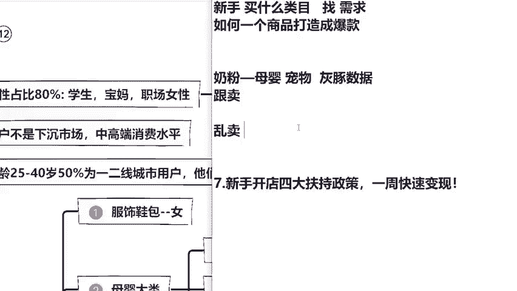