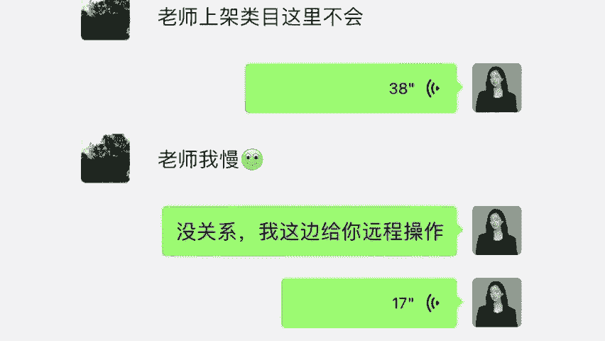

# 【2024版小红书运营教程】全B站最良心的小红书开店运营高阶教程合集！小红书体开店 起号真的快，赶快点赞收藏起来 - P8：第八章 - 香凝孕味 - BV1Pf421U77J

啊，有时候励志，有时候减肥对不对？啊？有时候瘦身来听仔细啊，很多人看电影都会说啊，我也要减肥，我也要变瘦，我也要励志，对不对？但是我们你们之后啊，也就之后你们一定要学会看到商机，卖居家健身器材。

卖小哑铃，卖大水壶，我在同步的写一篇稿子，一天要喝多少水才能瘦，这个时候呢我再挂上1个2000毫升的蹲蹲桶，哎，我们要学会自己监督自己一天要喝2000毫升的水哦，我再卖一个减脂餐，我再卖一个瘦腿神器。

你告诉我，我当时趁着那波热度，我是不是一打一个准啊，同学们，还有就是养不养生泡不泡脚，现在年轻人都养生，对不对？知道泡脚包吧，对吧？养生也火啊，我还可以蹭热度，泡脚消肿，泡脚瘦身啊，而且我卖什么泡脚包。

泡脚包这玩意不够高端不够精，我卖泡脚凝珠，我换个词一样的东西，我价格翻了5倍，在小红书上面卖的特别好。😊，而且我告诉大家，泡脚名著的利润真的是非常高，而且基本上是零退换货率。

所以说啊我要跟你们讲的是灰屯，大家一定要用可以用能去跟卖卖爆款，能让你年收益不低于30到50万。但是你听我讲。如果说在后期你学会了什么叫做打造爆款的话，那么你的收入将没有上限。你能完全把握小红书的风口。

打造爆款的思路是什么？听我讲啊，就是制造需求，刺激欲望。我们同步的制造焦虑也是一样的点。当我们没有产品利润可以赚的时候，我们就去制造，我们就去创作。我给大家举个例子啊，比如说很多同学都做美甲，对不对？

呃，你来女孩子，你自己想想，我们在去做美甲之前，我们会直接跟美甲师说，你随便给我做一个款式吧，我都能接受，还是说我们在脑海里凭空捏造一个，你告诉我你做美甲之前。

你是不是打开小红书上面搜索一下别人做美甲的款式，然后再拿着这张图去给到美甲师，你告诉我是还是不是啊啊，同学如果你是做过美甲同学，你会发现两个问题啊。😊，第一个是美甲非常的浪费时间，耽误时间。

越好看的时间就越长。我们其实现在很难在工作之余再抽出几个小时去做美甲了。其次就是美甲的价格一直在不断的飙升，差不多一个简单的美甲都要多少，都要2300块钱。那么我们作为商家。

我们肯定要把握这种断崖式的商机。于是这几年出现一个新的产品，叫做什么？叫做穿戴甲。😊，大家应该知道吧，是不是你以为这个东西它是凭空出现的吗？不，其实说的那个一点，它就是资本联合。

是以消费者为需求为中心的产品，它是一个人为制造，它的优点在于什么？穿戴甲。第一个就是省时，第二个是省钱，而且你别看它省钱，但其实它是真的非常暴力，它的成本低的话，就几毛几块钱一2块钱。

但是卖家卖到最高的质量好一些的，复杂一点的，它是可以卖到100多的。其中利润是非常的恐怖。你们作为新手，我不得不告诉你们，一个产品它是如何诞生的，背后又有多少推手，这个确实是咱们前期无法去参与的。

但是你们得明白我们可以借着这个风口去迎接属于我们的利润，还记不记得我刚刚提到一个词叫做商单。同学们还记不记得商单来打在公屏上面。😊，加深一下印象。商单跟这个有关联吗？

肯定是有我们当我们要去推行一个爆款的时候，第一个是抓住市场大盘的需求。另一个就是铺天盖地的宣传，就像完美日记穿戴假的商家也会大批的找新手卖家为他做宣传，对不对？所以机会是怎样把握的，大家应该都懂。

同样的，我今天是你的老师，我来带你。我不说帮你跨越这个阶层和维度吧，对不对？哪怕我们看得到我们知道未来的路，你少走的弯路，你浪费的时间，你可以赚多少钱啊，同学们人一定要学会走捷径，对不对？

所以说彤彤老师，我要告诉大家，无论你是选爆款还是打造爆款，你跟着我，你一定要下定决心好好去做，但是在前期作为新手，我们汇腾数据也是你必须要用到的，他太贵了，那我就用我的方法，对不对？

你可以通过我的账号去登录，或者说我每天给你更新，因为灰腾数据，他能够了解我们整个行业大盘，我今天知己知彼，我们才能够百战百胜，对不对？那你今天是需要灰腾数据，你自己去买，要00年。😊，就非常不划算。

到时候我来给你更新，好吧，或者这样子吧，同学们，你们要是有些同学说老师，我就是想自己去研究一下它到底是怎么用的。这样吧，他有一个短期的体验会员卡，到时候我给你开好不好？会员卡的价格，我记得没错的话。

是599，到时候这个钱我帮你出好不好？同学们要不要要不要办这个体验卡，这个体验卡的价格我来帮你出，好不好？😊，要办的话，你给我打个要字，我看一下，要是不要的话，那就算了，那老师就下课了啊。😊。

OK我看有同学在说这些东西你也在买穿戴甲也买过，对不对？所以说你们现在一定要学会转变思维。你以前是消费者，你现在不是了，你现在是商家，我们要转变思维啊，像我学生我给他们推的产品绝对是一打一个爆的。

明白没有嗯，有同学说真的很想通过小红书来赚钱。O其实我要跟你们说一句话啊，很多同学就说担心自己学不会做不起来，对不对？进度慢等等，你们要记住任何人他都是从不懂不会去做起来。像彤彤老师。

我我生下来我就会做小红书吗？同学也不是吧，对不对？虽然说我现在做的还不错了，但是我要告诉你们的一件事情来看一下，每个月我都要去参加这种交流会学习会，为什么？因为呢我觉得人真的是活到老学到了。

我们一定要有学习的观念，对不对？同学们，到时候你等你们到了后期陈述一点，我也能带你们去参加，都是一些电商的交流会。😊。

很多同学都说老师真厉害。其实我告诉大家，我也跟你们一样，我并没有说比你们聪明很多。包括我也不是说富二代家里支持我去创业，我就是从农村走出来，甚至我的起点比你们还要低。我今天聊的比较开心。

我就跟你们多聊一点，好不好？同学们，我问你们好不好？我跟你们多聊一点吧。就是我之前啊真的没有你们想象的这么风光。我在小时候我在念书的时候很穷。我家里，我当时念初中，我印象很深刻。我表姐嘛，她在县城嘛。

就是稍微比我家情况好一点，她不要的衣服，我姨妈会打包过来拿给我妈妈，然后给我穿嘛，我穿着我表姐不要的衣服去学校，老师会把我喊到办公室说，杨少彤，你的心思能不能放在学习上面。😊。

我明白老师的话，就是说我不该穿正常一点的衣服，因为所有的人都会下意识的给我贴上一个标签，叫做贫困户。好像说穷就是罪。我想问大家一个问题啊，之前有个梗，但是我觉得这个真的不叫梗，它更可以说是一个规则。

叫做穷是不是原罪，我想问一下你们，你们觉得穷是不是原罪，穷是罪吗？来回答一下我，我觉得穷不是罪，但是啊在这个社会好像穷，你穷你就不配活着一样。我给大家说实话，我想问一下你们的年龄。来，同学们不介意的话。

把年龄打在公屏上面好不好？我想问一下，不介意的话，你就打一下，我看一下呃，有挺多同学都是还年纪比较轻，对不对？😊，像老师，我今年31岁了啊，我我们这样子好吧，我马上35了，我们就一起把时间线控到35岁。

直播间所有的同学应该大部分都是为人子女，或者说是为人父母吧。我为什么说要把时间线拉到35岁呢？因为在这个年纪。😊，原生家庭是不能选择，所以我们只能去努力的改变。

像我们这个年纪上有老下有小这句话是真实的写照。现在有很多人喊着口号啊，年轻人喊着口号说什么，说活在当下，听着感觉是不是很潇洒。但是我就想问一句，如果说你认同活在当下这句话的话，你是真的觉得说。😊。

我是真的发自内心这么想的，还是说我不敢面对未来，不敢想以后，我不敢想我老了之后怎么办？我有了孩子怎么办啊，很多年轻人是这么想的，我想问一下，你们是这么想的吗？是在逃避现状吗？如果说不要怪我说这种话。

如果说未来某一天，父母生病了，所有责任落在了你的身上，现在的你承不承担得起。承担不起怎么办？会有人提前给你打招呼说，我看一下你卡里余额够不够不够啊，你父母现不生病了，下次再生吧。

咱们是没有和生活讨价还价的机会，如果那个时候我们还是拿着几千块钱的工资，你养活自己都是问题，那躺在病床上的爸妈怎么办？那生病的家人怎么办？孩子不能生病吗？承担不起，对不对？😊，所以说怎么办？

我真的很庆幸我的选择。因为我之前我姐姐出车祸，我是有这个条件从北京请专家连夜过来做手术钱这个东西回到这里是不是罪钱他不是罪，他也不是说万能的，但是钱他确实有时候就是我们活着资本，几千块钱的工资。

父母老了要养，最怕子育养亲不在，孩子小也要养，你说不能让他走我的老路，对不对？很简单的一道选择题。我想问一下同学们，你的工资摆在这里，左边是父母，右边是孩子，你会怎么选择？

你会怎么选择来选父母打父母选孩子打孩子来打在公屏上面告诉我。选不选的出来，可能会觉得说我父母健康活到99，我孩子自己有出息，我天天在这打麻将，他都能考清华北大啊，这么远的事情我才不想呢。

万一我明天发财了呢，万一我中彩票了呢，你想捡钱之前，你不得先把腰弯下去，你想中奖之前，你得去花钱买彩票，咱别天天做梦，我不是在给你们制造焦虑啊。同学那么现在既然你无法面对未知的恐惧。

你无法承担生活给你的磨难，你不能靠祈祷，无论你现在是2535还是45，这都是我们现在看似承担不起的。但是你要记住老师一句话，它不是死路，有时候只是我们的思维认知局限了你，让你看不上其他的路而已。

我们在路口，你可以迷茫，可以思考，但是你绝对不能无所作为。我今天跟你们说这些不是说我想象出来的，而是我有感而发。我是从最苦的日子熬出头，我不是站着说话不腰疼。我给你们说句实话，同学们。

像我这种人考上大学有什么用？😊，我学费都交不起，我也不想说我开开心心念大学，我爹妈砸锅卖铁到处借钱，我想要去挣钱，我想要去改变，我只能靠自己。我当时没办法，我跟你们说实话，我是休学了一年。

我发现打工是没有出入的，打工是不可能打工的。我当时进了场，我知道，就算我拿到学历，我不过是工资加2000块钱。我当时完全就是已经是一种死猪不怕开烫的心头了。我给你们讲实话，我最开始我自己批发去摆地摊。

然后到开店到做网店到大学我就没有在寝室住过，我在仓库跟我的货物在行军床上睡了大半年。我从零到一从无到有，从最开始我一个人到现在公司几百号人，从我第一笔资金，你们知道哪来的吗？

在学校奶茶店兼职赚500块钱创业资金走到现在，我要是靠祈祷靠想象，我靠碰运气，我不去做，我不可能有今年也不可能带着我的员工把直播带货给做起来非常顺利。我告诉你。

现在包括南极人浪上那些大品牌都有很多的在跟我们合作，且。我跟你讲，平时我真的很少讲线上课程，平时我讲的都是线下课程，不要主要是教什么教那些商业老板，怎么把咱们的产品卖到电商，通过商业来赚钱的。

像现在很多商业老板，他们都想要去做小红书。我跟你讲实话。但是呢小红书确实有一个问题就还没有完善。所以说对他们大商家来说，现在不是下场的最佳时期，他们没有什么优势。

但是这也是对于你们这种新闻小白来说比较适合的入场时机，这对于你们来说就是最好时间。像什么像15年16年去做淘宝，你像17年去做抖音，你早入场早赚钱。像我最开始做淘宝说我连推广都不会。但是我只要发布照片。

我就能够有订单，那个时候就特别简单，换句话来说，我们现在去做小红书就跟那个时候做抖音，做淘宝是一样的。他不需要你多懂多会，只要你去做你敢去做，你就有钱赚，这就是风口的魅力。😊，来，同学们，我想问一下。

你们现在确定了说老师，我觉得小红书它的前景，你跟我讲的非常的明白，我愿意去做，我每天也有时间，我愿意花心思去做好小红书。想要通过小红书来变现来改变我现在生活的同学，你在公屏上面把小红书三个字，给老师。

我敲出来好不好？我看一下有多少同学是下定决定说老师我愿意每天花时间花精力，我愿意好好去做小红书，你把小红书敲出来，我看一下，那么所有敲了小红书的同学，你听仔细了，现在我会来给你们讲到我们课程的一个重点。

这就是我们的一个运营方式。如果说你前这里没有听到你前面的相当于是白听了，什么意思？

我会给你讲清楚，我们作为新手小白，如何去打造年收入30到50万的小树店铺。我知道疫情三年的时候，他同学们很难过，因为没有专业技能过得非常不容易，对不对？现在很多同学就是说真的很怕被辞职。你一旦辞职的话。

你就会失业，很难找到下一份工作，想要赚钱，其实很简单，我给你们说两个点啊，真的就两个点，第一个点，我们要去选对市场。😊，来，我给你们说，选对市场，我们要去选对行业。小红书这个平台我告诉你，它才刚刚起步。

而且他的抖音是它的流量是抖音粉丝价值10倍以上，会给到我们非常多的扶持政策。什么叫做选对行业。你今天想要年入百万，那么你就去干年入百万的事情，不是说老师我看不起其他什么行业啊，我举个例子。

谁送外卖年入百万吗？谁今天洗盘子年入百万吗？没有吧，360行行状元那是一个行业的顶端你能做到吗？做不到对不？其实你们现在所挣的钱，所选的行业已经决定你想要赚钱一个上限了。

你今天想要赚钱想要翻倍赚钱首先第一点必须要选对行业啊，包括我给大家说句扎心的话，如果说你身边朋友一个月挣3000块，你会觉得我挣5000可牛了，对吧？5000够了。

但是如果你身边朋友人家挣10万挣20万，你再一对比你挣5000你会干嘛？我会选择放弃吗？还选择我去努力。所以说现在老师我给你一条通天大路，我们做电商一个月做起来有团队10万。😊，真的太正常不过了。

但是前提是你一定要把你的观念给转变过来，我们得去选对行业好不好？那么第二点，我们一定得跟对人，你今天想要去赚钱，你必须要跟着有实力的人，你跟对人才能做对事，你今天才能拿到结果。

像我自己的店铺账号非常成熟，我把我的方法干嘛复制给你啊，同学，我所有的弯路所有的坑，我都踩过了。你今天按照我的方法一步一步的去复制就OK了。我现给大家看一下我的店铺好不好？来，同学们。😊。

给你们看一下，你们可以看到这是我自己的店铺，因为做的早嘛，做的是女士内衣真的非常的暴力，而且退换货率真的特别低。因为很多人他其实都是在这一方面他不会选去退换货。

你们可以看到这家店铺是做到200多万的一个销售额，是不是确实还不错了，真的这个数据可以算是很好了。那么我今天把这个方法教给你们，你们按照我的来做，你做我的10分之1，你抄答案，我做200万。

你做20万很简单，我把我的方法1比1的复制给你啊。同学我对行业的规则，我对运营方式太了解了，你什么时候上架，什么时候做活动，我全部摸透了。那我今天能带你去拿到结果，你记住了。

我们就选对行业跟着优秀人站在一起站在巨人的肩膀上，加上你自己的持之以恒的努力，你才能够拿到结果好不好？包括说来我给你们看一下，我这前去参加行业线下分享会来看一下。

今年啊他会把所有的扶持政策给到咱们优质服务商对接新手卖家。😊。

他的你们来看一下我们的内部资料，给大家在这里简单的看一下，好不好？😊，来这个内部资料，但是只能浅浅的看一下啊。

看一下24年的年度趋势，对不对？扶持新手卖家持续爆单。小红书呢它会推出一个活动叫做什么？叫做参与，就是赢家，人人有机会全面开启2024年的卖家造新计划，并且呢对优质服务商报备成功新卖家就可以参加。

同学们，你们是不是新卖家，直接开放平台的免费流量服务活动以及活动单日置顶权限。什么意思？比如说双十一双十二你去发布一个作品，他就会把你的作品往上放，会给你先进行内部的推流。

所以今年啊小红书官方为了让咱们新手小白能够直接销量增长20倍。他推出这个活动，让我带着你们一起实现爆单，直接助力新卖家，把握24年的红利大促，去打造什么打造店铺的高级大卖。

让大家的店铺月销售突破3万以上。所以同学们，你们今天想跟着童童老师来学习做小红书店铺想拿到所有扶车政策，像我的学生一样，做到年收益不低于30到50万的小红书店铺的同学啊，今。😊。

那我为什么要来给大家讲这节课呢？我也给大家看直接一点。😊，当时。是我们的招商经理嘛，他又找到我了。他说杨老师，今年希望你能够再带一批学生邀请函呢已经发到你的这个邮箱了。因为我的团队人很多啊。

我说能不能给我手底下老师一些机会。他怎么说的？因为我带的学生年利润率是全部都没有低于35的，希望我能再带出来一批，而且呢会只给到我一个人扶持，像其他的老师是没有的。

那么我们内部呢对于我的学员专门的一个扶持，今年是直接给到了我什么，我开始跟你们说还记不记得VIP快速入入通道来让我的学生进行报备。今天我为什么要来给大家讲课，因为也说了，今天确实是一个最后的截止时间。

这个确实是怪我给大家准备资料，加上感冒，耽误了点时间拖到今天嘛，那你如果说想要拿到这些扶持和政策的，我必须今天把你们所有的信息提交备案啊，确实是有点赶了。但是备案了之后。

你们才能拿到所有的一个扶持和政策，好不好？同学们，那么如果说你们想跟着彤彤老师学习，像我的学生一样，一家店开。😊。

起来开多店，像我学生一样做到年收益不低于30到50万的同学来在直播间把想两个想这个字打在公屏上面好不好？所有敲了想的同学啊，我带你让其他人感受一下什么叫做信息币，什么叫做资源币，什么叫做老师。

我想做做不了，包括我的学生，他们是怎么做到年收益不低于30到50万的小红数店铺，用了什么样的方法。我在这里全部教给大家，好不好？😊，哎，非常的好，想要跟着我学就认真听好了。现在我来给你们讲一下。

我会给到你们新手开店的四大扶持政策。来，我们先看扶持一，我会带着你们干嘛啊，去增加你的一个店铺数量。😊，打造店群模式，这样的话我们就能达到一个收益翻倍的效果了。什么意思？如果你既然是自己开店，对不对？

我前面跟你说了，通过率审核率，他只有50%。很多同学连店铺你都开不下来。如果说你只有一套资料，你只能开一家店，你后期想要去做举证，开两家店，三家店，那搞不定了，人家也说了，多店铺运营，他是不是所有同学。

你都能够多店铺运营的。你需要走我的内部通道来进行报备，我才能去帮你开通多店铺，也只能是后期做，所以说只有彤童老师，我来帮你对接，你才拥有开多店的资格，好不好？后期我带你打通多家店铺。

带大家做咱们的多店运营权限。我给大家说一句话，你们一定要记住啊，我们做任何事情不可能说是一步登天。我今天教你的也不是一夜报付的方法。你第一个月你必须要做好只挣个一两千的准备。因为我们情况差一点是一两千。

但你情况好的话，也有七八千的，但是我们不能把话说死，我只跟你说好的，不是坏的，我们必。😊，必须一步一步文打稳章来走。你说老师，我明天就要挣个3万4万的，这个我做不到一点啊。

但是你也不用担心说我只要你跟着我文打文章，后期呢我们开多店，对不对？怎么管理过来，我告诉你，到时候我会直接给到你一个工具，这个工具能够帮我们直接进行多店管理一个后台就能够管理所有的店铺，明白没有？

而且同学们我们先来算一笔账啊，假设我们今天一家店只挣3000块钱，好不好？😡，只挣3000块钱，我就只算你只有10家店出单。那一个月我是不是有3万块钱啊？同学们没错吧，我再去乘以12个月。

也就是一年一年的话，这样算下，我年收益做到30到50万的收入有问题吗？没有问题吧，对不对？同学们是不是没有问题，所以很多同学都在说老师你是你学生是怎么做到30到50万的，肯定是有方法有技巧，对不对？

那么今天你们如果说是想跟着老师说哎老师我前面把一家店做好一家店的，我前期要求也不高挣个三五千0块钱。我到了第三个月4个月我要开多店开4家店，5家店的，每个月收入，我想突破1万的想开多店的同学来。

咱们把这个敲在公屏上面，咱们敲一个店群模式好不好？咱把店群模式敲出来。因为你如果说老师我没有什么出息，我就想开一家店。然后我每个月只挣3000块钱，我一点都不想多挣，那你真的成为我学生不是很合适。

我也说句实话，因为你到时候我们要统计你的收。😊，入算下来，你是拉低整体平均率的，好不好？所以你跟着我是一定要辛苦一点，打造一个店群模式的啊，好吧。而且还有一点什么好处，不仅是赚的钱多少的问题。

就是你鸡蛋不能放在一个篮子里。如果只有一家店，咱们多多少少会有一点风险的，对不对？我们一定要做店群模式才是最安全的，也是收益最多的。好不好？这个扶持一能够理解吧。OK都能理解非常的好。

那我们现在给大家讲一下，我给大家第二个扶持。我会带着你们呢去对接平台所有的免费。😊。

流量扶持。你们要知道啊，如果说我们自己去开店，你要干嘛，你要去花钱买流量，花钱做广告，对不对？但这些东西它都不是普通人能够承接的了的。你后期一旦不充钱了，你的收益，你的店铺全部都看不到了。

这就是一个无底洞，普通人他是承担不起的，这就是为什么很多人他做不起来的一个原因就在这里他什么都不会，他自己一个小白就想去做这个真的是天方夜谭，这个一点都不现实，但是你们作为我的学生，你听好了。

你店铺开起来过后，我会干嘛，我会给你去对接产品，我会帮你去做优化，通过平台的一个免费流量，咱们去干嘛啊？同学们打造爆款，打造所有的爆款，并且通过免费流量直接成为优选卖家，咱们肯定要后期去申请优选卖家。

对不对？这个挺好的，这个我暂时就不给大家说了，这个的好处，后期你们就能体会到了。我给大家讲啊，现在平台的免费流量。他不是说哎你随便来个人都能给你开放，明白了吗。😊，你必须要是前期做的OK了才有的。

他不是针对所有今天你所有想做的人，他都给你免费开放的，明白了吧？首先第一点你就得是一个好的新手卖家。你听仔细了，我们店铺最开起来最关键的两个月啊，首先新手期，人家官方会给到我所有学生每天我不说每天吧。

反正呢30天都是有新手流量的，多的话可能会有几万十几万少的话也有个几千几百的，对不对？直接通过免费流量就能够做起来，我给大家看一下，为什么说我的学生，人家店铺开起来，第二个月就能够直接出单赚钱。

如果不是官方给到我们新手期对接流量，你觉得一个新手小白，他能够有这么好的起步吗，对不对？那么这就是我第二个能够给到大家的店铺开起来之后，人家官方直接给我们推流，因为我们今天拿到的是高权重店铺，明白没有？

😊，那我现在给大家讲第三个扶持啊。听仔细了，我们做小红书就是做电商。那么电商我们拼的是什么呢？是不是就是每一年的双十一、双十二、6118、中秋度中秋啊、端午节节日活动力度对不对？也就是所谓的破价。😊。

哎，同学们破价这句话理理不理解？如果不理解的话，全网最低价这句话听过没有？听过的话，公屏飘花来看一下。全网最低价听过没有？听过的飘花啊，我说的再简单一点，比如说一支口红，你卖150，别人卖189。

那你说哪个好卖一些都是一样的产品，对不对？作为我的学生，你听好了，今年所有的节日，包括明年包括大红年什么双十一双十二、618、端午中秋，我做电商做这么多年了，我会直接跟品牌方对接。

你们所有的卖商品卖的商品，我给你们争取全网最低价，当然你不能说100块钱东西能不能让我谈成10块给你，这个是不可能的啊，我为什么一定要在今天来给你们去讲课呢？同学们啊，我因为之后那么多活动。

咱们过一天就少一个活动啊，对不对？而且我杨晓彤，我带学生不打无准备支账，抛去什么双十一双十二这种非常火的节日，你像圣诞节儿童节劳动节这些什么618、端午节、中秋节这些节日，凡是人过的节日。

我们都能去参加。而我们要做的就是利用所有的节日去破价去报单去赚钱，明白没有？我给大家看。😊。

像我这个学生你们就明白了。我这个同学啊，他之前跟你们一样，是一个消费者，但是人家现在变成商家了，他之前跟我说，彤彤老师这个活动力度真的大，我在活动期间直接就给爆单了，他叫做李婷文啊。

我们来看一下李婷文的那个店铺，他一个双十一做了多少好不好？37万，他一个双十一做了37万的销售，算一下嘛，对不对？纯利润的话，我记得他的纯利润应该是这个不能按照40算。因为我记得是非常清楚。

应该是有接近18万的。我记得他的纯利润是有18万的。但是这个不包括他的人工费啊，他团队那些什么工资还没算啊，而且呢他其实还就是一个普通商家，所以在活动期间一定是我们作为商家能够直接去赚到钱的，明白没有？

那我想问一下，你想参加这些节日的同学想参加破价活动，想参加全网最低价同学，你要参加的话，来在直播间把参加两个字打在公屏上面我看一下好不好？来所有要去参加的，你把。😊。

参加两个字打出来课后呢，把你的什么姓名、电话，还有一些资料发给我。在今天24点之前啊，最好是早一点，我会直接把给大家，把这些所有的扶持都进行报备。明白没有？那么这就是彤彤老师，我给到大家，前面三个扶持。

那如果说前面三个扶持呢，都叫做什么，都叫做传统卖货。😊，啊，你在小红书平台一年想挣个10万20万，你把前面三个阶段做好就OK了。但是呢我们现在来看什么？来看扶持4。😊，如果说你今天想要更上一层楼。

我建议大家呢不仅要去做传统卖货，我们还要尝试一下什么，尝试一下直播带货。因为小红书的直播带货是非常的火的，不要做什么淘宝抖音一定要做小红书，为什么人家官方都说了，直接给到你20倍的一个流量扶持。

关键是什么？你既然领粉丝你都能够直接去开播的，你会发现很多平台什么意思？就比如说抖音，对吧？它的直播流量池和粉丝流量池是两种，像我有个学生啊，他只有9个粉丝，我印象很深刻。那个时候我还在笑他。

我说你只有9个粉丝，你真上啊，他说没事，老师，我相信你我直接开他第一天就卖了5000多块钱，所以说直播带货一定是我们要去做的，很多抖音都说老师我不会做直播不会带货怎么办啊？我都说了。

我会教你直播话术带货细则搭件等等。我会来帮你我给大家看一下我们这个学生啊。😊。

来看一下，他叫做思琪。当时呢我让他去做直播带货，他跟我说，老师我是这个福建的，我普通话都说不清楚，我怎么做直播带货做得了吗？我说没有关系啊，我们每个人本来就是有自己的特色风格，对不对？只要你想做。

我就来帮你我帮他搭建的直播间，然后呢是在前段时间晚上快到12点了给我发消息。老师在吗？我说在的怎么了？你看怎么说的，他说我听你的做直播带货直接做了6万多，我说是你自己在播吗？

他说我和我妹妹一起真的很感谢你如果不是你鼓励我真的不敢相信走到现在直播话术有没有用。同学们如果说你们今天是想要自己播的老我可以帮你们去打造IP我们零粉丝开播一样能够去赚钱。

当然还有一部分同学可能会说老师我这个年纪比较大，我在公共场合讲话我比较紧张，我不想自己带货怎么办呢？还记不记我之前给大家提供的一个什么思路啊，不想自己直播的，我给你们提供了一个什么方法。

还记不记得记得的打在公屏上面不记得我就不讲了啊，记得。😊。

的话打在公屏上面。直播话术呢是针对人家直播的，无人直播啊，同学们。😡，无人直播，我今年已经把无人直播给你们研究透彻了，你们直接拿去用就可以了。只要你的电脑手机24小时不断电。

所有的直播素材我给你提供好不好？所有的原创素材，你把它上传到咱们的无人直播软件里面，我们就能够通过无人直播，把咱们直播带货钱依旧给挣到当然可能确实是没有前面的那个多啊。哎，这个王爱子同学非常好。

黄生同学也非常好啊，表现好的同学，如果你真的要跟我下令学小红书，对不对？到时候你把地址发我老师给你你是我的学生，我就给你寄一份小礼物好不好？来，同学们是这样子，我去给你们讲。

当然这个肯定是无人直播只有在后期才能做前期是不合适去做的，所以说我这样跟我的学生讲，千万不要给我们自己人生设限。如果说你觉得你可以你一定要相信我们才会有更多的可能性，对不对？我现在给告诉你们啊。

我带你们赚的是什么钱，我带大家赚的一定是技术的钱，我带你们赚的是方法的钱。我们赚的是什么？是运营的钱我们。😊，赚的是风口的钱，明白没有？我们赚钱是靠这些得来的。那么今天呢这就是我给到你们的四个扶持。

这四个扶持我能够确保你们走在什么走在起跑线上面，直接就赢在起跑线上面。那么这四个扶持你们是想要的，你们是认可老师我的，你是说老师我想要利用小红书来赚钱的。你在直播间里面来这样子。

同学们把三个八敲在公屏上面，好不好？

来，同学们把三个8敲在公屏上面，敲好的同学，你听好了。今天我会从你们当中挑选出10个同学。那么这10个同学是作为院长，我来辅导你，我会把所有的扶持给你，所有的政策给你，并且我带你们去开店开多店。

让大家争取能够一周出单，一个月打造爆款好不好？我们要做到年收益绝对达到30到50万以上。为什么因为人家今年要求我带学生，我必须要把你们带出结果，只有你们今天出结果了。

我们才能够拿你的数据来做广告做起来了，我才会有资源和扶持啊，对不对？我是比任何人都希望你们去赚钱的。我今天带大家，你们挣钱，我也挣钱，我们是合作共赢的关系，好不好？所以说呢我今天也给大家说。

我为什么有资格来带大家，为什么公司一而再再而三的要求我来带这最后一个案例班。我给大家看一下啊，来我们看一下，我23年的清代班的学员的数据来简单看一下，包括李娜刘玉啊李婷文都在这里来看一下。

你们看她的收益。😊。

没有一个同学挣不到钱的，所以我才有这样一个底气。我学生没有一个做不起来店铺，除非你们自己放弃的。所以人家呢也确实是这个再三要求我来亲自带学生。所以说彤彤老师，我今年也是张经理跟我说的很清楚了。

给大家看一下吧。我们张经理跟我说的是总共呢就10个名额帮我做进超优选扶持以及免费申报活动。任何机构拿不到的，全部给我了。所以同学们如果说你们今天想要跟着彤彤老师我来学习，想要跟着我拿到店铺的。

想要一天下店，拿到所有扶车政策，跟着我学一样做到年收益不低于30到50万的。咱们在直播间把想字敲出来。我再仔细看一看，所有敲了响的同学啊，来助教老师帮我统计一下。我给大家说一下。

我这个人呢说话也是比较的直接也是讲课比较实在。我带学生并不是说你在这敲个响，我就一定要带所有同学我带学生是有要求的。我把我的要求，我直接说你们看一下能不能做到能做到就做到做不到。😊。

就算了，咱们也没有必要强行在一起，对不对？首先第一点啊，你要满足我的要求。第一点，人品一定要好，什么意思？你一定要懂得诚信，你不要去卖假货，为了他们那么几块钱，几10块钱，你去卖那种质量很差的东西。

好不好？同学们，咱们卖东西一定要注重口碑，前期你哪怕少赚一点钱好不好？因为我们做事之前你一定要学会先做人，今天不管你年龄多大，你学历多低，你接受能力多差，人品一定是第一位，明白没有？那么第二点呢。

我希望大家一定要有执行力不能懒，因为勤能捕拙，笨鸟先飞。如果你今天什么都不想做，你就想首先早上说老师，我明天就要赚3万，我后天就要赚5万，我一个月要赚十几万，那你现在就可以离开教室了。你什么都不想哎。

我我也不是神仙，对不对？所以你们自己要有执行力，像我给你们看一下，我在2月份带的一个学生来给大家看一下。😊。

他当时62岁了，老金他当时过来跟我学的时候，他说彤彤老师我学的真的特别的慢，我说学的慢没关系，只要你愿意学，人家62岁了，我带他来做，我跟你讲实话，上架不会选品不会全部都是我给他远程操控的。

但是你们来看一下他的店铺做到多少，做到了3万多的销售啊，3万多可能不多啊，他的纯利润的话可能就是个呃8000块钱，8000块钱对于你们来说不多，但是对他来说真的非常好了。我当时为什么会选的时候。

他我也给你们讲实话，他听完我的课之后，他当时给我发了张图片，密密麻麻全是笔记。我给你们看一下他现在的吧，来给你们看一下，是不是人家年龄虽然大，但是他想努力的心不比你们任何一个人要差。

我的学生呢我还给你们强调一下啊，我会给你们每个同学定制好你们的档案，每天该做什么，你每天什么时候有时间，你要提前告诉我，我会来给你做规划，我带学生第三个要求是什么。听仔细。

就是你每天至少要花半个小时以上啊，最好是一个小时来。😊。

跟我学习啊，这三个要求你确定了说哎，老师我有时间，我这个人品我觉得也好，我一定听你的，我也不偷懒，我一定勤奋的同学，你都能做到的，你敲个能，你但凡有一条做不到，你就不用敲了，真的。😡，你不要过来跟我学。

你现在骗我说你有30分钟，你到时候没有时间，你学什么，你学不了啊。😡，好不好？你确定这三个要求你都能做到的。😡，OK你都能做的话，那我现在给你讲一下我的教学方式啊，我给你讲一下我的教学方式。呃。

所有的同学呢我给你们讲，我在你们都是从零基础开始，但是呢都是边学习边赚钱，什么意思？我会帮你们定制档案，这个档案是什么意思？就是根据你的情况来给你定制。我带学员可能跟家同老师不一样啊。

一定是边学习边赚钱。为什么我不会说我们一定要学个什么十半年学个三个月再开始赚钱。比如说我今天挑个同学啊，这个以和为贵同学。😊。

你今天我让你发布一条笔记，你挣了500块钱，我说你明天别发了，你明天休息，你愿意吗？以和为贵，不愿意，对不对？为什么？因为你会觉得我说的对，确实能够赚得到钱。所以我要继续努力，我想要挣更多的钱，对不对？

我们做任何事情啊，我一定要让大家有信心。所以说我要让大家争取一周出单，一个月打造爆款。那我的教学方式，你们记住了啊，一定是看效率的，什么意思？10%的理论加90%的实操。

到时候你每天花半个小时左右来听咱们的理论课程啊，有直播课，我们要打好基础，所以说理论课程你必须得听这个有直播有录播，你没有时间，你就看录播。我们课程呢相对来说你一个月就能学习完，独立上手。

但是你今天跟我学，对不对？我额外赠送你更多的学习权限，就是为了预防有些同学我吸收慢老没时间，我下个月再开始，所以说我会根据你的时间，根据你的情况去延长你的学习期限好不好？但是呢听课只是一个辅助。

真正能够把你带起来的是什么呀？一定。😊。

是彤彤老师，我这十多年的电商经验，一个实操才是最重要的，对不对？所以到时候呢你会有我所有的联系方式，你有不懂不会的，随时过来问我，我把你叫到会为止。包括啊老师你能扶导我多久，我能扶导你一辈子。

我今天坐在这能回你消息，我十年后依然能只要我在好不好？同学们，今天我告诉你，我就能够让你通过一部手机把小红书做起来。在前期啊，我会带大家一边实操，一边挣钱，包括我给大家看一下。

我希望这个会大家能够积极参与。😊，这个是什么？一些线下的，我会组织线下的小型交流会，邀请我之前一些毕业生，一些老卖家来分享一下经验和心得，让新卖家更有信心来做这个市场。当时在抽奖环节，我印象很深刻。

有一个宝妈过来找我他说童彤老师我来的时候呢用的是我老公淘汰手机。我走的时候用上这款最新的手机了。这些学生呢，我不仅能够把带好做好，能够让他赚钱，更加的是我要让你们结交更多的同行朋友。我想问一个问题啊。

到时候我要你比如说你们做好了，我拿你们的店铺数据啊，出来给其他同学做宣传，做榜样，你们愿不愿意，包括交流会，要是到了你的城市，你出来嗯做一个分享，愿不愿意。同学们能不能做。😊，OK吧。

我希望大家还是无私一点，好不好？因为呢在这个社会，你想要去做好，你想要去赚钱，你一个人搞不定的。你除了要有专业的人来给你指导，你事半功倍，对不对？而且呢还是要有什么，还要有更多的同行的朋友。

而且我在这里给大家说一下，我跟你们是师生关系，又是朋友关系。所以说有些话我就直接说了。关于我的一个呃工作时间，我给你们讲一下，好不好？因为我除了带你们，我另外也是有公司，我要自己还是时间比较有限的。

我给你们说一下，我教学时间呢，是周一到周六。😊。

你找我，我可能做不到秒回啊，但是我最晚最晚半小时，我一定会回消息好不好？这是我给大家承诺。我看到第一时间我一定会回你。然后我的工作时间是周一到周六，你们找我，然后下午的一点到晚上的10点钟，我全天都在。

有任何问题，你也可以给我打电话，打视频都是OK的。但是我有什么说什么，我这个年纪呢，说实话，有老人，有孩子，我周天呢。😊，我一般来说要休息一天的这一天呃，你们如果说是小问题找我，我可能不会回复。

但是你们有急事找我的话，我一定会接电话好不好？针对这个问题，大家能够理解吗？如果你能够理解的话，你敲个理解。如果你说老师我就希望你24小时全天秒回我，你敲哥不理解，你可以离开教室了，咱们三观不一致。

这个点大家能不能理解，我能保证是你找我，我尽量随时在好不好？而且呢我还给大家预备了一个东西，就是如果说我不在的话，我另外会给你配备一群老师。😊，因为你们要知道，今天其实说到我自己的话。

因为我儿子呢是小学一年级了，所说话我每天早出晚归陪他时间特别晚少嘛。所以说我周天想尽量的花一天时间来陪陪他。关于那个我等一会再给大家说，那是一个神秘礼包啊。先听我讲完这个，包括有同学在问说。

老师跟着我能出什么样的效果。如果说我们想要做小红书店铺，对不对？全职来做的，敲个全职兼职来做，敲个兼职来，我告诉大家，全职和兼职分别要准备什么东西，好不好？来打在公屏上面，同学们。😊。

如果你是想要全职来做啊，那你每天至少呢要花两个小时。两个小时以上啊，但是呢我允许你这个时间是碎片化的时间。就是你什么时候有时间，什么时候来，对不对？什么时候来找我，我会尽量的去配合你的时间。

一个月争取让大家稳定出单好不好？并且呢每个月能达到1个1。5万左右的收益，这是一个保守估计啊。因为我这个人不喜欢讲大话，所以说我们保守估计就估计就少1点1。5。我来给大家看一下。

我这里有个学生叫做莹莹的，来，我们来看一下。😊。

他原本是在那个婚庆店啊，婚庆店给人当化妆师的，那个时候呢就是白天在外面跟妆啊，晚上回家做店铺。我当时都急了，我说你这个到底什么时候报备活动啊，要时间要到了，他说老师我马上回家马上回家。

我等到他凌晨一点钟，当那个时间基本上是我天天在公司等他下班，因为他这个工作性质没办法嘛。然后呢他前段时间跟我说老师我在定属店终于稳定了，我辞职了。现在正好在家就可以赚钱，不用到处跑了。

说谢谢老师你的耐心指导，然后呢给自己提了一辆车，这辆车其实还真的挺不错了，因为人家26岁自己做的，他的店铺怎么样也给你们看一下吧，还行吧，第一个月呢可能少一点，第一个月的话，利润也是有个1万多。

第二个月的话，他利润立马就上来了。第三个月是直接做到了11万的销售额，所以说我的学生我能够把他们带起来，我就一样的能够把你们带起来。为什么他做店铺前三个月就能看到效果。我说了我会来带你教你怎么去做。

只要你愿意学上手速度真的很快的，而且。😊，会把我所有的资源都给到你好不好？包括有同学在问那兼职呢，兼职你每天至少啊30分钟啊，同学们，你30分钟没有，那你真的是在这跟我开玩笑，好吧，同样的。

我允许你也是碎片化时间。你比如说上厕所的时间，对不对？比如说你去上班路上地铁的时间，哎，你都可以来学习，是不是如果你是有工作的话，我建议大家你们前期先兼职。你赚到钱了，你再开始全职。😊。

因为前期他全职也不是说需要每天8个小时以上，每每天就两三个小时，三四个小时就可以搞定，好不好？我再给你们说一下，坚持按照以往我亲自来辅导学生的话，一个月收入是不算太高的。但是一个月呢。

他们以往来说是6000到8000左右的样子是绝对有的，好不好？所以说呢我的学生我能够把他们带出这种效果，我今天也能够把你们带成一个这样的效果，明白没有？那我为什么能保证说你百分百一定会有效果呢？

因为我今天拿到所有扶持政策，都是让大家一个月把店铺给做起来的。如果说你今天想要跟着。😊。

