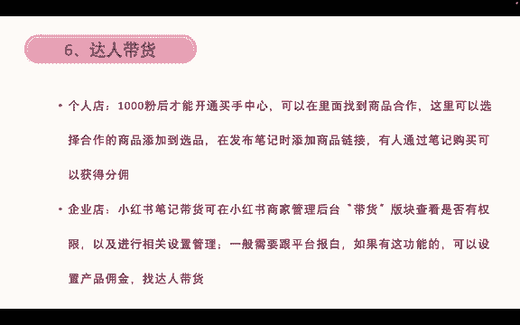
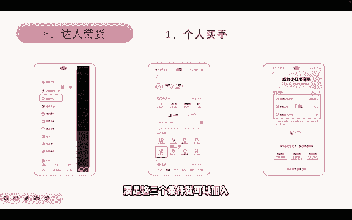
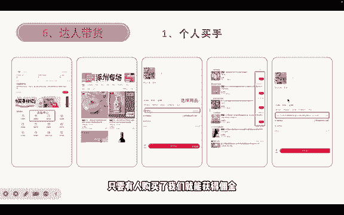
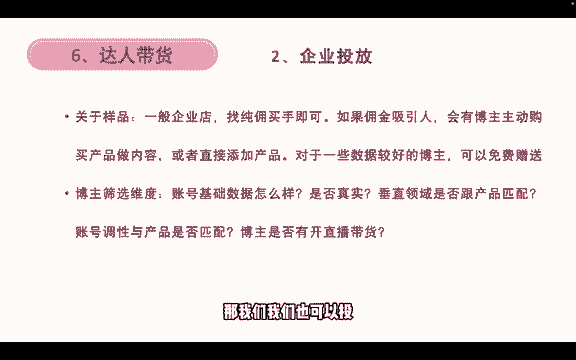

# 【2024版小红书运营教程】全B站最良心的小红书开店运营高阶教程合集！目前B站最完整的小红书运营教程，大佬亲自教学！小红书体开店 起号真的快，！赶快点赞收藏 - P12：9.小红书买手带货 - 火影忍者坤坤老师版 - BV1tC411j7Ri

再家看一下达人带货，个人店的话有1000粉丝才能开通买手中心，然后可以在里面找到商品合作。这里可以选择呃自己合作的商品，然后添加到选品发布笔记时就可以添加商品链接，有人通过笔记购买就可以获得分忧。

个人店呢？如果你达到1000粉丝之后，你既能卖自己的产品。对吧你既可以卖这个的产品，又能够卖选品中心的产品。就是既能分销，又能卖这些的产品，这是个人店才有的。那如果是企业店呢。

不管是个体企业还是企业的企业店。就不能够帮别人卖了。但是呃小红书笔记带货可以在小红书的商家后台。那你带货板块，那你看是否开通，以前呢是内测，那现在呢它是全量开放，只要你是个体或者企业的企业店都能够开通。

那在里面就可以进行一些设置，之前是要跟平台报白，但现在不用了。那我们设置好了之后，设置好了佣金就可以找达人帮你带货。所以个人店跟企业店不同，在这里个人店1000粉丝之后可以帮企业店带货，对吧？

企业的产品带货，那企业店呢就可以让让那些1000粉丝以上的博主，他们只要开通了买手，他们就可以帮我挂链接，帮我卖产品，对吧？然后我再给他一些佣金。

所以这是两个不同的方式。个人买手的开通步骤在这里先点创作中心，然后再点这个创作中心里面的买手中心，然后再看看自己有没有达到这个门槛。第一个是否完成实名认证。第二个，你的年年龄是否大于或等于18岁。

然后第三个，你的粉丝能不能大于1000？满足这三个条件就可以加入小红书买手。

然后个人买手，如果你加入了买手之后，再重新点到买手中心，这里就会有直播选品跟笔记选品。那么我们点开笔记选品，这里就会有一系列的产品给你选择。我们比如说选中这一个锅，那我们就可以添加到选品中心。

添加到选品中心之后，我们就可以编辑笔记。编辑笔记在发布的时候，这里关联。关联商品我们点击关联商品，这也就可以去选择一些商品。就我们添加到选品选品里面的商品去选择，然后就可以挂到这里。只要有人购买了。

我们就能获得佣金。

然后。关于一些企业投放的问题，如果说一般的企业店要找春游买手的话，就可以了，就不用说去呃再次付费的去找买手。如果佣金吸引人，也会有博主主动购买产品来做内容。或者说直接添加商品来做内容。

然后对于一些素质比较好的博主，我们可以免费赠送一些样品给来给他。比如说他的粉丝有1万多个，然后你的产品100来块钱对吧？那你就可以免费赠送一个产品给他跟他讲，你能不能帮我发一篇呃买手笔记，就带货笔记。

那这种方式也是可以的。那如果说100块钱里面你有40%都是分给博主的那很可能有一些博主他会呃自己花钱购买你的产品，然后再来发布待位笔记。当然了，前提是你这个产品在小红书上卖的很棒。

那就会有就会有买手会这么做啊。如果是一些很热门的产品，那也不会有买有不会有博主主动购买的。那我们如果说要筛选一些博主的话，可以参考这几个维度。第一个账号的基础数据怎么样好不好，对吧？

账号基础数据它的互动，它的点赞高不高？然后第二个是这个数据是否真实，真实，是不是刷的，我们要判断一下，然后垂直领域与产品是否匹配。

就是如果说我不是服装的那我只推给一些只需要一些穿搭或者服装时尚类相关的买手，对吧？如果你是电子类的或者说食品类的，那我就不投你了，你去申请，我也不要，对吧？哎，账号调性与产品是否匹配。

如果说一些日常分享低客单的产品，然后你的客单价比较高了那这种账号掉性也是不匹配的。还有就是博主是否开直播带货。如果说他开了直播带货的话，我是建议我们就选它比较好。如果没开的话，但是笔记数据特别好。

那我们语我们也可以投。

然后以上就是这一节公开课的所有内容。然后之后我会再完善一下买手的内容和店铺产品，就是笔记制作的一些内容。我会完善给大家。好，谢谢大家的观看，今天就先到这里，拜拜。

