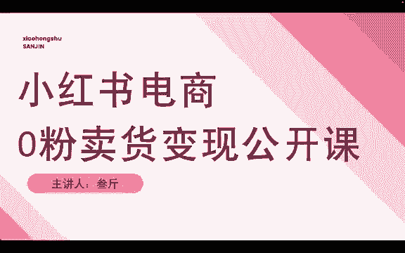
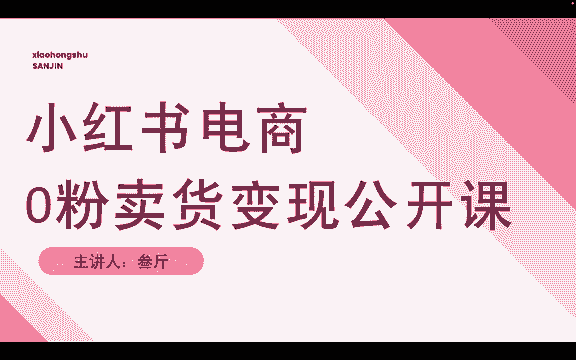
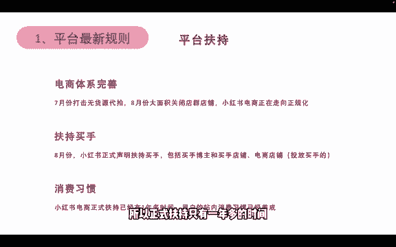
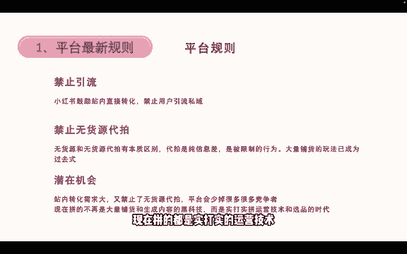

# 【2024版小红书运营教程】全B站最良心的小红书开店运营高阶教程合集！目前B站最完整的小红书运营教程，大佬亲自教学！小红书体开店 起号真的快，！赶快点赞收藏 - P5：1.小红书电商规则和风向 - 火影忍者坤坤老师版 - BV1tC411j7Ri

hello，我是三星。这一节公开课来跟大家分享一下小红书电商零粉卖货变现的整个流程。

在课程开始前呢来跟大家聊一聊平台的最新规则。第一个平台的流量扶持，小红书电商体系现在正在逐步的完善，7月份开始打击无货源代拍，然后8月份开始大面积的关闭那些开店群的店铺，以及做无货源代拍的那些店铺。

这就意味着小红书电商正在走向正规化。就是没有了那些呃大量发布笔记，大量商品，然后大量开店的那些竞争对手。第二个，扶持买手。8月份，小红书正式声明，开始扶持买手，包括买手博主和买手店铺，还有电商的店铺。

就是针对于一些投放买手电商店铺都能获得流量扶持。现在是小红书发布买手扶持这个声明的第一个双十一。所以今年双十一小红书会大量的去扶持买手和店铺，他会给到大量的一些流量和优惠券。然后第三个叫消费习惯。

小红书电商正式扶持已经有一年多的时间了。从2022年底12月份左右，11到12月份左右，小红书就已经开始在往电商方向发展了，到现在已经一年多时间，用户在站内的消费习惯已经养成。然后需要注意的是。

这也是说正式扶持有一年多时间。但是小红书电商本身已经大于一年多时间，它已很早就开始了做电商的这个事情。但是一直没有做好，也没有给到特别大的流量扶持，而从2022年底才开始给一些开店的。

就是给一些开店的卖家，给他们做一些流量扶持。所以正式扶持只有一年多的时间。

然后再来看一下平台的最新规则。第一个，禁止引流。小红书是鼓励站内直接转化的，禁止用户引流到食域。比如说你想要在小红书引流引流用户到你的微信上面去成交去购买这个行为，小红书是禁止的。当然了。

这个禁止只针对个人卖家。如果我们是企业企业商家，比如说我们的产品，我们企业的一个产品做的是定制类的产品。那么这个东西它天然就不适合在小红书站内转化，它需要呃跟卖家详细的沟通一些细节才能够促成成交的化。

那这种必须要引得到思欲的，是可以跟平台开白名单的。当然这是后话。那么作为我们个人来讲。小红书是禁止我们引流的，它不允许我们从小红书上获得流量，然后引导到1欲成交。然后第二个叫禁止无会员代拍。

这个就跟前面讲的，7月份开始了这么一个行为。但是需要注意的是，无货源跟无货源代拍有着本质的区别。代拍是纯纯的赚信息差，纯纯的赚差价。是被限制的行为。大量铺货的玩法已经是过去式了。

解释一下什么叫无会员代拍。无会员代拍。就是比如说我从小红书上下了一个订单，但是那个卖家不是直接给我发货，而是他从淘宝或者拼多多找到一模一样的产品。然后他拿着我的信息去拼多多下一个一模一样的产品再寄给我。

那么这叫无会员代拍，就纯纯的赚信息差。这种方式是被限制的，但是无货源无货源不是这样子的。无货源代拍属于无货源的一种，但无货源并不并不是全部都是无货员代拍。无货源。

还有一种叫一键代发合作这一种合作是被允许的，而且是正常的商业行为。比如说我跟一个工厂或者跟一个供应商呃，跟他们确定一个合作关系。那我来帮他卖产品，卖完产品之后，因为我不想囤货，对吧？

那如果我们做有货源的话，需要自己压货自己囤货会有一定的风险。但是我不想这么做，所以我就跟供应商联系，跟他合作，你能不能帮我一键代发，就是我这里下了单，你直接帮我发就可以了。那么这种方式是被允许的。

是正常的商业行为。所以无货源跟无会员代拍就有本质区别的。这次打击的是无货员代拍，而不包含无货源在内，就是一件代发，那些是不会被限制的。然后呃基于这两项两项最新规则的前提下。

那小红书就存在着一些潜在的机会。比如站内站内转化的需求越来越大，而且又禁止了无会员代拍平台就会少掉很多很多的竞争者。对于不懂的人来讲，就是。对于一些呃还是以原来粗简单粗暴做无会员代拍的那些人来讲。

在小红书是肯定没有出路的，没有活路的。所以呃但是但是需求一样，就是想要在小红书上买东西的人，这个数量是不会变的。而卖东西的人会少掉很多，所以我们在这里面潜在着很多的机会。

现在在小红书做电商拼的不是大量的铺货和大量生成内容的黑科技，而是实打实拼运营技术和选品的一个时代。因为在之前在无会员代拍禁止以前。有很多做店群的人，他们上产品的方式是一天一个店铺上几十上百个产品。

然后同时操控着几十个店铺，他们是用软件的方式去操作。而且生成内容也全部使用全部使用工具，一个图文或者说一个视频，他们能够批量混剪成几百个看起来一样，但有，但系统分别不出一样，就非搬运的视频二创视频。

他们能一下子生成几百升至上千个。那么这种时代已经成为过去式，我们没有办法再用这种黑科技去小红书上做无货员店铺，如果还是以这种方式去做的话，呃，会有两个结果。第一个你卖不出货。你的店铺没有任何流量。

第二个结果就是小红书识别了你这个行为，然后把你的店铺封掉，甚至把你的账号封掉。所以呃现在拼的都是实打实的运营技术和你的选品。

