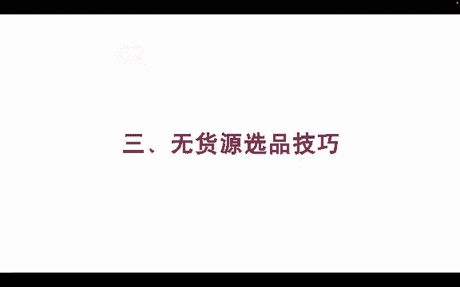
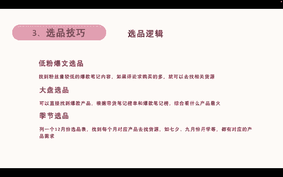
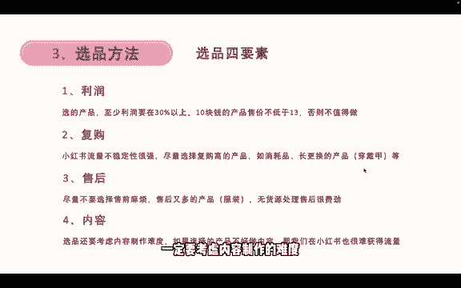

# 【2024版小红书运营教程】全B站最良心的小红书开店运营高阶教程合集！目前B站最完整的小红书运营教程，大佬亲自教学！小红书体开店 起号真的快，！赶快点赞收藏 - P9：6.小红书爆款选品技巧 - 火影忍者坤坤老师版 - BV1tC411j7Ri

我们再看一下无货源的选品技巧。无过员的选品逻辑呢有第一个叫低粉豹纹选品，就是找到粉丝量比较低的爆款笔鉴来做内容。如果说他的评论里面求购买的很多，那么我们就可以去找相关的货源，对吧？

因为这个品它是报在产品那里嘛，我们就可以找到相关货源。然后第二个呢叫大盘选品，就直接找到爆款的产品。比如说杯子，我直接找到杯子的这个品类，然后我再根据带货笔记本跟爆款笔记本看看哪一款杯子最火。

或者说哪一个服装最火。那么我们找到最火的去找货源，对吧？这也是大盘选品的方式。第三个呢叫季节性选品。我们列1个12月份的选品表，然后对应每个月份找到呃就是找到每个月对应的产品去找会员。比如说七夕的礼物。

9月份的开学礼物、书包，他们都有对应的产品和需求，对吧？我们就可以找到这一些产品去做。

那具体的选品方法呢，有几个工具可以选。工具的话，我们使用灰臀数据和新新红，还有产小红这些都可以。我个人是比较推荐灰臀数据，因为灰臀数据新物可以白嫖几天的时间足够用了。灰存数据的话，看左边的这个图。

我们打开灰屯数据的官网，找到笔记查找里面的笔记榜单。我们在笔记版那里面找到中间的第一粉豹文版，再找到自己想要卖的类目。比如说时尚配饰好，那我们就能找到配时尚配饰类的第一粉豹文版。

我们就来看到我们筛选近三天的。时尚配饰类的低款豹纹。然后看第二个，它就有一个呃小小的包，这小小的包。那么这一个配饰就是跟产品相关，我们就可以找到这么一个包来卖，对吧？然后第二种呢叫笔记本单。

我们找到笔记本单，然后带货笔记本，直接找到时尚类的带货笔记。然后这一个像这种项链，这一个小项链呢，它就是在带货笔记本里面做的比较好的，就是数据比较好，卖的比较好的产品。

那么我们也可以去模仿它找一样的选品。那这就是低粉豹纹和带货笔记本的做法。那这里有个比较关键的地方，就找产品的时候，尽量的去避免手工定制类的产品和大品牌的产品。因为手工定制类的，你找不到货源。

因为这是他自己个人做的个人定制的手工博主个人自己就是创造的这个产品，所以你是没有办法找到会源的。大品牌产品呢呃比如说我们做手机对吧？手机你想要卖华为手机，那肯定是你是要拿大品牌授权，对吧？

所以这种大品牌产品你也是不好去做的。所以我们要避免这两个问题。那么选品还有4个要素，选品的方法里面还有4个要素。第一个利润我们选的产品至少利润要保证在330%以上。所如说我们10块钱的产品。

10块钱成本的产品售价不能低于13块，否则的话这个品就不值得我们去做。因为你还要考虑你的人工还要考虑呃有可能会产生了售后等问题，所以我们尽量的利润要保持在30%以上。第二个呢叫复购。

因为小红书的流量不稳定性很强。我可能这一篇笔记报了，但是我不能保证每一篇笔记都报，对吧？所以我们尽量的去选择一些高复购的产品和比如说像消耗品和长期更换类的产品。比如穿戴甲啊、内衣啊这一些。

那么他在你这买过之后，他很可能还会倒回来再买。比如说穿戴甲，带了半个月到一个月左右就不稳了。那他就需要换新的那很可能会找回我们这一家，然后再买一个新的。所以我们要找做有复购的一些产品。然后第三个呢。

就不要去选择一些售前麻烦，又售后又多的产品。比如说像服装，当然这里举的例子是服装，但服装还是比较好做的一个品啊，所以可以只是举了这么一个例子，售后很多。因为服装为什么说售后多呢？

特别是女装女装的产品它是非常容易出单，非常容易爆单的。但是呢它的退货率也非常的高。正常的女装退货率有50%左右，就是卖100单会退掉50单。所以这个我觉得是非常麻烦，对于无会员来说非常麻烦的一个事情。

甚至有一些质量差的，它能达到70%，80%的退货就卖100件，退掉70件。那这种产品也没办法去做，做特别累，对吧？而且无货源处理这些东西的时候是非常费劲的。

然后前面这三个呃利润复购和售后是几乎所有电商平台都会教你的选品三要素。但是呢。别人不会告诉你的是，如果你是做抖音，做小红书这种内容电商平台。第四个要素他们几乎不会告诉你，但是是非常非常关键的要素。

就是内容。我们选品的时候还要考虑内容制作的难度，对吧？如果说我们选的产品你不好做内容，那你怎么在小红中获得流量呢？对吧如果说你一个男生你想要做内衣的产品，那你是很难拍摄内容的对吧？你只能做摆拍的那种。

然后你自己不好去做内容。但是如果说女生去做的话，他很可能做内容更比你更容易，他能卖的也比你更多，特别是穿戴甲这种穿戴甲，如果是男生去做的话，你很难获得流量，你很难拍。因为穿戴甲他需要戴在手上才好看。

如果你摆拍的话，他可能不是很好看，对吧？那如果女生去做这个的话，他能获得流量的概率比你更大，他能卖爆的概率也比你更大。所以我们在选品的时候，一定要考虑内容制作的难度。

