# 【2024版微信视频号运营教程】全B站最良心的微信视频号运营高阶教程合集！微信视频号运营 自媒体视频号起号真的不难！ - P15：1.自我介绍 - 庄剪子映剪辑 - BV1ei4ceHEP3

OK那既然啊现在及时已到啊，咱们废话也不多说，直接进入我们今天的主题。好吧。首先张老师，我做一个简单的自我介绍啊，咱们就正式开始了。那张老师，我姓张当们一个娘次啊。

大家可以直接称呼为啊张老师当院长都是没有问题的。张老师，我本人呢是从一呃三年啊，从部队退伍之后开始做咱们的这个互联网，那之后呢，15年又进军咱们的拼多多啊，因为要与时与时俱进嘛，对吧？

17年抖音出来之后就开始做咱们的这个抖音，也算就是。

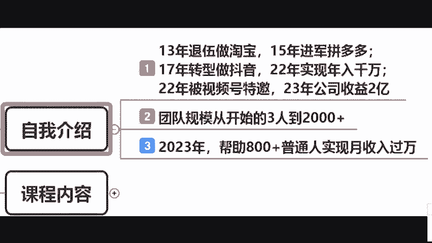

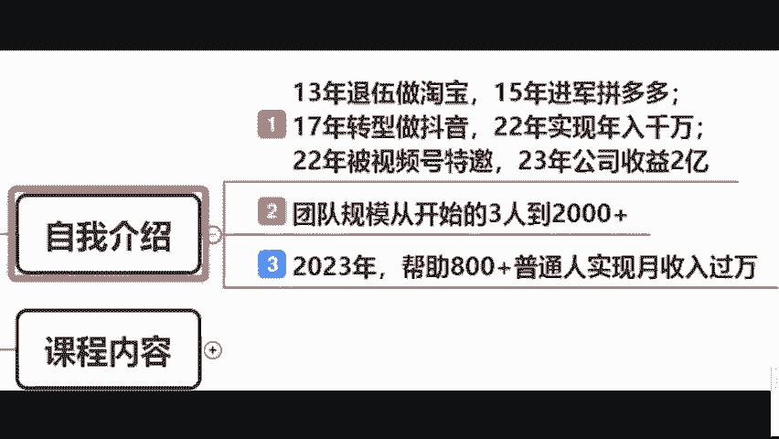

啊，跟着咱们的这个呃跟着咱们的时代去走啊，跟时代走。那么接下来就咱们疫情三年，对不对？那张老师，我是比较幸运的一个点是什么？是踩上了咱们时代的一个什么风口啊，踩上了咱们时代的一个风口。怎么说呢？

各位啊呃踩上咱们是代风口，就是呃疫情三年，相信大家应该影响都蛮大。但是张老师我这个整体来说啊互联网上做爆了。所以说呃在2022年的时候，总共公司规模从三个人发展到1000号人，对吧？收益也达到多少呢？

也达到了咱们的这个千万啊，所以说2022年被咱们的视频号特邀成为咱们的首席执行官啊，那22年23年就咱们的这个去年啊咱们的去年啊整个公司又翻了一倍，有1000变成2000人，收益达两个亿。

所以说啊既然社会啊赋予了张老师，我这样的一个财富。张老师我更多的是反哺咱们的社会。所以说在2023年帮助800多普通人实现了一个月输户万，也帮助了近百名企业，企业从线下卷正到我们线上。

免费的啊免费的各位同学嗯啊，免费的好吧，那今天的课程内容分为几点，包括从0到1搭建咱们的爆款账号，最后新中小白如何在视频号上实现月输过万以及。

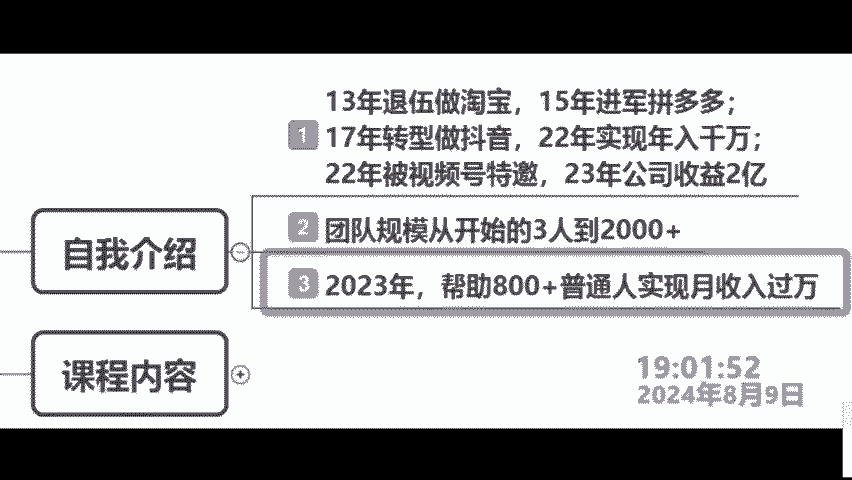

零基础新手都可以去做的暴力变现的一个玩么？玩法，好吧，各位。所以说来看到很多同学刷了个鲜花啊，感谢各位同学鲜花。那各位好吧，那接下来啊接下来我们就正式开始我们的实操课程。各位同学好吧。

来把三个8打在公屏上啊，鲜花可以稍微停一下了。啊，鲜花可以稍微停一下各同学听懂没有？嗯，对啊，我们就正式开始了，好吧，嗯，对对对哈，那今天张老师也直接废话不多说，直接进入我们的主题。好吧。

各位那现在你们想学什么东西啊，都可以把你们想学的东西直接给张老师，我打在你们的什么评论区，你们想学什么？张老师我就教什么好吧，各位我来看一下嗯。😊。

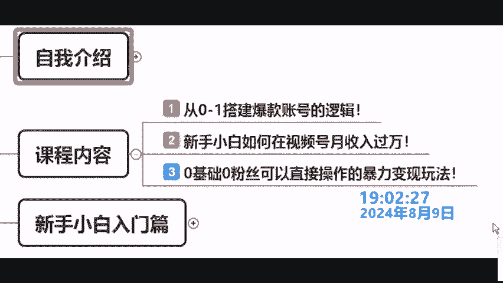

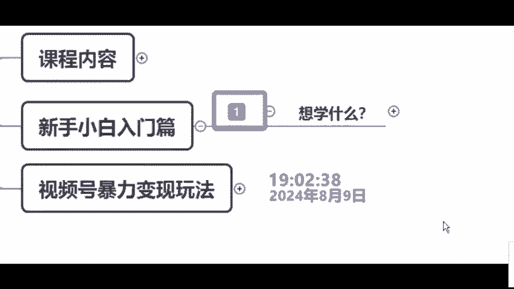

因为刚刚啊也是简单的了解一下个人情况啊，土生金道好，看一下怎么申请创作分句化，视频号变现，视频号变现，视频号带货okK啊，张老师我都有看到了。那可能呃总结一下，简单就这几个点。

那有同学可能想学习咱们的什么涨粉啊，或者说咱们的视频号运营啊，又或者说想关于咱们的视频号的带货呀，视频号的什么变现哪，无人直播呀。对。😊。

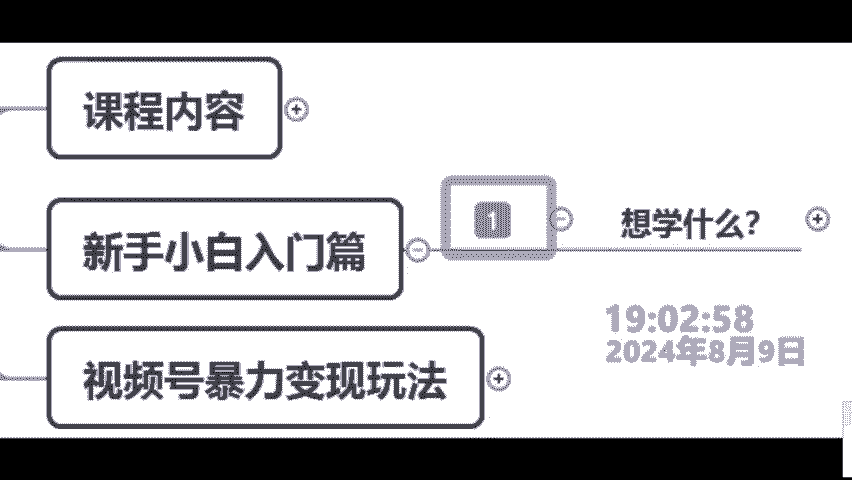

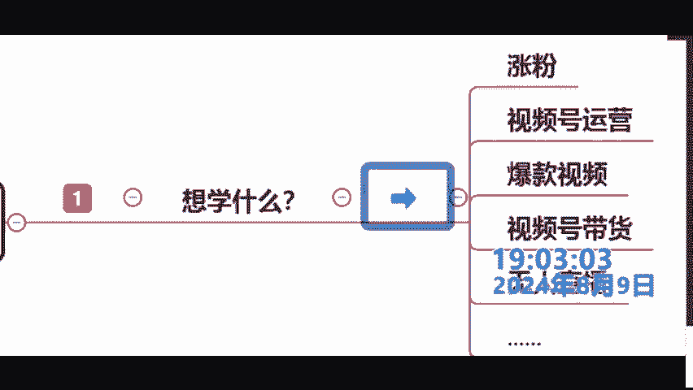

啊，我看一下年入百万是吧嗯。😊，我看一下哈。小学无人直播啊，OK张老师我都有看到啊，各位都没问题啊，这个东西张老师我都会提交。但是我想问各位各位各位一个问题，我不管说你们想学习什么东西啊，各位。

那你告诉张老师，你们的最终目的是不是赚钱，是不是啊？

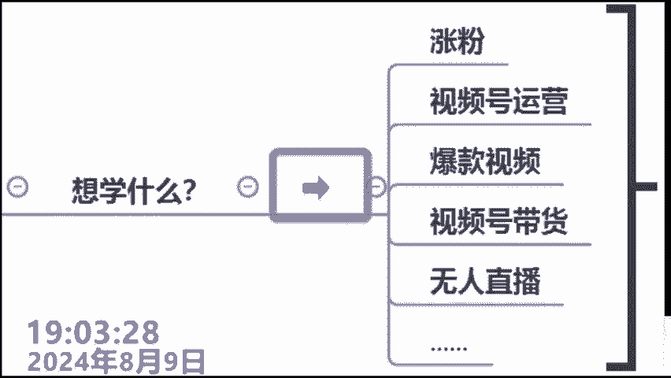

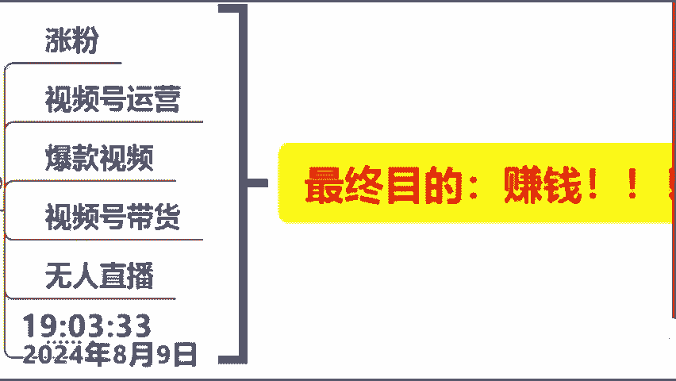

嗯。同学在是不是来事的话，跟他打两个数子，对吧？你不管学什么东西，最终目的就是咱们的赚钱呢。所以说我跟大家讲啊，聪明的学生一定是来学习咱们的什么方式方法的。为什么这样说呢？各位。😡，很简单的对吧？

那很简单的，对吧？你想挣钱，那你得找一下哪里的钱最多嘛啊，哪里的钱最多，那就是钱好挣一点嘛。各位同学是不是道理，对吧？张老师，我给您举一个什么比较简单的例子嘛？那张老师我想吃鱼了。

那很多同学说老师你可以去超市里面买河里面去钓，前提是不是超市河里面。😊，有余啊，对不对？那说到赚钱，现在想都没想哪里最好赚钱呢，对吧？我们得搞清楚钱在哪里呀，对不对？那现在最好赚钱的一定是我们的互联网。

一定是我们党平台位同学，那是不是道你来试的话，你给张老师我打上一个什么数字一啊，对不对？那说到现在比较火热的短视平台，他有几个比较代表性的东西啊，几标代表性的平台，哪几个呢？来一个就是咱们的抖音啊。

一个就是咱们的快手，还一个咱们的什么视频号，那这三个平台能不能赚钱啊，张老师我可以200的跟大家说可以赚钱，但是各位你是一个新手啊，张老师我已经从业12年了，对不对？

那各位同学你作为新手只能选择其中一个，为什么呢？因为你现在还不会走啊，就想学跑嘛？所以说我们来探讨一下，各位，你觉得那你觉得你作为一个新手，对不对？你作为一个新手，你在抖音上能够赚到钱的话。

你给老师打上一个什么数字一，你觉得你在快手上能赚到钱。😊。

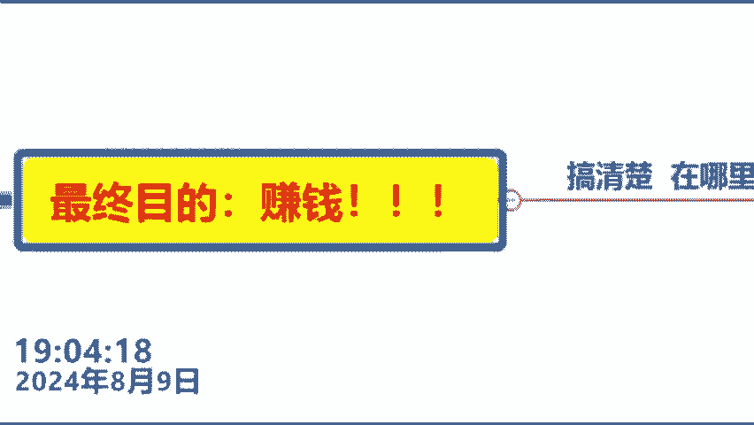

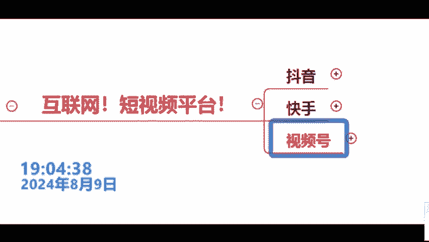

话给老师打上一个数字2，对吧？你觉得老师我觉得在视频号啊，我可以挣到第一统计，给他师打上一个数字3。来，很多老师我不知道啊，所以说我今天才听课，对吧？你给老师打上一个数字4啊，张老师，我来看一下，好吧。

各嗯。😊，我来看一下。老板。嗯。OK有同学打了一，有同学打了2啊，老师我玩三年还不赚钱。我告诉你啊，你今天听张老师，我一节课啊，我告诉你抵得上你之前玩自己玩视频号啊，玩这何平台玩三年啊，好不好啊？

我看一下，还有同学打了一个什么123各位啊，打了123或者说打了1234的同学啊，我告诉你，你在互联网上绝对是一分钱都赚不到的那为什么这样说呢？因为你什么都想做呀，你什么都想赚啊？

那各位是不是你什么都抓不住啊。来同学，你觉得张老师我讲的有没道，你觉得有的话，打个有字，所以说我一直说啊，一定是来学习张老师，我的什么思维方式的好吧，那张老师呢我也不给大家什么去卖关子了，那什么意思呢？

各同学听好了啊，首先抖音啊，各位你们千万不要再去做了。因为抖音它的商业资本化是特别特别严重的，怎么说呢？你会发现在抖音上面有十，比如说你刷10个视频当中，是不是有7个或者8个代带货啊，是不是对吧？

来事的话，打个十字。😊，甚至于你刷视频刷的好好的啊，对抖音人复杂，对吧？他也给你开个广告。各位，因为抖音是17年出来的呀，17年到现在多少年了？1718192021222324同学第八年了呀。

8年时间只有多少人在里面去挣钱呢？是竞争非常之大的那我们来看快手快手的各位同学，你更不要说了啊，快手他比抖音出来的还要早一些，听到没有？所以说各位你作为新手啊，他的竞争也非常激烈。

但是我们来看一下视频号啊，各同学看好了啊，视频号是各位新手同学，你必须要抓住的一个风口，为什么这样说呢？因为视频号它是有一些独特的优势的，什么叫做独特的优势呢？那独特的优势说白了啊。

就是说白只有他有而B没有那么各位啊，来如何去抓住我们视频号这个风口呢？很简单。来各位比老师我把情花刷起来，对吧？什么意思？各位，你们在听张老师。😊，我的课的时候呢，首先第一点，我不需要你们做任何的笔记。

听到没有？你可以在课后领取张老师我的笔记。第二点，张老师，我让你们刷鲜花的时候，说白了就是在跟大家讲，这是什么一个什么重点内容。听到没有？第三点，各位，你把你们之前学到的所有东西，你给张老师。

我放在什么一边啊，放在一边，听到没有？好不好？来，你看一下张老师，我是如何把一家公司从三个人做的2000多号人的，如何把握我们互联网的每一个什么红利器。刚才我说这些东西我都会去教，好不好？😊。

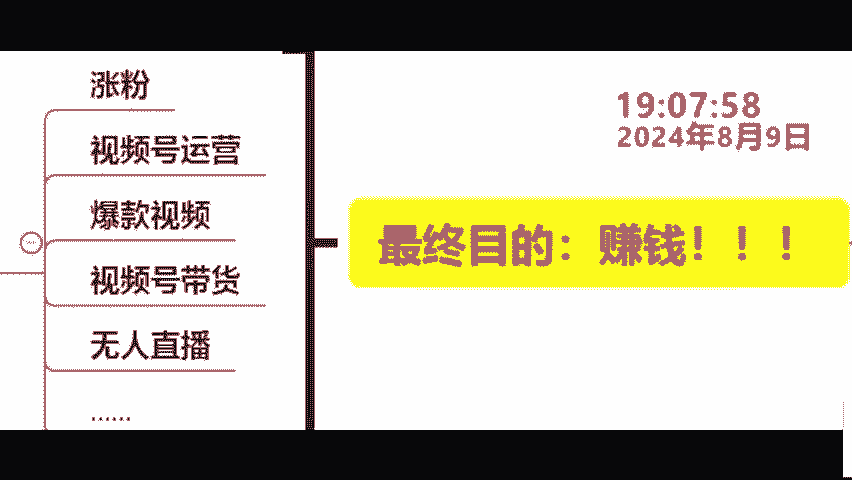