# 【2024版微信视频号运营教程】全B站最良心的微信视频号运营高阶教程合集！微信视频号运营 自媒体视频号起号真的不难！ - P18：4.视频号两种玩法 - 佐自悠_媒_体_运_营 - BV1Qk4ce7EPm

OK看清楚啊，那给大家讲讲一下这两个玩法有什么样的区别呢？啊，肯定是有的。大家看清楚啊，我们的这个保底减去玩法呀，它呢是适合那些什么呢？你想搞什么副业的，听到没有？对吧？时间比较少的搞搞兼职同学呢。

好吧，那适合这样的同学呢，你就可以做保底减决玩法，如果说是这样同学，你给张老师打上一个什么数字一，听到没有？那我们的这个翻身报复玩法，大家可以看到啊，可以日数位数一天挣个万把块钱，对吧？那这个玩法。

那肯定是时间要比较多一点啊，想要去创业的同学对吧？全职做同学，你给老师打上一个数字2那我来看一下，如果今天扣一的同学比较多，我就着重讲第一个扣二同学比较多，我就着重讲咱们的什么第二个我来看一下啊啊。

有同学说都讲啊ok ok啊ok ok啊，老师我都会看到那这样好不好？那这样好不好？张老师，我这两个呢都讲我先讲第一个再讲咱们第二个一个一个的讲好吧，来没有问同学给老师把三个8打在公屏上好吧。😊。

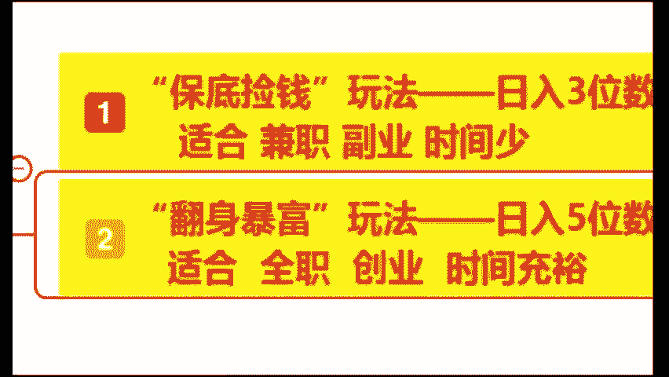

没有问题同学，你把三个8给老师打在公屏上。张老师，我现在就开始讲咱们的一个什么保底卷钱玩法啊，保底减钱玩法。嗯，OK。稍等一下啊。

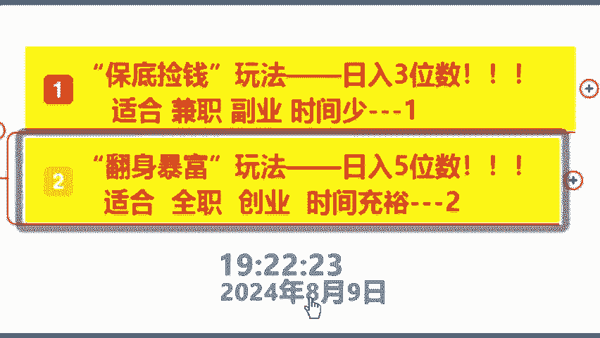

。好，OK来同学。😊，先给大家讲保底减轻玩法，那保底减轻玩法啊，又称之为我们的什么创作者的分成计划。那这个计划大家知道同学打知道啊，不知道同学打不知道什么意思呢？那创作者分成计划呢。

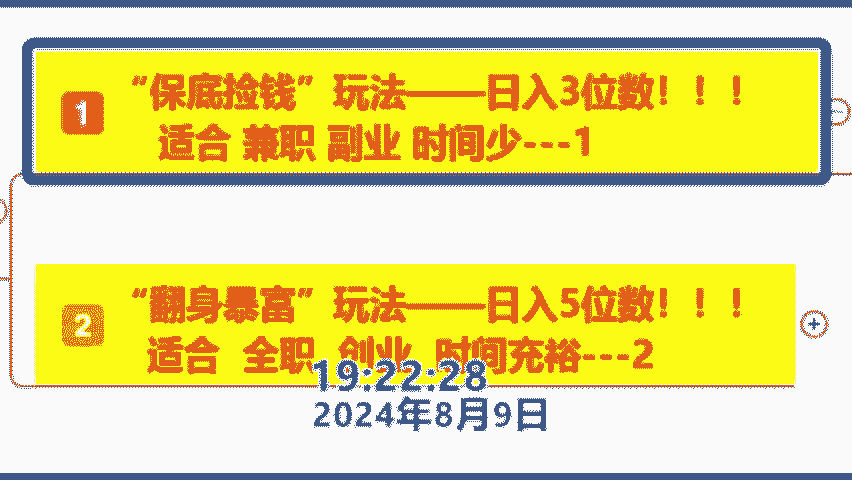

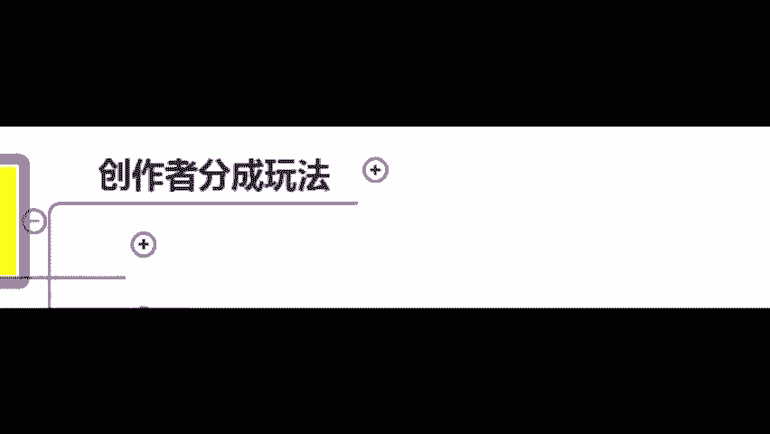

啊，它是一个比较简单的种操作，就是发布视频之后，你就有稳定的稳定的一个什么保底收益了。各位同学看到没有？它就相当于我们出去打工啊，你的工资呢就是由底薪加提成来构成，好吧，他是没有任何门槛的。

非常适合我们的新手小白同学啊，这么多同学都不知道吗？😊。

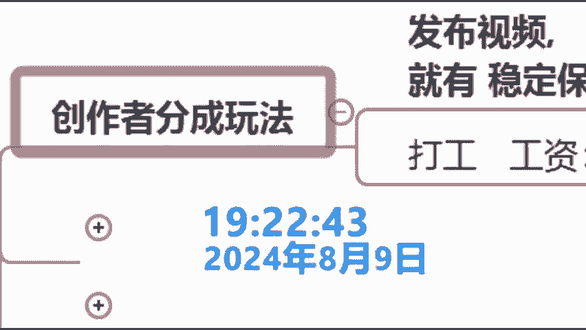

那这么东学都不知道吗？嗯，那么okK那我来看一下啊啊又一春哪啊原同学呀，MY不知道是不是嗯。😊，OK那张老师，我这样对吧？我接下来给你们看个视频，你就知道了。各位其实很多的东西啊，你们绝对是看到过的。

就是你们觉得习以为常的东西啊，在别人在里面已经挣得什么盆满钵满的。好吧，来各位同学，我们简单来看一下，就是很多很多你们习以为常的东西啊，但是别人既然里面什么闷声发大财呀。我们来看一下这个视频。

大家有没有看到过啊，各位。😊。

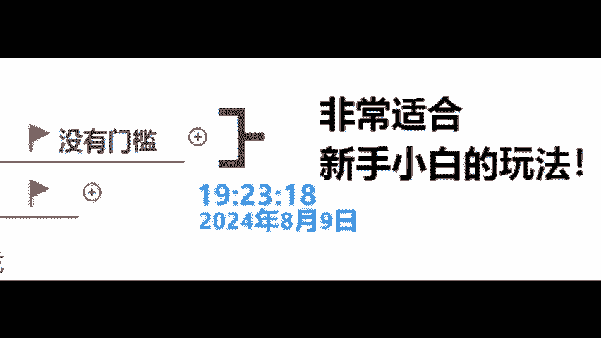

我你谁呀？你呀。😊，是不是已经不好了。想法看组啊，不用做笔记啊，各位同学这样的画面啊，这样的视频有没有看到过来？有的话打个有字，对吧？很多人发搞笑类的，就是同一个类型的话，一直在发，一直在发，有。

是不是？那你想为什么别人那天天接着发，难道是闲的吗？好吧，来，张老师，我1。1点的给大家去揭秘啊，1。给下去揭秘秘密在哪里呢？秘密在我们这个什么评论区我们就往下看。😊。

嗯，各位这个评论区大家应该都有看到吧，很正常啊。但是接下来我们往下滑啊，往下滑秘密就在这个地方在哪里呢？在这个地方好吧，我截图给他放大一下，我不知道大家能否啊。

你们以后注意在这个地方有个叫做广告的两个字，那能否看得到能的话，给老师打上一个数字一。嗯，打上一个数字一，不需要做比B。我说了，各位嗯，听到没有啊看到没有？那既然有广告就有咱们的什么广告费呀。

那就咱们的广告费跟同学，你们说是还是不是嗯，O那这是看是什么广告呢？我们简单的看一下，好吧，我们把这个广告打开一下，看是什么广告。各位。😊，来点开这个广告之后呢，我们可以看到这是一个什么东西呢？

汽车的一个什么广告看到没有？那为什么是汽车呢？因为张老师在今年呃就刚过年的农历的2月初二啊，农历的2月初二家里面添了一个什么龙宝宝啊，听到咱们是什么龙宝宝，所以说现在是呃两个什么两个儿子了啊。

两个儿子了，所以说现在想呃换一部大一点的车啊，换一部什么大一点的车，各位同学听懂没有？好吧，那我不知道各位同学，你们平时有没有交到电话啊，说你在这个官网上留言买什么吹风机啊，洗衣机啊，电饭煲啊。

来有的话，打个有字好吧。😊。

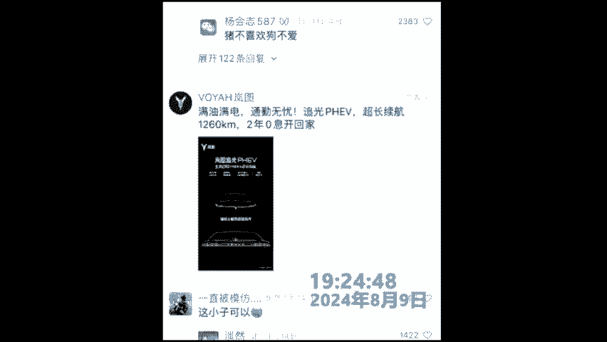

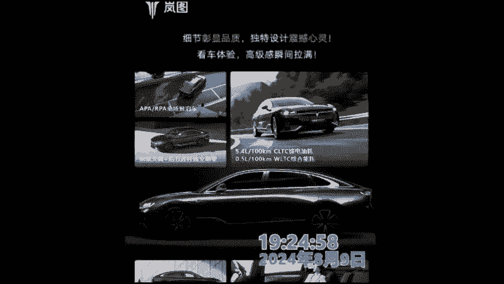

感谢这位冰冰同学啊，这个其实就是我们的创作者分争计划。那包括为什么张老师，我会非常推荐大家去做这个玩法啊？董同学，因为你做我们的创作者分争计划呀，对吧？它是不限制你的一个什么类型的啊。

时长风格都是不限制的。你可以做搞笑类书单类情感类和美食都是可以的。听见没有？你包括刚才这位同学，他的整个账号，看到没有？😊。

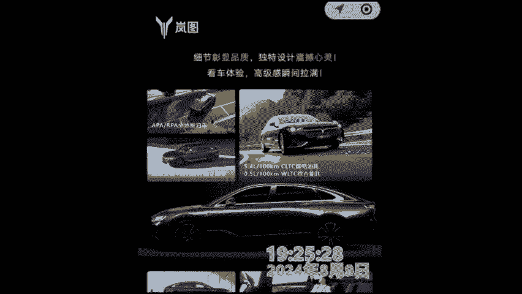

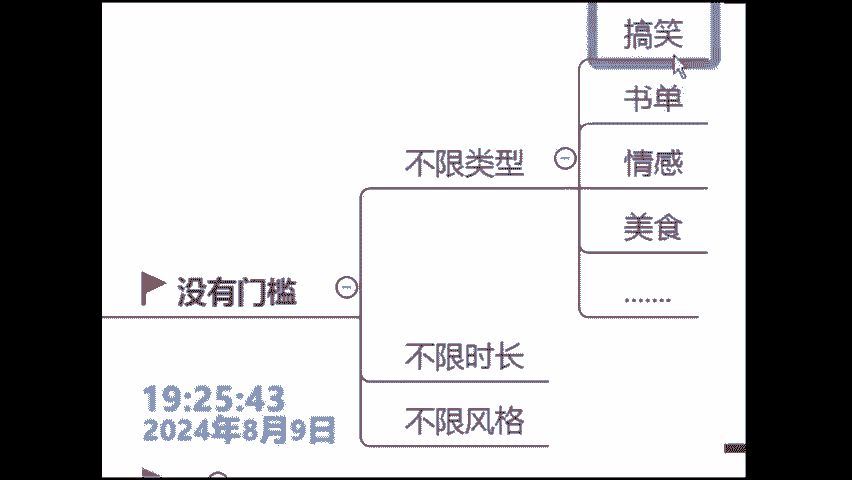

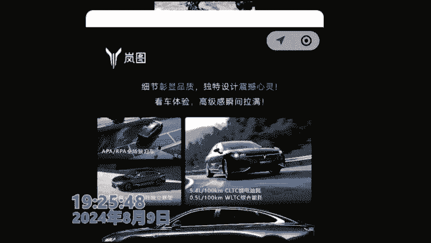

他做的所有东西全部都是搞笑类的，看到没有啊？全部都是咱们的搞笑类的。妈听到没有？那包括多同学说老师啊这个东西他真的老师多大哈，老师93年的哈，老师93年的好吧，这位物极非凡同学好吧。

各位那他的收益是怎么来的？各位同学大家好好看啊，他的收益呢是根据我们的一个什么播放量来的。什么意思呢？也就是你这个福音发出去啊，只要你有播放量，你就钱，听到没有？播放量越高，收益就越高。来各位好吧。

来我们看他是怎么去算的那一个播放量呢，就是咱们的什么一分钱，1个就是咱们的一毛，100个就咱们的一块1000个就是咱们10块钱，一万个就咱们1100块钱。

那我想问一下哈啊10万个播放量是对应的收益是多好啊，来恭喜这位简简单单的同学回答正确啊，就咱们的1000块钱。包括这位老郭同学回答正确，就咱们的1000块钱哈。😊。

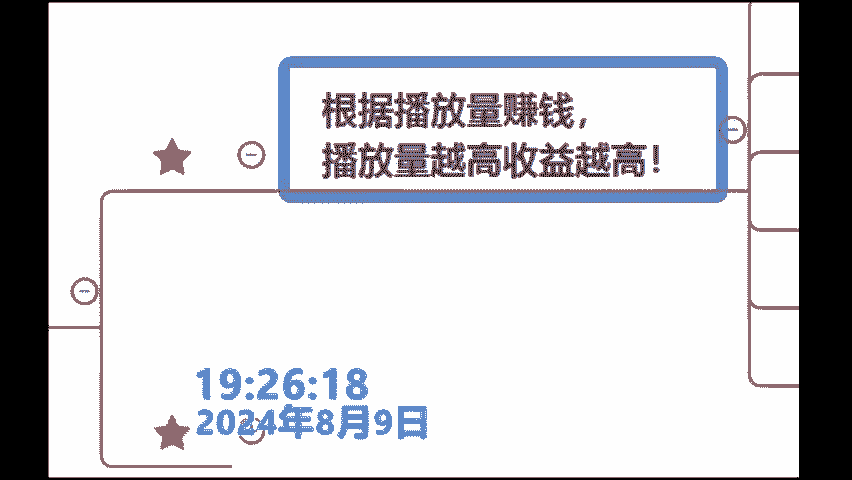

啊，感谢各位可以做游戏类呀，可以做游戏类哈。对，93年暑期的，感谢各位哈，感谢各位好好听课哈，没有收到钱，我会告诉你为什么你去做没有收到钱。而张老师我可以挣到钱的原因，好吧，好好听各位。😊。

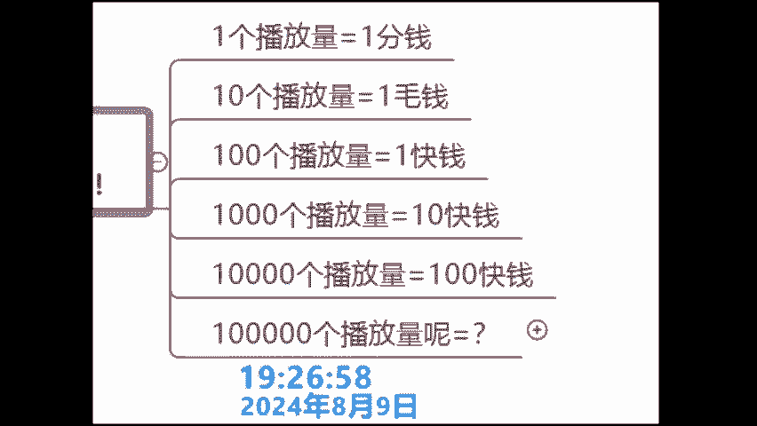