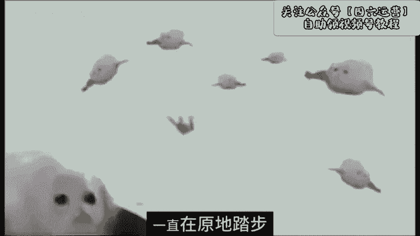
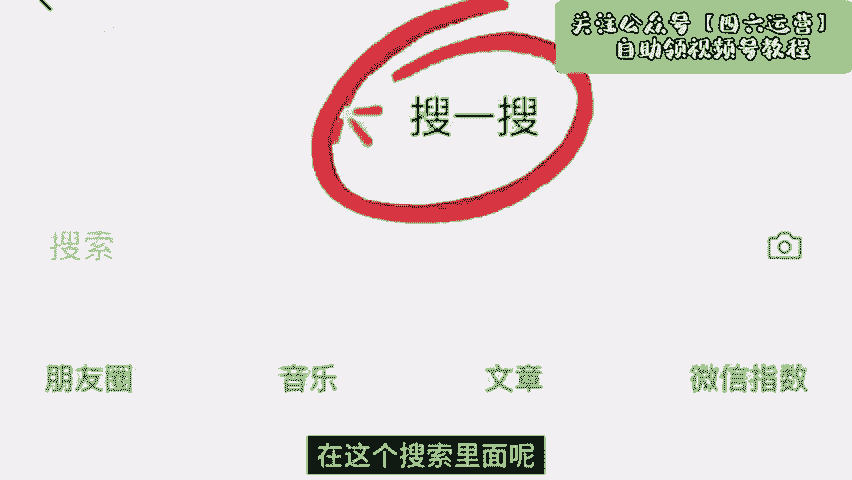
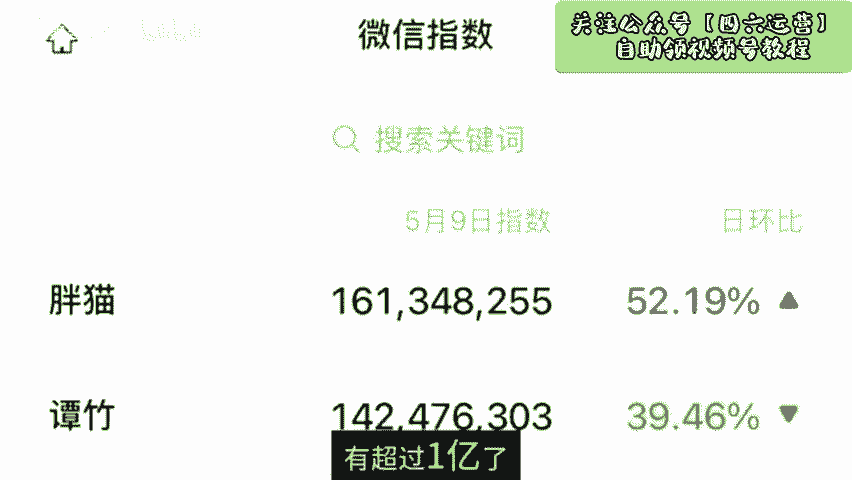
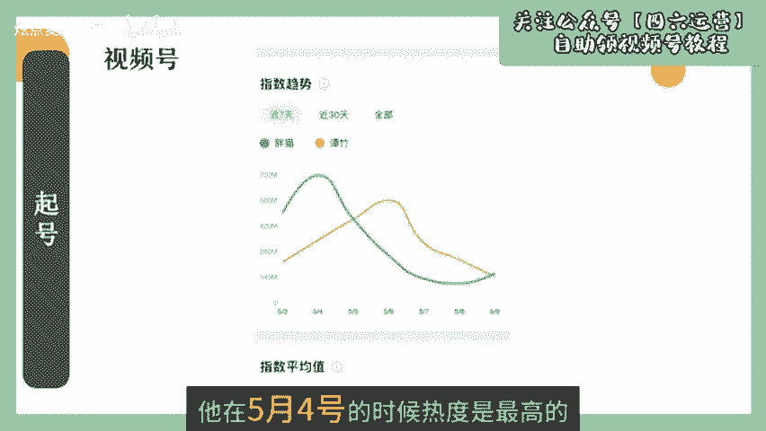
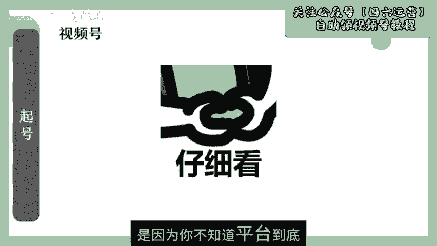
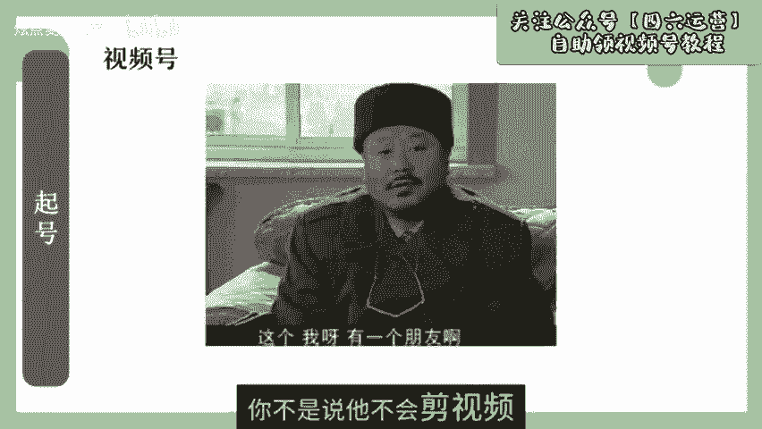

# 【2024版微信视频号运营教程】全B站最良心的微信视频号运营高阶教程合集！微信视频号运营 自媒体视频号起号真的不难！ - P1：视频号起号 - 炫点麦当当薯条 - BV1gmxMePEkF

🎼如果你的视频号已经发了超过10条作品，还是没有一条能够破半播放，那么先停一下，耐心看完这个视频再开始行动。先跟你讲三个做蝴蝶号爆款的思路。这是我从2020年开始做蝴蝶号，花了4年时间总结出来的。

本来团队呢是不让我去说这些的。但是真的不忍心看到很多朋友一直在原地踏步走无人工，今天呢决定分享出来。第一招就是巧用搜索指数，你有没有那种经历啊，就是本身看别人做的视频都爆火。

一般到蝴蝶号上去翻拍就是没有播放。你要清楚一点啊，蝴蝶号它不是第二个某音，它有自己的推流逻辑，那么怎么判断你这条视频内容能够在蝴蝶号上跑起来呢？你可以去搜一搜，里面找到微信指数，在这个搜索里面呢。

去搜索你的关键词。就比如说胖猫，截止今天的指数呢有超过1亿了。那么你再去看它的一个指数趋势。它在5月4号的时候，热度是最高的。这时候你去发关于胖猫的内容呢？它就更容易。😊。

🎼去拿到流量。那么现在你再去发流量就会差很多。那么你还不如重新去找一个趋势，一直在爬升的热点，做出爆款的概率就会大了很多。🎼第二，皮分完播率爆点前置。🎼一条视频能不能拿到好的播放数据。

那么它的玩播互动数据是特别重要的。如果你想拿到高播放，最好是让你的完播率保持在20%以上。

🎼我给你去看一个提升完播的方法，那就是爆点前置，把你的这条视频最精彩的地方放到视频开头，从而吸引用户观众看下去，给你们看一个视频啊。那天我偷了别人的橙子，被果脓抓个正着，他朝我挥挥手，让我滚出来。

我想我大不了就赔给他呗，他拿了一根棍子，有些生气，然后转身把我带进一个小屋里，但在这个小房子里，我才真正了解了他。这条视频呢就是把最有冲突的部分放到了开头，观众看完之后呢，就想知道后面到底发生了什么。

不自觉的就会把视频看完。😊。

🎼第三点就是提升认知，做话题引导的互动。这个该怎么理解啊？大部分人的账号没有播放量的原因，是因为你不知道平台到底要什么样的视频。还有一个数据就是互动，它分为点赞评论转发，尤其是评论。

你做的视频能不能引起观众的评论，是你打开播放量的关键。如果说你发一条视频，比如上是你自己坐高铁出行的视频，它是很难引起评论的。但是如果你在这个视频上加上一个戏剧性的话题，数据就会完全不一样了。比如这样。

我刚才给一个大姨知道不怕了。现在大姨上车走了。

一路平安。

🎼我操废了，我刚才给一个大，为什么？因为你给大家谈资，大家自然更容易在你的评论区进行讨论。大部分的人呢你不是说他不会剪视频，现在的剪辑都很智能化，大家也都会拍摄，也会会剪辑。

那么在他的认知里面就能做出这样的视频来。但是大部分人刚做短视频的时候，一定会遇到什么问题，就是他对短视频优质内容的认知不够。但凡你稍微提升一下自己的认知，播放量就会有一个质的飞跃。

所以短视频认知到底该怎么提升一句话，多刷平台的爆款内容，多看热点吗，多了解平台的极致规则。如果说你还是不懂怎么做蝴蝶号的话，可以去我主页看看。2024年如果说你还想入局视频号，但还不知道怎么去做。

我总结了一份视频号的灵分旗号指南。需要的话，可以点赞三连敲一下喜号。我们团队呢就是用这套指南实现了单视频一天涨粉1万多，拿到了百万播放。😊。

