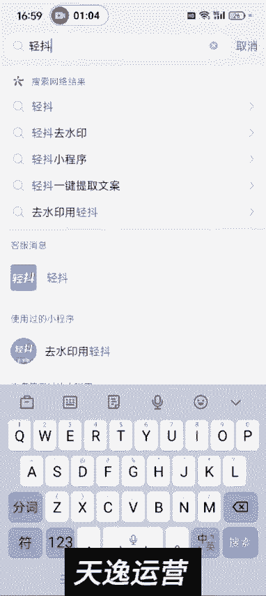
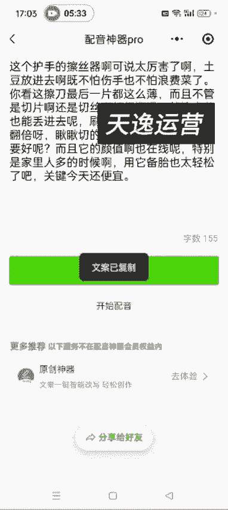

# 【2024版微信视频号运营教程】全B站最良心的微信视频号运营高阶教程合集！微信视频号运营 自媒体视频号起号真的不难！ - P21：2.视频来源 - 视频号教程17 - BV1ihyAYsE9g

嗯。好，各位同学大家好。这节课给大家讲一下如何搬运去水印和提取你这个视频里边的文案，就是我们。我们做视频号带货的话，基本上不需要自己去实拍啊，我们都是做搬运混检，然后如何搬运短视频，我们打开抖音是吧？

我们提供原创，打开抖音之后，你比如说你随便搜一个视频吧，比如说那个擦试器吧。就是用一，然后点视频。这个护手的擦丝器可太厉害了，土豆放进去。比如说这个视频是吧？我们如果想想用这个视频的话。

然后直接点这个箭头，然后点复制链接啊，然后点复制链接。我们回到这个微信里面啊，在你这个微信里面呃。直接搜青岛。去水印的这个工具有很多啊，青痘去水印。

然后点这个小程序啊。然后青抖去实验。然后点去水印，直接把你的这个。刚才复制的链接粘贴进去。然后一键去水就OK了啊。然后点保存到相册，它会提示让你看广告，然后我们去看广告，对方视频几次，留视频3。

看那个30秒的广告就可以提取这个文案了，就是提取就可以把这个视频去完水印了。其实那个去水印的工具有很多啊，我们直接在微信里面去搜索去水印这三这个关键词。呃，有很多很多这种免费的工具啊，都不需要花钱。

有的是需要广告，然后相对来说比较好用的就是青抖。然后关闭。这个时候点保存，这就OK了。然后你这个视频就去完水印了啊，然后我们可以在这发一下。这个护手的擦丝系得太厉害了，土豆放进去既不怕生手。

已经去完水印了啊。土豆你要是直接在这儿直接保存的话，既不怕伤手也不，直接保存的话，它是有那个水印的啊。他这个视频没有开着，就这个不杀手的菜。直接保存本地的话。他是有水印的。

有的视频没有没有开那个复制链接那个功能，或者说没有开那个保存的功能，大家就换一个视频啊。

就这个不伤手的擦丝器呀，我妈用了都夸我。你看这个视频，左上角和右下角它都有这个抖音的这个水印啊，所以说我们需要去一下水印。另外的话就是还有一个推荐一个那个配音神器这个啊。大家截图一下截图一下。

然后等一下我会把这个码放到那个这节课的这个下边这个评论区这啊，然后大家直接识别这个小程序，长按识别这个小程序，可以用配音神器，配音神器的话，它去水印是不需要看广告的。你像刚才那个青抖，它是需要看广告。

对吧？

呃，所以推荐大家用那个配音神器啊，擦丝器呀，我妈用了都。比如说这个视频我再换一个吧，就这这个护士的。然后复制链接。然后我们用过的小程序直接在这个微信的这个界面下拉啊。

他就可以呃你之前使用过的这个小程序啊什么的，直接在那能找找到，然后点这个去水印。然后点粘贴也行啊，或者说你直接长按长按这里粘贴也行，然后一键去水印。这儿可以预览，一般不需要预览啊，然后我们直接点保存。

这样的话就可以把这个视频的水印去出来了。你像刚才那个青抖，它是需要看广告的，但是配音神器pro这个它是不需要看广告的啊啊，这是一个配音的软件。然后它里面可以呃去水印也可以提取文案。

就是刚才还是这个视器啊，可是太厉害了啊。我们如果想用这个视频的文案和脚本的话，就直接复制这个链接，然后同样的道理啊，在配音神器里面去文案提取。短视频链接，然后确定。稍等一会儿，他这个文案就搞出来了。

然后配音神器提取文案的话，不仅是你这个从抖音、快手啊这些平台去，就是你自己相册里面那个呃视频，自拍的那自己拍的那个视频也可以提取出文案来啊。文章啊这些都支持。呃，然后我们是复制这个文案就可以了。

就可以用了啊，这个文案就可以用了啊，是吧？这个文案就出来了，是吧？然后这个。土豆放进去啊，既不怕伤手也不感接。然后这个青斗的话也是可以去水印的啊。但是青斗他是呃那个需要您。文案提取。需要你看广告的。

就是挺烦的。

你看他又让看广告是吧？所以建议大家去用这个配音神器啊，配音神器你直接截个图截个图。然后到你微信里边长按复制，不是长按识别这个小程序就可以了啊。

这个是那个去水印和提取文，这节课就讲到这儿了啊。