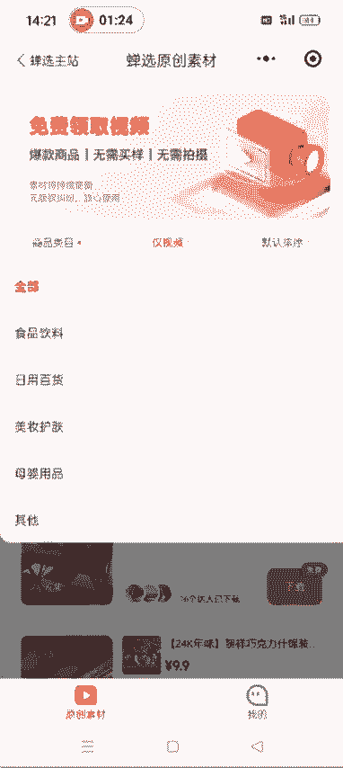
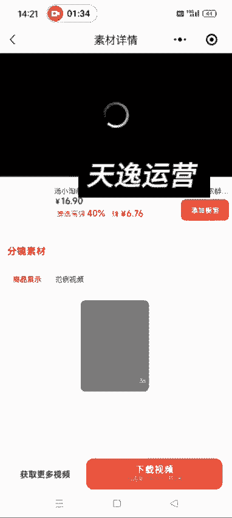
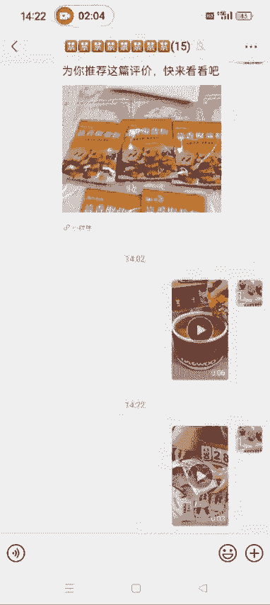
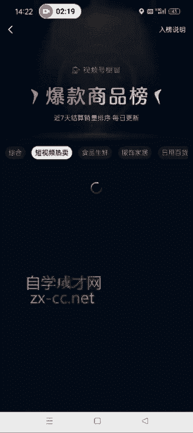
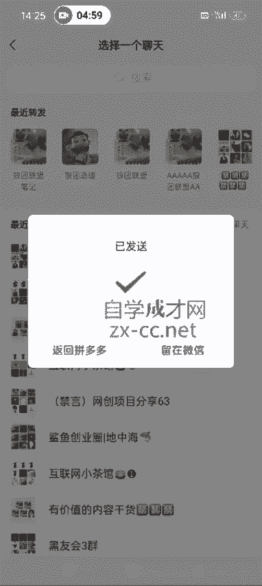
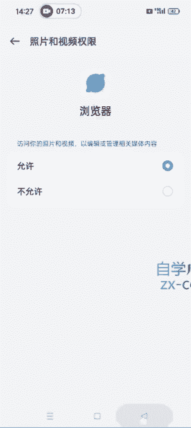

# 【2024版微信视频号运营教程】全B站最良心的微信视频号运营高阶教程合集！微信视频号运营 自媒体视频号起号真的不难！ - P28：1.如何获取原创的实拍素材 - 视频号教程17 - BV1ihyAYsE9g

好，各位同学大家好啊。这节课给大家讲一下我们如何获取原创的素材。呃，就是我们在做搬运混检的时候，可以把这些原创的素材添加进去，增加我们视频的原创度，对吧？然后视频号现在除了做搬运混检之外。

很多团队其实他们就是自己买样品自己实拍。但是我们要是买样品自己实拍的话，成本太高了啊，所以说我们就想办法找一些原创的素材。呃，因为都搬运的话，又像抖音快手，很多人嗯他那个点赞量高的视频。

其实很多人都已经搬运过了。所以有些团队他们就自己去做实拍。呃呃，做实拍的好处就是他视频号就是判你违规的几率就相对来说比较小嘛，基本上不会判违规，对吧？所以说我们呃也可以在混检的时候添加一些原创的素材啊。

原创素材的获取方式有两种。嗯，先讲第一种啊，就是直接在微信里面搜产选。原创素材。它跟那个配音神器，还有青抖啊，是一样的，都是都是一个小程序啊。我们点进去之后注册一个账号，然后就呃这个让他那个。

绑定一下抖音，然后就可以在这里面去选择了啊。就很多类目，食品饮料啊、日用百货、美妆、百货、美妆、护肤、母婴用品都有啊。

这个里面有很多很多视频，我们想用哪一个啊，直接下载就行了啊。比如说第一个对吧？我们点下载想想下载哪一个视频啊，就直接选择它，然后下载就行了，然后点下载视频。

这样的话就把这个视频下载下来了啊。嗯产选原创素材的好处是什么呀？好处就是说。你看这是刚才下载的那个视频，好处就是说它这个对。他这个视频拍的相对来说比较高清。高清啊就是专业的就是让这些达人用的。

它比较高清。不好的一点就是它那个里边素材相对来说可能比较少。我们一般做带货的话，就是根据视频号的选品中心里边这个爆款榜，选品中心它不是最上面有一个爆款排行榜嘛，然后有一个短视频热卖。

这个里面哪一个卖的好，我们做纯视品带货的就可以直接带这个东西啊。比如说他第一个村庄农品，对吧？你想带这个带这个视频，我们就可以呃就是先带抖音或快手去根据这个村庄农品。蒜香椒盐粉这个关键词去搜索视频。

然后下呃去完水印之后保存下来，然后再去混剪。混检的时候加上一些我们这个原创的素材，原创的素材。第二种获取方式就是说我们直接在淘宝或拼多多的这个买家秀里面去去找啊。我们打开淘宝。就是搜这个爆品啊，森庄。

农品的蒜香椒盐粉，然后里边不是有很多嘛，对吧？比如说我们点开以第一个为例啊。然后直接到他的评论区。找到有图和视频的这种。比如说这个对吧？像这个我们可以把这个买家秀实拍的这个视频下载下来。

作为我们的原创素材啊。然后他这个淘宝的这个买家秀里边这个视频，电脑版的有很多软件可以下载。但是手机版的我找了好多都不行啊，所以我们可以通过录屏的方式去把它这个视频录下来。然后点开这个视频之后。

进入清屏模式啊。嗯，点一下点一下旁边，它就进到清屏模式了，记得把这个声音打开，然后再去录屏啊。把打开声音打开再去录屏，知道了吧？啊，这个是淘宝的这个评论区原创素材的获取啊。还有一个就是拼多多。拼多多。

我们相。呃，那个方法一样，也是搜这个爆款排行榜里边，你想搜哪个，直接在拼多多里面去找。然后比如说这个对吧？点开了一个之后，我们还是在评论区去找啊图和视频往下翻。

比如说这个。60年。这个拼多多我们就不需要录屏了啊，然后他这儿有一个分享，你要录屏的话也录不了，因为它有这个字幕也进入不了这个清屏模式啊，我们点分享，随便发给一个微信好友。或者说你自己建的这个群里面啊。

发送，然后留在微信。点开。点开之后啊。这个时候可以。这个时候就可以进到清屏模式，然后我们再去选择录屏啊。我这儿现在正在那个给大家录课，我就不给大家演示了啊。录屏的话手机上都自带这个功能。

就直接把它这个呃买家秀录制下来。然后我们呃混剪的时候可以把它这个视频添加进去，一般选择的这个视频啊，你看它这个就是横着的啊，需要横过来，我们一般就选择竖屏的模式就可以了啊。啊，我这儿就是给大家演示一下。

明白了吧？啊，这是一个是那个把他这个评论区的视频。发送给。发到微信。第二种这个保存方式就是复制它这个链接，打开QQ浏览器，必须是QQ浏览器啊，其他的浏览器不行，必须是QQ浏览器。然后我们打开QQ浏览器。

把这个网址粘切进去。然后进入。这个时候再去打开它这个视频。打开视频之后，这个时候右下角有3个点，看到没有？然后我们就可以点下载了，确认下载。这样的话。这个视频就可以下载到我们的这个手机相册里面啊。

你看这是他那个视频。就下载下来了。如果说你的QQ浏览器啊，它。下载的这个视频不能保存到你的相册里面，呃，剪映也好，秒检也好，或者说其他的也好啊，就是你们弄的这个视频，它保存不到自己的相册里面。

我们打开设置。有一个应用管理啊。应用应用管理。把他那个权限打开啊，记得把权限打开。有很多人问过这个问题啊，我给大家说一下，这儿有一个权限管理，不同的手机，它那个权限管理是不一样的啊。嗯。

你我这个是oppo的。然后把这个让他允许就可以了啊。让他允许到时候你保存的这个视频，它就可以直接保存到你的手机相册里面了。

啊，这个是两个原创素材获取的方式，一个是这个通过。嗯，产选原创素材。另一个是淘宝或拼多多的评论区去录屏，或者说直接下载啊，建议大家用拼多多啊。这个可以直接保存，不需要录屏了，就直接保存。

通过QQ浏览器再下载一下。好吧，这是我们这个原创素材。原创素材获取了之后，就是我们后续剪辑的时候可以用得到啊。嗯，下节课我给大家录，就是我们如何发布一条带货视频啊。嗯。

那个时那那个时候我在讲如何把这个原创素材剪到自己的这个。呃，搬运的视频里面啊。好，这节课就录制到这儿。

