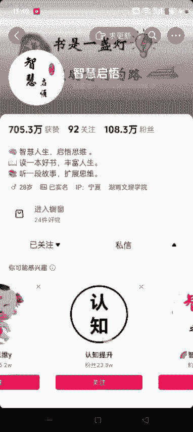

# 【2024版微信视频号运营教程】全B站最良心的微信视频号运营高阶教程合集！微信视频号运营 自媒体视频号起号真的不难！ - P32：1.如何找书单类的对标账号 - 视频号教程17 - BV1ihyAYsE9g

我还。好，各位同学大家好。这节课给大家讲一下我们做短视频如何找对标账号，如何在抖音找，就是呃跟我们这个想做的这种账号类似的这种账号。你比如说你想做渔具的账号，你肯定是在抖音去搜相关的渔具这个关键词。

对吧？然后你想做呃玩具类的，你就搜某一个玩具，然后你想做书单的话，那肯定是搜书单这些关键词，对不对？然后我们搜出来之后，然后比如说找到一个账号，你看到这个账号，这个视频类型是你想做的。

它也不是真人出镜的这种。然后你你觉得这个账号可以，后期你想做这种想模仿的话，然后呃如何找到更多的跟他类似的账号呢，除了我们一个一个刷，另外的话，还可以通过这个关注去找啊，呃两种方法。

第一种方法就是我们点开这个呃账号的头像，先不要点关注。然后进来之后先看看他这个视频看看。是不是呃跟你想做的类型差不多相符。如果相符的话，然后我们在这儿点关注。点关注之后，他立马会下面弹出一个。

你可能感兴趣这些账号基本上都是跟这个你关注的这个账号，他这个抖音官方给他打的标签都差不多啊，就是跟他这个账号类型类似。然后我们就点进去看一下他这个作品是不是你想模仿的。

如果是你就点关注。如果不是，然后返回接着往旁边滑。这个世界只有华人没有杀过犹太人，所有的民族人种都杀过犹太人。哎，如果这个也差不多的话，一看他也是卖书的对吧？然后进到橱窗一看卖的也不少，卖了6万多了。

对吧？像这种的，我们就可以直接去点关注。然后关注的话，相同的道理，它下面还会出来很多。这样的话呃，你不到两三分钟是吧，你就可以关注几十个类似的这种账号。后期的话你刷抖音，他就会给你推荐相同的这种账号了。

知道了吧？这儿是一种寻找方式啊。

然后看他这个作品什么的啊，都可以，然后我们就点关注就行了。点了关注后面就直接参考这些账号就可以了啊，这是一种方式。第二种方式就是滚去，你比如说你想嗯买卖哪一本书，对吧？书名就行。

然后我们打开截省你最打开抖音，然后直接右上角搜索。

呃。就比如说搜这个墨菲定律漫画版吧，搜这个。

搜到这个之后后呢，这个是特别它这个首先出来的是综合，我们点商品。我们点击商品，点击商品之后，我们点销量。🎼这样的话他筛选出来的就是销量最高的这些啊，我们可以直接进到这个店里边去看。有的时候会弹出直播。

我们不看直播啊，我们就看一定要红亮，别逃避，就进到他这个店儿。进到他这个店儿，看他推荐的这本书啊，一般这个销量呃在2万以上的这种啊，他那个商品你点进去之后，它都有一个达人秀和买家秀。啊。

然后这里面你看解妈说育儿育儿智慧。木木妈咪是吧，像这种的全部都是你想做的这个想模仿的这个视频。呃，跟他类似的这种视频类型也差不多啊。我们随便点开一。你看。他也是卖书的对吧？已收14玩家。

可以看看他的这些账号类型，全部都是呃影视混剪啊，或者说某一个电视剧啊，这些或者说名人语录混剪出来的啊，作品也不多，但是销量挺高，像这种的账号我们就可以直接去模仿啊，这是两种找这个对标账号的方式。

一个是通过那个点头像进去点关注，另一个就是通过达人秀，达人秀里面就会出来很多很多账号。你看看全部都是他这个达人秀，这不是592个视频嘛，是吧。

这就说明有500多个账号。那你说我们做这种类型的视频，他还缺这个账号吗？切。而且基本上视频的这个类型啊什么的都差不多，而且他也都是卖书的，其他的品道理类似啊，就是通过这两种方式去找对标账号就OK了。

好吧，这节课就录到这儿。