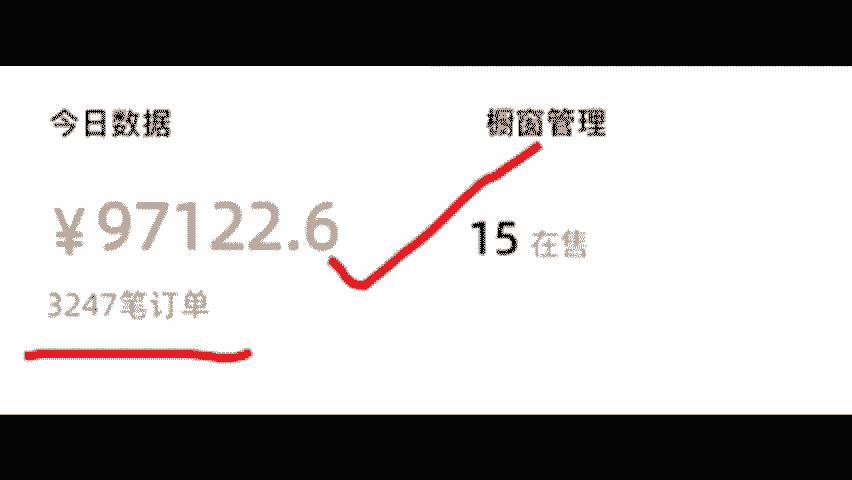
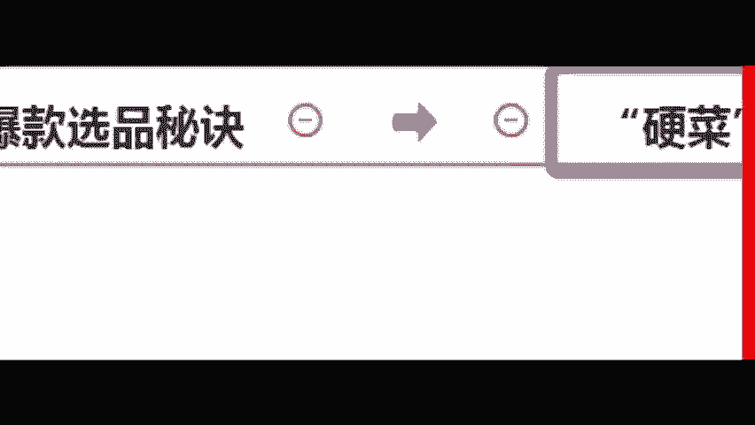
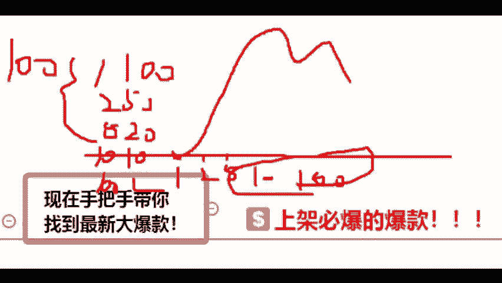

# 【2024版微信视频号运营教程】全B站最良心的微信视频号运营高阶教程合集！微信视频号运营 自媒体视频号起号真的不难！ - P37：21.不出单的原因 - b太和 - BV1cLsre3ERa

所以说还是那句话，鬼，你要搞清楚，那一天卖3000多单，一天能够挣到9万多块钱，难道仅仅只是运气吗？就没一点技巧，没一点干货吗？各位那话怎么说的？外行人看热闹，内行人看门道，好吧，各同学道规矩。

你给老师把新花刷起来。那今天张老师，我如果没有两把沙子，官方怎么可能邀请张老师，我来讲课啊。包括张老师，我自己到底专不专业，你自己去看好不好？来，各位同学看清楚啊，那今天张老师，我既然来了，我也不藏着。

我也不噎着，这个原因在哪里呢？就在于我们爆款选品的一个什么？😡。

蜜月贵。那刚刚张老师，我是不是带大家去做一个什么东西呢？各位同学刚刚张老师，我是不是大家做一个点，做一个什么东西呢？就说我们在进行一个什么上架，各同学是还是不是好吧，来各位同学我们看一下。

我们刚刚找到了我们的什么带货中心，是不是找到了带货群中中心之后，来点击了什么东西呢？来，我们再去选品是吧？然后我们去上架了这些产品，各位同学是是不是有没有影想的有的话，打个有字，嗯。😊。

看到没有？就是说卖了1。5万单，还是个小爆款。你像这个来各位，你说月销149，我打150单，那是不是一天才卖5单呢？同学，你告诉我，像这样的产品，你上的，你上架之后，你能挣到钱吗？你能卖得出去吗？对吧？

你像这个洗衣液也是一样的，月销149单，对吧？你像这些少的，还有这种是吧？月销54单，我就打算60单，一天卖两单，你说你是这样的产品，你怎么可能赚得到钱呢？同学，你们说是还是不是嗯。😡。

是的话，给老师打上一个数字机呀。所以说今天我告诉你，张老师，我既然来了，那我也不藏着掖着，对吧？我接下来给各位同学直接上一道什么硬菜，什么叫硬菜来？

同学看清楚张老师我会在现场手把手的教大家找到一个什么最新的一个什么大爆款同学。什么叫做最新的大爆款的？同学，你听好了是。😡。

还是什么东西？来是上家必爆的一个大爆款。各同学，你们信还是不信啊？各位同学信还是不信？来信的话，把薪子打过来，不信的话打不信。各位同学，你看清楚什么叫做上家必爆来跟同学，而且是大爆款哦嗯。😡。

信是吧？okK好好听接下来给你们讲一个干货啊，这点很重要啊。首先各位我们一个产品啊，它一般从上架啊到卖报基本上是长这样的个图啊，可能是这样子的，不管了，好吧，各位什么意思？

那这个时候那这个地方可以有一个人在卖啊，过了一会儿在这个地方啊，发现这个好卖，两个人来卖，这个地好卖，来5个人就过来了啊，后面后面10个人呢，100个人那，这样大家能不能理解，能的话。

给老师打上一个数字一。😊，嗯。😊，能吗？OK啊，能理解啊，这下给大看一下，那同样一块蛋糕啊，比如100块钱，那一个人分一人分数分100。😊，两个人分一人分50对吧？5个人分一人分分20。

那10个人分的话，一人就分10块。那100个人分，一人是不是分1块钱？这个逻辑大家能不能理解？能的话，给老师打上一个轮字。😊，嗯。Yeah。年解吗？好，能就OK了。好。

那接下来这个就是为什么啊你们不挣钱的原因。因为你们是在这个时候进来的，那是不是竞争很大呀？哎，对，要做第一个吃螃蟹的人，好吧，那现在大家知道原因了吗？来知道的同学打知道。😊，嗯。

现在大家应该知道为什么你们挣不到钱吗？就是因为你们啊入局的时候太晚了OK。😡，好，知道原因呢，接下来我们要想，那我们怎么挣到这个钱呢？那只有一个办法，就是我们更早的进来，对吧？我们在啊只有一个人的时候。

再早一点的时候过来跟同学，是不是来试的话，打个式字。这个时候我们可以讲的慢一点啊啊这个时候我们要讲的慢一点。因为这一点啊很关键。😡，啊，很关键，听到没有？OK啊，很关键，是对不对？好。

那这个时候到底有没有这样的东西能够让我们直接找到这样东西呢，是不是这个道理，对不对？我们得找到这个东西啊，各同学，你们说是还是不是？😊，啊，好，那现在就是一个很核心的观点。

来有没有这样的东西让我们能够啊找到的东西。😡，啊，大家觉得有没有直接有的话，大家有没有的话，大家没有对吧？有没有这种东西。😊，各位嗯，那肯定是有的嘛。如果没有的话，张老师，我今天会给大家讲课嘛。

那不存在的，对不对？是不是好，各位同学听好了啊，这个东西叫什么？它就相当于什么呢？各位同学就比如说大家呃这样给大家举个例子啊，就比如说各位对不？让我们出去打麻将，各位同学，那我们出去打麻将的时候。

如果说我们能够透视到别人的一个什么数据啊。😊，啊，我们能够透视到别人的数据。那么各位，你说你这一次出去打牌，你是不是必赢的啊，是还是不是来试话打个试试，这个时候比较慢呢。大对好好听哈，不晚不晚。嗯，好。

各位同学啊，这个逻辑懂吧？所以说我们现在就可以有这样的一个数据干什么，直接套视别人的一个数据，各位同学你看好了啊，你看好了，怎么去透殊出去下，来这个东西叫什么？这个东西叫我们的一个什么爆款参谋，好吧。

哪个同学就叫我们什么？😡。

爆款参谋这个东西它到底有多神奇呢？各同学我跟你们讲啊，它的神奇之处在于什么？我们可以透视别人的一个数据，就要我们去打麻将，我们看到别人的牌，我们不仅能够看到别人这个他发这个作品的播放量。

我还看到他这个作品是卖了多少单，以及人家这个作品是什么时候发布的来个同学就是这么的神奇。各同学想不想看来想看同学给老师我把鲜货刷起来。所以今天张老师，我带你长长见识。各位啊，给大家看一下爆款参谋。

他到底长什么样子。好吧，各位同学，你看清楚。😡。

