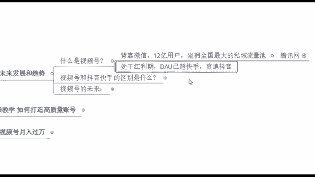
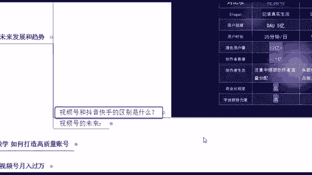
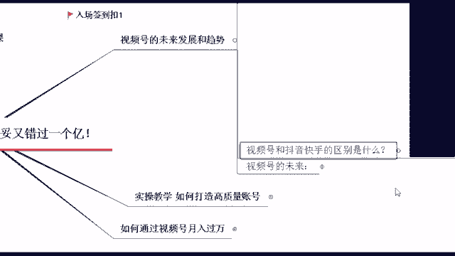

# 【2024版微信视频号运营教程】全B站最良心的微信视频号运营高阶教程合集！微信视频号运营 自媒体视频号起号真的不难！ - P4：2.视频号未来发展趋势 - 视频号运营教程2024 - BV13yxKetEFR

啊，首先来看一下，就是我们视频号的未来发展趋势是怎么样的。当然现在的话短视频行业内比较火的是抖音和快手。那这个的话呢也就能够看见视频号，它的一个潜力所在了。

等你等到大家就是都在哗啦啦的刷这个视频号的时候，那你这个时候再去做，肯定就晚了啊。所以说我们先来简单的看一下视频号哎，到底是什么东西，他现在能够给我们带来什么样的一些好处呢？之后我们做这个东西。

你首先自己要去会去刷一下啊。好，视频号，它是现在哪个平台下面呢啊，背靠微信，是不是它的背后是腾讯爸爸，是不是抖音，它的背后是字节跳动。那你像腾讯的话，它也是想要去分这么一杯羹啊。

所以说你像视频号它背靠微信，它的一个优势就在于它有什么全国最大的私域流量去坐拥12亿用户。你想一下12亿人，是不是微信用户截止目前12亿人。啊，我们中国最不缺的就是人了，一看都是人。

你看什么你做什么你都行。😊，但是一看没有人的话呢，做什么都不行呢。所以说人流量，这个才是商业的一个本质啊。你想一下你有人啊，你的东西你才卖得出去，不管你是卖什么产品，即使你是呃拿的是金碗和银碗。

那你要是在沙漠里面你也卖不出去啊，想想这个问题啊，所以说这是我们现在它的一个比较好的一个点就在这儿，它是坐拥全国最大的私域流量值。当然这个也不是说我受伤而已啊，给大家来看一下，我们现在腾讯网官方的消息。

你看2021年微信的月活跃数量已经达到12。682亿。有没有看到。😊，啊，这就是他当下的一个用户量。那其实现在在现场的同学的话呢，嗯可能不止你自己，你的手机里面，即使没有QQ，也一定要有微信。

包括你家里这个爷爷奶奶，他们也开始用这个微信了，很方便。所以说这就是他现在的一个用户量啊，是比较多的那同时的话呢，他现在是处于一个红利期，你们还记得是什么时候开始玩微信了吗？记不记得你想一想啊。

他现在处于红利期，他的DAU已经超了快手直追抖音，什么叫DAU。😊，啊，就是他的一个日活用户，每天有多少人会去用这个视频号呢？用微信呢就这么多啊。所以说这个的话一会儿给你们看一下这个微信。

它是从12年开始创立的，到现在的话，整整是10年时间吧。视频号它其实是从2020年的年底悄咪咪的上线的。😊，哎，那一个行业它的生存和发展大概也就是需要经历一个十0年时间啊，这个我跟大家说一下吧。

其实像我们整个行业，不管你是短视频行业啊，还是说直播行业啊，还是说你其他之前遇到的金融行业啊、保险啊等等这一些啊，它都是去需要经历一个十年时间。那一般来说在行业内第一年第二年的时候，它是成为一个起步期。

在这个阶段呢，核心工作一定是找方向啊，在这个阶段的话，一般它是技术人员涌入。然后呢，在里面去呃找方向，我应该去把怎么样去把这个东西给做起来搞事情嘛。那你在这个时候你去进入行业的话呢。

呃咱们作为普通人来说，我是不建议的。好吧，因为这个时候你如果说没有技术的话，你去里面只能看个热闹了。那你到第三年第四年甚至你到这个第七八年你再去进去的时候，越早入啊，越有更多的一些机会。

因为这段时间的话呢，它就是一个发展期和扩张期。当然在这几年当中的话呢，也是获取红利的最。😊，最佳时期啊，这个的话如果说你是越早了解到啊，越早入啊，当然你像最后两年，你到这个第九年、第十年。

你再去等人家这个东西已经完善了，已经成熟了是吧？你再去做这个东西。😊，不行了，这个节点已经变成红海了，红领期它就过去了嘛，是不是你再去的话，相当于什么吃冷饭了啊。所以说你想一想，我们现在刚好是视频号。

它发展第几年。😊，第几年是不是刚好是第三年啊，腾讯他到底想干嘛呢？讲白了，他肯定是想搞事情啊，他就是像我说的，他想跟这个抖音啊，跟字节跳动啊，去跟他去对标，去跟他去什么吸取这么一波流量。

他也想要去抓取一波创作者，那也正是给到我们绝大多数普通人啊，给到我们机会的时候了啊，那这个也是为什么？就是我非常支持大家，你要去什么抓住一些我们互联网当下比较新的一些东西啊。好，那当然说到这个视频号。

有的学说老师这个就跟抖音快手一样，我这样那样去发视频不就好了吗？来，我先问一下吧，就是咱们现场的同学，你们是零基础还是有基础的同学。😊。

零基础给老师打个零，有基础打个数字一啊，扣零的好多啊。那咱们现场大部分都是这个零基础。嗯，我今天就讲细一点吧，咱们有没有这个已经在其他平台做过的，有个别第一次知道好，那我想问你个问题啊。

现在你觉得这个抖音和快手好做吗？好不好做啊？😊，不好做了，是不是是不是感觉这个抖音快手它已经人才济济了。你再去里面想要去分一杯羹，真的很难。你像现在抖音快手它的商业化气息很严重啊，动不动一个广告。

一个带货。那其实相对比起咱们的这个视频号来说，你会发现他好像比较干净一点，就没有什么太多的一些广告啊，没有什么带货这些的对吧？商业化气息没有那么严重啊。

所以说这个是我们现在就他当下的一个能够看得到的一个发展趋势了。呃，当然刚刚这个扣一的同学的话，如果说你是有账号的同学，其实你再去做这个视频号，你有这个经验的话，你会有更大的一些优势。

因为短视频它的规则像埋了都是共通的。好比啊你去爬山啊，如果说你这座山你以前爬过，你登顶过，你再去爬一遍，是不是会更加的轻松一些，你只要在哪里可以歇一脚啊，哪里可以磕口水休息一会儿是吧？

后面的话要么这个爬陡坡了，那我可以续一段力了，是不是所以说你也可以更快在咱们视频号这里去获取一波流量啊，😊，这样就是赚钱的本质嘛。好，那刚刚这个咱们绝大部分扣零的同学，对于小白同学来说呃。

从来没有接触过也没有关系啊，因为平台它的包容性是非常强的。现在平台本身它也在支持呃，就是没有基础的创作者，可以让你们更加拥有更多的一些流量。同样的我非常坚信一句话，大家都是两个肩膀扛一个脑袋。

别人可以的话，你为什么不行呢？千万不要怀疑自己啊，不要给自己设限，这个我今天就是详细的跟大家讲的。😊。

