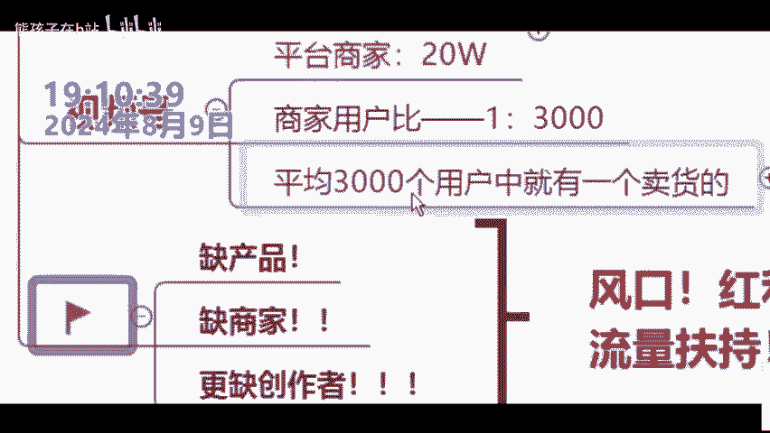
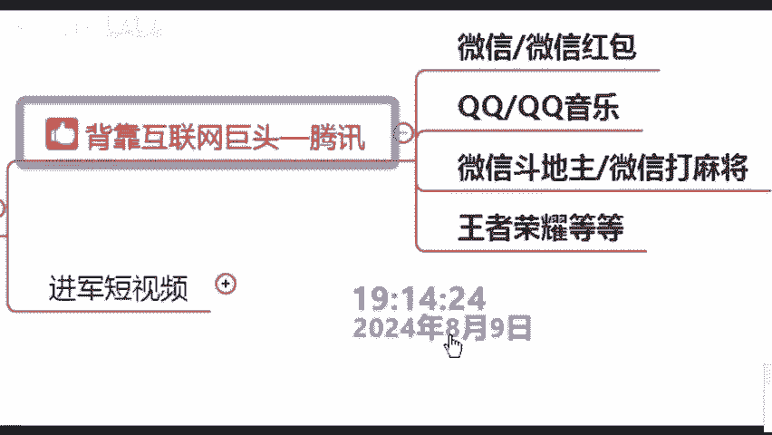

# 【2024版微信视频号运营教程】全B站最良心的微信视频号运营高阶教程合集！微信视频号运营 自媒体视频号起号真的不难！ - P5：2.如何把握风口 - 熊孩子在b站 - BV16L1qY4ELh

那各位如何去把握我们这个风口，我们来看一下啊，来看一下我们视频号的一个独特的优处，总共有4个点，哪四个点呢来好好听。第一个点，门槛低和咱们的什么竞争小。各位啊，你作为一个新手。

你肯定要找一个门槛低一点的嘛？对不对？那这样的话才好入门呢？我们看一下视频号的门槛到底有多低啊，我给大家看组数据，好吧，各位，首先我们来看一下抖音抖音的日活用户多少呢？是咱们的这个9个亿，听见没有？

商家有多少呢？有咱们的什么9000万，商家用户比是多少呢？那1比10。也就是说平均10个人当中有一个人就是咱们的卖货的，说明什么竞争非常之大呀，我们再看快手快手呢少一点那，但是有4个亿的4个亿的用户啊。

平台上家有5000万，商家用户比呢是1比8，什么意思。也就是说平均8个用户当中有一个是咱们卖货的那竞争是不是也不小啊，各位，那是我们再看一下视频号，视频号的日活用户是多少呢？是咱们。😊，来。

我来看一下啊，来各位，这位叫安哥的同学啊，这是放的录音，大家不要打字。来。各位今天是不是2024年的8月9号晚上的什么的呢？7点09分呢，各位是还是不是对不对？我的确知道很多同学现在干什么呢？同学啊。

有一些不法分子啊，在陆张老师我的课程，对不对？好吧，括是还是你看一下吗？对吧？所以包括来各位同学，你看清楚嗯。😊。

来，各位，这是不是我们的摄像头，你自己打开一下。来，各位，如果说不是现场直播，你能看到这些同学吗？来能够看到张老师的同学来给老师，我打上一个数字，一能看到吗？各位坚持到底呀，安阳啊。

包括这个安哥同学是还是不是。😊，能看到吗？来，各位同学，大家晚上好，可以看到吧，是不是？😊，所以说各位啊不排除一些不法分子啊，好吧，所以说各位。😊，看见了就行，对吧？张老师我自己从来就做直播的，好吧。

各位，那同样的好吧，来各位给老师，我把鲜花发起来。😊。

那这样的一个同学我只想告诉大家，对吧？别人怎么做，我不管。但是张老师，我这边都是现场直播的啊，好吧，OK来各位好。😊。

刚刚给大家讲到一个什么东西啊，讲到了我们2024年对吧？我们视频号，它做一个风口，它为什么是风口。来，我们来看一下视频号的用户说算呢？是不是咱们6个亿啊，但是人家的商家却只有20万，听见没有？

商家用户比是咱们的1比3000，平均也就是3000当中人当中只有一个人是咱们卖货的，各位啊，那说明什么？说明我们2024年的视频号，它就是一个缺产品，缺商家更缺创作的一个状态。

那么各位是不是我们平时所说的的一个什么风口口一个红利期啊，来跟同学是还是不是，对不对？所以说我跟大家去讲啊，我们2024年的视频号啊，它就相当于1718年的一个什么抖音啊，贵同学啊，什么意思？

啊什么意思？那你知道当年1718年抖音有多好做吗？贵同学就是这个样子，听懂没有啊，我不知道大家身边有没有之前有朋友去做过。😊。

啊互联网的来酒的话，给他打个有字，好吧？那我看到这位什么幸福一家人同学老师，我的朋友啊就是做互联网还清了这个账，还买了咱们的一个什么新房子啊。各位所以说我跟大家讲啊，张老师，我一直坚信一直什么意思呢？

学习啊，他一定是可以改变我们的命运的，跟学认不认可来认可这句话的话，你给老师打算认可两个字。各位对吧？为什么张老师我会认可这句话了，因为张老师我自己是农村出身的啊，对吧？

我是在部队这两年啊才接触到我们的互联网，那不然的话，张老师我不可能从事这个行业，听见没有啊，学习改变了张老师我的命运，那各位也是一样的，你们之前可能不知道对吧？没有做没有关系，对吧？你今天来了。

你今天学习了，那我相信就可以听到没有？所以说各位你错过了抖音没有关系视频号还有这个机会，那么我想问一下各位同学你说风口出现呢？来风口再一次出现呢？各位要不要把握住啊来要的话，你给老师打上个要子，对吧？

所以说你以前不知道张老师，我告诉你嘛，这是。😊。

的第一个点对吧？门槛低啊，然后我们再看第二个点。第二个点什么东西呢？就是咱们的一个什么竞争少啊，对，不是庞大的流量啊，门槛低，竞争少。各位为什么我要给大家讲这个东西啊，各同学，你要搞清楚一个事情。

新手同学对吧？你们做我们的这个互联网其实最担心的一个东西什么东西呢？是不是。😊。

就是没有流量啊，就是流量少啊。包括很多学说老师我这个涨粉比较慢呢，对吧？老师我这个这个播放量比较少，说白了就是没有流量嘛，对吧？比如说我们看抖音对吧？你会发现抖音虽然很庞大。

但是你做抖音它就是抖音最大的问题啊，它就是没有流量。各位不是说抖音这个平台没有流量，而是你们做没有流量，怎么说呢？新手呢你分不到流量老手呢你要干什么呢？老手的话，你不花钱，你根本也是没有流量的。

各同学啊，是不是没有流量，对不对？但是各位如果说你玩我们的视频号，根本是不缺流量的。为什么让？同学看清楚啊，首先呢微信它是有13。36亿的一个用户基础的那很多人会说老师啊，这个微信13。36亿。

跟我这个视频号有什么关系的？来跟同学肯定是有关系的来我给大家看一个东西啊？首先各位你看一下这个是什么东西啊，我不知道这个画面大家熟不熟悉啊，来熟悉同学。

你给老我打上一个什么数字一啊各位那这个是不是我们自己的一个微信的朋友圈。😊，那看到没？就是朋友圈在朋友圈正下方是不是我们的视频号啊，包括大家平时来蝴蝶号。

看到没有这个想象到蝴蝶就是咱们的一个什么啊视频号。那视频号是不是在朋友圈的正下方，也就意味着13。36亿的微信用户其说白了就是13。36亿的视频号啊，听到没有？所以说看到没视频号多好，位置很好。

在朋友圈的正下方。第二，它不用下载软件呢？抖音快手小红是不是要得下载一个APP但是视频号根本不用，听到没有？所以说这就是它的一个什么优势啊，听到没有？而且贵同学你要搞清楚一件事情什么事情呢。

就是视频号它背后的公司是谁呢？是腾讯加公司来知道腾讯公司打知道不知道话不知道腾讯家公司可能很多同学啊说名字不熟悉啊，但它的产品我相信贵同学你们200是用过的，比如说现在大家所用的微信啊，微信红包啊。

对吧？微信的斗地主呀，打麻将啊，贵同学听到没有？是包括小朋友玩。😊。

王者荣耀啊，有的同学知道对，是一样的。腾讯这家公司对吧？那腾讯他今年为什么要进军打的视频很简单嘛，因为他看抖音挣钱，他也想挣钱嘛，对吧？第二的话，就他现在他如果说不抢占市场就会有吞并。我跟大家讲啊。

腾讯它不是第一次进军打视频了，之前他搞了个软件叫微士啊，没搞起来，这一次我告诉你，他卷土重来，对吧？他只许成功，他不许失败，听到没有？啊，各位，而且我给大家看一下啊，刚刚我跟大家去说的13。

36用户基础还是今年年初的一个数据，来什么数据呢？来同学看清楚。😊。

这个呢是我们互联网上非常有名的一个。啊，网站叫钛媒体APP没有？这是在2024年1月10号发表的咨询数据，听到没有？2024年大厂开始卷咱们的社交了。各位在我们今年年初的时候。

微信的注册用户已经达到了13。36亿。那现在是2024年的8月9号呀，已经进入下半年了，现在14个亿是没有任何问题的各位那你告诉我这14个614个亿的用户，对于大家有不友好啊，来觉得友好同学。

你把好字给到师我打在公屏上了，看到没有？14个亿的流量给到各位同学，你是根本不缺流量的除此之外呢，他还有一个非常强大的推荐机制啊，这个叫什么？我们把它称之为的裂变，我们把它称之为裂变。那裂变这个词啊。

你是一个专业术语，可能大家不是很懂。张老师，我简单给大家解释一下，你就明白了，好吗？😊。

