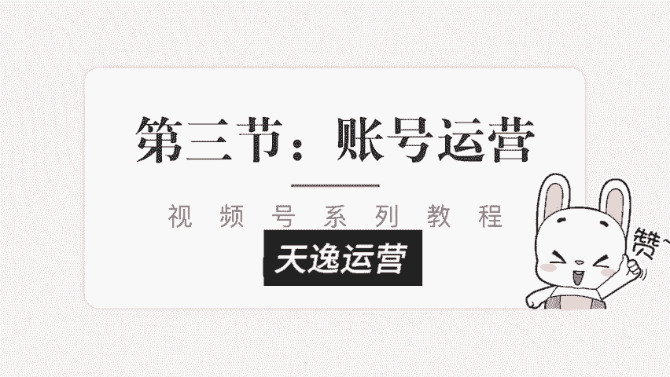
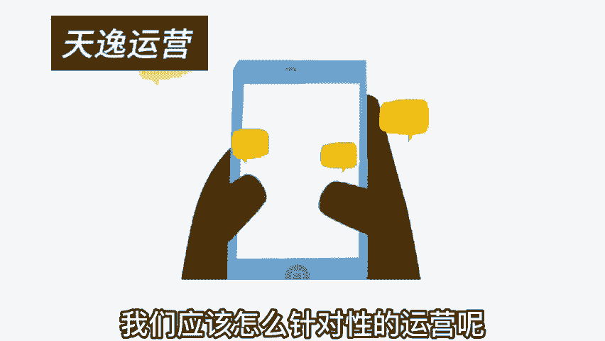
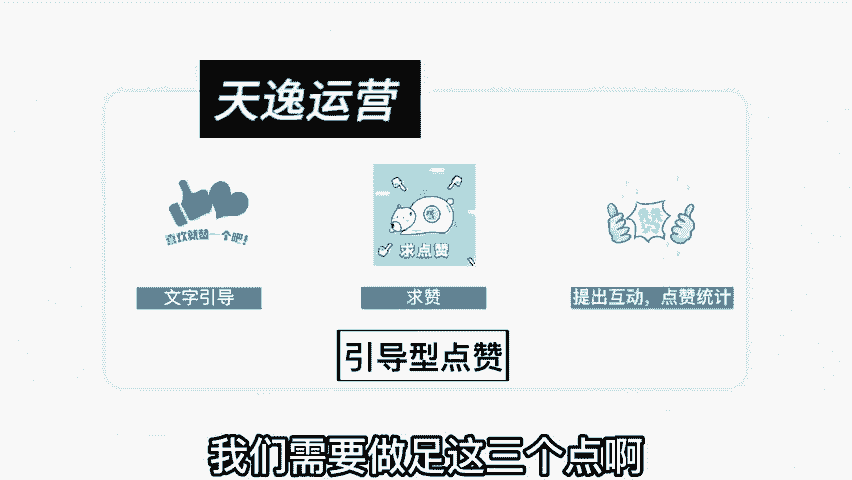
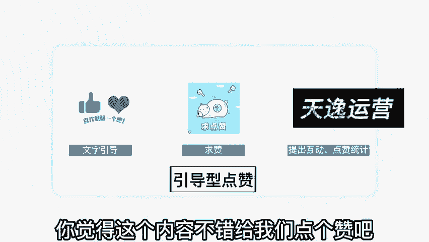
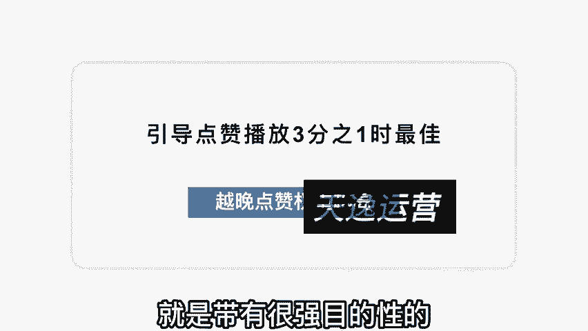
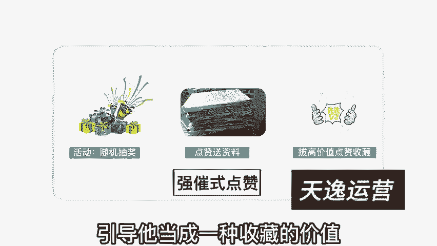
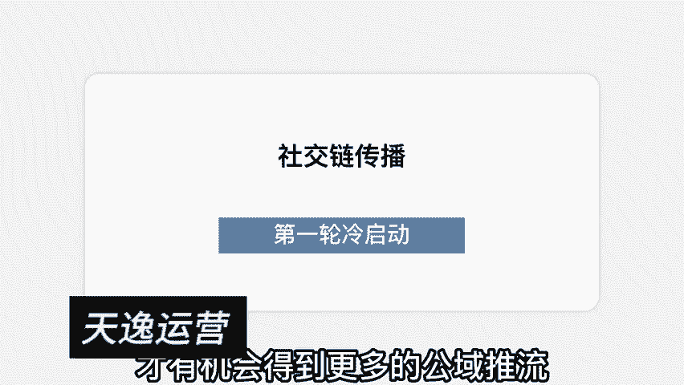
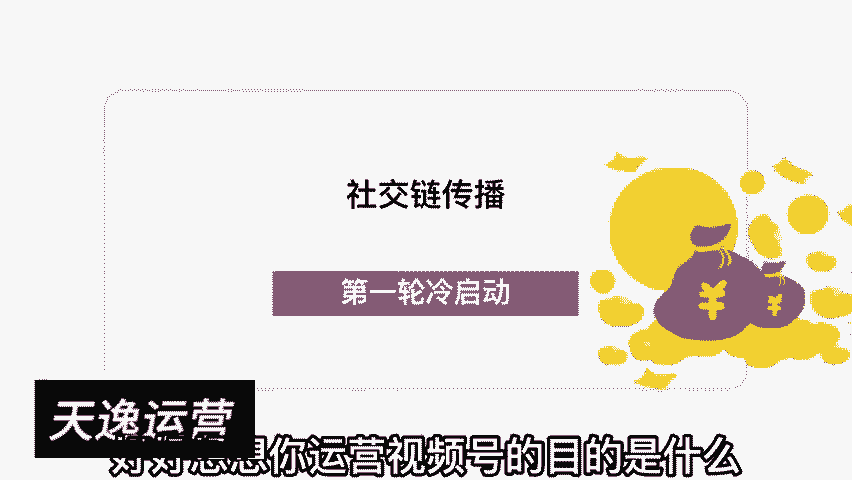
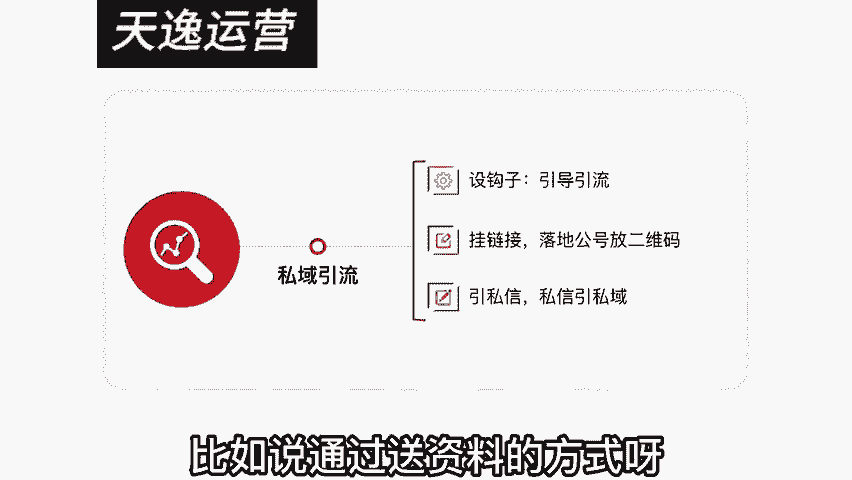
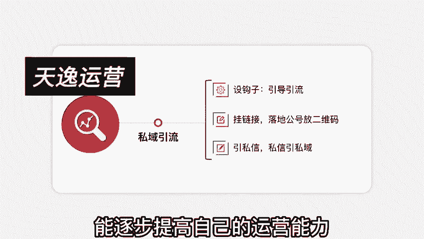

# 【2024版微信视频号运营教程】全B站最良心的微信视频号运营高阶教程合集！微信视频号运营 自媒体视频号起号真的不难！ - P5：第三节：账号运营~ - b太和 - BV1cLsre3ERa

视频号怎么运营？今天我们来到第三节账号运营整个系列呢我会出的五节。如果你是空降到这一节的话，我建议你按照顺序观看，我相信对视频号的整体运营啊理解的更加透彻。账号的运营运营什么呢？

我们在前两节讲的个很关键的点，就是视频号它的推荐机制的能启动，是源于用户的点赞，你的用户点赞也就辐射到它的一个社交圈，依此这样类推，我们就知道点赞的重要性啊实在太大了。在抖音里面内容点赞呢。

它只是一个简单的用户认可，它会判定到用户认可的一个维度里面。而视频号不一样啊。视频号点赞就是一个启动初期推流的一个根源。你要想你的内容进入更大的流量池得到公益流量的加持。

那就意味着你要在初阶的能启动的这个范围里面把它做足。那点赞这块，我们应该怎么针对性的运营呢？今天呢我把这块重点的来，讲一讲啊，在点赞这块呢，我们。

需要做足这三个点啊，这是属于引导性的点赞。第一，文字点赞。大家在看视频的时候，一定会刷到哎，视频的中间啊，它放了一个点赞，有一个这样一个动态图的提示啊，就是你喜欢哎，你觉得这个内容不错，给我们点个赞吧。

哎，这个引导非常重要啊，特别是视频号针对的这种中老年的用户群体蛮多的，你不要小看这么个引导动作啊，这么个引导动作，就决定了他是否就真的给了你一个赞，你就当是求赞赏的。第二种方式呢是求赞的模式，对吧？啊。

反正意思是我们都讲到这儿了。哎，我都贡献出这么多了，你来帮我点个赞吧。哎呀，我非常需要一个赞，怎么怎么怎么的，哎，你可以通过一些话术型的东西进行求赞。或者是通过互动型来点赞互动啊。

比如我在内容里面这么引导啊，我说大家看到这里啊都不容易啊，我相信你是一个非常有品味的人，你在这块已经了解的非常通透了。你现在点个赞，我来统计。

一下这个视频会有多少人真正的理解透了，对吧？或者说大家听到这儿以后啊，觉得理解的来点个赞，觉得学到的点个赞，我进行一个统计，看一下我们的内容是否做的真的优质，真的不错。用统计的形式提出互动。

也能够引发观众的点赞，引导式的点赞能帮助我们的内容进入更多更大的一个流量池，那引导点赞的话术以及这些标识放在什么时候比较好一点呢？我在这建议啊就是引导点赞呢是在播放的3分之1的时候最佳。啊。

一开始就引导点赞，完全没必要。你想想一个观众会在刚看你的视频的时候就直接点赞吗？啊，不太现实，放到最后的话呢啊人家可能玩不到不了那儿，你的点赞率就比较差，所以放在3分之1，这个时候啊他能看到了一些东西。

然后他也对你有一些兴趣，愿意接着看下去。所以你这个时候引导点赞是最佳的。而且这个时候权重是比较高的。

在整个推荐机制里面呢，点赞越晚，权重就越高。比如说这个人是看完了之后点赞和刚开始看就点赞，他的权重是不一样的啊，当然你不要拖的太晚，就像我刚刚说的，你放到最后人家点赞完步率到不到那。

然后也错失了引导点赞的机会，所以我建议在3分之1的时候引导一下点赞，在最后的时候再给他引导一下点赞，啊，双重的引导，尽量的把你的内容点赞这块给他放到最大。刚刚我们讲的是引导式点赞，还有的点赞什么点赞呢？

就是带有很强目的性的，我称为强催式点赞，强催式点赞什么意思呢？比方说点赞随机抽奖，对吧？啊，比如说比高的这个领域适合用什么来抽奖呢？我用一些课件啊，或者是我用一些教程，对吧？哎，我这个教程已经做好了。

你在下方点一下赞，然后我会随机的抽取，按照多少名多少名抽取来赠送这个奖励。

以抽奖的形式激发他们的点赞。第二种方式呢是送资料啊，比如说啊我做一个什么教程，然后后续有什么软件搭配啊，一些什么资源资料的搭配，哎，我完全可以送资料，我直接告诉大家。

凡是点赞的每一个人我都会私信把资料全部送到你的手上。哎，你看是不是很好。然后你想想这个内容特别有价值。我也想要一个资料顺势就点了，这种叫强粹式点赞啊，还有呢你可以把点赞引导他当成一种收藏的价值。

因为当他觉得这个内容好的时候，哎，你要提醒他做收藏，怎么收藏呢？他不可能把这个视频专门发到朋友圈或者是啊发到自己的好友那里，对吧？会打扰到别人，他不想要分享给其他的人。

但是他想收藏起来以后要的时候慢慢看，但是视频号没有下载的功能啊，啊，他不像抖音啊，所以你可以提醒他，喜欢的话，点赞收藏啊，绝对有价值的话，点赞收藏。

提醒他点赞和收藏有个很强的挂钩，拔高这个点赞的价值。通过这三种方式啊，我们可以有效的去引导我们的用户进行点赞。当然，这些引导方式在视频号非常重要。而在抖音号里面去做这种运营就变得很low了。

这也是很多运营抖音运营的特别厉害啊，但是一运营视频号就运营不起来是一样的道理，因为他们的运营逻辑不一样啊。

抖音的话呢，它的陌生关系啊有能够有效的触达账号打了标签之后，平台会给你很大的公域推流。所以你只要把内容做好啊，能够服务好你的用户，相信持续的更新下去之后就能够做出来。视频号不一样啊。

视频号你的内容做的再优质，但是你的运营这块不给你发不上去，就是没有播放，对吧？所以我们要把整个运营的体系逻辑给他理解透彻。那我们再回过头来看看。其实视频号的整个推荐呢，它都是源于社交链的传播。

我们为什么要引导我们的观众进行点赞，就是要让第一轮呢能启动跑起来，只有第一轮的能启动跑起来才有机会得到更多的公益推流。那运营视频号的目的是什么呢？可能有的人说啊我就是为了赚钱，我们再给他细分一点。

再切入的好好想想你运营视频号的目的是什么？我认为运营视频号无非就这2块。第一个它是一个很好养用户的一个。

场景，所以养用户粘性非常的不错。不管是你直播也好，发视频也好，它的整个触达是比较强效的。第二个呢是私域的引流非常便捷。比如说我们在视频号里面做的内容准备引到私域啊，也就地球号里面，对吧？

引到私域怎么办呢？哎，有很多种引流方式啊，所以私域的引流，是我们在操作视频号运营视频号的一个非常重要的一个大块。私域引流的话，我建议按照这三个步骤走。第一个先设置钩子啊，设钩子就是引导引流的方式。

比如说通过送资料的方式呀，你要给对方一个添加你的理由。关于这个理由的话，你们可以看看我的视频啊，我觉得我在引流这块还是不错的。你看一下我每个视频是怎么样去设置一些引流方式的。最合理的方式什么呢？

就是在这个平台发不了这一些东西，要到另外一个平台去发。所以大家问我要一些资料啊，一些课件，我在抖音里面是真的发不出来。我不可能。

🎼直接给你发链接，我也发不了文件，所以我让你在另外一个地方领取。你看这就是一个引流方式。但是视频号还有个引流比较不错的，就是他可以直接挂链接，它可以直接挂公号链接。

你只需要在这个链接里面落地放上你的二维码可以直接引流。这种方式在抖音里面是被封的。但是在视频号里面是没有问题啊，毕竟他们是自家产品嘛，对这个不排斥。第三种引流方式呢是从私信里面引从私信引到私域。

你看我们在运营起来之后啊，设钩子挂链接引私信，这三个非常强效的触达，包括在直播里面也可以挂链接，直接做强效的引流。它的引流效率呢是比较不错的。我这在第一节的时候呢，我详细的给大家讲了。

关于引流的转化的一些数据啊，这是整个视频号，我们运营需要做的一些基本功。当然视频号的运营远不止如此。我今天我没有把这个事讲的太过于复杂的，是希望大家。

能够去执行，然后能够简单的去理解它。并且在接下来深入去做的时候呢，能逐步提高自己的运营能力。

