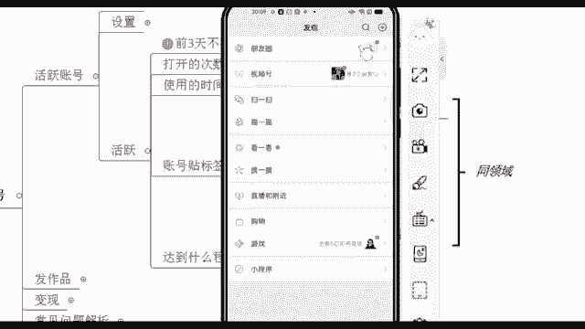
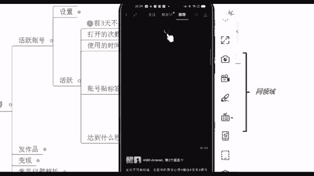
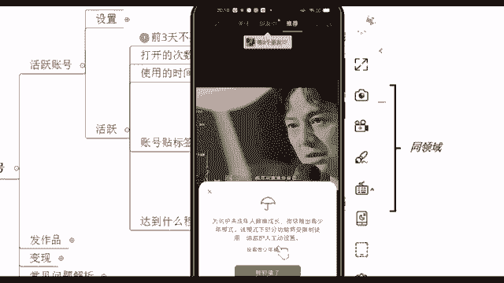
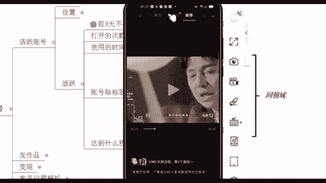
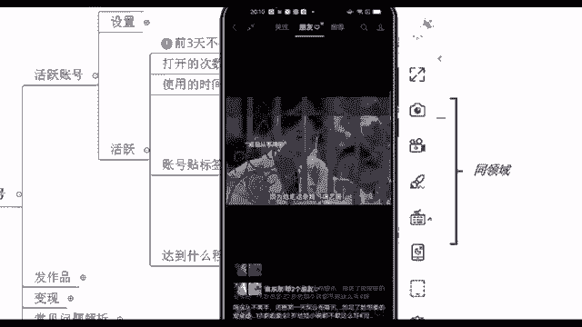
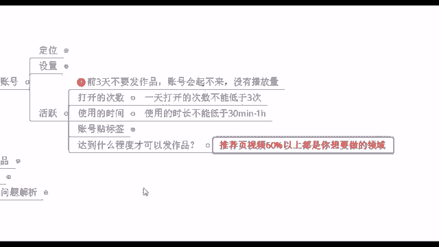

# 【2024版微信视频号运营教程】全B站最良心的微信视频号运营高阶教程合集！微信视频号运营 自媒体视频号起号真的不难！ - P9：6.实操教学-视频号养号解密 - 庄剪子映剪辑 - BV1ei4ceHEP3

第三步就到达这个活跃账号了。活跃账号其实讲白了，就是我前面有说到一个词语叫做养号。你们觉得养号这个东西它到底要不要做呢？😊，你觉得要的话，哪个要不要的话。

哪个不要你们觉得要不要之前有看什么呃其他平台的时候，应该有听过这个词语吧。这个养号这个东西啊，它的话呃之前可能会有人说老师这个养号，我觉得养不养没有关系吧，就是不养的话，好像也可以去发作品。

个人会觉得养了会比没有养号。因为根据我自己之前的一些实操，我没有养的一些账号，我发作品的话，很容易出现什么，就账号播放量不高，啊，甚至我的作品怎么被吞的，我都不知道之前我踩过了一些坑啊。

这就是我之前的一些经历啊。所以我自己我个人认为的话呢，如果说你之后要去做好这个事情，你去花几天时间去养养号，这个也不难。来，我们来看一下养号怎么去养前三天你刚开始创建这个账号的时候，不要去发作品。

因为就会像我说的账号起不来，没有播放量，以及呢我们打开的次数，你每天不要打鱼不要少三次就行了，是吧？我每天没事我就打开它使用的时间不要低于半个小时到一个小时，账号贴标签，这个就是字面意思啊。😊。

非常简单，贴标签什么意思呢？嗯，我问一下啊，就现场你们有没有在跟你家人啊，跟你朋友在聊天的时候，哎，我今天明明聊到一个话题，聊到一个产品，感觉这个还不错。比如说我聊到某个牌子衣服是吧。

或者说某个牌子的化妆品啊啊，某个牌子的这个零食啊，结果第二天我打开其他的平台，打开淘宝啊，或者说打开微信啊，他立马就给我推荐相关的一些产品了啊，要养了权重高对这个词语它就是非常的专业了，这就是权重。

我们活跃账号其实就是为了去提高你的账号权重。😊，有是吧？好，所以说其实这个的话呢，就是我们现在什吧账号贴标签，因为大数据它是很灵活的，大数据它会去记住你所有的一个操作。比如说你喜欢什么东西。

你在这个界面停留多久，他都知道的啊。所以说我们现在去给账号贴标签，就是告诉大数据，你喜欢这个东西，我们一定是给同领域的东西去给他去点赞评论转发，这个就是让大数据记住你啊，同领域的。

就比如说你要做影视剪辑，我就专门去点赞影视剪辑的，你要做其他类型，你就专门给他去点赞就行了。好吧，评论转发玩播什么意思呢？就你看完它你不要停留个2秒钟，我就走了啊，还有呢？关注他，并且直播直播的话呢。

😊，不是说让你自己直播啊，你去看别人直播。现在我们看直播都是基本上都是免费的。然后现在因为腾讯它在下半年要进入这个商业化模式了，对吧？所以说我们现在去看的话。

就在前两天我刚看见啊前两天已经开始部分试水付费直播了，付费直播什么意思？就你可以免费观看3分钟，看完之后你觉得还不错的话，哎，我付个几块钱啊，我又可以观看它整场的一个直播了，并且这个直播还是有回放的。

所以说这个现在就是他在测试的一项东西啊，这个也是后面会大力去推广的这么一个直播类型啊，这是给账号贴标签，这个能理解吗？包括点赞他的视频号点赞跟其他平台会有一点不太一样，给你们看一下啊，视频号的点赞。

它其实更加像是微博的转发微博的转发啊，他因为特别注重这个社交属性，我给你们看一下，在这个发现页视频号底下，你看我的朋友点赞之后，我都在这能够看到他的头像，包括在中间这么一栏。😊。

。🎼可以放弃你自己在这你千万接来。

よ。好，在这个中间你有没有看到在这个朋友这一栏，它右边有个小星星，这个就是你朋友点赞之后，你能够去看到的这么一个东西。所以说这是咱们这个点赞它的一个机制啊，那他的话也非常注重这个社交属性。

我在后面给你们说一下，它这个是能够给你带来一大波的流量的，这个就是我们这个账号贴标签，正确的事情重复去做就好了，能理解是吧？好，来，能理解，我就快速过了啊，来除了这个账号贴标签之外。

我们还有提高权重的一些方法的。比如说你可以去给他评论啊，制造神评论评论底下可以去制造神评论啊，这个制造神评论的话呢。😊。

什么意思呢？就你们经常在看抖音的时候是吧？有一些屏就是这个点赞量。😊，非常高的一些评论，你会发现点赞量非常高的一些评论，包括就是很有意思啊。你看完之后，你觉得自己笑的不行了，这个就叫做神评论。

那我们的话你可以去在视频号里面把这个操作给它做起来啊，我去给别人评论，要是我的这个评论非常多赞的话呢，那说明你这个账号养的非常好的。哎，有的人说老师我不知道我怎么去呃制造神评论啊，我我又不幽默。

我又没有什么我肚子里又没有什么墨水。没关系啊，这个时候你可以去其他平台，你把人家这个比较搞笑的一些话，把它给复制下来。互联网它的一些热点，就是有一些比较新潮的一些话都是共通的。你把它复制下来。

粘贴到我就是要去评论的这个审频上面，这样的话也能够去制造神评论，好吧啊，这就是非常简单的一些操作啊，贴标签，包括达到什么程度可以去发作品。😊，当你的推荐页60%以上都是你想要去做的一些领域。

推荐页就是我们刚刚说朋友右边那一栏啊，那个推荐页。如果说你刷10个视频，10个视频只有一两个是你想做的啊，那还不够是吧？你这个时候再去刷一刷，再刷两天。

如果说你刷10个视频有五六个视频都是你想要去做的这个。比如说美食类的对吧？好，那这个时候说明你的这个账号活跃的还不错了。你可以去啊直接去发作品了。好，这个就是活跃账号，简单说到这儿啊。😊。

