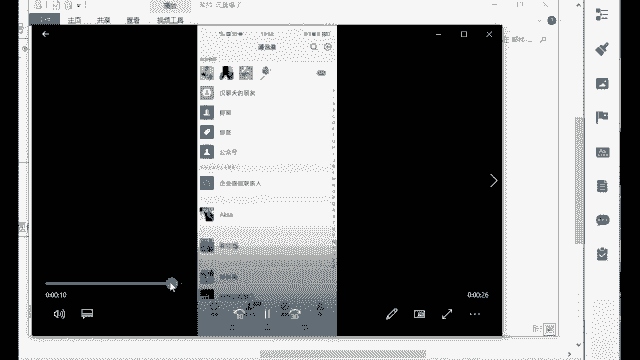
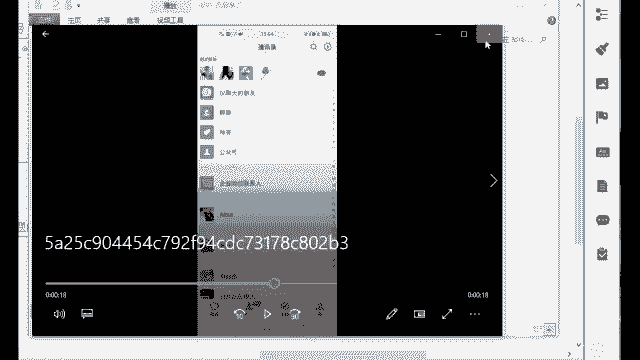

# 【2024版微信视频号运营教程】全B站最良心的微信视频号运营高阶教程合集！视频号入门创作的变现底层逻辑！微信视频号快速起号确定及账号定位！ - P13：10.视频号变形模式（一） - 手机剪辑教程_ - BV1zr2vYREnC

这个是涉及到变现的一些环节了，有哪些方法呢？来做账号的时候，我们除了发作品，还有很多高级玩法。比如说隐私域流量，私域流量就是你自己的好友数量。😊，私域流量就相当于你自己加的一些这个资源嘛。

你自己的一个人脉嘛，这是隐私域流量啊。讲白一点，就是让你的微信好友去关注你的账号。那我们隐私域流量，我们可以发到哪里去？视频号它可以发朋友圈公众号社群，甚至红包封面可以带你的视频号。

如果说别人要领你的这个红包是吧？你可以在群里面去群发嘛，我群发一个红包，我就一分钱一个红包也行啊。他如果说要领，他必须要看完你的视频号，必须要去点进去看，所以说这里就能够给你带来你的私域流量。

那是不是可以把你的微信好友给激活了呀，平时可能不聊天，但是他可以去呃作为你的粉丝嘛，而且视频号这里啊，它有一个机制叫做买一送一模式。呃，如果说我们之后去做视频号。然后呢，你自己的朋友给你点赞了。😊。

假如说现在你的朋友给你点赞了啊，他是什么机制，就长这个样子。你自己你首先你发完作品之后，你自己给自己点个赞。点完赞之后，你的朋友给你点赞了，他看到了是不是刚刚在那个地方，你朋友点赞都是能够看到。

后面有个小星星的啊，那在这里他点完赞之后，如果说你自己的朋友看到了啊。然后大数据他监测到了你的朋友给你点赞了，他再送你一个。😊，这个是他送的这个是你自己的这个是他送的。好，那有一个看到之后的话呢。

他朋友的朋友是不是又会去点赞呢？点赞之后的话好，那这里的话又进行了一个什么二次传播。好，这里的话就是什么进行了一个社交裂变了。这个就叫做买一送一，也就是说有一个你自己的好友看了你的视频。

腾讯妈妈再送你一个有2000就送2000，有2万就送2万。😊，厉不厉害？这个其实这一步就是他现在微信视频号做的非常好的一个点。这就是为什么你的账号一开始可能你会看呃，播放量不是特别高。

但是后面只要你的内容是好的，他后面一定能够火起来。因为他需要一个时间的沉淀啊，那这个的话呢，这一步我们是叫做把河流里的水灌到你自己家的甜店里面去。如果说我们后面做好的话，做成社交裂变，他是什么情况呢？

社交裂变来流量报了这个周帅同学给你看一下，他当时给我发的一个视频，这是他当时就是做账号，你看后面他起来了以后，他的账号的这个添加好友数量在这儿点点点。😊。

是吧这场面啊，如果说你之后账号做的好啊，这个都是常态加上来的好友，那都是什么白花花的一些流量啊。那你想一下，如果说你是做微商的。😊，你自己如果说是做微商，或者说你朋友圈会卖你自己家的一些产品。哎。

那这个时候他们加上来，是不是有可能会去买你朋友圈的一些产品呢？这就又回到我们原来比较火的一个什么微商时代了啊。好，这个就是叫做社交裂变了。它的一个背后的一个什么播放量就是这样的。

所以说这个我们一定要去利用起来它的一个隐私欲流量啊，叫做把河流里面的水灌到你自己家的田地里面去，把门口加门口的这个水先什么利己嘛。好，或者说我们也可以像其他平台一样，也可以去带货的啊，带货的话呢。

比如说直播带货，它是当下最火的一个行业了。当下做个比较好的就短视频嘛，直播带货嘛，啊，就短视频时代就是现在最赚钱的但我们的目的就是为了赚钱啊。那刚开始的时候有流量，你就可以去赚钱。

所以开始的重点还是要放在流量上面去。你的饭一口一口吃路一步一步走，一口吃不上一个大胖子啊，那视频号他直播的优势呢，就在于可以直播预告。这个直播预告的话，它不像抖音快手一样，那我如果说我要看的话，我。😊。

记得他多少点多少点，我还得去蹲他的直播啊，但是你像他的话有一个很好的点，就是他明天10点直播，你直接点击一下这个按钮可以预约一秒预约。预约好之后，我明天如果说他在开播，我即使我忘了腾讯他还提醒你的。

直接就发给你，这个谁谁谁，你预约的谁谁谁开始直播了，快点进去看。所以说这个界面是非常非常好的啊这个预约，你以后要去直播的话，你一定要提前去发这个预约直播发这个直播预告啊。

那我的话可以去让我的好友给他滚动起来。我先在社群里面群发一遍，让他们先约一遍，就不会说我直播的时候没有人来看了，这个就是他的一个优势所在，包括知持最小化知持分享给朋友以及知识设置状态。

你的朋友是可以看到你在看谁的直播，那他看到之后他进来直播间了，哎，大数据监测到了是吧？有一个又送一个啊，有两个又送两个这是是又开始这个滚动了呀。这是他的一个背后的一个算法推荐啊，要了解他背后这个东西。

包括付费直播。你看现在部分直播已经开始这个付。😊，费模式了，那你之后去做直播，如果说你的内容好，那别人会愿意为了你去买单的，你不管是卖课程还是说卖什么其他的一些东西啊啊，包括直接可以带二维码。

这个很香啊。你想想你在抖音快手，你去放二维码，你去放个微信的二维码是吧？本身他不是一家公司的，他是字节跳动的字节跳动，你去引导腾讯的这个什么流量，你去帮腾讯去赚钱，你觉得人家愿意吗？

所以说你这个经常你去抖音去带二维码，你去看一下啊，如果他们有带二维码的，下一秒怎么疯的都不知道账号直播间怎么没都都不知道啊，这个就什么谨慎处理啊。那你像现在视频号，他本身就在自己家。

我可以直接放我的二维码啊，那这个东西都是他的一个好处嘛？本身就是他是出身，就是含着金钥匙出身的啊好，那这个是我们现在视频号，他直播的一个优势所在了。并且呢如果说你现在有看到视频号直播。

你发现刚开始来的话，好像都是这个熟人都是你自己的好友，但是你注意到吗？你只要坚持去直播，你坚持大概。😊，半个小时啊，一个小时后面的话来个几百个人，几千个人，几万个人一点都不夸张。

他就真的是滚雪球一样滚动起来的那如果说你发现这一点了，说明唉你还是能够去了解到他背后的一个逻辑的。而且这个东西如果说他人越来越多了，说明这个东西他很多人在看了。我们现在去视频号直播。

其实就是要去抢相对应的，叫做公域流量，这个就不是私域流量了，私域流量是我们自己的公寓流量就是属于什么把大海里的水去灌到你自己家的田地里面去啊，我们现在就是抢大海里的一些公共的资源了啊。

所以说这个直播的话，也是什么你能做起来，赶紧做起来啊，好，这个东西也是抢公寓流量，直播也可以提前选好货啊，然后在直播间去上架，现在是可以什么直播卖货的。

因为像现在视频号它官方到处都在搞这个扶持啊他也就是在5月份现在就是刚开始开启这个付费直播，你能够看到它的一个重视的嘛。那你像现在如果说你能够流出陌生人，你能够成交，后面他会给你扶持，给你送流量券。

那让更多。😊，人来你的直播间，哎，这就意味着现在他还是个红利期，只要你足够努力达到他的一个标准，这就是什么哗啦啦的免费的流量，这也是为什么？就是现在普通人去做这个视频号时最合适的原因啊。

就是这么一个情况啊。如果说你前面直播了很多场看的人越来越少，说明这个内容它是有一些问题的那直播的内容不够吸引人啊，这个的话嗯一定要去找准他现在的一个问题所在啊，找准你的问题嗯。😊。

