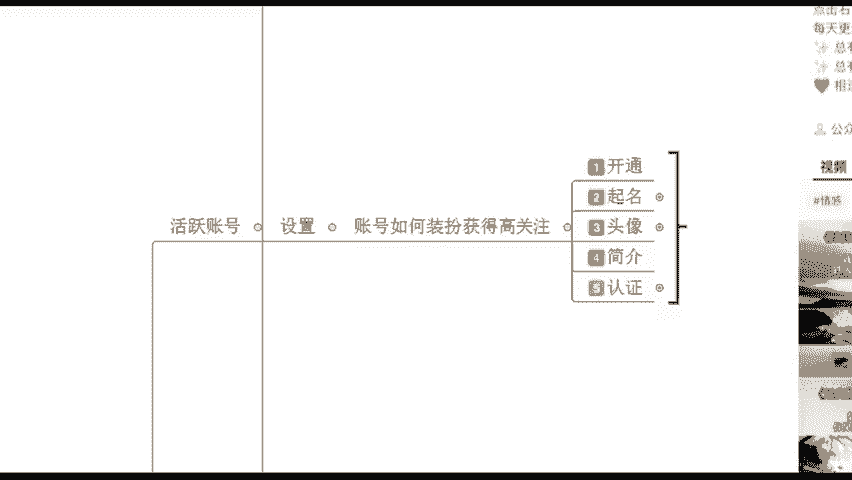
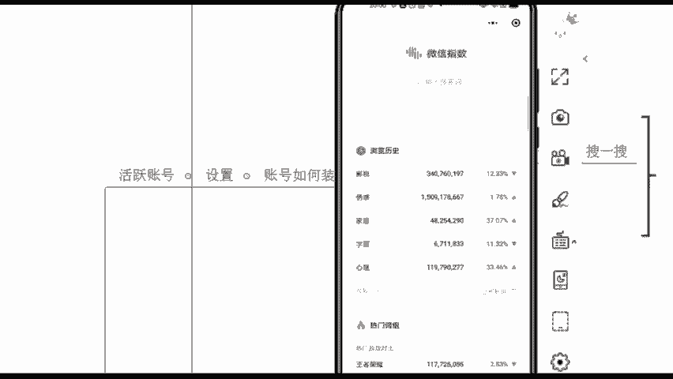
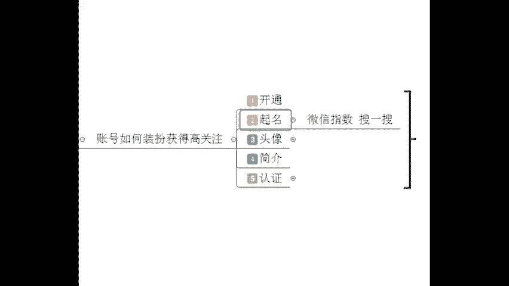
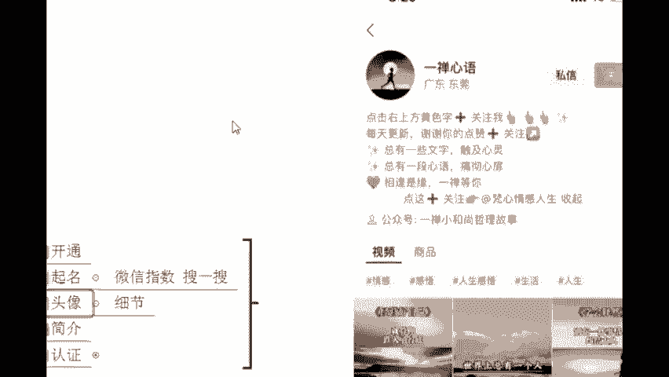
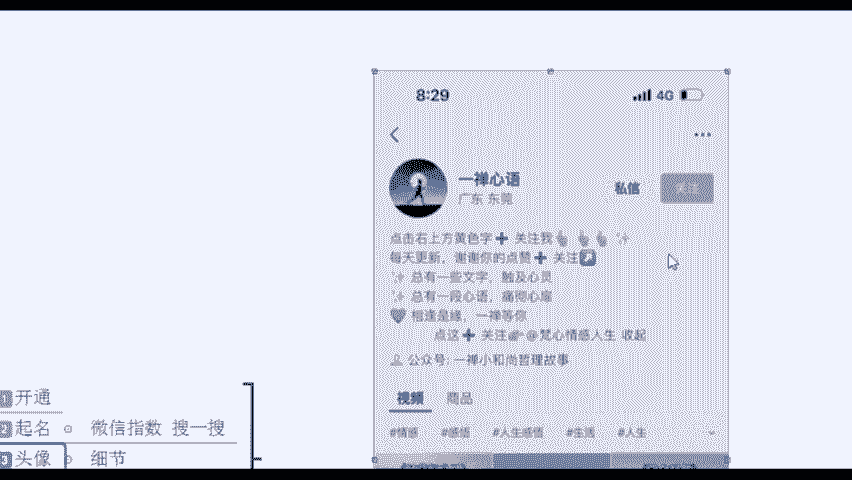
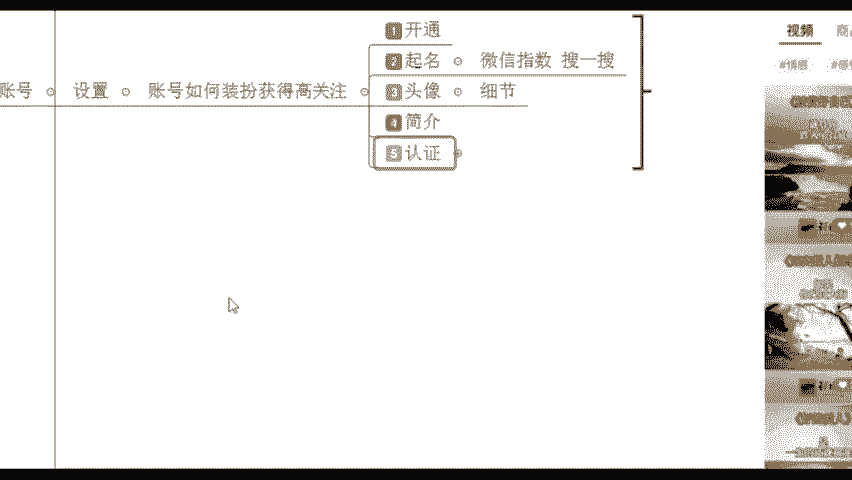

# 【2024版微信视频号运营教程】全B站最良心的微信视频号运营高阶教程合集！视频号入门创作的变现底层逻辑！微信视频号快速起号确定及账号定位！ - P8：5.实操教学-账号设置 - 手机剪辑教程_ - BV1zr2vYREnC

第一步是定位。第二步就是根据你想要去做的一些类型。却设置我们那个账号了。这个设置什么意思呢？相当于是你的门面装修给别人的第一印象一定要好啊。所以说头像简介、名字啊，这些哎我们是要去把这些给装扮起来。

才能够去获得什么更高的一些关注啊，那这里的话就涉及到一些呃简单的一些方法了。有一些小操作来给大家说一下啊。你像首先开通的话，把你的微信升级到最新的版本再去设置里面，把这个视频号打开它就好了。

开通之后在这个地方它会有一个小小的蝴蝶的形状，就这个东西啊，这个它就是视频号的一个标志。那我们那个的话起名起名字的时候呢，我们是可以去找到一些相对来说热度比较高的词语去设置你自己的账号。

起名字这里可以用到一个小软件，小程序叫做微信指数，微信指数是什么东西呢？就是在我们微信这个地方右上角我们打开微信界面的右上角，它是有一个小小的这个搜索框。

你在这个右上角就是这个地方就这个搜一搜这个放大镜啊，它的话每天会有5亿用户会用它。😊。

5亿用户就跟我们百度是一样的啊，那我们现在在这个搜一搜里面，你可以直接去搜索微信指数这个东西。😊，直接搜索微信指数啊，就这个。指头的指数字的数，包括相对应的还有很多的一些平台，大数据平台。

比如说西瓜数据，这些都可以看平台的一些数据量，就看它到底每天有哪样的一些内容比较容易火。或者说有哪些话题比较受欢迎的。我们可以每天去看一看啊，因为本身互联网它赚的就是一个信息差。

那在这里面你看我们之前我自己是有搜过一些相关的一些热词。你可以看一下啊，这些词语哪个词语它的搜索量是最高的呀。😊，看得清吗？影视的情感的家居的，还有呢这个是什么字画的心理的，哪个词语。

它的搜索量更高一些，情感的是不是很明显啊？所以说情感类型呢它是不是更加受欢迎一些，它这个词语可能大家搜的比较多，那你之后你去设置你的名字的时候，你把这些比较热度比较高的词语，不一定是情感。

或者说你自己想去做的一些类目啊，是吧？我去找到哪个词语，大家比较爱搜放到我的名字里面去啊，这就能够给你带来搜索的免费流量了。好，这是非常简单的一个这个道理啊，就是微信指数这个小程序。

你们下去之后去用一用它啊，可以去了解一下。包括还有呢头像头像这一方面的话，注重细节头像你不要去带明星爱豆头像啊，很多人可能会追星平平常没事可能就追星嘛。

这个你在做号的时候就不要去放这个明星id豆头像了啊。影战，而且呢这个是有侵权的风险，有版权风险。啊，第二个就不要去用这个风景照风景照的话，它看起来好像也有点太随意了嘛。😊。

如果说你是走可爱路线的，你就用这个可爱的卖萌的，你走专业路线的，你就用形象账好嘛。比如说你是自己你要去做课程啊，你要去做产品啊，你就用你品牌的logo，你就用你产品的名字就好了嘛。

所以说这个是我们头像这一方面注意细节啊，这个它就是整体跟你的店铺装修是一样的。这个就是我给大家看一下啊，这是我之前的一个账号，它这个做的还不错，你看它的封面这个包装，你看着还是挺丰富的。

所以说把你的这个账号界面去丰富起来啊，简介就是这一方面了，你看一下这个简介，它在这里就这么一一些数字啊，这里是可以什么丰富到十行，最长可以写十行，十行，你随便怎么去排版。比如说第一行我可以像他一样。

点击右上方黄色字加关注，是不是这个是引导关注。那别人看到之后可能会来关注你啊，加几个小表情啊，立马就生动起来了，或者说你下面也可以跟大家说一下，我这个账号每天直播是什么时候啊。

就跟你平时看别人的抖音账号是一样的，还有呢我们在下面也可以说一下我这个账。😊。

能够给你带来什么东西，告诉别人你的这个账号它的价值在哪里。为什么你要来关注我呢？我能够给你带来心灵上的慰藉。哎，我能够告诉你生活有哪些小秘诀啊，小秘诀，或者说我能够告诉你这个电影它有多么好看啊。

这就是你的一个内容可以写在这啊，包括就是你可以给你自己的其他的一些账号，比如说我不仅运营了一个账号，我是多个账号一起在做的啊，你可以引导到其他账号相互引粉丝，以及你如果说有公众号。

我绑定了公众号也可以展示在这个界面非常方便好吧，把这十行去给它丰富起来啊，这根据你们的情况来。你不要说这个只一行，或者说我什么都不写，那别人看这个账号的话，也不知道你这个到底是干嘛的，为什么要关注你。

把它给丰富起来啊。好，这个就是我们简介这一方面。那接下来的话再到这个认证认证的话，我们是可以去认证个人和认证企业的啊，个人认证非常简单，你实名之后，把你的一些相关的这个资质啊，你把它给上传，后台的话。

😊。

你可以选择一下你是做什么类型的。比如说你是做兴趣类的，还是做这个知识培育，知识教育类的，对吧？还是说做什么其他类啊，其他类型认证非常简单啊。当然像企业认证的话会更加的好一些。有没有有企业的。

有没有自己当老板的？😊，有没有在场有没有老板们啊？如果说你自己是做企业的话，企业认证也是更加好一些啊？有是不是？如果说你不是做企业的话，直接把这些东西去完善就好。😊。

把你的营业执照、企业法定代表人的身份证上传就OK了。因为像企业号，为什么说更好呢？它更像是官方，就是你企业的官方流量会更多，而且企业号会优先。😊，啊，他的话没有什么粉丝要求啊，公众号跟你的什么视频号。

如果说你有的话，你去认证，然后名字一致就行了。如果说没有的话，你把你的店铺上传就行了啊，一年两次认证机会谨慎认证。如果说你这个认证失败了，你可能得另外开新号啊，或者说你得再等到明年了啊。好。

所以说这个的话去稍微注意一下认证这个东西。😊，啊，如果说咱们是个人同学也没有关系啊，老师，我这不是当老板，我自己给自己打工，是不是啊？如果说我哦老师我就是打工人啊，那您如果说是打工人。

我之后哎也可以教大家我们怎么样去认证这个企业账号也可以的。好，来接下来我们再来看一下第三步了。😊。

