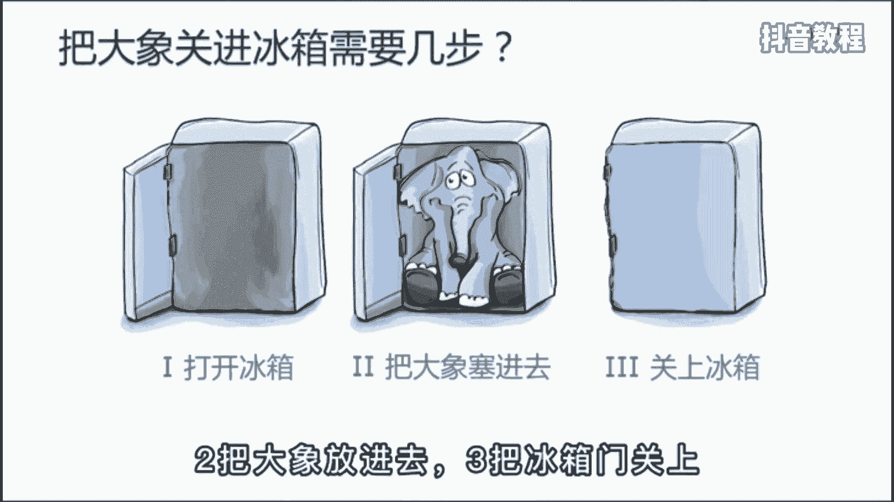
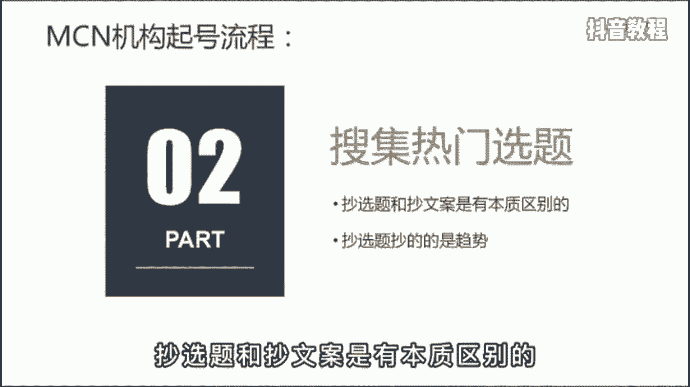
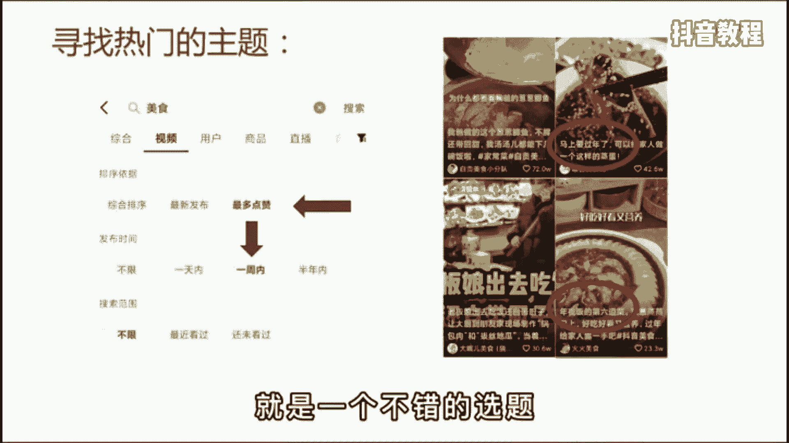
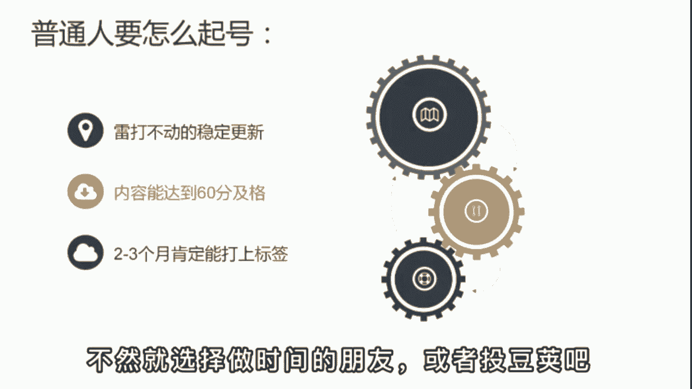
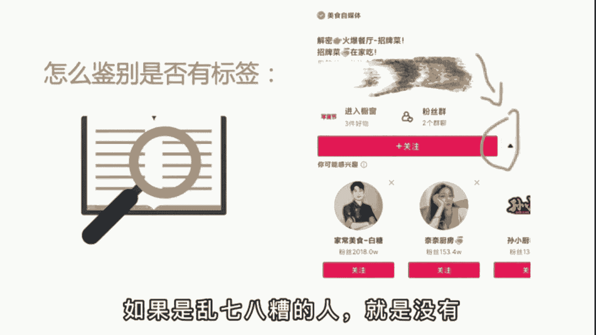

# 【2024版抖音短视频运营教程】全B站最良心的抖音运营高阶教程合集！抖音运营 自媒体起号真的不难！ - P21：基础篇丨抖音起号流程 - 有点像大哥Seven - BV1Uppte3EMF

为什么同样的方法你用的就是没效果，于是啊你开始怀疑自己的能力有问题，其实啊做短视频最重要的不是创意，不是套路，也不是颜值。

而是标准化的工作流程，这就跟宋丹丹的小品一样，把大象关进冰箱里，需要几步，需要三步，一把冰箱门打开，二把大象放进去。

三把冰箱门关上，就这么简单，MCN机构拿到一个账号啊，首先就是确定定位，你是做美食，美妆还是才艺，得有一个清晰的定位，确定了你的粉丝群体是哪类人，视频的展现形式是什么样的，未来如何进行变现等等。

第二步在抖音里选择关键词，比如美食，点击右上角的筛选，选择一周内最多点赞的作品，统计前30个热门作品，准备超选题，注意啊，抄选题和抄文案是有本质区别的。

抄选题抄的是趋势，举个例子来说，假设啊你发现教做年夜饭的视频很多，你就也可以选择年夜饭这个主题，比如挑战15天，学会为家人做顿年夜饭，这就是一个不错的选题。

第三步，打上账号标签，这是啊整个流程中最重要的，很多人啊做不起来账号，就是因为没有打上标签，所以没有稳定的流量来源，MCN机构打标签方法很简单，就是透透件精心打磨10~15条作品，每个作品投510天啊。

投三个五天就能打上标签，起号成功，后面呢就是不继续追投，也会有稳定的基础播放，一般呢是5000到5万左右的播放，这个数据啊和粉丝的数量是没有关系的。

那普通人没有那么多预算怎么办呢，你就保证啊雷打不动的稳定更新就好了，至少啊一天一个作品先发上100条冷启动，只要内容能达到60分及格，一般两到三个月肯定能打上标签，很多人呢就是又穷又心急。

咩咩还没发几个作品，一看不到500播放，就急得满世界找老师，找破播放的技巧，其实啊谁做都一样，除非你有大号，已经混了个脸熟，那再起新号肯定快，不然呢就选择做时间的朋友或者投抖家吧。

那判断账号打没打上标签啊，这里有个鉴别方法，就是用另一个号去到你的主页，点击关注旁边的小三角，如果下面推荐的是领域相关的账号，就是打上了，如果是乱七八糟的人。

就是没有学会后。