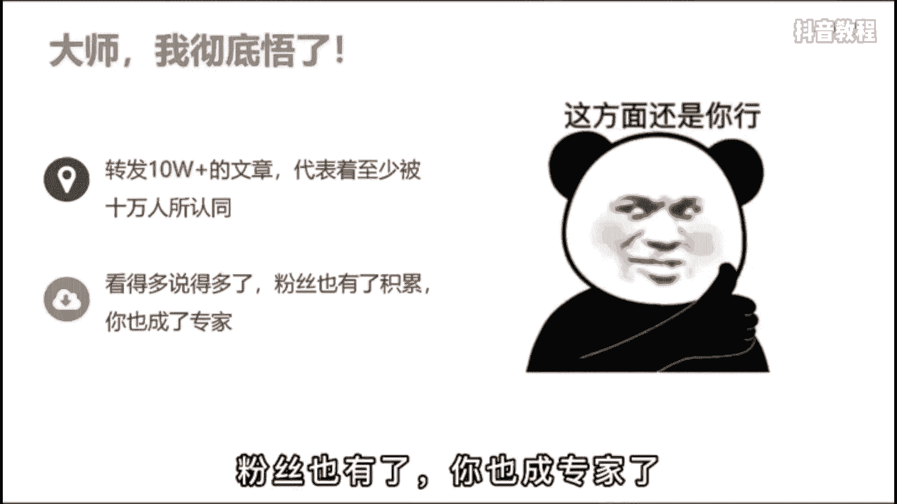
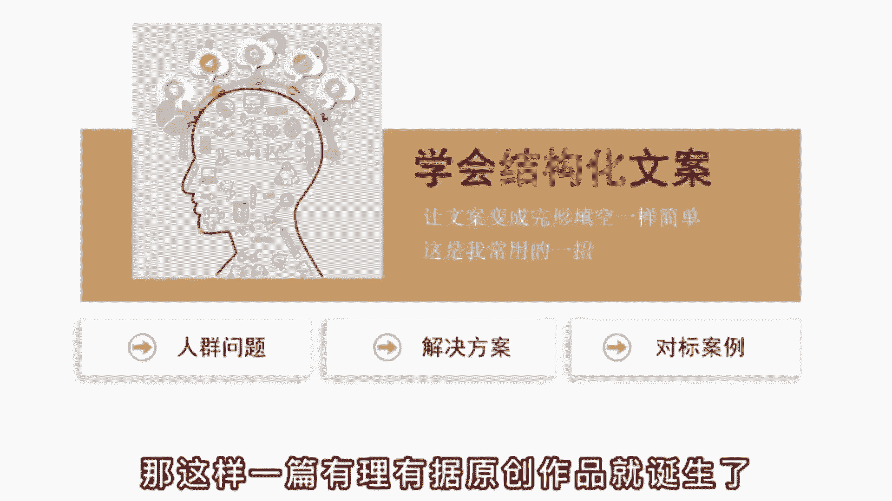
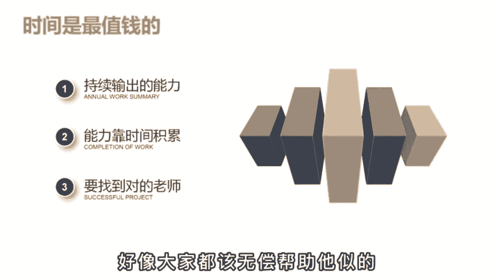

# 【2024版抖音短视频运营教程】全B站最良心的抖音运营高阶教程合集！抖音运营 自媒体起号真的不难！ - P22：基础篇丨抖音的文案怎么找 - 有点像大哥Seven - BV1Uppte3EMF

说啥也不做抖音了，做短视频最崩溃的就是写文案啊，群里有个伙伴刚做短视频一个月，说什么也不继续干了，天天写800字的文案稿，还没啥人看。

说自己啊都快成精神病了，然后呢他就问我，有没有一种输出方式可以不这么累，在自己一个人做的时候呢，也能保持作品的数量和质量，我说啊有是有，但是手段呢有点不止啊，我是不太推荐的。

但是呢有一个大V就是靠这个办法，积累到了上千万的粉丝，这个办法是什么呢，其实啊用一句话就可以说明白，任何一个图文平台出现过的10万加内容。

你都可以用短视频的形式再做一遍，什么意思呢，啊比如说啊，你在朋友圈看到了一个10万加的文章，大家呢都在转发桌面啊，这篇文章已经被至少10万个人认同，而是能产生情绪共鸣的高质量内容啊。

就比如说这个讲拼夕夕砍价的文章，普通人呢就是满腔的愤怒，而觉得终于有人发声，给出了口恶气，然后呢你也想蹭这个热点，但是啊你自己说三言两语，肚子里就没货了，怎么办呢，哎你就去某号某乎搜索相关的话题。

你用口播的形式再拍一遍，就好要做其他领域呢也是一个道理啊，比如说你觉得健身减肥是一个好的项目，赛道卖轻卡零食或者减肥代餐什么的，有搞头，但你是门外汉不懂，那这个呢还是用这个办法，哎，你就去找爆款的文案。

就这么讲，三个月看的多了，说的多了，粉丝呢也就九了，你呢也成了行业的专家。

这个呢是第一个阶段，通过转换输出的方式来帮助自己快速起号，因为曾经火过的内容啊，已经可以再火，那第二个阶段呢就不能这么用了，万一让人发现啊，你都没有自己的观点，迟早口碑人设会崩溃。

在这时呢你就得学会结构化文案，把你的文案变得像完形填空一样简单啊，比如说我常用的一个结构，一提出一个精准人群的问题，第二给出具体的解决方案，第三给出实操的对标案例，你看这不就是填空吗。

当你第一阶段积累了一定的知识储备后，第二阶段就会很好做啊，比如还是减肥这个问题，我能提出哪些问题呢，第一新手健身该怎么制定计划啊，减肥做什么运动最有效，少吃多餐对身体有没有影响。

然后啊你就按照1234给出具体的意见，再给出一个已经瘦身成功的案例来佐证观点，那这样一篇有理有据的原创作品就诞生了。

那这个呢就是结构化思维的好处，很多人啊为什么做不起来账号，就是因为他肚子里没货，没有办法持续的输出，然后呢还不愿意花时间去积累，只想速成，那想速成呢也行对吧，你付费向有经验的老师学习。

他花时间花钱得到的经验，肯定呢是对你有帮助的啊，你做半年都想不通的点，可能啊老师的一句话你就醒悟了，但有部分人啊，他自己的时间就不值钱，也不尊重别人的事情啊，我关注你，你就该为我免费解答。

不然呢我就取关威胁，或者呢直接割韭菜言论。

