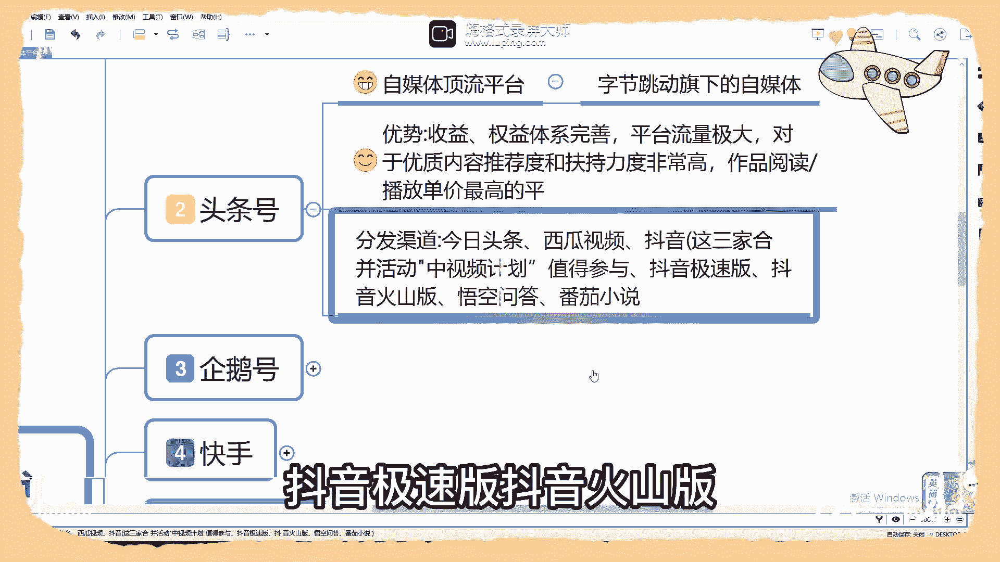
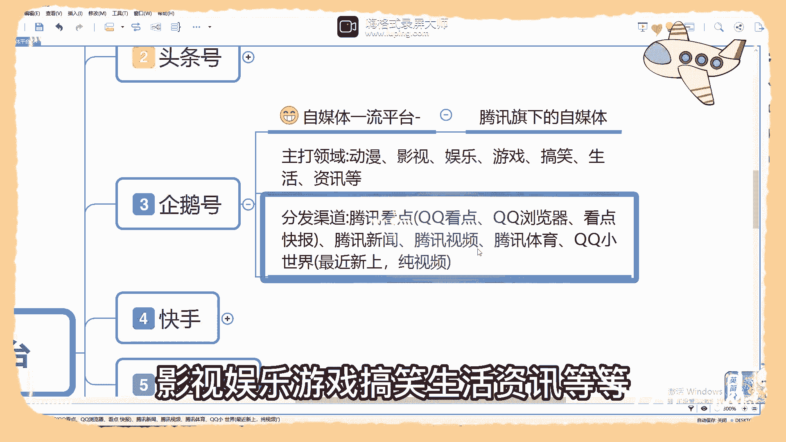
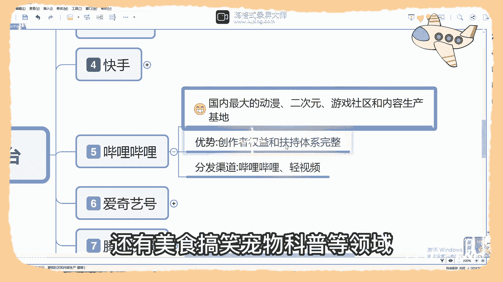

# 【2024版抖音短视频运营教程】全B站最良心的抖音运营高阶教程合集！抖音运营 自媒体起号真的不难！ - P26：十个自媒体平台 - 有点像大哥Seven - BV1Uppte3EMF

有哪些平台是发视频有播放量就有收益的呢，那up主呢在这里整理了十个平台，都是根据自己的亲身经历而言的，建议大家收藏起来，如果你也想要通过自媒体获得一份收益，评论区扣一个学习第一个百家号。

百度旗下的自媒体属于自媒体的顶流平台。

几乎包含了你能想到的所有领域内容，用户数量多。

推荐流量大，权益体系的完善，创作扶持优厚。

更重要的是呢，只要完成实名认证，开始发布内容注册即可产生收益。

百家号主要分发的渠道呢，手机百度百度搜索百度百科。

好看视频，百度知道百度文库度小事。

百度网盘及个别会转发到百度贴吧，那第二个呢就是头条号了。

字节跳动旗下的自媒体属于自媒体的顶流平台。

首创的中视频计划，网络无数优质创作者。

几乎包含你所有想到的领域的内容，并且呢包括自媒体式的小说。

比如说在网上广告满天飞的番茄小说。

就是头条家的收益，权益体系完善，平台的流量是极大的。

对于优质内容推荐度呢和扶持度是非常高的。

是现存的所有自媒体平台中，表面上能达到作品阅读播放量单价最高的平台。

没有之一，头条号主要分发的渠道呢有今日头条。

西瓜视频，抖音抖音。

极速版，抖音火山版，悟空问答，番茄小说。

第三个企鹅号，腾讯旗下的自媒体属于自媒体一流的平台。

旗下分发矩阵庞大，但是由于近几年的运营方式的问题呢。

导致原创作者大量流失，作者收益下滑严重。

那主打的领域有动漫，影视娱乐游戏。

搞笑生活资讯等等，以视频内容为主，图文较少，主要集中在腾讯新闻，企鹅号主要分发的渠道有腾讯看点。

腾讯新闻，腾讯视频，腾讯体育，QQ小世界。

第四个快手，快手科技旗下自媒体属于竖屏视频的内容。

顶流平台，包含除必须文字展示的内容外，几乎所有的领域与抖音一样，全民创作，全民分享收益，除了带货视频任务，直播打赏以外呢，想要获得流量收益。

通常是需要满足至少1万份的条件，快手主要分发渠道有快手快手极速版。

快看点，第五个，哔哩哔哩。

俗称B站，国内最大的动漫，二次元游戏社区和内容生产基地，这三个呢也是哔哩哔哩的主打内容，创作人气和数量极高。

除此以外呢，还有美食，搞笑，宠物科普等领域。

流量也是不错的，获得收益不难，但是有一定的门槛，创作者的收益和扶持的体系完整，B站呢虽然有图文内容。

但远不及视频内容的1/10，那哔哩哔哩主要分发的渠道有哔哩哔哩。

新视频，第六个爱奇艺。

爱奇艺旗下自媒体属于自媒体二流的平台，侧重点的明显，主要是偏向于影视娱乐，资讯，科普等领域。

但旗下短视频品牌随客视频近日发布公告。

停止运营，非主打的领域，收益极少，权益获取有一定的难度，涨粉比较难，那爱奇艺好。

主要分发渠道，爱奇艺，第七个腾讯视频号。

虽然作为企鹅号的分发渠道，但是腾讯视频的创作体系呢是自成一方的。

视频的收益相对一般，同时侧重的领域也是很明显的。

主要偏向于影视娱乐等，腾讯视频号呢主要分发渠道有腾讯视频。

以上呢就是我给大家的分享。

那视频的最后呢也是兑现福利的时候了，那点赞收藏转发本条视频评论区。

留一个学习的呢，就可以免费领取自媒体的直播教程了。

那今天的视频呢就到这里了。

关注我。