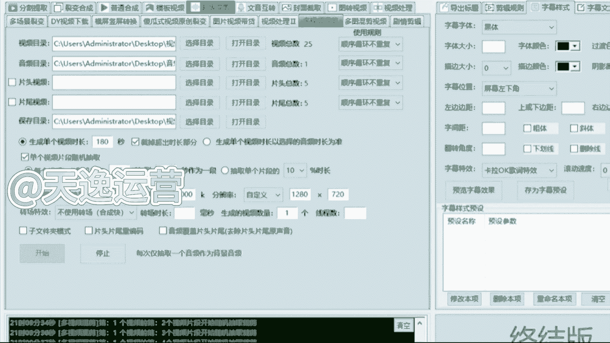
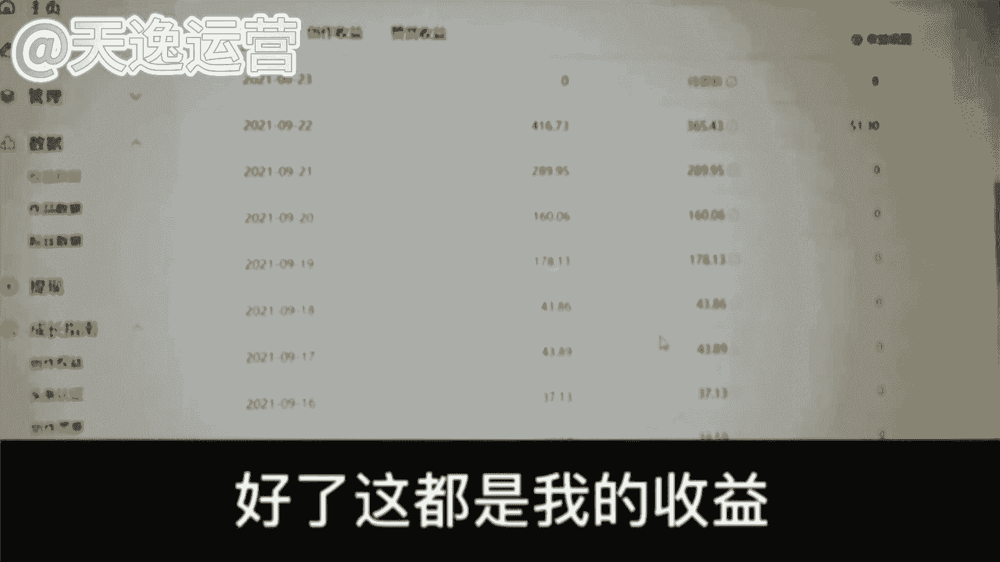

# 【2024版抖音短视频运营教程】全B站最良心的抖音运营高阶教程合集！抖音运营 自媒体起号真的不难！ - P47：16.混剪视频批量剪辑 - j爱卿近日可好 - BV1NteueLEvM

那在这个下载的过程当中呢，我们必须要用到一个批量剪辑的工具，这就是曾曾老师说到的制胜法宝了，首先来看一下该怎么去使用，那首先第一个呢分割提取，就是无论你做的是这个解说还是视频剪辑，还是说批量混剪。

我们都可以用到它，就这个我们只需要把这个链接粘贴进去，然后呢干嘛，我们只需要去调整一个时间参数就可以了，就右边每段的时长，我建议你们每五秒钟为一个片段，这是最好的，也是最精彩的一个片段。

我们直接去调整就可以了啊，5~10秒钟，10~15秒钟，这样去调就可以了，那么今天要用到的呢就是这个超级混剪，多视频混剪这个选项了，首先第一点就把你们自己下载的一个视频素材，全部添加进去。

然后这个混剪的话他是肯定需要音乐的，我找了一个音乐给你们听一下，你们来听一下它合不合适好不好，来听一下这个音乐，It's like fire burning up the way。

Fuking like the world up for just one day，Watch this madness color potirade。

No one can be just like me anywhere，Just like magic，I'll be flying dreams，I'm a disappear。

When they come for，好，那么首先呢我们这音乐添加完了过后，来左下角我们要去添加第一个是什么呢，就有一个生成单个视频的时长，我们刚才说到了哈，就如果你要做的是一个一分钟的是60秒。

如果是一个2分钟的是180秒，如果是一个三分3分钟的，就是180秒，我们按照这样的一个时长去调啊，这个调整完了之后，左下角有一个单个视频片段随机抽取，这个按照我刚才说的来，每五秒钟去调整一个片段。

它是最精彩的啊，15秒到20秒，或者说20秒到25秒钟，我们就选择中间的这一个片段，它是最精彩的，我们可以去用，那这个调整完了过后呢，右下角有一个生成的视频数量，就你想要做多少个，你要想做十个。

你就添加十个，你想做100个就添加100个，这个根据我们自己呃，下载这个视频素材的数量来啊，我们今天呢先做一个，为了更快的去看见这个成品，这个数量我们添加完了过后，只需要点击左下角的开始。

然后他就会自己去执行任务，抽取音频采取这一个视频的片段，这个他就会自己去做一个这个混剪的视频，我们只需要稍等一分钟啊。

这一分钟呢让他去捡，我们来唠一个嗑是吧，那这个呢我也给你们讲清楚，这个工具呢它毕竟是工具，如果说你想让它剪出来的视频，跟我手动剪的一样的好，他达不到啊，他达不到，这个得给你说实话。

就这个视频呢它剪出来这个混剪视频工具，剪出来的每一个呢，它能达到一个正常的推流机制，就是每一个在5000左右的一个播放量，就问一下同学们每天半个小时的时间，有没有就半个小时，我们就花半个小时的时间啊。

我们去剪多少个视频呢，我们就剪十个嘛，其实我们最开始也说到了一分钟呢，他就能剪一个视频，半个小时肯定不止剪十个，我们就按照最低的一个标准来算十个视频，一个视频5000的一个播放量，这播放量是多少了。

5万了，我最开始算的1万的播放量的单价还记得吗，还记得来，你把这个单价打出来，就我最开始算的啊，单价多少，1万的播放量，1万的播放量是34块钱，诶对了，34块钱，我们就来算一下，把1万的播放量是34。

5万的播放量乘以34，来看一下，我们做十个视频，170块钱的收益，满不满足就170块钱，十个视频，我们一个月呢我们也不说多了，我们周末呢也休息一下，我们按照正常的一个工作日来算。

我们一个月做24天的视频嗯，我们乘以24，那一个月我们就靠这个工具，我们每天去堆量4000块钱，能不能接受，能的来公屏上打能子吧，这个收益能接受吗，如果说你觉得这个收益你满足不了，你接受不了的。

OK那你就花更多的时间，更多的是精力把这个量你给他堆上去啊，我是按照最低十个标准来算的，你就去做20个，做30个啊，当然这个过程当中呢，我们的账号他也要多，我们才能够平平均每一天去发布的啊。

这个我要提前给你们讲到，因为我自己所有的小伙伴当中呢，做这个批量剪辑的人真的不是很多啊，不是很多，就是他们都在做批量剪辑，但是不是主体在做的，他们每一个呢要么在做解说，要么在做盘点，辅助工具。

是这个呃混剪的工具，他们拿去堆量的，我好像记得有一个主要在做这个批量剪辑，我看了一下对，就这一个，因为这个同学呢她是一位宝妈啊，当时呢他主要做的就是这个批量的混检，就只做了一个批量的混检。

当时呢他是呃因为自己的过程当中，家里面有孩子，就没有办法自己出去工作，所以当时呢想来做自媒体，就有没有宝妈的，有的来公屏上打，有子吧，有没有宝妈同学，她当时就是他有三个孩子，当他跟我说的时候。

我都特别惊讶，我说你这么年轻，有三个孩子了，他说是的，当时呢她也特别想出去工作，但是因为孩子的原因呢，没办法，她放心不下，这过程当中呢，她跟我说，她她跟自己有公婆住在一起的，就因为公婆的关系不是特别好。

当时呢生活费是每个月她老公发了工资，他去要才会给的，当时就有这样的一个情况，当时呢因为孩子要这个呃，开学了，想给孩子买一些这个开学的新衣服，新文具，我觉得这是一个好事嘛，对不对，当时她说她婆婆知道了呃。

她找这个老公要钱。

她婆婆给直接把那个生活费抢过去了，给她说，那你天天在家里面是吧，又不挣钱，还要花我儿子的钱，他说我儿子的钱是大风刮来的嘛，当时我听的时候真的特别惊讶，我说是真的吗，他说是真的。

我说我以为电视剧里面才有这样的情节，他说当时我也觉得特别生气，他说我过够了这种手心向上的生活，我也是自己有能力的，但是如果不是我是吧，她的这个我老公怎么能安心出去赚钱呢是吧。

他说这一切好像也应该是我换来的吧，当时特别生气，但是我就想让他们来看一看，我是可以靠自己的能力赚到钱，改变自己的生活，给我孩子一个好的教育条件的，当时他特别硬气，但是呢随之而来的一个问题。

但当时时间真的特别少，每天要照顾孩子，每天最多最多他跟我说，老师我每天最多能给你挤出半个小时时间，我当时听了之后呢，其实还是有点为难，我当时给他说，我说那你就先做这个批量剪辑吧。

我说后边孩子上学去了之后，我们再去拓展一些其他的领域，去提升一下收益，当时呢他做了两个月，其实结果还可以给你们看一下，有两个月的时间了，从一开始的什么都不懂，到现在这个月收入已经到1万3了。

还要特别感谢我的解答，老师细心耐心的给我解答和指导，才让我有了这么好的成绩，下面呢我给大家看一下我后台的收益数据，给大家看一下，这个是我这个月的总收益，1万3338，看下收益数据，从第一页。

第一页25号，这都是每天100多，几十三百多，300多，100多，200多，500多的，还有一页，这这边中间就有几个爆款了，900多，1000多，2500的，然后100多，100多，200多，100多。

然后这几天也有一个爆款，100多，600多，200多，400多，昨天有一个爆款还没出来数据呢，好了，这都是我的收益。

这就是我这两个月的收益情况，现在我每天的收益都很稳定了，就算没有爆款的时候，每天也有100多，我觉得吧做这个自媒体就是要耐着性子，坚持不断，更肯定就会有不错的收获，后面的收益也会越来越稳定的。

最后还要感谢老师们和我的解答，好这个视频呢我们就先看到这里哈，呃这个宝妈呢刚才也说到了，如果说呢每天没有爆款的情况之下，收益呢也在100多左右啊，这是一个稳定的收益。

当时呢呃两个月差不多1万3的一个收益，我觉得这个结果呢是因为过程当中，他自己的时间呢慢慢的有增加，当时他把这个作品的数量也是提升了的，包括他讲的一句话是我最认可的，就做自媒体就是要坚持不断，更为什么呢。

因为我们需要活跃自己的账号，你的账号越活跃，平台给你的扶持流量才会越多，这也是很多人自媒体没有做起来的原因，因为他坚持不了，同学觉得你自己能坚持吗是吧，确实啊，说实话，现在很多人呢也做不到这两个字啊。

我的要求是你们可以七一周七天的时间，不用每一天都去发，但是至少要保证你发的时间，要多于你休息的时间是吧，一周七天，你发四天，你休三天都可以啊，你每隔一天去发也可以，你不要发一周，第二周我不发。

这样是不可以的啊，这样不可以的平台，它有寄自己有一个计算方式的这样的方式。