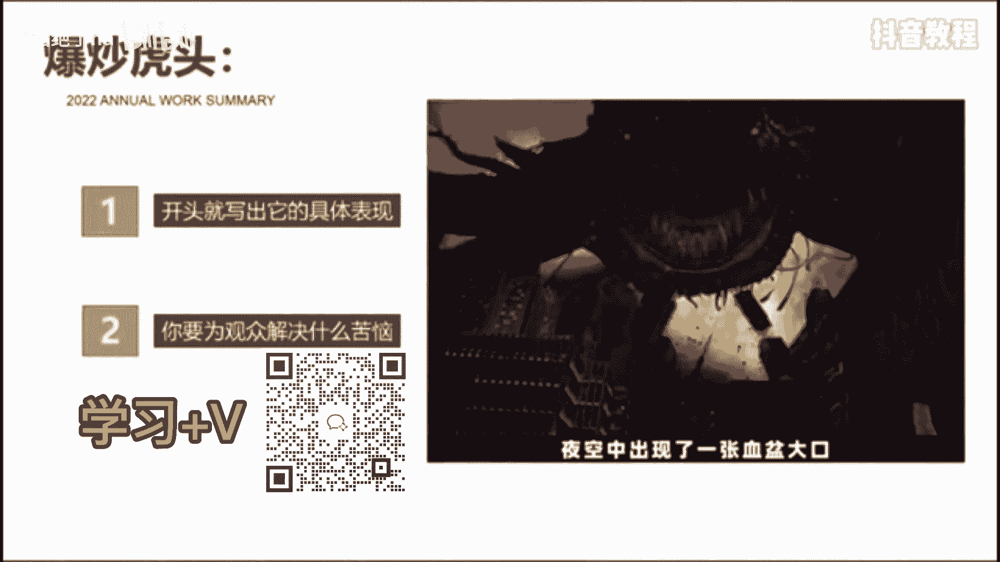
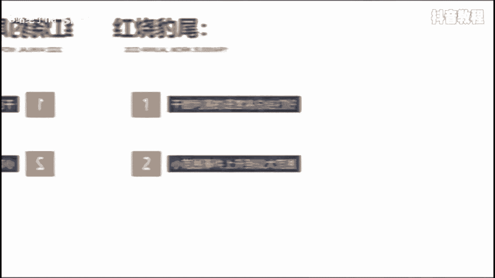
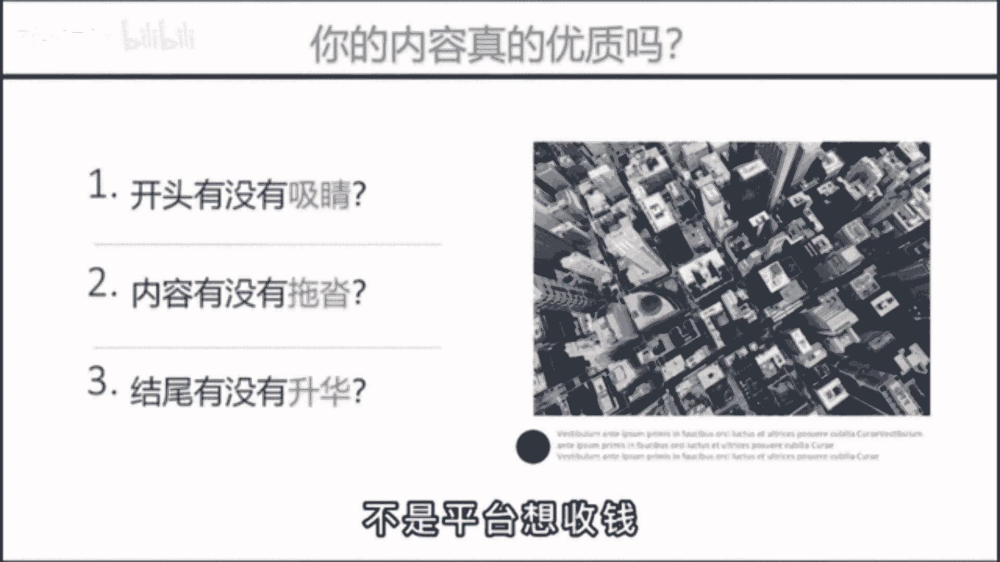

# 【2024版抖音运营教程】全B站最良心的抖音新媒体运营高阶教程合集，抖音涨粉起号 ，抖音矩阵7天暴力起号流程，起号真的快、 - P24：怎么发视频有推荐量 - B站绝了ha - BV1vA4m1w7bU

我也知道好内容才会被推荐，但到底什么才是好内容，这个也太抽象了。

有没有什么办法能把抽象的价值，变成可视化的短视频语言呢，还真有，教你一个公式，爆炒虎头，什锦猪肚，红烧爆米，什么意思呢。

有句话叫客户买的不是产品，而是感觉，爆炒虎头，就是说开头的五秒，我开的精彩像虎头般斑斓夺目，比如这样。

那一天上海感受到了被吞噬的恐惧，夜空中出现了一张血盆大口。

钢筋森林都被他吸进嘴里，开头就写出它的具体表现，而不是给大家推荐一部高分末日电影。

再或者这样，有人说来上海旅游没什么好玩的，那可能是你的打开方式不太对。

作为10年的老沪漂，我想送你今天这份上海旅行攻略，写出你要为观众解决什么苦恼。

而不是我给大家分享三个上海的经典什锦，猪肚呢，此时内容又像猪肚那样饱满丰富，包括画面的切换也要符合情绪的递减。

有这样，然而过了一天，各国股市又普遍的回血。

那问题就来了，接下来这场仗，对全球的经济到底会有什么样的影响呢，内容充实丰富饱满。

一定不能出现任何的节奏拖沓，华而不实的内容，红烧豹尾则是指豹子般意味深长的结尾，用最简短有力，干脆利落的语言将总结打好。

比如这个屏幕前的你看完会不会食欲大增呢。

反正我能多干两碗米饭，用一句反问来提高评论互动数据，再比如这样吞下了委屈，伟大了格局，改变不了别人，就改变自己。

把前面写的小范围事件上升到较大的范围，从而升华视频的主题。

明白了这个故事后，你再问问自己，你的内容真的优质吗，是不是开头不够细节，内容节奏拖沓，让人看不到最后，而结尾呢就一句，我们下期再见，这就是你投抖加没效果的核心原因，不是平台想收钱。

而是你不充钱。