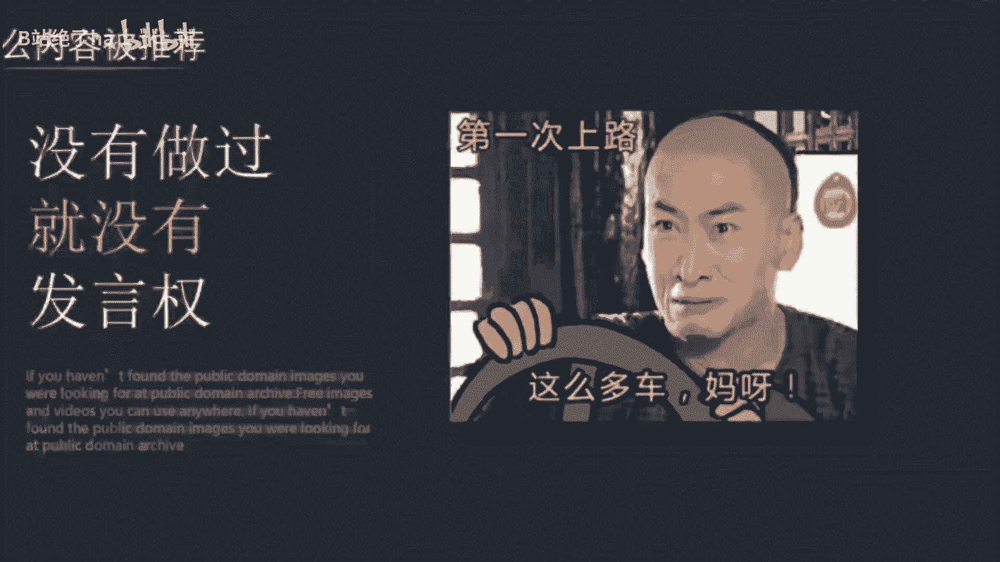
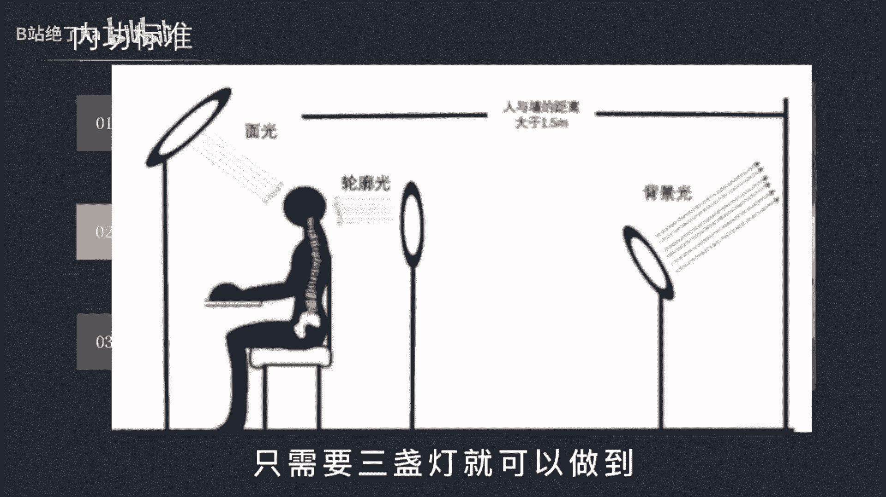
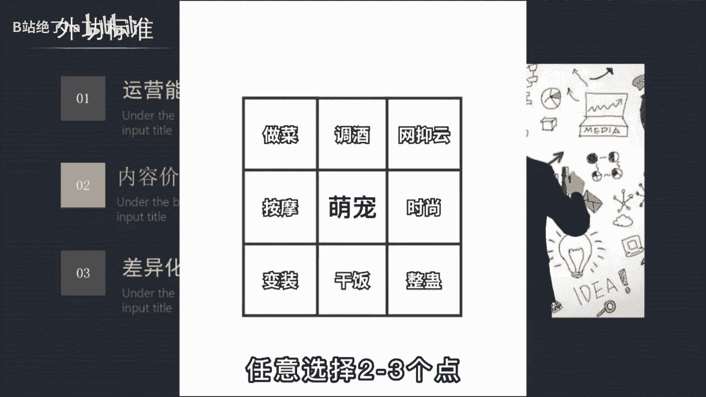
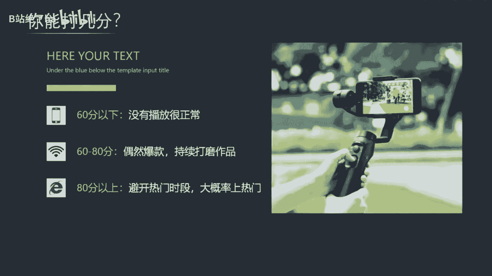

# 【2024版抖音运营教程】全B站最良心的抖音新媒体运营高阶教程合集，抖音涨粉起号 ，抖音矩阵7天暴力起号流程，起号真的快、 - P27：运营篇丨什么内容容易涨粉上热门 - B站绝了ha - BV1vA4m1w7bU

那什么样的内容才会被推荐，才值得投放抖加来撬动更大的流量呢，上一期视频已经给出了答案，但是这个答案没有实际做过账号的小白，根本无法实际理解，有些东西啊只有经历过不会懂，这就和学开车一样。

你嘴上说的头头是道，但一让你上路就手忙脚乱，这就是没有实操的原因，所以这期视频呢我会给你一套打分的标准，哪怕没有经验，靠这套算分值的方式，也能判断自己的内容是不是优质，到底应该优化哪里。

这个打分标准分为内功和外功两个部分，首先外公啊看的是这三点，画面观感，剪辑节奏，叙事逻辑，总体呢是40分，画面观感啊属于比较基础的要求，你的画面字体颜色，配乐等搭配得让人感觉舒服协调。

清晰度呢保证720P以上，其中啊影响观感最重要的因素就是光线的利用，在拍口播类短视频时，常常需要通过打光来让人物和主体进行分离，其主体很清晰，背景很暗，那这种光应该怎么打呢，啊就像这张图这样。

只需要三盏灯就可以做到。

然后呢是剪辑的节奏，什么跳切啊，离奇啊，这些专业名词我就不科普了，只要你是做出境类的，我都强烈建议你看看静静香这个账号，他的整个剪辑节奏的把控，镜头的切换，每三秒的一个反转。

抛开剧情都能牢牢的锁住你的眼球，你直接去看视频去了解吧，那最后一个呢是叙事的逻辑，这个呀是很多新手不太容易掌握的地方，短视频呢它不像聊天那么随意，你必须三秒内就抓住注意力，不然后边就是再精彩也没有用。

那我这里呢给大家一个我自己用的方法论，第一个开头抛出问题加123解答加结尾总结，或者呢开头抛出问题加讲述自己的经历加结尾，升华时间呢控制在一分钟左右，这样调理就会比较清晰，没有废话，每一句都是重点。

接着说内功有运营能力，内容价值差异化，这三点总分是60分，那为什么会比外公高20分呢，因为内容的价值远比技术重要得多，普通人啊一听到运营就感觉啊这东西好专业啊，自己弄不来。

其实呢没必要把运营想得那么高级，我用人话给你解释一下，就是解决一类人群的核心需求，让他带着疑问看完你的视频，会尽可能的提高完播率，最后呢还能得到他想要的答案，这就是运营的工作，比如我这条视频。

你想想自己为什么要看到这里，在期待上面，第二个呢是内容价值，本质上就能够对用户产生影响的内容，那这个呢比较难说清楚，不过啊这些内容普遍都有一些这样的特点，引我思考，引我发笑，与我激励，教我新知。

按照这个标准，你可以对比一下自己的作品有没有做到，最后一个呢就是差异化，这里有个小技巧，比如说你想做一个萌宠号，那就画一个九宫格出来，把所有你个人的爱好写上去，任意的选择两到三个点。

这样呢就会出现一个差异化的创意，比如他就是用这个方法，最终变成了一个1300多万粉丝的账号，因为猫咪会做饭实在太稀奇了，通过这个评判标准，你可以看看自己的作品能打几分，综合达到60分为及格。

可以正常的发布，80分以上为优质视频，适合投抖加，然后呢持续日更就完了，因为大多数人啊最擅长的就是放弃别人呀，还在对标优质内容，但你有了这个标准，就可以对标生产队的驴了，送一句话，成功的道路并不拥挤。

