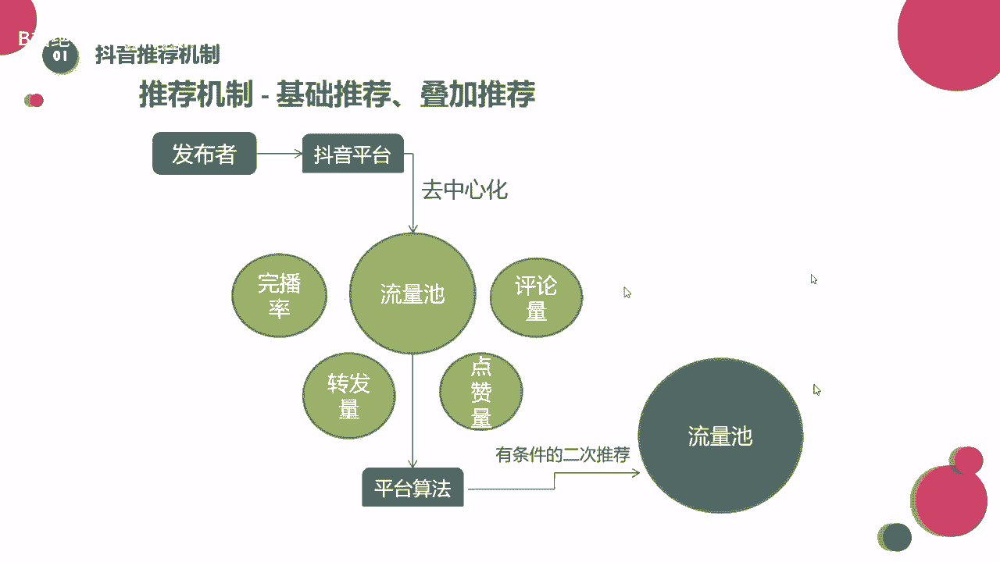
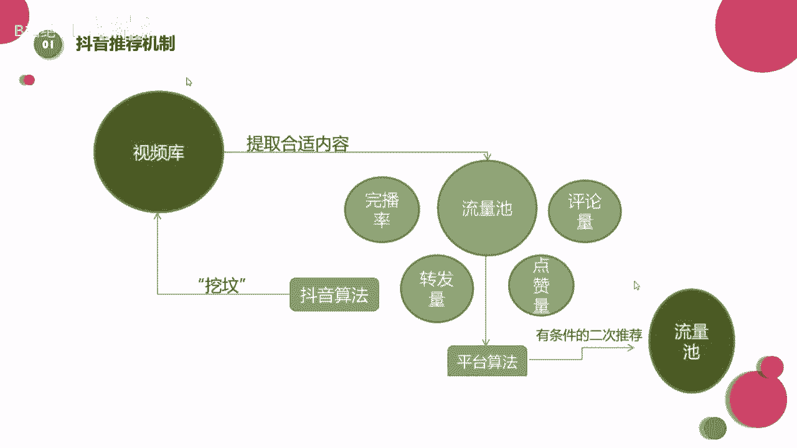

# 【2024版抖音运营教程】全B站最良心的抖音新媒体运营高阶教程合集，抖音涨粉起号 ，抖音矩阵7天暴力起号流程，起号真的快、 - P33：推荐机制—时间效应 - B站绝了ha - BV1vA4m1w7bU

让人理解，那么除了基础推荐和抵押推荐之外呢，它的推荐机制里还有一个叫做时间效应。

来到这里来看一下这一部分，大家知道，就是刚才我们看到的基础推荐和叠加推荐，那个示意图，那么这一块啊是我们第三个推荐机制里面的，叫做实践效应，那么什么是时间效应啊，我举个例子啊。

不知道同学们有没有遇到过啊，咱们发布了一个视频之后，哎你发布之后的当天或者第二天他没有被推荐，或者是推荐的比较少，他观看的播放量比较少啊，但是可能过了一个周之后，你发现它的播放量就上涨了。

甚至它能持续一个月，是不是就是它能持续一个月啊，这是到了一个月，两个月之后，你发现原先发过的视频，它的播放量上涨了，这是为什么，这其实就是时间效应的原因哈啊为什么，我们来看一下，你像这里有一个视频库。

那么其实啊抖音他会把他自己的作品，就是把我们的作品放在他自己的视频库里，那抖音这么多用户，只要你把视频发出去，那这个视频就存在于他的视频库里面，你就说所有的视频都在这里边，都在这里边。

那如果说啊就是这个时候啊，我第一天发出去之后，我的这个视频也没有蹭到什么热点，那内容也不算特别优质，可能我们就在视频库里就呆着了，那等到有一天，等到有一天啊啊这个时候可能有些热点出现了。

正好我的视频比较符合，那他就会从他的视频库中去找一些原有的库存，去再进行一次二次推荐，大家能懂吧，啊我举个例子哈，那比如说就是嗯比如说李小璐，李小璐吧，比如说你特别喜欢李小璐。

你发的视频就是李小璐的视频，但是今天你发现他没有火，但是过了一段时间之后啊，你发现哎李小璐可能又因为卖衣服啦，或者跟贾乃亮有什么样的绯闻啦，哦他这个时候热度上去了，你就发现你的那个视频呢。

可能跟着这个热度也上去了，对不对，也进行了一次二次推荐，也又走了一遍这个流程，这个是有可能的，那么像这个时间效应呢源自于抖音啊，什么抖音源自于贴吧上，最开始的一个概念叫做挖坟，叫拉粉。

其实就是通过算法发现热点，再重新去视频库里寻找一些原有的库存，再次提取到合适的内容，进行一个流量池的推荐啊，这个也是比较容易理解，所以说同学们，如果今天啊你非常用心的去做视频。

安老师说的每个步骤的都有了，你可以多关注，多引导他再次被推荐的几率比较大，那么这里我也要再强调一点哈，这种这种机制啊，时间效应的机制呢只是专属于抖音这个平台的，大家知道除了抖音这个短视频平台之外。

还有快手也是属于短视频平台，对不对，他们俩在这一点上区别还是比较大的，那么快手啊，他的推荐机制叫做择新去旧机制，泽馨去旧，什么是择心祛痘机制哈，其实就是啊我会推荐新的视频。

旧的视频发出去一周甚至一个月之后呢，我就不会再推荐了，不论这个时候发生了什么热点，我都不会再去推荐旧的视频，大家能懂吗，所以这个呢是快手和抖音比较大的一个，机制上的差别好吧，抖音的叫时间效应。

快手上的叫泽新去旧。

