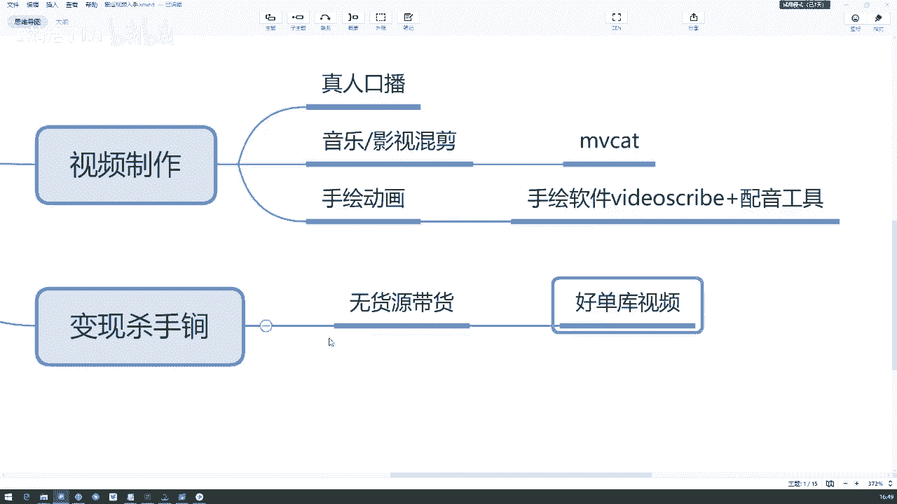
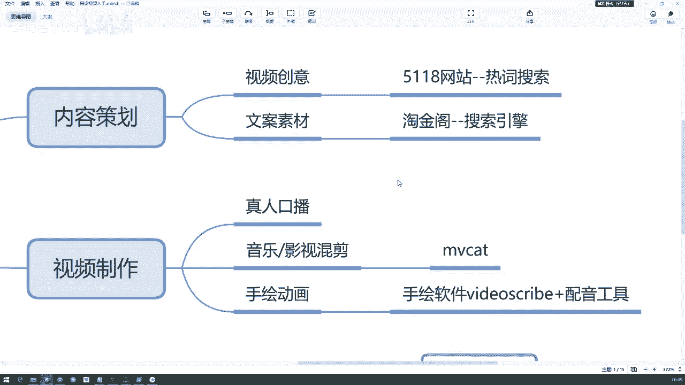
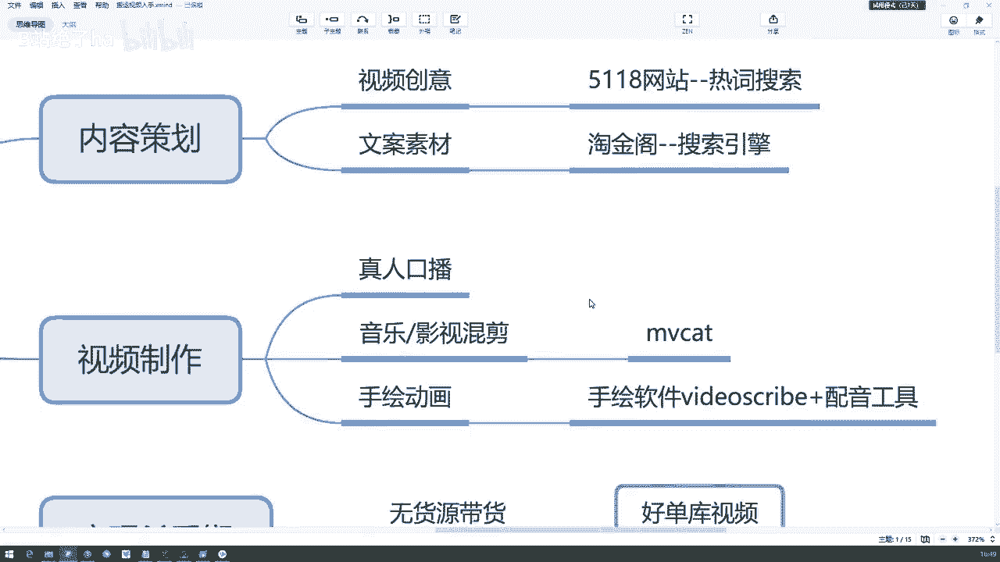
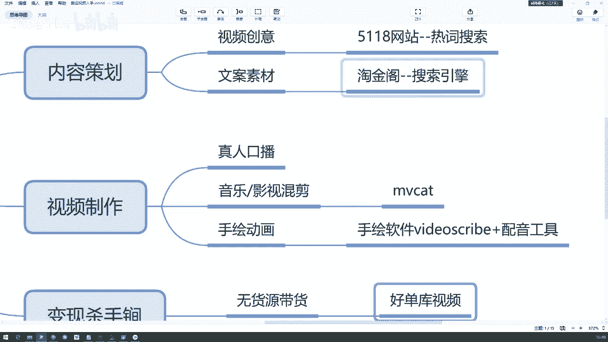
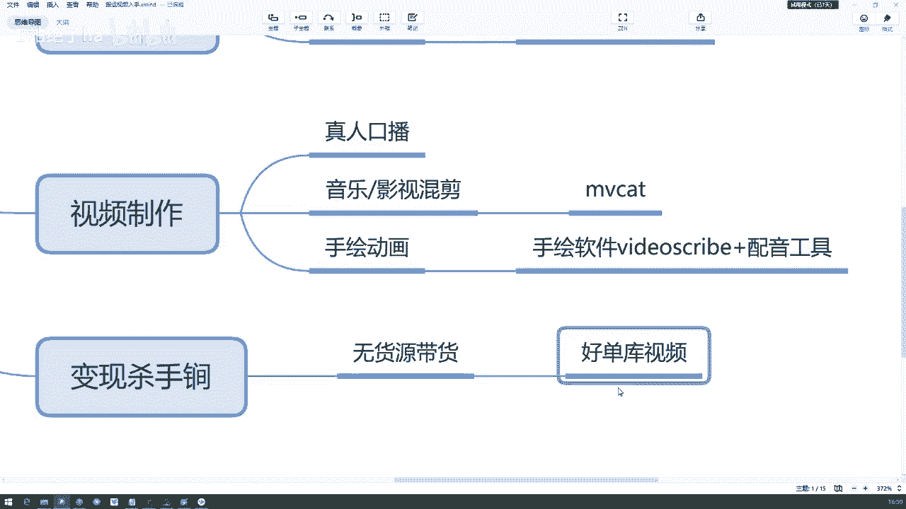
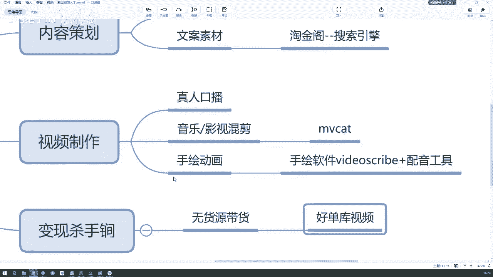
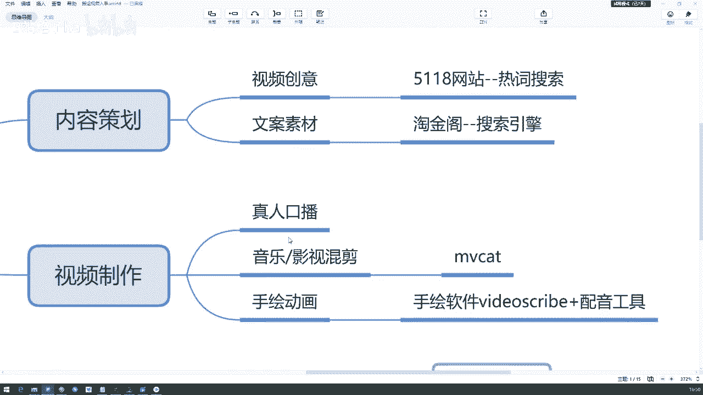
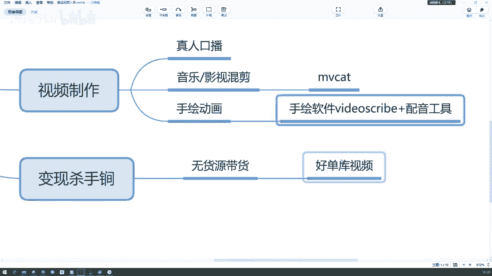
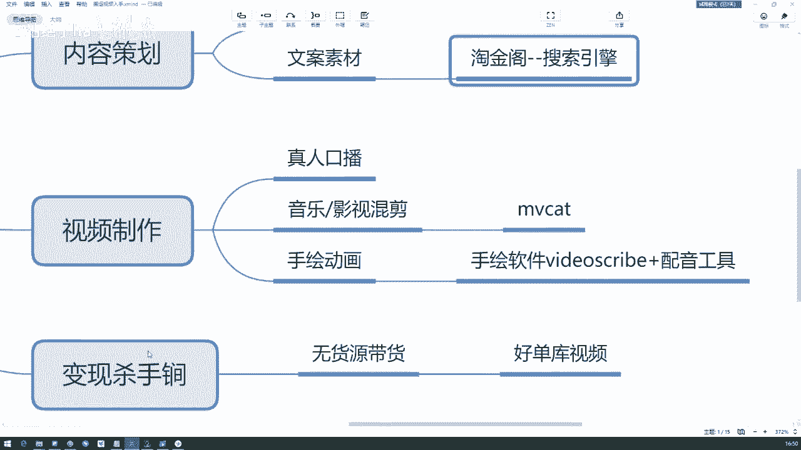
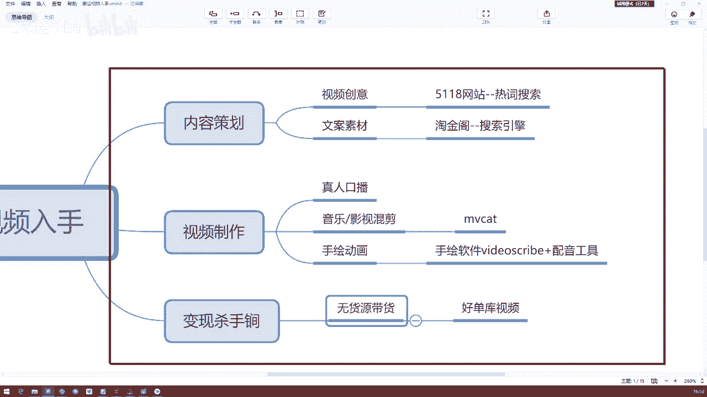

# 【2024版抖音运营教程】全B站最良心的抖音新媒体运营高阶教程合集，抖音涨粉起号 ，抖音矩阵7天暴力起号流程，起号真的快、 - P41：快速变现方式 - B站绝了ha - BV1vA4m1w7bU

大家懂吗，这个是一个快速变现的方式，快速变现的方式，但是变现的方式不止这一个，你想要去这个带货的方式呢也不止这一个，因为如果说啊你有自己有货品，你自己有货品，你自己去拍摄它，它的话它的效果会更好对吧。

在这里呢是想给很多无货源，我们想带货，我们零成本想带货的话，我们做这种方式可能会比较快捷一点啊，比较简单一点，然后呢它的一个变现的成本比较低一点，但是我什么都卖，要开开很多号吗，如果你很什么都卖的话。

如果你放在一个号里，他确实很容易开，就是卖不出去，然后很杂乱，然后整整个账号的定位也不好哦，即使我们是做这种无货源带货，也想快速变现，也不要忘了我们前两节课，讲给大家的那个内容定位啊，商业定位那些。

大家能懂吧，即使我们想快速变现，这些东西还是要有的，还是要有的，定位的话，最好还是做垂直领域的，因为你想卖出去，你得保证你的这个播放量还是比较高的呀，对吧，那如果你实际去拍摄的话。

你想卖东西实际去拍摄啊，你这样的话原创效果肯定是会好一点的，因为它的真实性更高，对不对，可能你承担量啊，它的转化率会好一点，但是也有很多同学他是没有的，他没有了，所以这个是想告诉大家。

今天的就是嗯不原创，然后没有货啊，或者是觉得原创现在还有点困难的，同学可以采用这些方式，我们去做这种其他形式的视频。

其他形式的视频，当然我讲的这些呢并不是说哦原创不能做啊。

原创做起来肯定是更好的好吧。

因为做运营的话呢，呃运营和我们说拍摄剪辑还不太一样，运营的话他还是说嗯看的是效果，他想用最短的时间完成一个最大的利益化，对所以说会有这些东西，会有一些热词的网站啦，包括文案的网站啦。

包括说这种手绘软件的出现了，以及这种好短裤视频的去啊，去那个什么去进行一个伪原创。

去进行一个搬运了，好大家能懂吧，那这块呢。

其实今天就是这一部分想给大家讲的啊，所以这块让大家能够记住的是这个5188。

然后这个淘金阁，还有就是这个手绘软件以及好单库的这个网站。

希望大家课下可以去研究一下。

好吧这一部分呢还是穿插着来讲的。

因为总的来说呢，我们还是鼓励原创的是吧，还是鼓励原创的，因为我们毕竟是学了这个拍摄剪辑了嘛，所以原创这个东西不能忘，嗯其实有同学已经在做这一块了，来给大家看一下，其实我同学已经在做这一块了。

因为我看过好几个同学给我发这样的视频啊，给我发类似的视频，但是他们可能出现的问题哈，在这里跟同学们说一下，如果你要去做这个的话，一定不要在我们的视频里出现，价格也不也不要不说话，也不要不说话。

不要出现价格，也不要不说话，但是也不要说你买它现在优惠，不要出现任何买卖的词汇，你单纯的去介绍它就行了，单纯的介绍它展示效果就OK了啊，这一点要注意，另外这个守护软件的话，它就是这个英文名字啊。

他如果在淘宝上卖，也就25块钱，可能最基础的那个十块钱就能买到，好吧，包括说呃这个淘金阁啊，包括上面的一个热词搜索素材的网站，你去做这种文案运营或者新媒体运营啊，什么都是可以用到的，还是比较强大的好吧。

那这一块大家懂了没有，这一部分大家能懂吗，这块能懂吗，因为我没有在很很细致的去讲啊，比如说淘宝联盟的那个原理，那个网站啊，没有去给大家展示啊，因为这个的话大家其实在这个啊抖音的后台。

就是商品橱窗那个位置啊，他都有很清楚的那个标注，去引导你。

