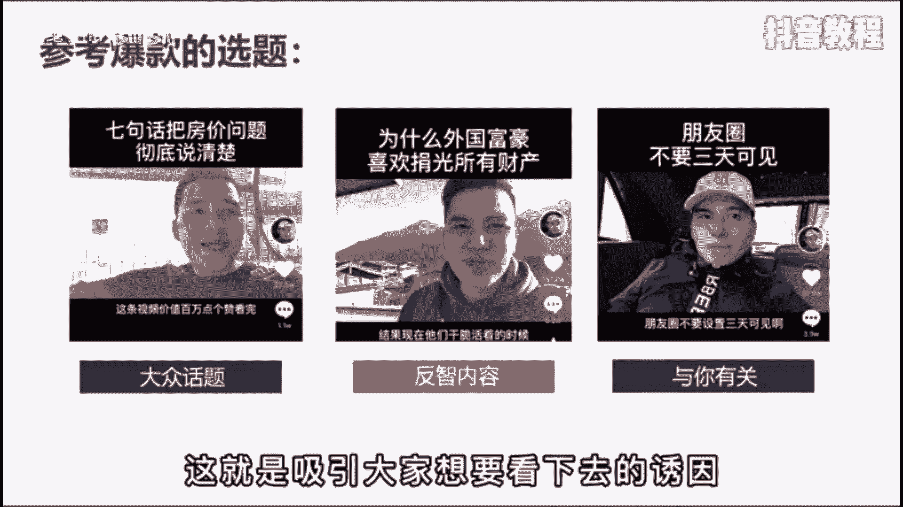
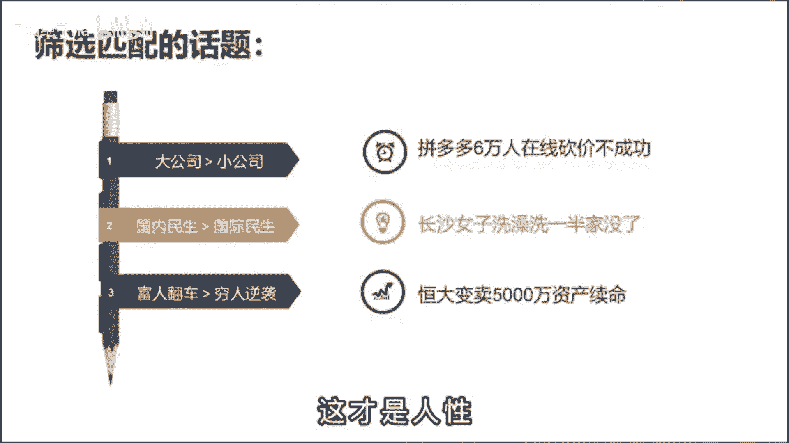

# 【2024版抖音运营教程】全B站最良心的抖音新媒体运营高阶教程合集，抖音涨粉起号 ，抖音矩阵7天暴力起号流程，起号真的快、 - P44：基础篇丨抖音如何做出爆款选题？ - B站绝了ha - BV1vA4m1w7bU

今天我要分享的是如何找到一个必火的话题，一个好的选题就是内容再差，也会有一定的流量，而如果你的干货都在中间，把别人开头就划走了。

也没有意义，很多人啊都发出选题啊，不知道选择什么方向，但找选题这个事，其实呢，我们可以通过已经火过的内容来找到规律，比如说大蓝啊，你把他10万点赞的视频标题都扒下来。

就会直观的发现他的选题呢无外乎就这三点，大众话题反制内容与你有关啊，比如说七句话，把房价的问题彻底说明白，房价问题呢永远是自带流量的，那属于刚才说的大众话题，而我要跟你彻底说明白。

哎这就是与你有关的范畴，这个选题呢同时采用了两个药店，那它必然是一个优秀的选题，最终数据呢点赞22万，评论一半，而反之内容呢则是指颠覆了大多数人的认知啊，比如为什么外国富豪喜欢捐光所有财富。

正常老百姓不想有那么多财富，不得飞机有体挥霍起来啊，为什么要捐了呢，这个呢就是吸引大家想要看下去的诱因。

那最终数据是157万，点赞6。2万的评论，那道理是明白怎么筛选匹配的话题呢，啊比如说你是做口播知识类账号，今天呢同时有三个热点，拼多多6万人在线砍价不成功啊，长沙女子洗澡媳妇嫁女儿，第三个。

恒大变卖了5000万资产续命，你会选择哪个选题来做呢，答案都可以，你今天去说拼多多有多恶心，点赞肯定是过万的爆款视频，在这里呢有一个基本的原则，就是在话题的选择上，大公司的话题大于小公司的话题。

国内民生话题大于国际的民生话题，富人翻车的话题大于穷人逆袭的话题，这个呢就是朴实无华的大众价值观，但在第二点上估计有人会反驳，而最近国际形势才是热门啊，老李你说的不对，但这种事情呢是特殊事件。

还不具备参考意义，一般在正常的情况下，大家只会关心自己的生活，这才是人性。

那无论你是做什么类型的账号，想要有流量，就不能过多的被自己的主观感受所影响，你的感受呢是没有流量的，大众关心的事儿才是流量密码，尤其在内容质量相差不大的情况下。

想要战胜同领域的对手。