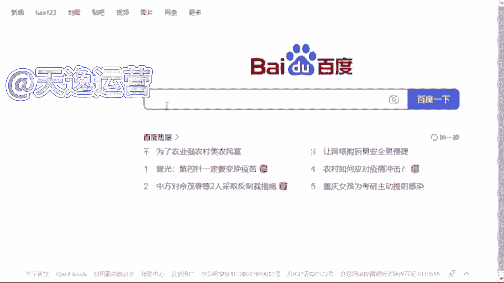
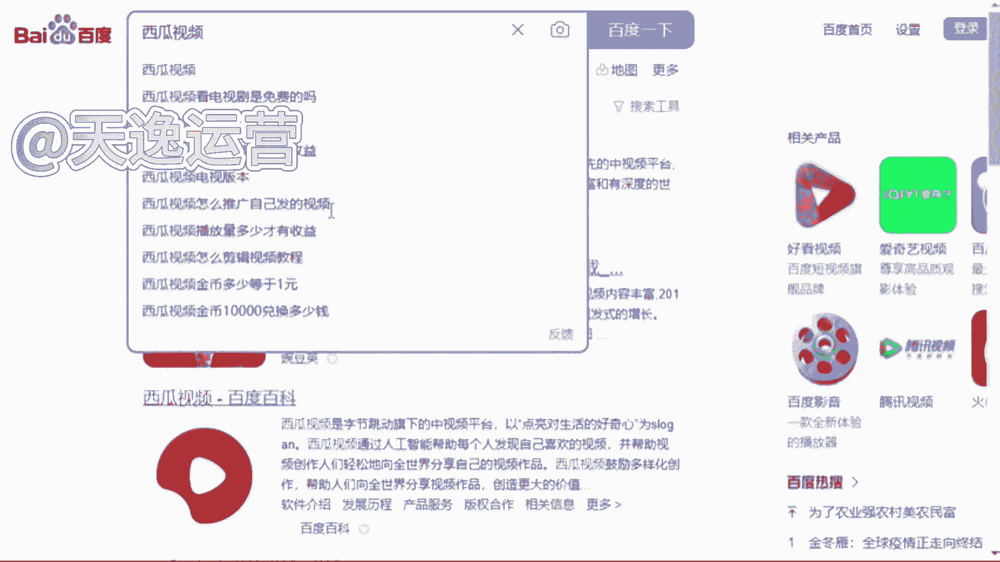
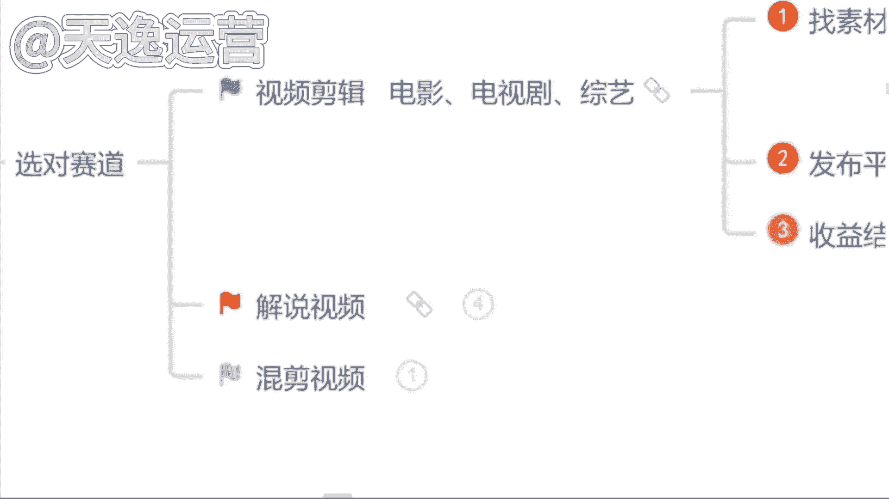

# 【2024版抖音运营教程】全B站最良心的抖音涨粉运营高阶教程合集！抖音短视频运营 起号真的不难！ - P12：5.视频剪辑找素材 - 是你的孤风呀a - BV1ix4y1z7P8

啊那首先呢我们先来讲第一个视频剪辑类好吧，视频剪辑的话呢，分为很多都可以去做这个视频剪辑，比如说首先第一个就是这个电影的，就影视的剪辑嘛，电影的啊，除此之外呢，像这个电视剧的或者说综艺的啊。

这个都是这个视频剪辑类的，那如果说我们想去做这个视频剪辑类的呢，我们首先要去干嘛，要去找素材，对不对，那这个素材我们该怎么去找呢，找素材呢我们先从这几个平台去找，首先第一个所有的视频平台。

知道视频平台有哪些吗，啊那现在不知道的同学来看一下，这个就是我刚才让你们截图保存的。

这30多个自媒体平台，现在不知道的同学再截图保存一次啊，这30多个自媒体平台呢，都是我们能够找到素材的地方。

那这30多个自媒体平台呢我们都能找到素材，那除此之外呢，第二个我们可以去一些影视网站里面去找，我不知道同学们有没有了解过哈，影视网站，比如说我举一个例子，就原来我们所说的这个豆瓣电影这样子的呢。

都是这个影视的网站，包括我自己呢整理了将近有这个50多个啊，影视的一些网站，这些网站里面所有的一个影视素材，它全部都是没有版权要求的，这个呢我到时候也可以送给你们，除此之外呢。

这个平台呢就这些网站呢它是关于影视类的，就很多同学说哎曾曾老师，那我不想做影视类的是吧，我想做一些其他的什么动漫的，综艺的，搞笑的，我想做一些这些类型的，OK也可以啊，我自己也整理了将近有60多个。

这60多个网站了，里面除了影视类的，像这个旅游的啊，这个图片类的啊，音效类的，评论的，体育的，美食的，动漫的，综艺的，搞笑的，或者说各个国家的境内境外的视频素材，我们都是能找到的啊，都是能找到的。

这个呢我后边也送给你们好吧，让你们能有一个找素材的地方，那除此之外呢，第三个就是我所讲到的这个影视推广的平台，就影视推广的平台呢，现在他可能做的更多的，就是我们在这个抖音或者说快手上面。

我们很多同学都知道哈，你去抖音或者说快手上面做视频，有做过的，来就去这个抖音或者快手上面发过视频的，有没有，因为我们都知道哈，就抖音和快手这两个平台，你去发布视频。

最多最多可能只能达到一个涨粉的作用是吧，这个播放量它是变不了线的，那如果说我们去做这些影视推广，平台里面的这些影视素材啊，我们是可以靠这个播放量去拿到奖金的啊，这个平台呢等一下我会着重讲啊，我会着重讲。

那么首先呢如果说我们要去做这个视频的剪辑，我们素材该怎么去找呢，比如说我给你举个例子吧啊吧，我们今天打开我们自己手机百度，那我们先打开这个百度，打开了过后呢，我们随便去搜索一个自媒体平台吧。

嗯用这个西瓜视频，我们搜索一下这个西瓜视频。

然后点击百度，我们打开它的网页，比如说我今天举一个例子，我想要去做一个这个关于综艺类型的是吧，我想要找一个人，比如说综艺类型的，就是它跟娱乐是相关的，就同学们平常看直播吗，直播看不看。

就像一些网红的直播，什么大杨哥，小杨哥是吧，比如说我们想要找一些这一类的素材，我们直接去搜索他们这一个关键词就可以了，什么关键词呢。

就直接搜名字啊，大洋哥，小杨哥，我们直接搜索关键词，然后点开搜索，我们就能找到非常多的一个素材了。

现在我们按照这种关键词的方式去找素材，能不能找到，但是在这个找素材过程当中，我得给你强调一点，我们正确找素材的一个方式，不是让你们把这个视频直接下载下来，就很多同学。

我不知道同学们有没有听到过这样一个词语，就你们可能听过课程的哈，有的老师叫你去做搬运，有没有听过的，或者说有没有做过搬运的，如果说你直接去把这个视频下载下来，它跟搬运就没有什么区别了啊，搬运的内容。

现在平台95%的人，你去做都通过不了审核，所以说告诉你们正确找素材的一个方式，就是我们要从这么多的这个视频当中去找到，符合我们自己视频主题的视频片段，就每一个片段呢大概保持在十秒钟左右啊。

十秒钟这个数字你们要记住，到时候我们找到素材，我们去做视频平台，在审核的过程当中才能给你通过，是不会有违规存在的，这个记住了吗，记住了，公屏上打一啊，十秒钟左右，每一个素材片段。

就按照这一个这个时长去找就可以了，那除此之外再举一个例子，比如说我们今天想要做一个沈腾的是吧，沈腾明星明星网红，他都是自带呃这个热点的啊，热度的你去做，他不缺流量啊，不缺流量的那一样的。

我们打开一个关键词直接搜索。

就你们能找到素材呢是非常多的啊，是非常多的，那现在我们素材能找到了吗，那如果说我们这个视频素材我们自己能找到了，那我们想要去做视频，OK那我们是必须要用到什么呢，用到剪映这个软件的，做视频的话呢。

问一下同学们用哪一个软件，用的是最多的手机还是电脑，你用哪个，我等一下就用哪一个给你们实操好吧，根据你们的一个要求来，都是手机呀，没有一个打电脑的吗，呵呵好的，我知道了，就你们打手机的这个速度。

就让我感觉到生怕我看见电脑是吗，好的，稍等一下，我投个屏好吧，我投个屏，啊那我们今天呢如果说我们要做视频哈，我们首先呢要确定一个什么呢主题，比如说我举个例子吧，我说我们今天去做一个综艺类型的。

我们就要确定一个人物，什么人物呢，我们今天去做一个这个呃沈腾的搞笑名场面吧，就这一个视频的主题，我们的主题确定了，那这个视频的素材当中必须要有沈腾这个人，这个是主题。

