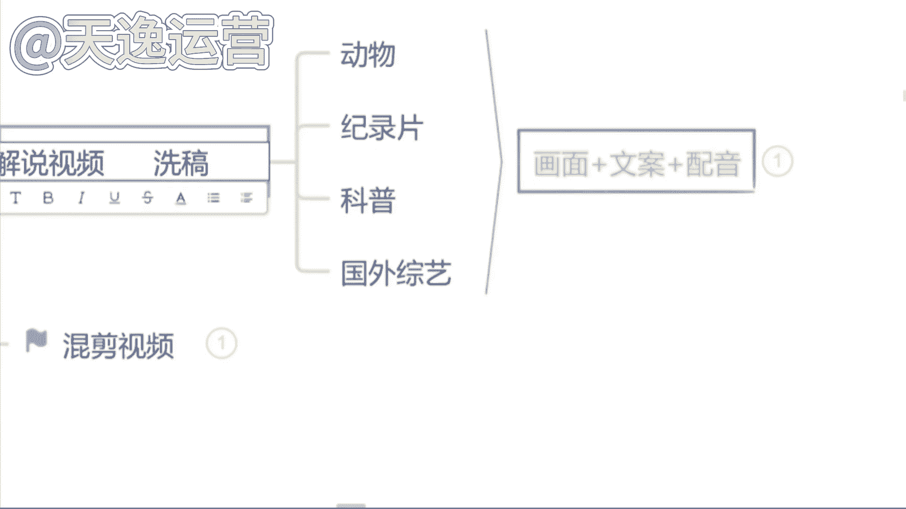
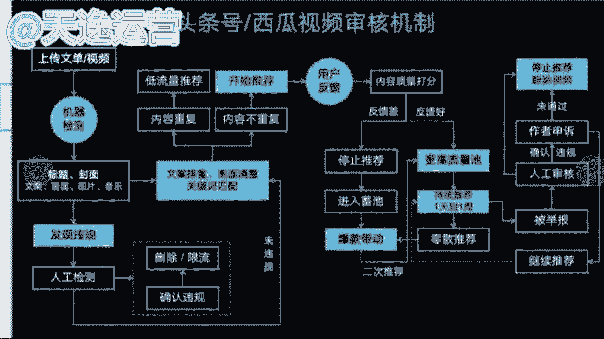
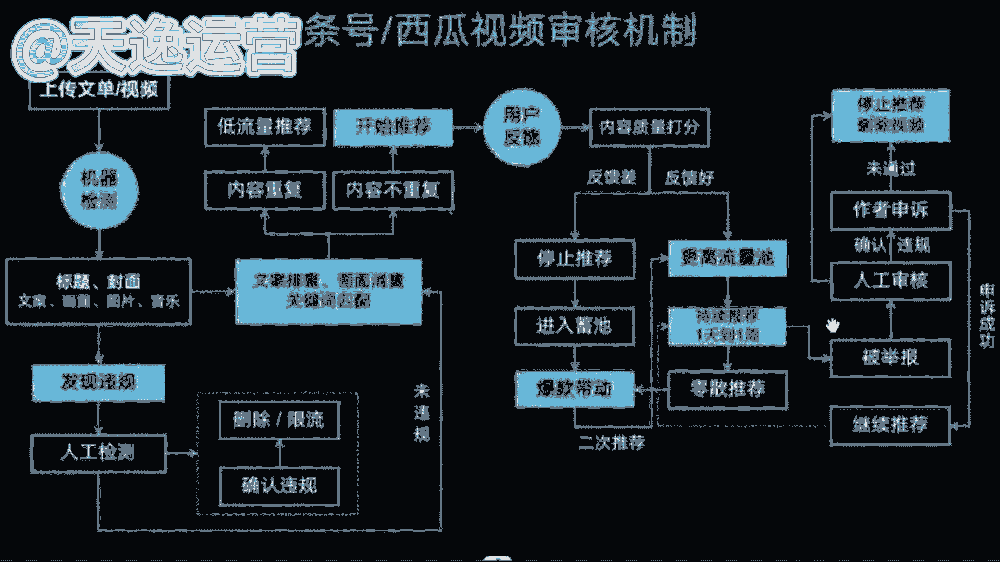
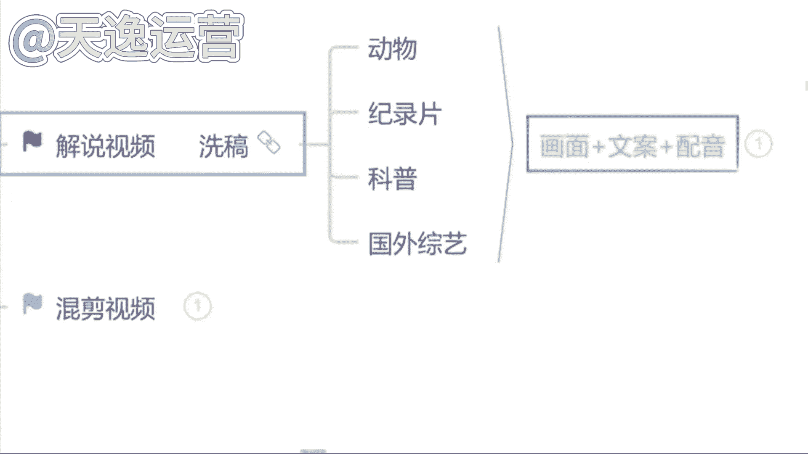

# 【2024版抖音运营教程】全B站最良心的抖音涨粉运营高阶教程合集！抖音短视频运营 起号真的不难！ - P17：10.头条-西瓜视频审核机制 - 是你的孤风呀a - BV1ix4y1z7P8

那除此之外就问同学们一下，有没有想去做解说的啊，你说曾老师，我就想做这个影视的这个推广是吧，我在这个基础之上，我还是想要去添加解说，我也想要去争这个双份的收益的，有你哪有字吧，有想要去做解说的是吗。

好的好的，我看见了在这个影视解说的话呢，就很多同学在选择这个解说之前，如果同学们这样一个问题，你在没有来听我的课之前，有没有听到过这样一句话，就很多老师告诉你诶，同学们不要去做解说了。

解说他已经赚不到钱了，有没有听到过这样言论的，没关系，如果说有听过的呢，我们就不要去信好吧，如果说没有听过的呢，咱们就不要去听了嗯，因为影视解说或者说解说的视频，它是我们所有的视频领域当中。

最赚钱的一个领域，赚钱的东西，我们为什么不去做呢，只是说在这个过程当中呢，我们一定要选择好赛道，因为我刚才讲到的影视解说呢，他不是不可以做，他是可以做的，只是说不太好做而已，不好做是在哪里呢。

很多同学如果说你没有版权的情况之下，当然我们就没办法去做，因为影视版权的会非常重要的，但是如果说你去做这个影视的推广，你去做解说，它是有版权的，他就对于我们来说就比较好做了，那如果说很多同学。

你不想做这个影视推广的同时呢，你想去做这个解说的视频，我们就去选择一些跟这个教育类相关的，教育类相关的呢就有很多，就现在社会当中有句话说的非常好的，就很多人都说哎我们所有人，包括我们自己也好。

我们的父母也好，在这个教育这个领域当中，这个行业当中花的钱是最多的，这句话认可吗，认可的还公屏上打个认可两个字吧，认可吗，就这句话，有很多人在教育这个行业里面花的钱是最多的，我们做视频。

我们就去贴合教育这个领域去做，我们做解说，一样的，我们就选择教育相关的动物类的，纪录片类的科普类的，就包括我们小时候也是一样的哈，我们在家里面的时候，我们放假的时候，我们爸爸妈妈也好是吧。

我们的爷爷奶奶也好，从来不希望我们在这个家里面去看一些，什么动画片啊是吧，或者说什么动漫呀，不需要我们看这些没有营养的东西，我们可以看什么呢，动物世界有看到过吗，动物世界有看到过吗。

就我们小时候肯定都会看的哈，包括这个动物的纪录片的科普的，现在国家都比较支持这些行业啊，这个领域为什么呢，是因为我们所有人在观看这些视频的过程当中，它是可以获取一些不同的社会常识的。

这对于整个社会来说它是有用的，这个我们就可以去做，因为平台给的扶持流量，它是会高于其他领域的啊，就这几个领域，当然我在讲这个解说之前呢，一样的得给你避个坑，什么坑呢，就很多老师给你讲解说的时候。

他会教你们，所以同学们我们不会写这个文案，没有关系，我们可以去找素材来用，我们找什么样的素材呢，我们直接去做洗稿，有没有听过洗稿的，有没有做过洗稿的，有没有听过的，或者说有没有做过洗稿的，有是不是。

那首先你们强调一点哈，洗稿的内容不要去做了，嗯这个国家都是发布了文件的，明令禁止，不能去做洗稿的内容，你想一想，国家都发了文件的内容，你去做这个平台审核能通过吗，通不过的，就很多同学可能没了解过的。

给你们讲一下洗稿是什么意思，这个坑你们必须要避开，就很多人呢他确实想做解说的视频，但是呢自己不会写文案，或者说自己不想写文案，直接把人家的这个解说视频下载下来，通过工具把他的这个解说文案。

就文字全部提取出来，然后再通过洗稿的工具，或者说自己手动的方式把这个文字颠倒顺序，然后我们拿过来使用，这个就是洗稿了啊，这个就是洗稿，现在不能做平台明令禁止了的，因为我做过这个视频的人，肯定都知道。

你这个视频呢发出去永远在一个小时之内，它的播放量就已经到达上限了，这样子的视频你就思考一下，它一定是重复度过高了，因为如果说我们视频的重复度，达到了60%到85，这个阶段的。

基本上平台审核你们是通不过的，因为近6年期间我也在审核很多作品，我跟这个字节跳动说有合作的，就我在审核作品的过程当中，我觉得很可惜的一点是什么呢，就很多人都想用这个呃，这个自媒体也赚钱。

但是确实采取了一些不合法的手段，就不对的方式，你去做这个解说洗稿，我想给你通过，但是没办法，规则是放在那里的，我是不能给你通过的。

要不然对其他人是不公平的，就包括现在你们看见这个啊。

这就是每个平台审核它的一个机制，如果说这个内容你发出去重复度过高了，因为我刚才讲到60%到85，平台审核是不会一定通过的，如果说你恰恰踩在了这个50%的一个，重复度这个地方啊，你成为了那个漏网之鱼。

你发视频的时候，这个平台是会给你通过审核的，但是你这个视频永远在一个小时之内，你的播放量就已经到达上限了，平台就不会再给你推送流量了，有没有这样情况的啊，这个就是我们俗称的重复度内容。

有的有重复度内容的这个作品，我们不会给你推送很多的一个流量，如果说你的内容不重复，我们才会给你推送更高的一个流量池，就我不知道同学们有没有看到过这样的视频，就有的视频我在月初的时候我能看见他。

但是我在月末的时候我依然能够刷到他，有没有看到过这样子的，这就是我们俗称的优质的作品啊，这个质量比较高的内容没有重复的，我们会愿意给他推送流量，就我们会持续给大家推荐一天，一周甚至一个月。

就这一个月里面，哪怕你不做视频了，哪怕你去玩了，你这个视频在这个平台上面，我们持续去给你推荐流量，这个叠加的流量你们都可以去结算收益的啊。

有这样的情况，是不是这个就是我所说到的啊，质量好的作品没有重复度的，他没有做洗稿的一个内容，这个首先给你避个坑啊，讲到这里呢，还是那句话，就你听完这堂课，无论你跟我学还是不跟我学。

我都希望你们做的是正确的事情，不要去浪费咱们自己的时间啊，不值得，他也不划算，是不是，所以说洗稿内容不要去做。

