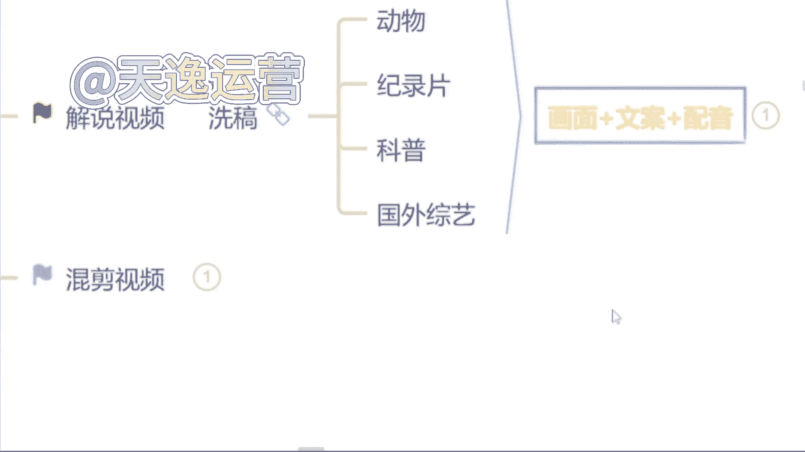
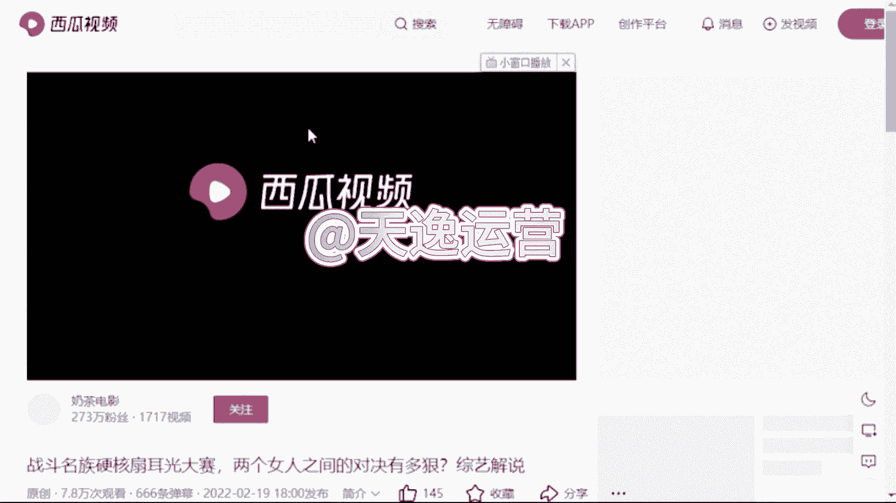
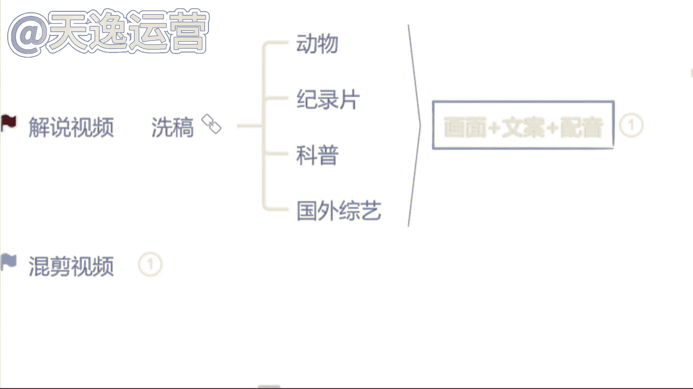

# 【2024版抖音运营教程】全B站最良心的抖音涨粉运营高阶教程合集！抖音短视频运营 起号真的不难！ - P18：11.解说视频哪几方面组成 - 是你的孤风呀a - BV1ix4y1z7P8

那么在讲解说之前，我们首先先去看一下什么样的饰品，它叫做解说是从哪几方面来组成的。

先去了解一下，真的抗打胡子哥的胜利来之不易，比赛竞技大家请勿模仿，如果给你一个机会，你愿意参加这种比赛吗，就是我们刚才看见这个视频呢，这个视频呢就是非常典型的一个。

解说类的视频了，三方面组成的哪三方面的，包括给你们放小一点，你可以再看一下，首先第一个呢就是这个画面啊视频，那第二个呢就是有这个文案，看见没有这个文案的情况之下呢，还是会啊，就有这三方面组成的。

包括你们现在看见这个是一个国外综艺的解说，因为国外的综艺呢现在走的真的非常的野，除了你们现在看见这个什么扇耳光的也好是吧，经常刷视频的人，应该都有看到过一些奇奇怪怪的，这是什么掰腕子的呀。

什么真心话大冒险的呀，包括这个国外不是走这个开放嘛是吧，什么这个综艺里面穿什么比基尼的呀，这样的视频真的特别多啊，特别多，不过现在呢这可能这个也比较抓人眼球，而未来你们可以去做这样的视频，国外的一些。

那今天呢我可能不会给你们讲啊，因为这个国外综艺的话呢，它是会涉及到一些国外的平台和国外的素材，今天字节官方的人员在听我的课啊，所以说如果感兴趣的同学下课之后，你可以加我的微信来问我，我教你怎么去做好吧。

我们刚才讲到了解说呢就三方面组成，第一个画面，第二个文案，第三个配音，那如果说我们不会自己写文案的同学，或者说自己不相信的，那我们就去找素材来用，说到找素材呢，我要问你们一个问题了。

就我们本身做的是一个视频的解说，你找素材还能不能去找视频的文案来用，同学们觉得能吗，就我刚才讲到的不能哎呦，说能的，这么问肯定不能可以啊，上道了是吧，对不能啊，打能的同学嗯，先给自己一巴掌啊。

打男同学先给自己一巴掌，我刚才说到了，我们本身做的是一个视频的解说，你还要去找这个视频的文案来用，它跟洗稿就没有什么区别了啊，就没有什么区别了，首先它是不能的啊，是不能的对了，那我们找素材呢。

我们要学会什么，我们要学会逆向思维，什么思维呢，我们本身做的是一个视频，我们就不要去找视频了，我们可以去找文章或者说音频来用啊，因为我们所有的一个平台我是非常清楚的，他文章和视频是分开审核的。

不会有任何内容重复度的一个出现，我们可以去找文章或者说音频来用，这个小窍门呢是我自己的一个独家小技巧哈，因为原来我做这个自媒体的时候，我不光在做视频，我也在写文章的。

就最开始呢我自己的文章是我自己纯原创的，我自己手动去写的，就最开始这个文章的话呢，当时做的人很少，我做起来了过后呢，我的账号就越来越多了，到那时候我账号多了之后，我就明显能感觉到我自己写不过来了。

就很多账号我发不过来了，当时我就在思考诶，我说我能不能去通过一些什么样的方式，去增加一下作品的数量，同时不会去增加这个内容的一个重复度呢，当时我写文章，我当时用的就是一些音频，就音频嘛非常多。

像什么喜马拉雅呀，企鹅FM呀这样的音频平台，我当时是把他们的音频提取出来的啊，文字我拿了过来当文章用的，当时呢我自己的主账号呢，就主要做的就是文章类的，我给你们看一下吧，其实这个收益的话真的还不错。

这还可以你们看一下，我给你们刷新一下，你们就可以看一下，每天他这个文章和视频的收益，你可以看一下谁更高啊，同学们是文章嘛，对了这个文章呢每天的收益会更高一点，你为什么呢，因为我堆量也堆上去了的。

我每天文章呢差不多在12天左右啊，12篇文章我数量也够了的，所以当时结果还不错，那我最开始后边做这个视频的时候，我当时也在思考，我说我可不可以用这种方式，我也去对一下量呢，当时试了一下，结果还不错。

