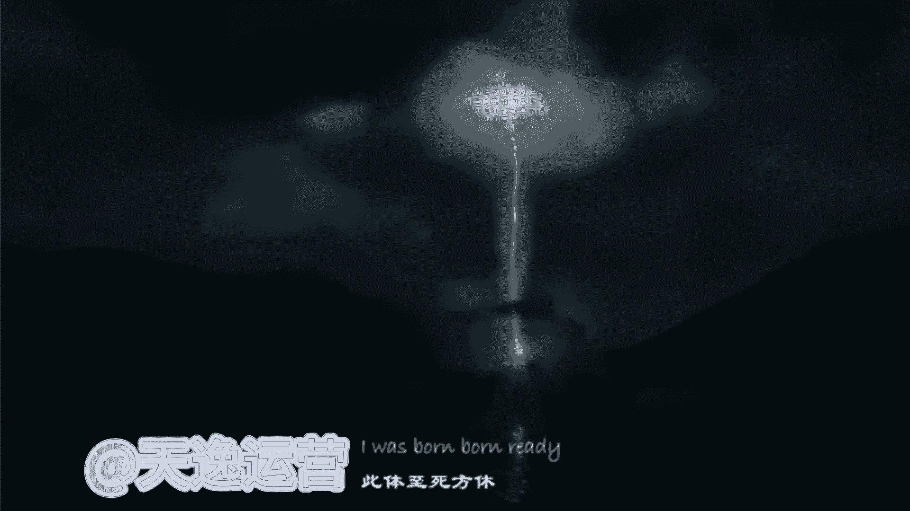
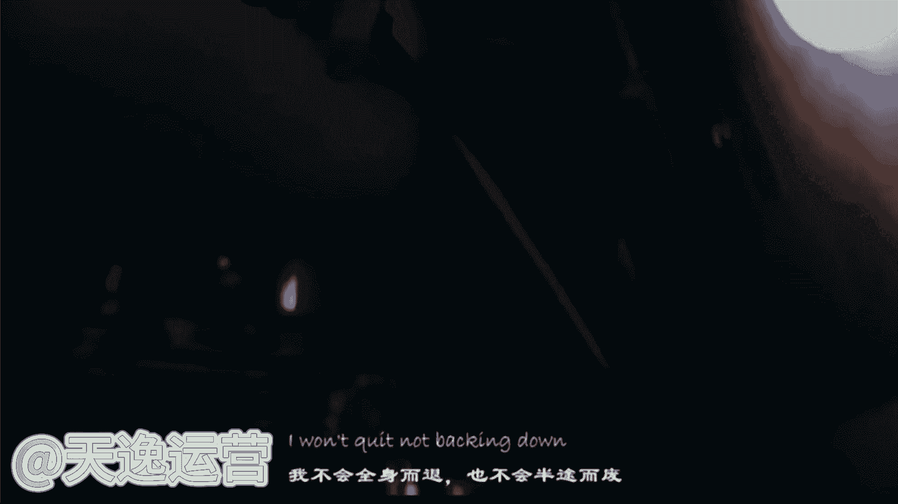

# 【2024版抖音运营教程】全B站最良心的抖音涨粉运营高阶教程合集！抖音短视频运营 起号真的不难！ - P24：17.批量剪辑成果展示 - 是你的孤风呀a - BV1ix4y1z7P8

是吧，包括到现在我们一个一分钟时间也到了，我们来看一下这个视频，剪完了没有好，这个视频呢他剪完了，那没执行完毕了啊，那我们就来看一下，这个工具剪的视频到底怎么样呢，他能不能配得上这个5000的播放量。

我们来看一下，♪ Just like fire turning up ♪，♪ The wind ♪，♪ Talking like the world ♪，♪ We're just one day ♪。

♪ Watch this man is unable to rain ♪，♪ No one can be just like me ♪，♪ Anywhere just like that ♪。

♪ I'll be like a dream ♪，♪ I'm a jappeal when they come for me ♪，♪ I keep dancing what you ♪。

♪ Gonna say ♪，♪ No one can be just like me ♪，♪ Anywhere ♪，♪ Just like fire ♪，♪ Burning up the way ♪。

♪ I can let the world up for just one day ♪，♪ Watch this man is colorful charade ♪。

♪ No one can be just like me ♪，Anyway，♪ Just like fire up the world like a world ♪。

♪ Just one day wanna touch this man is color function rate ♪，♪ No one can be just like me anyway ♪。

♪ Just like fire ♪，Just like fire，♪ Burning up ♪，♪ The w walking in the world was just one day ♪。

♪ Watch this man is cuba rain ♪，♪ No one can be like like me anywhere ♪，♪ Just like that ♪。

♪ Just do it like a dream ♪，♪ I'm just a feel when they come for me ♪，♪ I didn't dca ♪。

♪ What you gonna say ♪，♪ You know ♪，♪ What can be just like me anyway ♪，♪ Just like fire ♪。

♪ Burning up the way ♪，♪ I can let the world up for ♪，♪ Just one day ♪。

♪ Watch this man is colorful charade ♪，No one can be just like me anyway。

♪ Just like fire running up ♪，♪ My world like the world ♪。

♪ but just one day wanna do this man is gonna function rate好 ♪。

这个视频我们先看到这儿哈，同学觉得这个视频做的怎么样，还可以吗，这个工具剪的我说实话哈，虽然说他真的没有我自己手动剪的好，但是他绝对比大部分做自媒体视频的人，要好得多啊，这个是实话。

这个5000的播放量他能配得上的吗，是不是包括我讲到现在哈。

同学们就可以思考一下，你自己想要做混剪呢，还是想要做解说呢，还是想要做这个影视的推广呢，你想要做哪一个，如果说你现在已经有想法了，同学啊，你可以自己思考一下，但是呢我所讲到的哈这三个领域呢。

你不能每一个都想做，我们最开始呢肯定要选择一个领域，我们去专攻的，我们有了这个收益，结果我们慢慢的再去拓展一些领域啊，因为我们没有人能够一口气吃成个大胖子的啊，不可以。

所以说你们一定要对自己要做这个领域，我说这个视频的这个类型，你一定要有想法的，有想好吗，同学们做解说的人是我最喜欢的，因为我自己最擅长的，就是这一个文案的这个写作，那我这是我最擅长的。

所以说你如果说跟着我去做这个呢，你一定能够拿到一个很好的结果，包括我刚才讲到这三个领域的视频呢，这是我所讲到的，我们自媒体行业当中最基础的一个变现方式。

叫什么呢，内容变现。