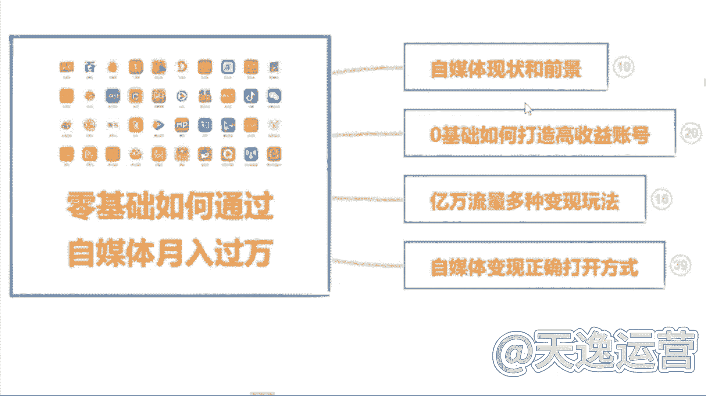
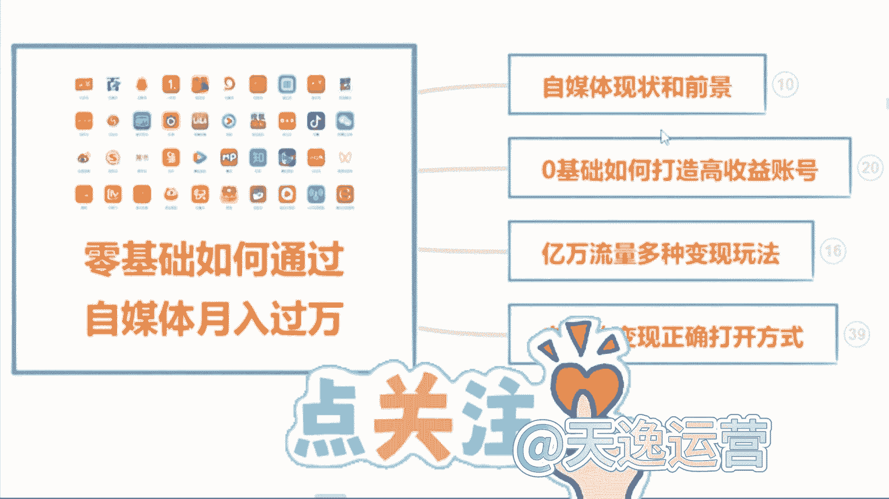
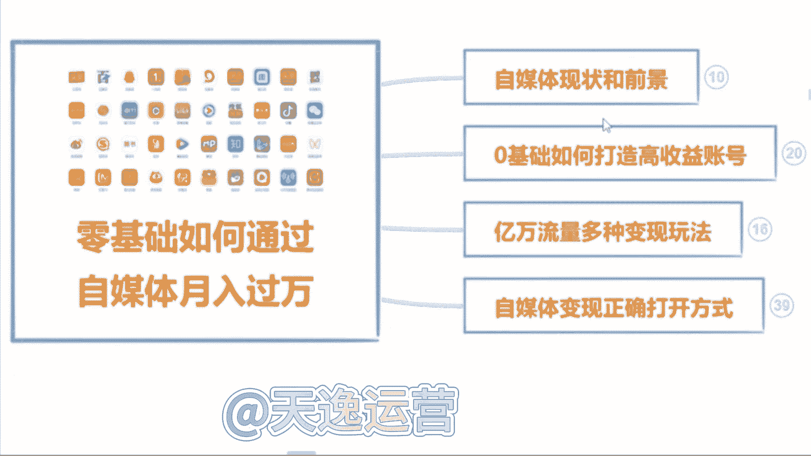

# 【2024版抖音运营教程】全B站最良心的抖音涨粉运营高阶教程合集！抖音短视频运营 起号真的不难！ - P8：1.什么叫自媒体 - 是你的孤风呀a - BV1ix4y1z7P8

首先第一个板块就是自媒体，它的一个现状和前景，就是无论我们做任何一个行业哈，无论是做前置也好还是兼职也好，我们得清楚这个行业它的一个现状和前景，我们去做对于我们来说有一些什么样的好处呢。

那到底可不可以去做呢，是吧，我们了解清楚了过后，我们再去上手，我们才能更放心一点，那第二个板块呢就是零基础的同学，我们如何去打造一个高收益的账号，就很多可能了解一点自媒体的同学，或者说你是有做过自媒体。

同学可能都知道哈，呃我们这个视频发出去，要么他是零播放量，要么你去抖音和快手上面，你去做视频啊，靠这个播放量没有人来给你结算收益的，这是为什么呢，那这个板块当中呢，我会教大家怎么去选择这个平台。

怎么去选择领域和这个渠道，我们才能把这个收益赚到手，那第三个板块就是一个亿万流量的，一个多种变现玩法，就是很多同学了解自媒体呢，可能都知道我们自媒体呢。

就是我们做视频或者文章发到这个平台上面去，有人观看，我们可以靠这个播放量去结算收益，那除了这个之外呢，还有很多种玩法。

都适合我们零基础同学去上手的，那这个板块呢我会给大家讲到，那第四个板块，就是我们自媒体变现的一个正确打开方式啊，这怎么说呢，就是如果说你是听完整堂课，你觉得这个自媒体比较适合你的，你有时间来做的。

那我会教大家怎么去规划我们自己的账号，以及系统性的把这个钱赚到手啊，这是我今天内容板块一个划分。

那么首先呢先来了解一下到底什么是自媒体呢。

自媒体的话呢，我用大白话给他讲吧，就是我们今天打开我们自己的手机。

百度去百度上面搜索一个自媒体平台，然后去这个平台上面，注册一个属于我们自己的账号，在我们自己这个账号上面去发布，我们自己做的文章或者说视频啊，我们有人观看，就可以靠这个播放量去结算收益。

这个就叫做自媒体。

