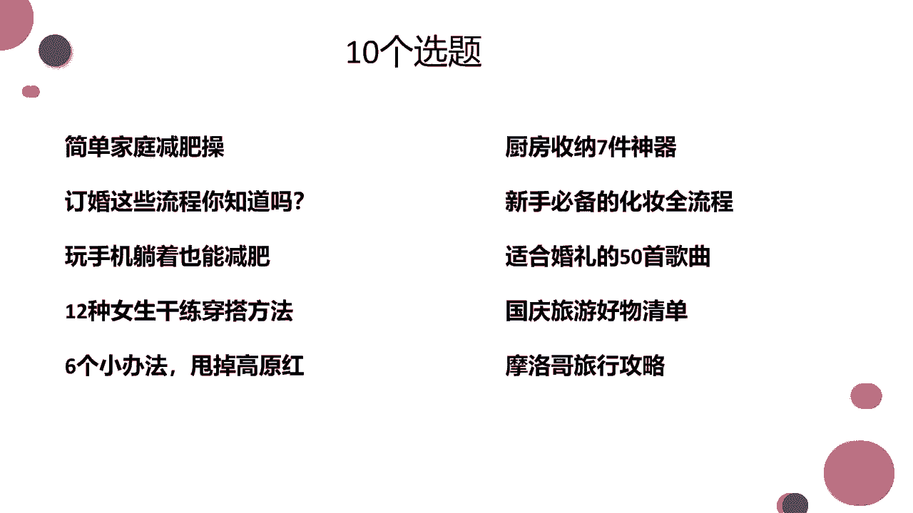
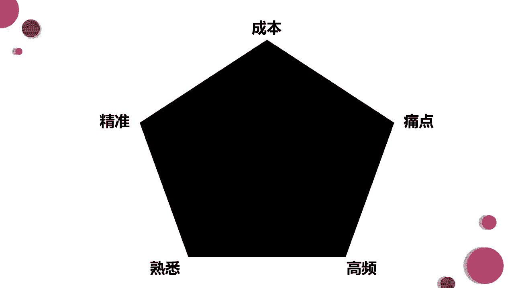

# 【2024版抖音运营教程】全B站最良心的抖音运营高阶教程合集！目前B站最完整的抖音运营教程，大佬亲自教学！！自媒体运营 起号真的不难！ - P12：如何衡量选题 - 仙女味儿的小可爱 - BV1k3tAegExx

啊我们啊，我们怎么去衡量这个选题是不是好选题，在这里给到大家十个选题，好给大家框一下这十个选题，大家觉得这十个选题里面，哪个选题给你的印象最深刻，我先给大家啊读一下啊，简单家庭减肥操。

订婚这些流程你知道吗，玩手机躺着也能减肥，12种女生干练穿搭方法，六个小办法，甩掉高原红厨房收纳七件神器，新手必备的化妆全流程，适合婚礼的50首歌曲，国庆旅游好物清单，摩洛哥旅行攻略。

那么大家觉得这十个选题，哪几个选题给你的印象最深，或者是这十个选题，我必须让你选出来一个，哪个选题给你的印象最深刻，嗯对对对对对，大熊其实选的看哎大家都选了什么，玩手机躺着也能减肥。

其实我第一眼看到的时候，我我选的也是这个，我选的也是这个，大家知道为什么吗，大家知知道这是为什么，这是这是为什么，你看叔叔老师对，这其实就是大部分人的选择啊，因为叔叔老师也是用户啊，是用户，因为懒。

是不是因为懒，这其实是衡量一个好选题的啊，其中一个标准叫做低成本，用低成本达到你想要的效果呃，其实用户也是这样，用户也很懒，他就想用低成本完成这个效果，比如说你教我三个方法，我就能变白。

我就特别想学三个方法就能变白，然后别人都教我100个方法呢，我懒得去看，这太多了，比如像像这个适合婚礼的50首歌曲，50首，这也太多了，你要给我三首，我还能选择出来一个，你要给我50首。

我这个婚结不了了，我往后推是不是好啦，那我们啊经常会我们什么经常会，我们一般都会选择这种低成本的，哎这样的一个方式。

哎去衡量一下我们的什么呀，我们的选题是否是好的，这里呢给到大家五个衡量选题好不好的标准，一个是成本，一个是精准，一个是熟悉，一个是高频，一个是痛点，那么其实这里面我们经常用到的就是成本，还有痛点。

成本的话就是低成本，让让这个用户低成本去完成他想要的一个效果，哼参加不用化妆就有男孩子来求婚，这也算是啊，其实我们先不看他说的这句话，逻辑通不通啊，你就看这个萌萌星说的这句话，其实他既说了这个低成本。

又说了痛点，又说了痛点，哎我们先不看啊，这个萌萌星是不是在做梦，我们去分析一下萌萌星说的这句话，在家里不用化妆，非常低成本非常低成本，我就有男孩子来求婚，成本低不低啊，我不用啊，自己出去相亲。

我也不用就是去跟他谈恋爱，对不对，我就能找到一个男孩子爱我，这个是低成本，那么痛点是什么呢，我太想结婚了，是啊我太想结婚了，一定要戳中用户的痛点，用户的痛点其实就是假设说我想要买一个口红。

我想要在李佳琦那买一个口红，它上色啊，这个口红特别特别的好看啊，李佳琦给我上上色，就是去给给我看这个效果的时候，我特别喜欢，我就喜欢他手里的这个999色号，但是它太贵了啊，他999色号也卖999块钱啊。

我就觉得我喜欢，但是太贵了，对于我来说，这个痛点就是价格下一个，如果有一天啊，有一有一个人发了一个视频，说啊啊李佳琦推荐的999色号什么啊，可以打五折优惠，可以领取到什么什么什么的优惠券。

我一定就去买了，因为这样的一条信息呢，它戳中了我的痛点，我的痛点不是在于这个东西好不好看，我已经确定它好看了，我的痛点就在于这个东西的价格太高了啊，大家知道吧，我们经常就是会使用到成本，还有痛点。

还有就是熟悉这个其实也经常会使用到啊，因为有些嗯做这种情景剧的，他的选题基本上就是这样，你有没有在公交车上碰到这样一类人，你有没有在电影院里碰见这样一类人，你放假回家的时候。

你妈妈是不是总跟你唠叨这两句话，这个就是首席，就是一些场景是场景化的东西，对不对啊，比如说啊我我最近刚刷到一个抖音，他他就是用了熟悉这样的一个啊选题方法，那么他选题就是啊，我在电影院里去看了一场电影。

为什么会遇到下面这种情况啊，真是人间真实了，是不是啊，就每个人都遇到过，多多少少都戳中了啊，大家的这种啊比较熟悉的场景，熟悉的回忆好吧，这个的话呢是可以去衡量咱们的选题好坏的，比如说你给到一个选题之后。

你就往这五点里面带啊，它符不符合，基本上符合两点，符合三点就是OK的一个选题，大家能懂吧，大家能懂吧啊我们基本就是先找选题，然后通过九宫格写选题，写出来很多选题之后，我们再去衡量它是不是一个好选题。

我们是不是真的能拿它去拍摄这样的一个视频，对吧，这个能理解不能理解不啊，当然了，并不是说我们啊做的每一个它都是一个好选题，对不对，一定会有筛选，一定会有这种删减的，那有同学说老师我所有的选题。

我好像觉得都不太好，怎么办，其实我们可以根据文案。

