# 【2024版抖音运营教程】全B站最良心的抖音运营高阶教程合集！目前B站最完整的抖音运营教程，大佬亲自教学！！自媒体运营 起号真的不难！ - P13：视频创意 - 马云背后de女人 - BV1VgHkeXEE5

来开始我们本节课的这个具体的内容了哈，本节课的话呢我们不再去讲这个脚本套路了啊，因为说知识点太密集的话，我们吸收不了，这节课就讲一讲这个搬运，或者是就是不是自己拍素材的话，怎么去制作我们的视频好吧。

那给到大家入手的几个方面啊，我给大家放大一下去看看好，今天我们就直接使用这个啊。

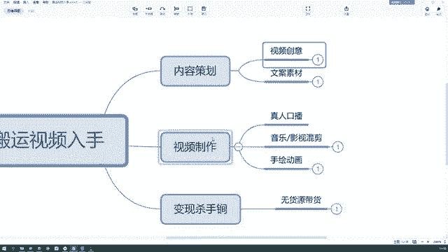

思维导图的形式了哈，就不给大家再做这个PPT了，来首先我们看一下，我们无论是搬运视频还是原创视频，首先都得有一个内容策划，对不对啊，就是我们的选题以及我们素材的收集，那在这里再讲一下。

因为想给同学们再去啊，就是呃延伸不同的一些素材，网站或者是创意网站，首先我们看啊，我们在做这个内容策划的时候，要找到这个视频的创意，也即也就是我们所说的选题，对不对。

我们这这个内容这一期内容我要拍摄什么，我要怎么选择，那当然选题法是能够确定出我们选题来的，上节课我们讲的九宫格选题法，但是最大的主题我们要选择出来，比如说我这期是要讲励志故事呢，还是要讲产品故事呢。

对不对，那么这个最大的选题要选择出来啊，那么这个创意是怎么来的，创意思是怎么来的，当然我们说你可以自己去延伸一些创意，可以自己想，但是当你自己没有想法的时候，你想要去蹭热点的时候。

你去哪里找到这样的热点，在这里给同学们去推荐一个啊创意网站。

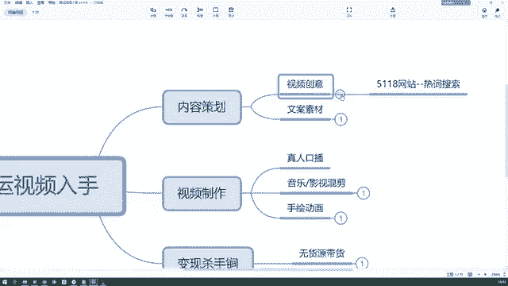

叫做5118网站，它是一个热词搜索的网站嗯。

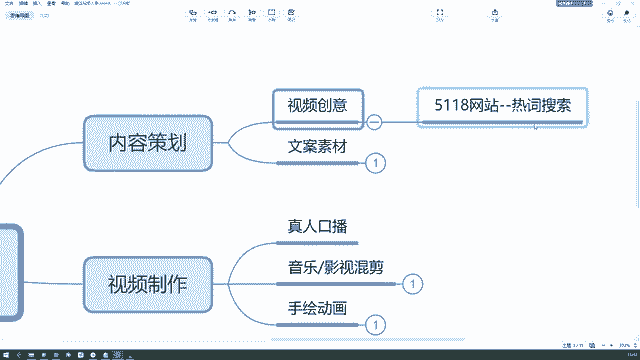

大家可以看一下，我给大家打开一下5118网站，如果你们现在手边有浏览器的话，可以跟着我一起搜索好吧，哎打错了，55118。

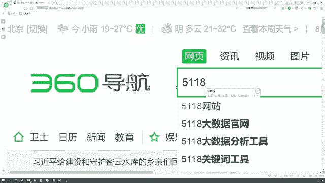

它是一个大数据搜集的网站，你看这个5118打开之后呢，我们就能看到，第一个就是它的一个营销大数据的网站，下面写着快照的话是一个正常的官网啊，我们给它点击进去。

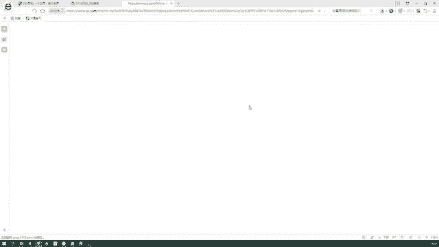

我们来到这样的一个界面，这是他的首页，你们可以都打开一下，如果手边有浏览器的话，你看你现在打开的话呢，是这样一个是他的首页，我们可以看看上面这一部分啊，上面这一部分可能第一个你看不懂排名的效果。

它是一个呃其他的一个概念啦，一些百度竞价啦，或者是那个SEOSEM了，这一块咱们没涉及到啊，你们不懂也没有关系啊，第二个挖掘流量这一块也是啊，它会涉及到一些呃流量的变化，那相关这个关键词啊，流量词啊。

竞价词的一些查询，你像前两个吧，咱们用到的不多，用到的不多，除非你涉及到这个行业了，就是我刚才说的搜索引擎的竞价，或者搜索引擎的排名这块咱用不到，咱可以用到的是哪个，是这个第三个后边写着新媒体运营。

是不是这块才是运营要用到的一些东西，首先我们可以看一下，当你不知道你想写什么主题的时候，或者你仅仅有一个大的方向，比如说我想写一个什么励志故事之类的对吧，那我可以在这里搜一个励志，做一个励志。

搜完了之后，它就会跳到这样的一个需求图谱啊，这里有一个词平导图，经过数据分析得到词频最高的是励志故事，对不对，因为你如果是确定励志这个选题的话，你可以写励志故事啊，也可以写其他的励志的东西。

你看这个的话就是一个啊词平比较高的啊，其次还有什么励志名言。

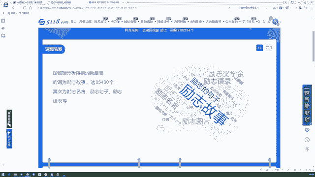

励志句子，励志语录等等对吧，那我们再接着往下看，还有一些放射图，啊这边的话呢他全部都是什么励志奖学金啦，励志申请啦，励志这叫什么励志奖学金的名单公布啦，啊励志小故事100字啊等等。

这些呢咱们都可以去挖掘的，这里面的任何一个东西，你延伸出来它都是一个具体的选题，你可以根据这个选题去寻找素材了，大家能懂吧，再往下看，还有一些关系的脑图啊，就是涉及到一些名人，一些作文啊。

其他的这些脑图它都有这种相关的线去连接它。

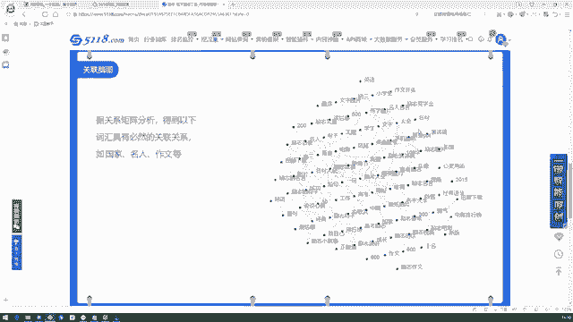

可以拓展你的思维，啊包括一些疑问词的脑图啊，怎么样，哪里哪个多久国家如何啊等等。

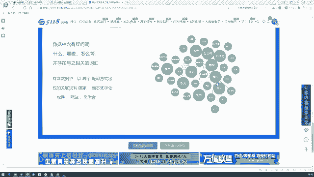

这都是通过一个词去联想出来的，一些高频词汇以及高频需求。

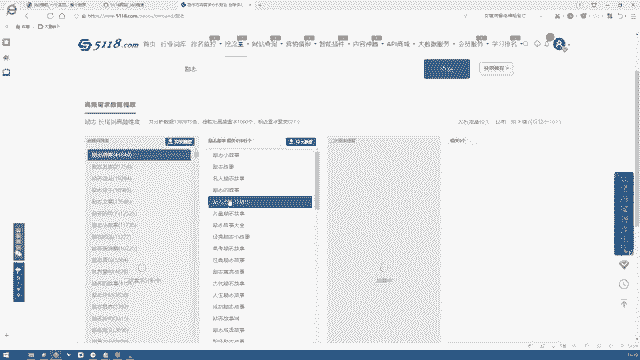

你看这边还有一些高频需求，这些高频需求呢全部都是用户的需求，大家能懂吧，而我们去看一下哈，下面有一些什么励志故事，这是多少个个十百千万4万1849个，什么视频，3067个啊。

励志故事视频相关的有3067个，那这些数据呢都是可以导出的，当然有些功能呢它可能会需要你开通会员啊，什么的啊，这些的功能可能会需要开通会员，你不用它就可以了，你只看一下相关的一些高频词汇。

那高频的需求就可以，你知道啊，大概是励志故事，这个啊比较吸引人，励志小故事啊，100字的小故事或励志故事大全，是我可以去做的一个方向，我确定确定什么哈，我今天嘴老瓢啊，我确定下来一个这样的方向。

一个主题之后，我可以去其他的网站搜寻不花钱的素材，大家能懂吧，我喝口水，因为像这种创意网站或者素材网站，他可能会给你很多相关的素材，但是导出数据的时候呢，他可能会哦让你花钱，这个是会出现这种情况的。

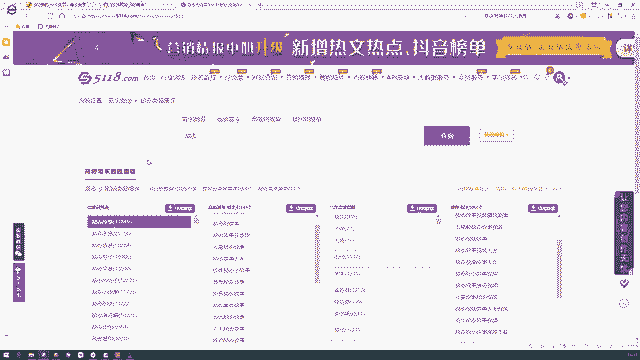

我们再回到他这个首页，刚才我们用到的是需求图谱的一个分析，它下面还有一个素材搜索，素材搜索的话也可以直接在这里面搜索到素材，相关的励志的话，他会去全网搜集一些励志故事的文章。

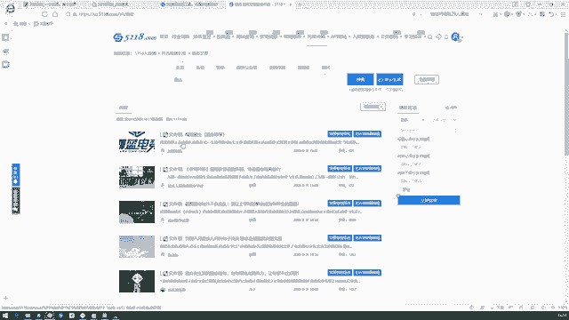

看到没有，还有一个我要智能原创，看到没有，他就会把相关的呢啊进行相关的这个字眼啊，进行一个搜集，还有原创度的检测什么的，就让你避免这种啊那个搬运的现象，这个网站还是比较智能的，这个叫做5118。

5118网站，大家可以记一下，好吧啊，一般我是用这个来进行一个创意的搜集，也就只会用到需求分析这一块，需求图谱这一块，好吧啊，那我哦大家看懂了这个网站没5118呃，它登录的话呢是需要用微信去扫个码的。

这个我已经给大家登录好了，好难，下面有什么嗯新媒体的工具啊之类的，你可以多研究一下，这个是给大家的一个嗯就是热词的搜索啊。

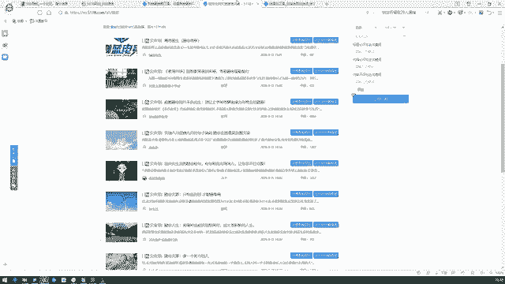

以及素材的搜索工具来先最简化，那么首先这是我们的第一步啊，就是我们的视频创意，我们可以从这个5118网站，这个热词搜索的网站上去，确定一下我们这个视频的创意啊，以及我们想做的一个大主题。

以及它的一些关联的脑图嗯，脑词什么的，能不能联想出我们想要的那些创意，其实二次创作创作到如何程度才不算搬运呢，这个问题的话呢，呃其实他没有一个标准的答案，二次创作创作到如何程度。

实际上啊这跟那个审核的人员是有关的，因为他有机审，还有人工审嘛，你想同样的视频，你放在这个号上，他可能不会审核厨师搬运，但如果放在另一个号上，可能会审核出搬运，这是为什么呢，因为就像我刚才说的。

我这个朋友啊，他不是现在面临着搬运这个问题吗。

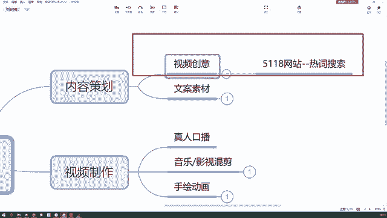

给大家说的这个朋友，他现在面临着这个搬运的问题，但是呢他只有三个视频被判定为搬运了，其他的视频呢跟这个视频剪辑的类型是一样的，内容也是差不多的，但是另外的视频就没有判定为搬运。

所以说其实结合到这个视频审核和人，工审核的时候，这个不定性是非常大的，所以我们在啊就是很主观的，没错他没有一个严格的判定标准，所以我们在处理的时候呢，尽量是把一些主要的东西留下来。

其他的加上一点自己的观点，那甚至给它进行一个镜像的翻转啊，把他的这个视频给他换一换，方向换一换，尽量不让机器去审核出来，我们这是一个搬运的行为，对还是相对主观的，还是相对主观的。

比如他之前发的几个视频流量都特别好，也没有被判定为搬运，但后来当流量好了之后呢，这个时候一定是人工审核介入了，所以他被判定为搬运了，而且还给了他一个处罚，还给了他一个处罚。

那包括说他在视频里面哈有那种广告的商标，因为他是从用腾讯视频录屏下来，进行一个剪辑的，所以他一定会碰到那种呃商标的存在啊，包括说字幕上也会有一些那种商标啊，广告商家他可能忘记处理了，那在这个时候呢。

其实这个抖音官方也给他发了另一个通知，就是啊他的视频存在营销的性质，所以这个大家注意一下就行。

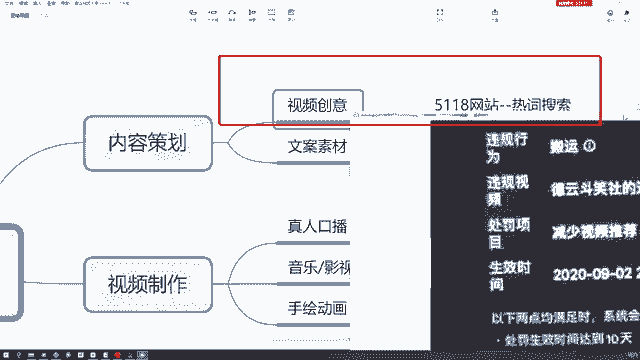

注意一下就行，所以其实做搬运的话呢，做搬运的话不建议同学们现在啊，就是再往以后越来越发展，就不建议同学们把现有的视频拿过来，直接去做一个处理，所以咱们现在在教的呢啊。

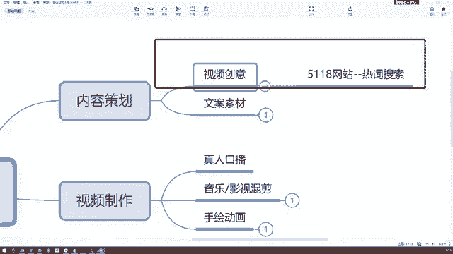