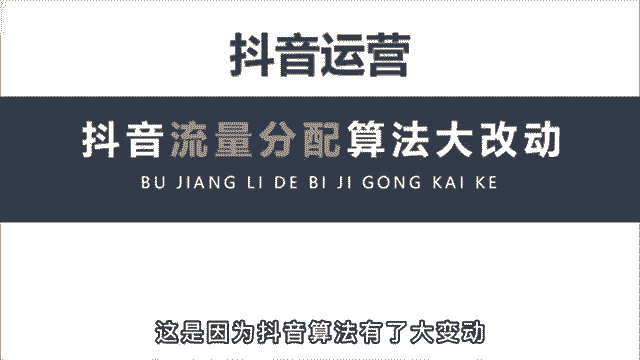
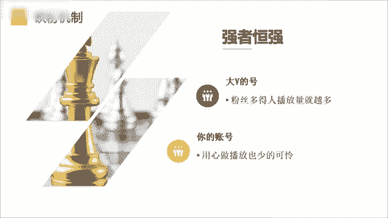
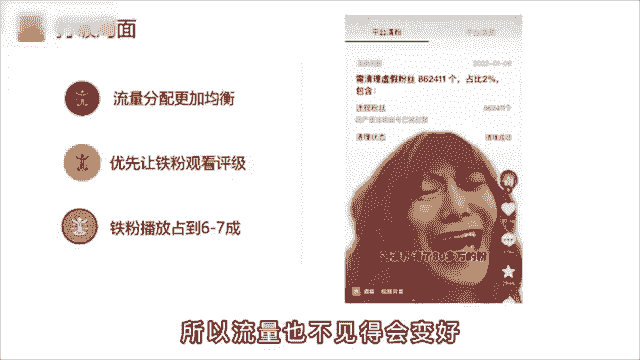

# 【2024版抖音运营教程】全B站最良心的抖音运营高阶教程合集！目前B站最完整的抖音运营教程，大佬亲自教学！！自媒体运营 起号真的不难！ - P6：4抖音新的流量推送机制 - 马云背后de女人 - BV1VgHkeXEE5

最近你是不是流量不太好，这是因为抖音的算法有了大的变动。

很多账号的流量都有严重的下滑，知名网红毛毛姐一夜掉粉80万，不过呢这对小博主来说，却是一次弯道超车的好机会，看到视频最后啊一定会对你有所帮助，那造成这个现象的主要原因是。

因为抖音的算法新增了一个铁粉机制，所谓铁粉就是长期支持你的粉丝，再以前我们只能看到粉丝的总数，这就导致强者恒强，粉丝多的人播放量就越多，哪怕就是拍一段毫无意义的吃水果，也会被吸引走几十上百万的流量。

这对普通人来说啊，这是一种不公平，对平台来说也是不健康的。

所以呢，这个铁粉系统就会从一定程度上打破这种局面，让流量的分配更加均衡，让真心做好内容的你能获得更多的流量推荐，无论大号呢是有几百万的粉丝，在作品发布的初期，都会优先让他的铁粉观看评级。

只有过了铁粉这关后，才会进行大范围的推荐，一般呢10万播放以内啊，铁粉播放要占到6~7成的比例，比如呢我是做运营教学的，我发现最近流量不太好，也去发一些炫富博眼球的话题，老粉看到呢就会不乐意。

觉得我这个干货博主初心变了，所以流量呢也不见得会变好。

然后再说一下，为什么对中小博主来说是次机会，首先呀你要明白一个基本的概念，每一个行业赛道粉丝的体量是不一样的，你做娱乐号粉丝到1000万都有可能，但你做技能培训，比如开挖掘机最多啊，就是10万的体量。

原因呢有以下两点，第一是学习枯燥，看短视频啊，主要还是以消遣为主，第二呢是学挖掘机的人本来就少。