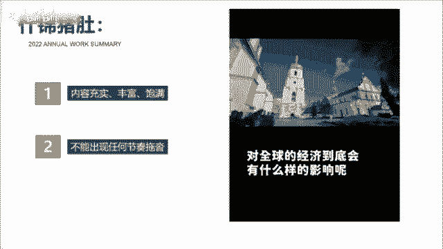

# 【2024版抖音运营教程】全B站最良心的新媒体运营高阶教程合集！抖音运营 起号真的不难！ - P14：7抖音怎么发才有流量？ - 烙_ - BV1Uz421S7cY

我也知道好内容才会被推荐，但到底什么才是好内容，这个也太抽象了，有没有什么办法能把抽象的价值，变成可视化的短视频语言呢。

还真有，教你一个公式，爆炒虎头，什锦猪肚，红烧爆炒，什么意思呢，有句话叫客户买的不是产品，而是感觉，爆炒虎头，就是说开头的五秒要开的精彩，像虎头般斑斓夺目，比如这样，那一天上海感受到了被吞噬的恐惧。

夜空中出现了一张血盆大口，钢筋森林都被他吸进嘴里，开头就写出它的具体表现，而不是给大家推荐一部高分末日电影，再或者这样，有人说来上海旅游没什么好玩的，那可能是你的打开方式不太对，作为10年的老沪漂。

我想送你今天这份上海旅行攻略，写出你要为观众解决什么苦恼，而不是我给大家分享三个上海的景点，什锦猪肚呢则是内容要像猪肚那样饱满丰富，包括画面的切换，也要符合情绪的递进，比如这样，然而过了一天。

各国股市呢又普遍的回血，那问题就来了，接下来这场仗，对全球的经济到底会有什么样的影响呢。

内容充实丰富饱满，一定不能出现任何的节奏拖沓，华而不实的那种，红烧豹尾则是指豹子般意味深长的结尾，用最简短有力，干脆利落的语言将总结打好，比如这个屏幕前的你看完会不会食欲大增呢，反正我能多干两碗米饭。

用一句反问来提高评论互动数据，再比如这样吞下了委屈，伟大了格局，改变不了别人，就改变自己，把前面写的小范围事件上升到较大的范围，从而升华视频的主题，明白了这个故事后，你再问问自己，你的内容真的优质吗。

内容节奏拖沓，让人看不到最后，而结尾呢就一句。